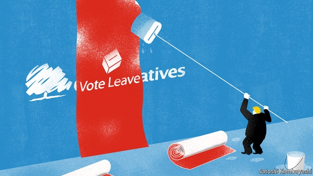

###### The future of the right

# How Britain’s staid Conservative Party became a radical insurgency 

 

> print-edition iconPrint edition | Britain | Sep 5th 2019 

IMAGINE A conservative mp and your mind’s eye might conjure up Philip Hammond. The former chancellor is tall, grey and with a sense of humour that matches his fiscal policy: extra-dry. If not Mr Hammond, then perhaps a figure in the mould of Kenneth Clarke. The rotund, cigar-chomping jazz enthusiast has served in practically every senior government job bar prime minister in a 49-year stint as a Tory mp. Failing that, consider Sir Nicholas Soames, a former defence minister. He has a Churchillian manner, largely because Winston Churchill was his grandfather. The three embody the parliamentary Conservative Party in different ways. Yet they are no longer in it.  

The trio were among 21 Conservative mps to have the whip withdrawn and be barred from standing for the party again after they supported a plan to make Boris Johnson, the prime minister, seek a delay to Britain’s scheduled departure from the European Union on October 31st (see next story). The purge was only the most visible part of a revolution that is transforming the world’s oldest political party. Those who advocate fiscal prudence, social liberalism and an orderly departure from the eu have been routed. Those who demand free-spending authoritarianism and a “do-or-die” escape from the yoke of Brussels are ascendant. ConservativeHome, a blog for party activists, described this week as “the end of the Conservative Party as we have known it”. It proved too much for even the prime minister’s brother, Jo, who resigned as an mp on September 5th, “torn between family loyalty and the national interest”.  

The revolution has required ideological flexibility from those who wish to survive it. The cabinet is full of mps who are historically small-state Conservatives. Four of the five authors of “Britannia Unchained”, a paean to small government published by ambitious young Tory mps in 2012, when fiscal austerity was in fashion, now sit in a cabinet intent on opening the public-spending taps. A spending round on September 4th included measures that will increase the size of the state as a percentage of gdp for the first time since 2010. Sajid Javid, the chancellor, is a fan of Ayn Rand and hangs pictures of Margaret Thatcher in his office. Yet on Mr Johnson’s instructions he announced an extra £13.8bn ($16.9bn) in election-friendly giveaways, paid for with extra borrowing. 

There is also new thinking on law and order. Another 20,000 police officers are to be hired, and a review of whether prison sentences are too soft is expected. Priti Patel, who has called for a clampdown on immigration and once supported the return of capital punishment, is home secretary. It is a far cry from what some in the party thought Mr Johnson had in store. “Expect a liberal centrist,” advised one mp, who now sits in the cabinet, before Mr Johnson became prime minister. Wags have dubbed the new Tory domestic agenda: “Fund the nhs, hang the paedos.” 

The hardest line is on Brexit. Conservative mps appreciate that they must get Britain out of the eu if they are to keep their seats. Yet Mr Johnson’s approach, which seems likely to end in no-deal, leaves a quiet majority of the parliamentary party uneasy. No-dealers make up only a small fraction of Tory mps. A cabinet member who enthusiastically campaigned for Brexit admits that no-deal would be a catastrophe. But mps are willing to serve, partly because Mr Johnson seems determined to move things forward one way or another. “They may not agree, but they are happy for the direction,” says one cabinet minister. 

Setting the route is Dominic Cummings, the prime minister’s chief adviser, who will not even say whether he is a member of the Conservatives. When running for office, Mr Johnson promised an inclusive, “one nation” style of government. Instead, he has set about shaking the country’s institutions, suspending Parliament for the longest period since 1945 in order to reduce the time mps have to debate Brexit. Hitherto unimaginable tactics, such as asking the queen to veto anti-no-deal legislation, are now openly discussed. “This Conservative government…seems to not be very conservative, fiscally or institutionally,” noted Ryan Shorthouse of Bright Blue, a liberal Tory think-tank. 

The strong-arm techniques are in stark contrast to the days when David Cameron ran the party, and Eurosceptic rebels ran amok. Under Mr Johnson, such sedition is not acceptable, as this week’s purge was intended to show. Figures from Vote Leave, the main campaigning group behind the Brexit vote, call the shots in Downing Street, causing long-serving Tory mps to shake their jowls at the state of affairs. Sir Roger Gale, an mp since 1983, declared: “You have, at the heart of Number 10, as the prime minister’s senior adviser, an unelected, foul-mouthed oaf.” A “One Nation” group of about 100 moderate Conservative mps have demanded that Mr Johnson reinstate their sacked colleagues. 

Yet for all the fury over the deselections, Mr Cummings’s strategy remains just about intact. The prime minister and his aides want an election in which Mr Johnson is portrayed as the champion of a people defied by wily politicians, with the promise of a cash tsunami about to break over Britain’s public services if people vote Tory. “He gets the election he wanted and the framing he wanted,” says one former Downing Street aide. Nor will the revolution necessarily be permanent. A socially conservative offer to voters tempted by Nigel Farage’s Brexit Party may last only until the next general election, says Tim Bale of Queen Mary University of London. 

“What this country needs is sensible, moderate, progressive Conservative government,” declared Mr Johnson during a stilted performance in prime minister’s questions on September 4th. Yet with the Tory party in its current state, Britain will have to wait.■ 

