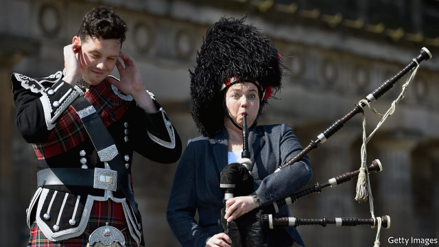

###### A warning blast

# Without Scotland, the Tories may struggle to win a majority 

 

> print-edition iconPrint edition | Britain | Sep 7th 2019 

IS LITTLE SCOTLAND’S voice about to be heard at last? In the Brexit referendum of 2016, fully 62% of Scots backed Remain. To no avail—England’s vastly greater size ensured that a narrow majority for Leave in the south dictated Britain’s exit from the European Union. Since then, Scotland’s politicians have largely played the role of bystanders as the Conservatives and Labour in Westminster have scrapped with each other, and between themselves, for control of the Brexit agenda. Scotland’s influence, so heavily felt in the cabinets of Margaret Thatcher and Tony Blair, has waned sharply. 

The arrival of Boris Johnson in 10 Downing Street suggests that a strain of English nationalism, embraced by Mr Johnson in an attempt to see off the threat of Nigel Farage and his Brexit Party, is to play a prominent role in Tory thinking. This has proved too much for Ruth Davidson, the popular leader of Scotland’s Conservatives, who last week announced her departure. 

In her resignation speech on August 29th Ms Davidson stressed the pressure that political leadership has placed on her family (she recently returned from maternity leave) more than any conflict with her Westminster colleagues. But her personal relationship with Mr Johnson has long been poor, and her brand of liberal Conservatism—she regularly cites Sir John Major, prime minister in 1990-97, as a touchstone—is suddenly unfashionable. Any possibility that she might unseat Nicola Sturgeon, first minister and leader of the Scottish National Party (SNP), at the next election to the devolved parliament in 2021, was becoming slimmer by the day. 

Yet her departure carries significant danger for the Conservative Party on both sides of the border. Under her eight-year leadership, driven by her distinctive energy, forthrightness and wit, the Scottish Tories returned from the electoral dead. In 2011, the year she took over, they had 15 seats in the Scottish Parliament and one at Westminster. She leaves the party as the official opposition at Holyrood, with 31 seats, and with 13 seats at Westminster. 

Mr Johnson needs those Westminster seats to stay blue in the general election that is expected to be called soon. In the election of 2017, a disastrous night for the Tories in England, the strong showing of the Scottish Conservatives was crucial to keeping the party in government. But the Tory roots in those Scottish seats are shallow, and the margin of victory last time mostly nothing to write home about. A majority of voters backed Remain in all but one of them. In Stirling, for example, where an SNP majority of 10,480 in 2015 gave way to a Conservative majority of 148 in 2017, only about a third voted Leave. The Tories would lose ten of their 13 seats to the SNP if there were an election, according to a YouGov poll for the Times on September 4th. 

It is not just Mr Johnson’s government that is at stake, but the future of the union itself. Ms Davidson has been the main pro-British figure in Scotland since the independence referendum of 2014. She redesigned her party to make it more palatable to Scots, and reaped the electoral benefits. Her departure is a huge boost to Ms Sturgeon, who hopes to secure a second independence referendum within a few years and who will regard winning it as eminently more achievable in the absence of her erstwhile opponent. 

Ms Davidson’s successor matters, therefore. Scottish Tory insiders expect a run-off between a pro-Brexit, pro-Johnson candidate (possibly Jackson Carlaw, Ms Davidson’s deputy), who might wrap himself in a union flag and prove popular with party members, and a candidate who argues for more distance and autonomy from the English party, such as Murdo Fraser, who is likely to be favoured by Tory members of the Scottish Parliament. The outcome will determine the shape of Scottish politics for years to come—and perhaps the survival or otherwise of the union. ■ 
<<<<<<< HEAD

-- 

 单词注释:

1.Tory['tɒ:ri]:n. 托利党党员, 保守党员, 亲英分子 a. 保守分子的 

2.Sep[]:九月 

3.Brexit[]:[网络] 英国退出欧盟 

4.referendum[.refә'rendәm]:n. （就重大政治或社会问题进行的）全民公决，全民投票 

5.fully['fuli]:adv. 十分地, 完全地, 充分地 

6.scot[skɒt]:n. 摊派的款项, 税赋 [化] 涂载体空心柱 

7.vastly['vɑ:stli]:adv. 广大地, 许多, 巨大 

8.bystander['baistændә(r)]:n. 旁观者, 目击者 [法] 候补陪审员, 旁观者 

9.Westminster['westminstә]:n. 威斯敏斯特 

10.scrap[skræp]:n. 碎片, 残余物, 些微, 片断, 铁屑, 吵架 vt. 扔弃, 敲碎, 拆毁 vi. 互相殴打 a. 零碎拼凑成的, 废弃的 

11.margaret['mɑ:^әrit]:n. 玛格利特（女子名） 

12.thatcher[]:n. 盖屋顶者 

13.tony['tәuni]:a. 高贵的, 时髦的 

14.blair[bleә(r)]:n. 布莱尔（男子名） 

15.wane[wein]:n. 减少, 衰微, 败落, 亏缺, 月亏 vi. 变小, 亏缺, 衰落, 消逝, 退潮 

16.boris['bɔris]:n. 鲍里斯（男子名） 

17.johnson['dʒɔnsn]:n. 约翰逊（姓氏） 

18.nationalism['næʃәnәlizm]:n. 民族主义, 民族特性 

19.nigel['naidʒәl]:n. 奈杰尔（男子名） 

20.farage[]:[网络] 人B淋巴瘤细胞系；法拉格 

21.Tory['tɒ:ri]:n. 托利党党员, 保守党员, 亲英分子 a. 保守分子的 

22.ruth[ru:θ]:n. 怜悯, 悲哀 

23.davidson['deividsn]:n. 戴维森（姓氏） 

24.maternity[mә'tә:niti]:n. 母性, 怀孕, 妇产科医院 a. 产妇的 

25.cite[sait]:vt. 引用, 引证, 表彰 [建] 引证, 指引 

26.john[dʒɔn]:n. 盥洗室, 厕所, 嫖客 

27.unfashionable[.ʌn'fæʃәnәbl]:a. 不流行的, 不时髦的, 过时的 

28.unseat['ʌn'si:t]:vt. 剥夺...的席位, 使失去资格, 使退位, 罢免, 使去职, 使退职 

29.nicola[]:n. 尼古拉（男子名） 

30.sturgeon['stә:dʒәn]:n. 鲟鱼 

31.snp[]:abbr. （英国）苏格兰国民党（Scottish National Party） 

32.devolve[di'vɒlv]:vt. 转移, 下放(权力等), 委托 vi. 被移交 

33.distinctive[di'stiŋktiv]:a. 有特色的, 出众的 

34.forthrightness[ˈfɔ:θˈraɪtnɪs]:n. 正直 

35.electoral[i'lektәrәl]:a. 选举人的, 选举的, (有关)选举的 [法] 选举的, 选举人的, 由选举人组成的 

36.opposition[.ɒpә'ziʃәn]:n. 反对, 敌对, 相反, 在野党 [医] 对生, 对向, 反抗, 反对症 

37.Holyrood[]:霍利鲁德 

38.disastrous[di'zɑ:strәs]:a. 损失惨重的, 悲伤的 

39.voter['vәutә]:n. 选民, 投票人 [法] 选民, 选举人, 投票人 

40.stirling['stә:liŋ]:n. 斯特灵（英国苏格兰中部城市, 中央区首府） 

41.YouGov[]:[网络] 民治调查公司；尤格夫；民治公司 

42.redesign[,ri:di'zain]:[化] 重新设计 

43.palatable['pælәtәbl]:a. 美味的, 好吃的, 可口的 [医] 适口的, 味美的 

44.eminently[]:adv. 很, 突出地, 非常 

45.achievable[ә'tʃi:vәbl]:a. 做得成的, 可完成的, 可有成就的 

46.erstwhile['ә:stwail]:adv. 以前, 往昔地 a. 以前的, 往昔的 

47.successor[sәk'sesә]:n. 继承者, 接任者 [计] 后继 

48.insider['in'saidә]:n. 内部的人, 权威人士, 知道内情的人 [经] 熟悉内情者 

49.jackson['dʒæksn]:n. 杰克逊（男子名）；杰克逊（美国密西西比州的城市） 

50.autonomy[ɒ:'tɒnәmi]:n. 自治, 自治权 [医] 自主性 

51.Murdo[]:n. (Murdo)人名；(英)默多 

52.fraser[]:n. 弗雷则河（加拿大西南部河流）；弗雷泽（男子名） 

53.politic['pɒlitik]:a. 精明的, 明智的, 策略的 
=======
>>>>>>> 50f1fbac684ef65c788c2c3b1cb359dd2a904378

