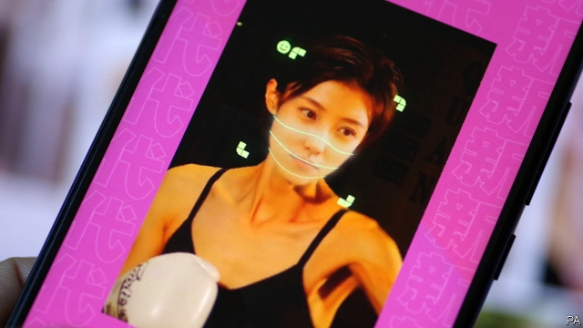

###### About face

# Chinese netizens get privacy-conscious 

 

> print-edition iconPrint edition | Business | Sep 7th 2019 

ON THE NIGHT of August 30th, soon after ZAO—an app whose name means “to make”—was launched, it proved so wildly popular that its servers crashed repeatedly. Almost as rapidly, a sudden backlash from its many fans nearly unmade it. Technology-news outlets and meticulous netizens who had combed through the terms of its user agreement found that by signing up, users had granted ZAO “completely free”, “irrevocable” and “perpetual” rights to all content they uploaded to its platform. 

Furious comments flooded Apple’s app store in China, where ZAO is now rated a measly two stars out of five. (This did not stop it from becoming China’s most-downloaded free app in the store.) WeChat, a dominant Chinese app—always eager to stick it to a potential rival—blocked ZAO links from being shared on its messaging service citing “security risks”. ZAO swiftly removed the offending clause. On September 3rd it apologised to users and pledged to protect their personal data “in every possible way”. 

China’s freewheeling internet users hand plenty of precious information over to the country’s data-grubbing apps. A report published last month by a Chinese cyber-security think-tank found that 1,000 of the country’s most-downloaded mobile applications hoover up an average of 20 types of data from each user. These often include call logs and videos of no obvious relevance to the apps themselves. And the notion of digital privacy seems almost quaint in the face of the vast data-gathering apparatus of an authoritarian state that regards public consent as optional at best. 

So why did ZAO hit a nerve? One reason is that it appears to belong to a new crop of apps that generate “deepfakes”, computational creations that use artificial intelligence to doctor video footage. One form involves pasting a face onto someone else’s body—in ZAO’S tantalising offering, your kisser can be stitched onto the svelte silhouette of an actor or actress in a hit film or television drama. 

Until recently such fakery had required hundreds of images to conjure a convincing clip. But deepfake technology has rapidly improved. ZAO’s winning claim is that, as its slogan promises, it takes “just one photo for you to star in all the world’s shows”. But for the best result, ZAO requires precise facial mapping, which users can feed into the app by following prompts to blink and move their mouths about. 

When ZAO’s grasping terms of service came to light, many users were alarmed at the idea of these biometric data being misused. Facial verification is being widely tested in China: to pay in supermarkets, glide through the gates at railway stations and even withdraw cash. On September 1st Alipay, a big payment app, assured users that “images created through face-swapping apps, no matter how realistic, cannot trick our system”. The government, too, has taken note. On September 4th it summoned Momo, a Chinese dating-app giant with ties to ZAO, to explain itself and launched an inquiry into the company’s “data-safety issues”. 

The state’s reaction continues its clampdown that began in January on non-consensual harvesting of personal information (by private firms, that is). Citizens are increasingly anxious about online fraud. More than four-fifths of respondents to a survey last year by the China Consumers’ Association said they had suffered from data theft. In an unusual case in May, a man from Jiangxi province sued Tencent, the internet giant behind WeChat, for sharing his personal data across its many services without his approval. The court ruled in the plaintiff’s favour—and ordered Tencent to stop the practice.■ 

