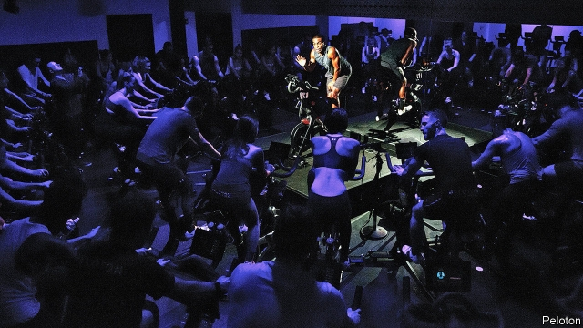
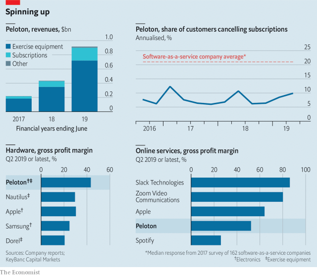

###### Le maillot jaune

# Peloton covets recurring revenue 

 

> print-edition iconPrint edition | Business | Sep 7th 2019 

AS ANYONE IN a CrossFit class or Bikram-yoga studio will tell you, fitness is full of fads. Few make it to the stockmarket. But on August 27th Peloton, an American firm founded in 2012, announced it had filed paperwork for an initial public offering. Peloton describes itself as a “technology fitness media design software retail product apparel experience logistics” company. Its investors reckon it could be worth $4bn. 

Stripped of the aspirational jargon, the firm is in the business of selling high-tech (and high-priced) home exercise bikes. Each bike, which costs $2,245, comes with a touchscreen, a version of Google’s Android operating system and an internet connection. For a monthly fee, users can tune into streamed exercise sessions, either live or pre-recorded, complete with leaderboards and statistics. The effect is a mix of a studio spinning class and a YouTube live stream, as perky instructors give shout-outs to individual users who are puffing away in their living rooms hundreds of miles away. For those who dislike cycling, a $4,295 treadmill is also available. 

Like many of the current crop of tech “unicorns”—private companies with a valuation of $1bn or more—Peloton does not do anything so unfashionable as making money. It lost $196m in the 12 months to June, up from $48m the year before, as it threw money at attracting new customers. But its efforts seem to be working: it has 511,000 subscribers, more than double the number last year. Revenue has doubled too, reaching $915m in 2019 (see chart). It is popular among trendsetters. David Beckham, an ex-footballer, is a fan, as is Barack Obama, an ex-president. That aspirational glow allows the firm to get away with gross margins on hardware of 43%, higher even than Apple’s famously lucrative gadgets. Despite its high prices (or perhaps because of them) it also boasts enviable customer loyalty. 

 

Exercise-bike makers used to be in the manufacturing business. But Peloton makes about 20% of revenue from subscriptions, and the share is rising. Margins here are mediocre but should improve as content-production costs are spread over more users. The shift illustrates a broader trend: thanks to the internet, industries that used to be about products are increasingly about services, too. This lets firms replace unpredictable sales with a steady stream of subscription revenue. If they can pull it off.■ 

-- 

 单词注释:

1.LE[]:[计] 小于或等于 

2.maillot[mɑ:'jәu]:n. 紧身衣 

3.jaune[]:[网络] 汝拉 

4.peloton[pelɔ:'tɔ:n, pelә'tɑ:n]:n. 佩洛通玻璃(一种欧洲装饰玻璃,亦作 peloton glass) 

5.covet['kʌvit]:v. 妄想, 垂涎 

6.recur[ri'kә:]:vi. 复发, 回到, 重现, 再来, 诉诸, 采用, 循环 

7.Sep[]:九月 

8.crossfit[]:[网络] 健身运动；是什么；健身训练 

9.fitness['fitnis]:n. 适合, 合宜, 合理, 恰当, 健康 [医] 适合性, 适应性 

10.fad[fæd]:n. 时尚 [化] 黄素腺嘌呤二核苷酸 

11.stockmarket[s'tɒkmɑ:kɪt]: 证券市场; 证券交易所; 证券行情 

12.apparel[ә'pærәl]:n. 衣服, 外表 vt. 使穿衣, 装饰 

13.logistic[lәu'dʒistik]:a. 逻辑的, 后勤学的 

14.investor[in'vestә]:n. 投资者 [经] 投资者 

15.reckon['rekәn]:vt. 计算, 总计, 估计, 认为, 猜想 vi. 数, 计算, 估计, 依赖, 料想 

16.aspirational[ˌæspəˈreɪʃənl]: 志同的, 有抱负的 

17.jargon['dʒɑ:gәn]:n. 专门术语, 行话, 梦话, 土语 [计] 行话 

18.touchscreen[tʌtʃɪzk'ri:n]:n. 触摸屏 

19.android['ændrɒid]:n. 机器人 [医] 男性样的 [计] Google 公司设计的开源移动端操作系统 

20.leaderboard['li:dərbɔ:d]:n. （尤指高尔夫锦标赛的）选手积分榜 

21.statistic[stә'tistik]:n. 统计量 a. 统计的, 统计学的 

22.youtube[]:n. 视频网站（可以让用户免费上传、观赏、分享视频短片的热门视频共享网站） 

23.perky['pә:ki]:a. 得意洋洋的, 快活的, 敏捷的, 美观的, 傲慢的, 神气的 

24.instructor[in'strʌktә]:n. 教员, 讲师 [法] 指导者, 教员, 讲师 

25.treadmill['tredmil]:n. 踏车, 令人厌倦的工作 [法] 踏车 

26.tech[tek]:n. 技术学院或学校 

27.valuation[.vælju'eiʃәn]:n. 评价, 估价, 价值判断 [经] 估价, 计价, 评价 

28.unfashionable[.ʌn'fæʃәnәbl]:a. 不流行的, 不时髦的, 过时的 

29.subscriber[sʌbs'kraibә]:n. 签署者, 捐献者, 订户 [经] 定户 

30.trendsetter[]:n. 新式样的创立者, 新式样的推广者 

31.david['deivid]:n. 大卫；戴维（男子名） 

32.beckham[]:n. 贝克汉姆（男子名） 

33.barack[bɑ:'ræk]:n. 巴拉克（男子名） 

34.obama[]:n. 奥巴马(姓) 

35.famously['feimәsli]:adv. 极好地, 非常令人满意地 

36.lucrative['lu:krәtiv]:a. 有利益的, 获利的, 合算的 

37.gadget['gædʒit]:n. 小配件, 小玩意, 诡计 

38.enviable['enviәbl]:a. 令人羡慕的, 可羡慕的 

39.maker['meikә]:n. 制造者, 上帝 [经] 制造者, 出票人 

40.manufacturing[.mænju'fæktʃәriŋ]:n. 制造业 a. 制造业的 

41.subscription[sәb'skripʃәn]:n. 捐献, 订金, 订阅, 签署, 同意 [化] 订购 

42.mediocre[.mi:di'әukә]:a. 不好不坏的, 通常, 平凡的 

43.unpredictable[.ʌnpri'diktәbl]:a. 不可预知的 

