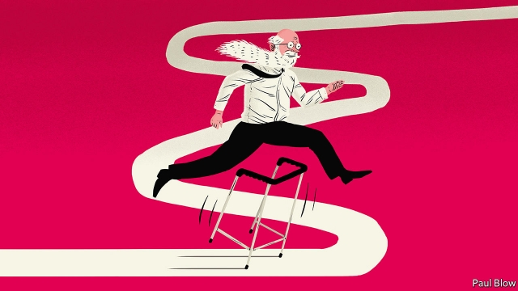

###### Bartleby

# People are working longer for reasons of choice and necessity 

 

> print-edition iconPrint edition | Business | Sep 5th 2019 

ACROSS THE developed world, the workforce now comes in 50 shades of grey. Since 2008 the average labour-force participation rate of 55- to 64-year-olds in OECD countries has risen by eight percentage points. Depending on your point of view, that trend can be spun as ruthless capitalism requiring workers to spend more years down the salt mines or as a sign that society that is finally recognising the value of its older employees. 

A new OECD report, “Working Better with Age”, points out that the employment of older workers is vital, if prosperity is to be maintained. The median age of citizens in the OECD is set to rise from 40 now to 45 in the mid-2050s; on current trends, by 2050 there will be 58 retired people for every 100 workers, up from 41 today. 

Many people will be more than happy to work longer. A recent survey of 1,000 British retired people found that a quarter thought they had stopped too early (on average they had quit at 62). A third said that they had lost their purpose in life after they retired. 

 

Bartleby has reached an age at which many of his contemporaries have stopped working. The appeal is understandable. Retirement gives you the chance to sleep late and avoid the morning commute. On a summer’s day, you can enjoy the sunshine; on a winter’s day, you can avoid the cold and rain. No longer do you have to sit through endless meetings or check email obsessively. 

But work has many compensations. It keeps the mind active and gives people a purpose in life. The first month of retirement may seem idyllic, but boredom is bound to ensue. Grand plans to learn languages and travel the world can quickly fizzle out. Furthermore, the camaraderie of colleagues provides a social network; spending all week at home can lead to loneliness. It will be a while before Bartleby retires to his seaside cottage, “Dunwritin”. 

Working longer should be easier now that most jobs require mental, rather than manual, labour. But the physical strain of being a fireman, miner or construction worker makes it harder to keep working in your 60s. 

Of course, many people are working longer not because they enjoy what they do, but because they cannot afford to quit. That is not solely because governments have been pushing up the state retirement age. In practice, the average age at which people actually retire (the “effective” retirement age) is lower than the official age by several years. In part, that is because rather than rely on a state pension, which kicks in at the official age, as their sole source of retirement income, many people supplement it with work-related pensions, which can be taken earlier. 

However, companies have been phasing out pensions linked to final salaries and replacing them with “defined contribution” schemes. Under the latter, workers end up with a pot of savings at retirement that needs to be reinvested. The income from such pots has been reduced by very low interest rates. Women tend to have smaller retirement pots (owing to their years spent raising children). That makes their difficulties particularly acute. They need to keep working. 

This helps explain the long-term trends. The effective male retirement age across the OECD was 68.4 in the late 1960s and then steadily fell to reach a low of 62.7 in the early 2000s. At that point it started to increase, reaching 65.3 by 2017. For women, the pattern has been similar. The effective retirement age fell from 66.5 in the late 1960s to 60.9 in 2000, and then rebounded to 63.7 by 2017. 

These statistics indicate that age discrimination in the workforce has been reduced, if not entirely eliminated. Some countries now have laws prohibiting discrimination on the grounds of age, although surveys suggest older workers still feel disadvantaged, particularly when it comes to promotion.  

Two issues seem to hold employers back. The first is that older workers tend to command higher salaries, because of the seniority system. The OECD suggests that the premium for long tenure should be reduced. The second is a skills deficit; one in three 55- to 65-year-olds in OECD countries either lacks computer experience or cannot pass technology tests. 

Such deficits can be tackled with proper training, organised by the government or by companies themselves. But the over-55s should take it upon themselves to keep up with technological changes. Become a silver surfer. Your livelihood may depend on it.■ 

