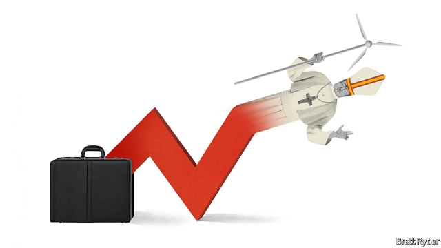

###### Schumpeter

# Popenomics 

 

> print-edition iconPrint edition | Business | Sep 7th 2019 

THERE ARE few more incongruous places for a seminar on the future of business than the Sacred Convent of Assisi, in Italy. From Schumpeter’s cell high in the convent’s outer walls, the view over rural Umbria was so beautiful it was like looking at the world through God’s eyes—not those of Mammon. The convent houses the nearly 800-year-old tomb of Saint Francis, the most poetic of holy men, who thought money was worth less than asses’ dung and inspired a mendicant order. On a night-time visit business-school students surrounded his tomb, as Franciscans in black robes charmed them with stories of their austere daily lives. The only gripe was that early friars failed to foresee that the thick medieval stonework would one day interfere with Wi-Fi. 

The week-long seminar on business, work and the circular economy, in early September, had divine overtones. Organised by some of Italy’s leading universities, it laid the groundwork for a meeting between Pope Francis and entrepreneurs, academics and students in Assisi next March to discuss the “Economy of Francesco”, in homage to the saint. The pope’s aim is to draw on the ideas of the young, as well as on veterans of development such as Amartya Sen, an Indian economist, and Jeffrey Sachs, an American one, to create a more sustainable and humane economy. 

Many businessmen—even Catholic ones—roll their eyes. They recoil at too much pontification on the shortcomings of private enterprise. Yet Pope Francis has a knack for catching the zeitgeist. On everyone’s lips in Assisi was the decision by 181 chief executives in America’s Business Roundtable in August to reject the idea that maximising shareholder value was their main goal. Stefano Zamagni, an economist at the University of Bologna (who teases modern capitalists with the pithy “a rising tide lifts only the yachts”), saw it as a watershed event. He acknowledges that it could have been a “social-marketing” ploy to keep big business’s critics at bay. But, he asks, “Who am I to judge?” 

It is a good time for reflection. Both capitalism and the Catholic church are suffering crises of faith. The reputation of big business has been damaged by the global financial crisis, inequality and environmental harm. The church is reeling from the fallout of the sexual abuse of children by priests. Both are casting about for ways to rebuild their reputations. It is intriguing that each thinks that re-evaluating economic principles may be the way forward. 

The starting-point in Assisi was that business and the Catholic church go back a long way together. Though Saint Francis ditched his life as son of a well-heeled merchant for a tunic of coarse wool, his followers helped lay the foundations of a market economy in the Middle Ages by establishing the rule of law and a role for credit. In Umbria Franciscans set up the first pawn shops in the 1460s. Luca Pacioli, who first wrote on double-entry book-keeping, was a Franciscan friar. In the past century so-called Catholic social teaching explored different economic doctrines and grew more pro-capitalist from the 1980s—in tandem with the rise of the Anglo-American concept of shareholder value. 

Things are changing. Pope Francis, an Argentine, is the first pontiff to come from the world’s less-developed south. His language on the economy is often incendiary, referring to it as “unjust at its root”. He blames big business, more than governments, for crony capitalism, while ignoring the role firms have played in helping lift many out of poverty through globalisation. He is scornful of financial markets, downplaying how important they are to economic activity. Some businesspeople view him with the same mistrust they would Jeremy Corbyn or Bernie Sanders. 

But in two ways, business folk should heed his message, particularly those who care about the long term. His “Laudato Si’”, an encyclical published in 2015 on climate change, sums up as eloquently as anything written so far the pressure from runaway growth on resources—and humans. It calls business “a noble vocation”, especially if it creates jobs. It celebrates new forms of technology, provided human responsibility develops alongside. But it notes that unbridled economic expansion is squeezing the planet dry. The rich may have to forsake some natural resources so that the poorer world can develop. It sounds radical. It is also common sense. 

The pope makes an argument about individual morality, too. A balanced life is one of self-restraint. To illustrate what he means, attendees at the Assisi seminar were shuttled to Brunello Cucinelli, a €1.9bn ($2.1bn) maker of cashmere garments. Its eponymous founder keeps a bust of Marcus Aurelius, the Roman emperor-philosopher, outside his office and talks passionately about ethics. In May he invited a dozen or so “young Leonardos”, including Amazon’s (55-year-old) Jeff Bezos, to his hilltop home to discuss humanity’s future. No doubt he told them about “gracious growth”: his preference for revenues to rise by no more than 8-10% a year, and EBITDA margins to stay at 16-17%. That, he says, is enough to sustain workers, shareholders and the environment. 

Easy for Mr Cucinelli to say, you might think. Few companies can hope for such results, at least outside Silicon Valley. But many Catholics wary of Pope Francis would agree with the garment-maker’s general point that business and morality should go hand in hand. Philip Booth, a Catholic economist from Britain, likens separating ethics from economics to separating ethics from sex—and teaching about sex purely in biological terms. 

Where things get more contentious is in recommending a course of action. Faced with climate change and inequality, the temptation is to call for draconian top-down measures to throttle economic activity. If the “Economy of Francesco” leans in that direction, it will fail. But if it stresses bosses’ commitment to behave as responsible citizens, corporate or otherwise, it may have a positive effect. At a time when the world is an unholy mess, even asking basic questions about the purpose of business has some virtue. ■ 
<<<<<<< HEAD

-- 

 单词注释:

1.Schumpeter[]:n. 熊彼特（美籍奥匈帝国经济学家, 当代资产阶级经济学代表人物之一） 

2.Sep[]:九月 

3.incongruous[in'kɒŋgruәs]:a. 不协调的, 不一致的, 不合适的 

4.convent['kɒnvәnt]:n. 女修道会 [法] 召集, 召开, 开会 

5.Assisi[ə'si:zi]:n. 阿西西（意大利城镇名） 

6.Umbria['ʌmbriә]:翁布里亚(意大利中部的大区, 翁布里亚画派发源地) 

7.mammon['mæmәn]:n. 财富, 财神 

8.convent['kɒnvәnt]:n. 女修道会 [法] 召集, 召开, 开会 

9.franci[]:[网络] 弗朗西；法赛纳；法奇 

10.poetic[pәu'etik]:a. 诗的, 诗意的, 诗人的 

11.les[lei]:abbr. 发射脱离系统（Launch Escape System） 

12.dung[dʌŋ]:n. 粪 vt. 施粪肥于 

13.mendicant['mendikәnt]:a. 行乞的, 托钵修道会的, 化缘的 n. 乞丐, 乞讨, 托钵僧 

14.Franciscan[fræn'siskәn]:a. 圣方济修会的 n. 圣方济会的修道士 

15.charm[tʃɑ:m]:n. 吸引力, 魔力, 符咒 vt. 迷住, 使陶醉, 行魔法 vi. 用符咒, 有魅力 

16.austere[ɒ'stiә]:a. 严峻的, 禁欲的, 简朴的 

17.gripe[graip]:n. 紧握, 柄, 把手, 控制 vt. 抓紧, 抱住, 使肠痛, 激怒 vi. 肠绞痛, 抱怨 

18.friar['fraiә]:n. 修道士 

19.medieval[.medi'i:vl]:a. 中古的, 中世纪的 

20.stonework['stәjnw\\:k]:n. 石造物, 建筑物的石造部分, 石方工程, 石细工, 石匠工场, 石铺 

21.divine[di'vain]:a. 神的, 神圣的, 非凡的 n. 神学家 

22.overtone['әuvәtәun]:n. 泛音, 暗示, 弦外之音, 折光的色彩 [医] 陪音, 泛音 

23.groundwork['graundwә:k]:n. 地基, 基础, 根据 

24.pope[pәup]:n. 罗马教皇, 主教 

25.entrepreneur[.ɒntrәprә'nә:]:n. 企业家, 主办人 [经] 承包商, 企业家 

26.Francesco[]:n. 弗朗西斯科（意大利文艺复兴时期著名作家）；弗朗西斯科（意大利著名导演） 

27.homage['hɒmidʒ]:n. 尊崇, 尊敬, 效忠 

28.amartya[]:[网络] 阿玛蒂亚；阿马蒂亚 

29.SEN[sen]:n. 传感器（传感元件, 探测设备） 

30.economist[i:'kɒnәmist]:n. 经济学者, 经济家 [经] 经济学家 

31.jeffrey['dʒefri]:n. 杰弗里（男子名, 等于Geoffrey） 

32.Sachs[zaks]:n. 萨克斯（汽车零配件生产厂商） 

33.sustainable[sә'steinәbl]:a. 足可支撑的, 养得起的, 可以忍受的 

34.humane[hju:'mein]:a. 有人情的, 人道的, 仁慈的 

35.recoil[ri'kɒil]:n. 畏缩, 后退, 弹回, 反作用, 后坐力 vi. 退却, 畏缩, 弹回, 撤退, 反冲, 报应 

36.pontification[,pɔntifi'keiʃәn]:武断地发表意见, 训话 

37.knack[næk]:n. 熟练技术, 巧妙手法, 诀窍 [化] 窍门 

38.zeitgeist['tsait^aist]:n. 时代精神, 时代思潮 

39.roundtable[]:a. 圆桌的, 圆台 

40.maximise['mæksimaiz]:vt. 把...增加到最大限度, 把...扩大到最大限度, 充分重视, 找出...的最高值 

41.shareholder['ʃєә.hәuldә]:n. 股东 [法] 股东, 股票持有人 

42.Stefano[]:n. 斯特凡诺（意大利名） 

43.zamagni[]:[网络] 赞玛尼 

44.bologna[bә'lәunjә]:n. 一种大腊肠 

45.capitalist['kæpitәlist]:n. 资本家, 资本主义者 a. 资本主义的 

46.pithy['piθi]:a. 有髓的, 由髓组成的, 简洁有力的 

47.yacht[jɒt]:n. 快艇, 游艇 vi. 驾游艇, 乘游艇 

48.watershed['wɒtәʃed]:n. 流域, 分水岭 [医] 分水界, 分水岭 

49.ploy[plɒi]:n. 手段, 活动, 玩乐 

50.capitalism['kæpitәlizәm]:n. 资本主义 [经] 资本主义 

51.inequality[.ini'kwɒliti]:n. 不平等, 不同, 不平坦, 不平均 n. 不平等, 不等式 [计] 不等式 

52.environmental[in.vaiәrәn'mentәl]:a. 周围的, 环境的 [经] 环境的, 环保的 

53.fallout['fɒ:laut]:n. 原子尘的降下, 辐射性微尘, 原子尘, 附带结果 [医] [放射尘]回降 

54.intrigue[in'tri:g]:n. 阴谋, 复杂的事 vi. 密谋, 私通 vt. 激起...的兴趣, 用诡计取得 

55.tunic['tju:nik]:n. 束腰外衣 [医] 膜, 被膜 

56.follower['fɒlәuә]:n. 从者, 属下, 追补者 [电] 随动机 

57.pawn[pɒ:n]:n. 典当, 抵押物, 人质, (象棋)兵, 马前卒, 工具 vt. 当掉, 以...担保 

58.luca[]:n. 卢卡（男子名） 

59.pacioli[]:[网络] 帕乔利；帕奇欧里；帕西欧里 

60.Franciscan[fræn'siskәn]:a. 圣方济修会的 n. 圣方济会的修道士 

61.doctrine['dɒktrin]:n. 教条, 学说 [医] 学说 

62.tandem['tændәm]:adv. 一前一后地, 纵排地 a. 纵排的, 串联的 n. 纵列两匹马拉的马车, 前后纵列的两匹马, 串座双人自行车 

63.argentine['ɑ:dʒәntain]:n. 银, 银白色金属, 银白色鱼鳞, 阿根廷人 a. 银的, 银色的, 阿根廷的 

64.pontiff['pɒntif]:n. 教皇, 主教, 大祭司 

65.incendiary[in'sendjәri]:a. 放火的, 煽动的, 燃烧的 n. 纵火犯人, 煽动者, 燃烧弹 

66.crony['krәuni]:n. 密友, 亲密伙伴, 好朋友 

67.globalisation[,gləubəlai'zeiʃən]:n. 全球化, =globalization 

68.scornful['skɒ:nful]:a. 轻蔑的 

69.downplay['daunplei]:vt. 不予重视 

70.businessperson['bɪznəspɜ:sn]:n. 商人 

71.mistrust[.mis'trʌst]:n. 不信任, 疑惑 v. 不信任, 疑惑 

72.jeremy['dʒerimi]:n. 杰里米（男子名） 

73.Corbyn[]:科尔宾（人名） 

74.bernie['bә:ni]:n. 伯尼（男子名）；[俚]可卡因（等于cocaine） 

75.sander['sændә]:[电] 散沙 

76.heed[hi:d]:n. 注意, 留心 v. 注意, 留心 

77.encyclical[en'siklikәl]:a. 传阅的, 广泛传送的 

78.eloquently[]:adv. 善辩地；富于表现力地 

79.runaway['rʌnә.wei]:n. 逃跑, 逃走的人, 逃亡, 压倒性的优胜 a. 逃亡的, 逃走的 

80.vocation[vәu'keiʃәn]:n. 职业, 天命, 天职, 才能, 行业 [法] 行业, 职业, 职业上的才能 

81.unbridle[.ʌn'braidl]:vt. 放松缰绳, 放纵 

82.forsake[fә'seik]:vt. 放弃, 断念, 抛弃 [法] 遗弃, 抛弃, 摒绝 

83.pope[pәup]:n. 罗马教皇, 主教 

84.morality[mә'ræliti]:n. 道德, 教训, 品行 [法] 道德, 道义 

85.attendee[æten'di:]:[计] 出席人, 参加者, 被照顾者, 被服务者 

86.brunello[]:n. (Brunello)人名；(西)布鲁内略；(意)布鲁内洛 

87.cucinelli[]:[网络] 库奇内利 

88.maker['meikә]:n. 制造者, 上帝 [经] 制造者, 出票人 

89.cashmere['kæʃmiә]:n. 开士米, 山羊绒 [化] 山羊绒; 开斯米绒 

90.eponymous[i'pɒnimәs]:a. 齐名的 

91.founder['faundә]:n. 创立者, 建立者 vt. 使沉没, 使摔倒, 弄跛, 浸水, 破坏 vi. 沉没, 摔到, 变跛, 倒塌, 失败 

92.bust[bʌst]:n. 半身像, 胸部, 失败, 殴打 vt. 使爆裂, 使破产 vi. 爆裂, 破产 [计] 操作错 

93.Marcus['mɑ:kәs]:n. 马库斯（男子名） 

94.Aurelius[ɔ:'ri:ljәs]:n. 马可.奥里利乌斯(罗马皇帝兼斯多葛派哲学家,121-180) 

95.passionately['pæʃənətlɪ]:adv. 热情地, 激昂地 

96.ethic['eθik]:n. 道德规范, 伦理 

97.leonardos[]:[网络] 莱昂纳多斯 

98.jeff[dʒef]:n. 杰夫（男子名, 等于Jeffrey） 

99.bezos[]:贝索斯（人名） 

100.hilltop['hiltɒp]:n. 小山顶 

101.ebitda[]:abbr. earings before interest;  tax; earnings before interest;  taxes 

102.silicon['silikәn]:n. 硅 [化] 硅Si 

103.wary['wєәri]:a. 谨慎的, 小心的, 机警的, 周到的, 唯恐的 

104.philip['filip]:n. 菲利普（男子名） 

105.liken['laikәn]:vt. 比喻, 比拟 

106.biological[.baiәu'lɒdʒikәl]:a. 生物学的 [医] 生物学的 

107.contentious[kәn'tenʃәs]:a. 好争吵的, 爱争论的, 有异议的 [法] 诉讼的, 争执的, 引起争论的 

108.draconian[drә'kәjniәn]:a. 严厉的, 残酷的 

109.throttle['θrɒtl]:n. 节流阀, 节气阀, 喉咙 vt. 扼喉咙, 使窒息, 压制, 使节流 vi. 窒息, 节流, 减速 

110.corporate['kɒ:pәrit]:a. 社团的, 合伙的, 公司的 [经] 团体的, 法人的, 社团的 

111.unholy[.ʌn'hәuli]:a. 不神圣的, 不虔诚的, 邪恶的 
=======
>>>>>>> 50f1fbac684ef65c788c2c3b1cb359dd2a904378

