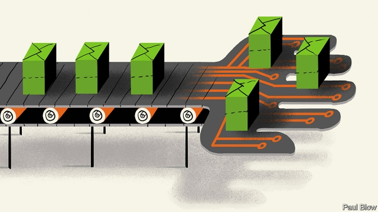
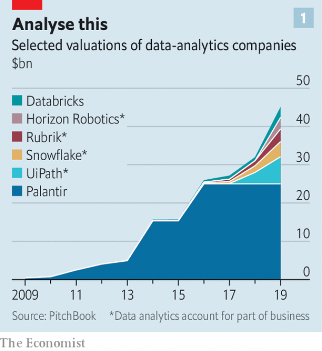
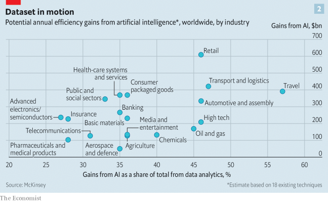

###### The digital assembly line

# Technology firms vie for billions in data-analytics contracts 

 

> print-edition iconPrint edition | Business | Sep 7th 2019 

SOMEBODY LESS driven than Tom Siebel would have long since thrown in the towel. In 2006 the entrepreneur, then 53 years old, sold his first firm, Siebel Systems, which made computer programs to track customer relations, to Oracle, a giant of business software. That left him a billionaire—but a restless one. In 2009, a few months after Mr Siebel had launched a new startup, he was trampled by an elephant while on safari in Tanzania. When, a dozen surgeries later, he could work again, the enterprise almost went bankrupt. Undeterred, he rebooted it. 

Mr Siebel’s fortitude has paid off. The firm, now called C3.ai, raised $100m in venture capital last year, valuing it at $2.1bn. It was an early bet on data analytics, which converts raw data (from a machine’s sensors or a warehouse) into useful predictions (when equipment will fail or what the optimal stocking levels are) with the help of clever algorithms. Many investors see fortunes to be made from this new breed of enterprise software, which is spreading from Big Tech’s computer labs to corporations everywhere. 

Worldwide, 35 companies that dabble in data analytics feature on a list of startups valued at $1bn or more, maintained by CB Insights, a research firm. Collectively, these unicorns—some of which brand themselves as purveyors of artificial intelligence (AI)—enjoy a heady valuation of $73bn. According to PitchBook, another research company, the six biggest alone are worth $45bn (see chart 1). Many venture capitalists who back them are hoping to emulate the successful initial public offerings this year of less exalted business-services startups like CrowdStrike, which provides cybersecurity, or Zoom, a video-conferencing company. And then some. 

 

As is often the case in Silicon Valley, hype springs eternal, fuelled by big numbers from consultancies. IDC reckons that spending on big-data and business-analytics software will reach $67bn this year. But it will, boosters say, at last allow businesses to see the computer age in their productivity statistics, freeing them from the shadow of Robert Solow, a Nobel-prizewinning economist, who in 1987 observed that investment in information technology appeared to do little to make companies more efficient. Just as electricity enabled the assembly line in the 19th century, since machines no longer had to be grouped around a central steam engine, data-analytics companies promise to usher in the assembly lines of the digital economy, distributing data-crunching capacity where it is needed. They may also, as George Gilbert, a veteran business-IT analyst, observes, help all kinds of firm create the same network effects behind the rise of the tech giants: the better they serve their customers, the more data they collect, which in turn improves their services, and so on. 

Consultants at Gartner recently calculated that in 2021 “AI augmentation” will create $2.9trn of “business value” and save 6.2bn man-hours globally. A survey by McKinsey last year estimated that AI analytics could add around $13trn, or 16%, to annual global GDP by 2030. Retail and logistics stand to gain most (see chart 2). 

 

Data analytics have a long way to go before they live up to these expectations. Extracting and analysing data from countless sources and connected devices—the “Internet of Things”—is difficult and costly. Although most firms boast of having conjured up AI “platforms”, few of these meet the usual definition of that term, typically reserved for things like Apple’s and Google’s smartphone operating systems, which allow developers to build compatible apps easily. 

An AI platform would automatically translate raw data into an algorithm-friendly format and offer a set of software-design tools that even people with limited coding skills could use. Many companies, including Palantir, the biggest unicorn in the data-analytics herd, sell high-end customised services—equivalent to building an operating system from scratch for every client. Cloud-computing giants such as Amazon Web Services, Microsoft Azure and Google Cloud offer standardised products for their corporate customers but, as Jim Hare of Gartner explains, these are considerably less sophisticated and lock users into their networks. 

Enter C3.ai, founded to help utilities manage electric grids, a complex problem that involves collecting and processing data from many sources. After its near-bankruptcy, advances in machine learning, sensors and data connectivity gave it a new lease of life—and allowed it to repackage its products for a range of industries. Crucially for corporate clients, C3’s approach grew out of Mr Siebel’s experience with enterprise software. He wanted to make data analytics hassle-free for corporate clients, without sacrificing sophistication. 

3M, an American conglomerate, employs C3 software to pick out potentially contentious invoices to pre-empt complaints. The United States Air Force uses it to work out which parts of an aircraft are likely to fail soon. C3 is helping Baker Hughes to develop analytics tools for the oil-and-gas industry (General Electric, the oil-services firm’s parent company, has struggled to perfect an analytics platform of its own, called Predix). 

C3’s chief rival in building a bona fide AI platform is not Big Tech or the very biggest data-analytics unicorns. It is a company called Databricks. It was founded in 2013 by computer wizards who developed Apache Spark, an open-source program which can handle reams of data from sensors and other connected devices in real time. Databricks expanded Spark to handle more data types. It sells its services chiefly to startups (such as Hotels.com, a travel site) and media companies (Viacom). It says it will generate $200m in revenue this year and was valued at $2.8bn when it last raised capital in February. 

Though C3’s and Databricks’ niches do not overlap much at the moment, they may do in the future. Their approaches differ, too, reflecting their roots. Databricks, born of abstruse computer science, helps clients deploy open-source tools effectively. Like most enterprise-software firms, C3 sells proprietary applications. 

It is unclear which one will prevail; at the moment the two firms are neck-and-neck. In the near term, the market is big enough for both—and more. In the longer run, someone will come up with AI-assisted data analytics that are no more taxing than using a spreadsheet. It could be C3 or Databricks, or smaller rivals like Dataiku from New York or Domino Data Lab in San Francisco, which are also busily erecting AI platforms. The field’s other unicorns are unlikely to give up trying. And incumbent tech titans like Amazon, Google and Microsoft want to dominate all sorts of software, including advanced data analytics. 

Mr Siebel would be the first to admit that this scramble is likely to claim victims. But it certainly bodes well for buyers of data-analytics software, which is likely to become as familiar to corporate IT departments in the 2020s as customer-relations programs are today. ■ 

