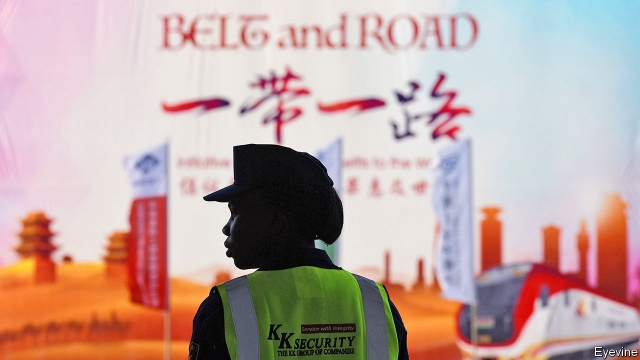

###### From the party, with love

# China releases a movie drama featuring its belt-and-road project 

 

> print-edition iconPrint edition | China | Sep 7th 2019 

 “PLEASE DON’T take it as a propaganda movie,” urges an employee from the Chinese entertainment company behind “Common Destiny”, the world’s first film featuring China’s Belt and Road Initiative (BRI), a global infrastructure-building scheme. That is a tall order. State media openly admit that the film, which had a nationwide première on August 30th amid much hype, received “major backing” from the government. It bears only a superficial resemblance to a drama pic. 

The Chinese term for BRI is rarely mentioned in the film. But it is all about the goodwill that China supposedly manifests through the project. The plot revolves around half a dozen unrelated people from all corners of the world, each benefiting in some way from the scheme. A schoolgirl in Kenya rides a new railway built by China (a guard is pictured at its terminus in the Kenyan capital, Nairobi). An unemployed woman in Jordan is hired by a Chinese internet firm—involved in the BRI’s “digital Silk Road”—after local companies turn her down. The only aspect of the film that is overtly political is its title, which is shorthand for the much ballyhooed goal of President Xi Jinping’s foreign policy: “A community of common destiny for mankind”. At the film’s opening Martin Campbell, a New Zealander best known for directing the James Bond movies “GoldenEye” and “Casino Royale”, said “Common Destiny” would “deeply touch” audiences. 

Those audiences, however, appear indifferent, not stirred. In its first five days “Common Destiny” earned just 1m yuan ($140,000) at the box office. In contrast, “Wolf Warrior 2”, a jingoistic action thriller also related to China’s overseas influence-building, grossed 5.7bn yuan in 2017—a Chinese box-office record. One of the state firms behind that film is also an investor in “Common Destiny”. 

Indeed, a sizeable minority of online commenters on “Common Destiny” appear sceptical about the BRI itself. “We are a developing country, yet we frequently give money away to others,” laments one on Mtime, a movie review and ticketing platform (never mind that BRI involves few free handouts). Recent research by a Chinese academic, who asks not to be identified, is revealing. It found that only a third of comments on the BRI published online in China were “enthusiastic” about the project. Two-thirds were “neutral”. 

Some people may not like China, as an emerging great power and the world’s second-largest economy, being so closely identified with the developing world. In recent years the BRI’s detractors in China have taken to mocking the project online by calling it da sa bi (“big spill of money”). This is a play on da sha bi, which literally means “big stupid cunt”. Censors have tried to keep up, but posts referring to the BRI as da sa bi can still be found. 

The academic says he is convinced that public enthusiasm for the BRI will grow, especially if the government increases publicity about the economic benefits that China itself will reap. But “as a big country, we have a duty to help less developed countries,” he notes. He reckons that more than 90% of Chinese people will be receptive to this line of thought if it is delivered in the right way. Perhaps a pacier sequel to “Common Destiny” would help. ■ 

