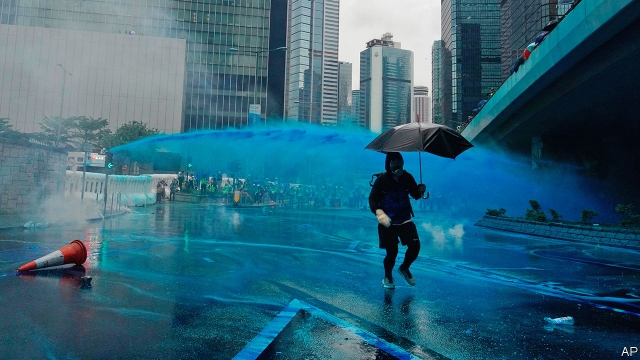

###### Carrie Lam’s blues

# Hong Kong’s leader has made a concession to protesters 

 

> print-edition iconPrint edition | China | Sep 7th 2019 

DURING THE past nearly three months of popular unrest in Hong Kong, unprecedented in size and intensity, the territory has become accustomed to surprises. Participants themselves have been taken aback by the scale of some of the protests, the violence they have spawned by protesters and police, and their persistence in spite of the economic harm that some residents fear they are causing and the risk they may be incurring of intervention by the mainland’s security forces. Now the territory’s chief executive, Carrie Lam, obdurate for weeks in the face of the protesters’ demands, has changed her tune. 

On September 4th, after days of speculation that the government was preparing to get far tougher, perhaps by invoking sweeping colonial-era emergency regulations, Mrs Lam made a pre-recorded televised address that was clearly intended to sound conciliatory. In it she said she would formally abandon the proposed legislation that sparked the unrest in June—a bill that would have allowed criminal suspects in Hong Kong to be extradited to Communist Party-controlled courts on the Chinese mainland. Mrs Lam shelved the bill a few days after the protests broke out, but had hitherto rejected protesters’ demands that she scrap it entirely. She now says a government motion declaring its withdrawal will be submitted to the legislature when it reconvenes next month. 

This was hardly a dramatic step—she had already declared the bill “dead”. But it was striking in the context of recent reports that she had been refusing to ditch it completely because the leadership in Beijing would not let her. On August 30th Reuters news agency quoted unnamed sources in Hong Kong as saying that Mrs Lam had proposed doing so in a report submitted to the central government. This document had also suggested accepting one of the protesters’ other demands, namely that an independent inquiry be conducted into the protests, including the use of excessive force by the police. Reuters said the response from Beijing was that no further concessions should be made. 

Many pro-democracy activists have responded dismissively to Mrs Lam’s announcement. They note that Mrs Lam repeated her consistent line that complaints about police violence would be handled by the Independent Police Complaints Council, which protesters say is not independent enough. She also made no concessions to their other demands: that arrested demonstrators be released and no charges pressed, that the government stop classifying the unrest as a “riot” and that full democracy be granted. The party has promised eventual “universal suffrage” in Hong Kong. But it applies the term only to the ability to cast a vote. It reserves the right to decide who can stand. 

Few protesters expect the party to grant more democracy. But a slogan they often chant is “Five demands, not one less”, implying that they intend to maintain pressure on the government even though they know their goal is unrealistic. Before Mrs Lam’s address, the stances of both sides had appeared to be hardening. Last week, for the first time, the police refused to give permission for a proposed big rally in central Hong Kong. Organisers called it off, but thousands turned up anyway on August 31st. This led to some of the worst violence since the unrest began. 

Protesters threw dozens of petrol bombs and lit bonfires in the streets. The police responded with water cannon (a recent addition to their armoury) with blue dye to stain protesters at the scene and help with identification later. They also fired live rounds in warning. On the following day protesters gathered at the airport, disrupting flights and ground-transport links. They later vandalised train stations elsewhere in Hong Kong. 

The scale of the unrest fuelled mounting speculation that the government might apply the martial-law-like Emergency Regulations Ordinance which was introduced by the British 75 years before their withdrawal from the territory in 1997. It was last used in 1967 to crush riots by Communist Party supporters. Under it, the government could impose censorship, seize property and arrest people far more freely. Party-controlled newspapers in Hong Kong have been braying for the law’s deployment. 

But using the ordinance may not help the government as much as the party’s cheerleaders expect. Restricting liberties could strengthen support for the demonstrators. Business confidence could plummet should the authorities start confiscating assets. Some firms are already deeply worried about being caught in the crossfire. Hong Kong’s flagship airline, Cathay Pacific, is one. The participation of some of its staff in the protests has infuriated Chinese officials. In mid-August the company dumped its chief executive as Chinese pressure on the firm grew. On September 4th its chairman, John Slosar, also said he would resign. (Cathay says he is retiring.) 

Ronny Tong, a member of Mrs Lam’s cabinet, says he personally has reservations about invoking the ordinance. He is concerned, for example, that if it were used to ban masks at protests (the pro-party press is eager for this to be done), the police might not be able to enforce the new rule strictly. If the police were struggling, in turn, he is worried that might prompt the mainland authorities to intervene as allowed for in the basic law. 

In a recent off-record speech to businessmen, published by Reuters on September 3rd, Mrs Lam said officials in Beijing were not planning to send in the army. “They know that the price would be too huge to pay,” she said. But she admitted that she had few options. “Political room for manoeuvring is very, very, very limited,” she said, given the need to “serve two masters”: the central government and the people of Hong Kong. She admitted that she had caused “unforgivable” havoc in the territory and said that if she had a choice, she would quit. Later, pressed by reporters, she denied having asked the central government for permission to do so and insisted she had not even thought about it. She must surely be tempted. ■ 
<<<<<<< HEAD

-- 

 单词注释:

1.carrie['kæri]:n. 卡丽（女名, Caroline的昵称） 

2.hong[hɔŋ]:n. （中国、日本的）行, 商行 

3.concession[kәn'seʃәn]:n. 特许, 让步, 认可 [经] 核准, 许可, 特殊(权) 

4.protester[]:n. 抗议者, 持异议者, 拒付者 [经] 反对者 

5.Sep[]:九月 

6.kong[kɔŋ]:n. 含锡砾石下的无矿基岩；钢 

7.unprecedented[.ʌn'presidentid]:a. 空前的 [经] 空前的, 无前例的 

8.participant[pɑ:'tisipәnt]:n. 参加者, 参与者 a. 有份的, 参加的, 参与的 

9.aback[ә'bæk]:adv. 向后, 朝后, 突然, 船顶风地 

10.spawn[spɒ:n]:n. (鱼)卵, 产物 vt. 产卵, 酿成, 大量生产 vi. 产卵, 大量生产 

11.persistence[pә'sistәns]:n. 固执, 坚持不懈, 持续(性), 存留(状态) [电] 持久 

12.incur[in'kә:]:vt. 招致, 蒙受, 遭遇 [经] 招致, 蒙受, 担负 

13.intervention[.intә'venʃәn]:n. 插入, 介入, 调停 [经] 干预 

14.lam[læm]:v. 打, 鞭笞, 逃脱 n. 逃亡 

15.obdurate['ɒbdjurit]:a. 顽固的, 执拗的, 冷酷的 [法] 执迷不悟的, 毫不悔改的, 无情的 

16.speculation[.spekju'leiʃәn]:n. 沉思, 推测, 投机 [经] 投机交易, 买空卖空 

17.invoke[in'vәuk]:vt. 祈求, 恳求, 实行, 援引, 引起 [计] 调用; 请求 

18.Mr['mistә(r)]:先生 [计] 存储器回收程序, 多重请求 

19.televise['telivaiz]:v. 用电视播放, 播映 

20.conciliatory[kәn'siliәtәri]:a. 安抚的, 和好的, 调和的 

21.formally['fɒ:mәli]:adv. 正式地, 形式上 

22.shelve[ʃelv]:vt. 放置架子上, 搁置 vi. 渐渐倾斜 

23.hitherto[.hiðә'tu:]:adv. 迄今, 至今 

24.scrap[skræp]:n. 碎片, 残余物, 些微, 片断, 铁屑, 吵架 vt. 扔弃, 敲碎, 拆毁 vi. 互相殴打 a. 零碎拼凑成的, 废弃的 

25.entirely[in'taiәli]:adv. 完全, 全然, 一概 

26.withdrawal[wið'drɒ:l]:n. 提款, 撤退, 退回, 撤消, 退隐, 戒毒过程 [医] 戒除, 脱瘾 

27.legislature['ledʒisleitʃә]:n. 立法机关, 议会, 立法院 [法] 立法机构, 立法机关 

28.reconvene[.ri:kәn'vi:n]:vi. 再聚会；再集会 

29.context['kɒntekst]:n. 上下文, 背景, 来龙去脉 n. 上下文 [计] 上下文 

30.Reuter['rɔitә]:n. 路透社, 路透通讯社 

31.unnamed['ʌn'neimd]:a. 未命名的, 没有名字的, 未提及的 [计] 无名的 

32.activist['æktivist]:n. 激进主义分子 

33.dismissively[]:adv. 轻蔑地；不屑一顾地 

34.demonstrator['demәnstreitә]:n. 论证者, 证明者, 指示者, 示威者 [医] 示教者 

35.riot['raiәt]:n. 暴动, 喧闹, 放纵 vi. 发动, 暴动, 纵情, 放荡 vt. 浪费, 挥霍 

36.eventual[i'ventʃuәl]:a. 最后的, 终于的 

37.suffrage['sʌfridʒ]:n. 投票, 选举权, 参政权, 代祷 [法] 选举权, 投票权, 参政权 

38.les[lei]:abbr. 发射脱离系统（Launch Escape System） 

39.unrealistic[.ʌnriә'listik]:a. 不切实际的, 幻想的 

40.stance[stæns]:n. 准备击球姿势, 站立的姿势, 位置, 姿态 [经] 地位, 形势 

41.rally['ræli]:n. 重振旗鼓, 集合, 群众集会, 跌停回升 v. 重整旗鼓, 集合, 恢复精神, 团结, 挖苦, 嘲笑 

42.bonfire['bɒnfaiә]:n. 大篝火, 营火 

43.armoury['ɑ:mәri]:n. 军械库, 兵工厂 

44.disrupt[dis'rʌpt]:a. 分裂的, 中断的 vt. 使分裂, 使瓦解 

45.vandalise['vændәlaiz]:vt. 摧残(文化), 破坏(公共财产), 故意破坏 

46.ordinance['ɒ:dinәns]:n. 法令, 条例, 圣餐礼 [经] 法令, 条款, 条例 

47.supporter[sә'pɒ:tә]:n. 支持者, 后盾, 迫随者, 护身织物 [法] 支持者, 赡养者, 抚养者 

48.censorship['sensәʃip]:n. 检查制度 [医] 督察, 监察 

49.bray[brei]:n. 驴叫声, 喇叭声 v. 叫, 嘶叫 

50.deployment[]:[计] 展开 

51.ordinance['ɒ:dinәns]:n. 法令, 条例, 圣餐礼 [经] 法令, 条款, 条例 

52.cheerleader['tʃiәli:dә]:n. 啦啦队长 

53.plummet['plʌmit]:n. 测深锤, 铅坠 vi. 垂直落下 

54.confiscate['kɒnfiskeit]:vt. 没收, 把...充公, 查抄 a. 被没收的 

55.asset['æset]:n. 资产, 有益的东西 

56.crossfire['krɔsfaiә]:n. 交叉火力, 串报, 串扰电流 [电] 交火 

57.flagship['flægʃip]:n. 旗舰 

58.Cathay[kæ'θei]:n. 中国 

59.participation[.pɑ:tisi'peiʃәn]:n. 参与, 分享 [经] 参与, 参股 

60.infuriate[in'fjuәrieit]:a. 狂怒的 vt. 激怒 

61.john[dʒɔn]:n. 盥洗室, 厕所, 嫖客 

62.Ronny[]:n. (Ronny)人名；(瑞典)龙尼 

63.tong[tɒŋ]:n. 钳子, 帮会 v. 用钳子钳起 

64.intervene[.intә'vi:n]:vi. 插入, 调停, 干涉 [经] 进场干预 

65.manoeuvre[mә'nu:vә]:n. 调遣, 演习, 策略 vi. 调动, 演习, 用策略 vt. 调动, 操纵 

66.unforgivable['ʌnfә'^ivәbl]:a. 不可原谅的, 不可饶恕的 

67.havoc['hævәk]:n. 大破坏, 蹂躏 vt. 严重破坏 
=======
>>>>>>> 50f1fbac684ef65c788c2c3b1cb359dd2a904378

