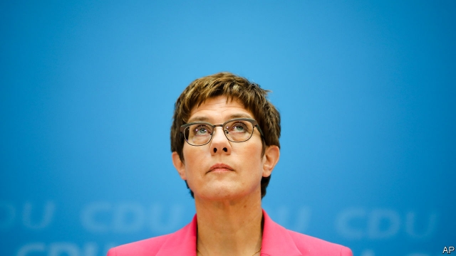
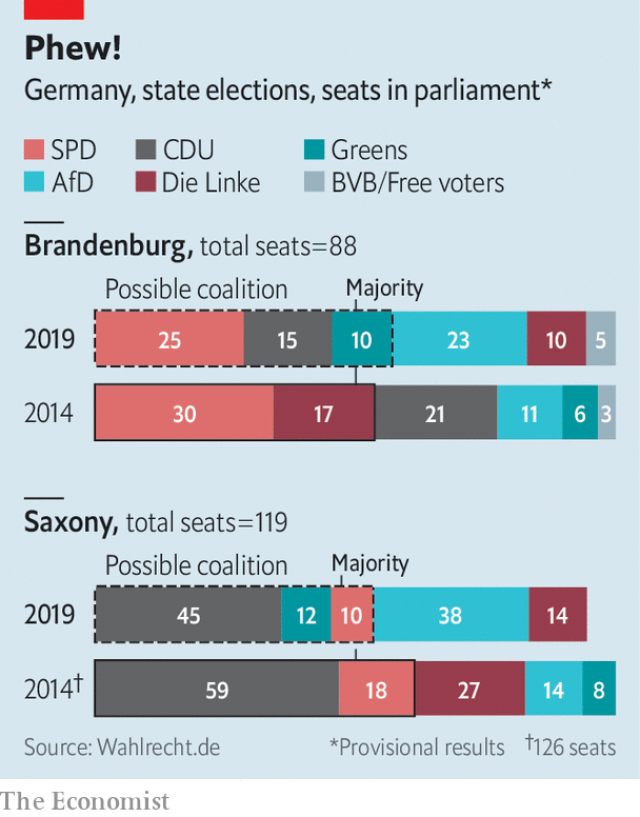

###### Meltdown averted

# Germany’s ruling parties have escaped electoral disaster 

 

> print-edition iconPrint edition | Europe | Sep 7th 2019 

ON SEPTEMBER 1ST Germany’s ruling Christian Democratic Union (CDU) scored its worst result at a state election in Saxony for three decades—and the party faithful, crammed into a sweaty restaurant in Dresden, cheered it to the rafters. For although the party’s 32% share was almost one-fifth lower than in the last vote, in 2014, it was enough to stop the hard-right Alternative for Germany (AfD) from winning its first state election. A similar story unfolded in Brandenburg, another eastern state, where the ruling Social Democrats (SPD) squeaked a victory over the AfD with just over a quarter of the vote. The SPD once scored absolute majorities here. But the AfD’s performance in eastern Germany has dramatically lowered the bar for what other parties consider success. 

Disaster averted, then? The probable survival of the ruling parties in both states provides a little breathing-space to Germany’s federal coalition, an unhappy marriage of the CDU (plus its Bavarian sister party) with the SPD. Annegret Kramp-Karrenbauer, the CDU’s embattled national leader, can thank Michael Kretschmer, her counterpart in Saxony, for leading the party to victory in a spirited campaign. For the SPD, divided and rudderless, losing Brandenburg would have darkened the mood further as it begins a campaign to choose a leader to replace the one it kicked out in June. Several of the candidates still want the party to leave the federal government, a decision it must make in December. 

In the two states, the ruling parties now begin the tough work of building coalitions. In Saxony Mr Kretschmer’s only option seems to be a “Kenya” coalition with the SPD and the Greens (the parties’ colours match the country’s flag), which would leave more parties sitting in government than outside it. Big differences over education, policing and energy will hamper the negotiations; success is not guaranteed. A similar combination looks possible in Brandenburg. A Kenya coalition in neighbouring Saxony-Anhalt has been a miserable experience for everyone. But awkward governing contraptions are increasingly unavoidable if the AfD is to be kept out of office, as all other parties insist. By the year’s end four of the five states of the former East Germany may be run by three-party coalitions. That bolsters the AfD’s claim to be the only genuine alternative. 

 

Many members of the Saxon CDU, perhaps the country’s most conservative branch, grumble about the cordon sanitaire their leadership has erected around the AfD. But the populists’ radicalisation makes co-operation impossible: Andreas Kalbitz, the AfD’s leader in Brandenburg, was plagued throughout the campaign by evidence of past links to neo-Nazi groups. That he nonetheless secured a score of 24%, including 100,000 previous non-voters, ought to concentrate minds. The party doubled its score in Brandenburg, and nearly tripled it in Saxony. In Saxony it came first among every age group below 60. This may represent the limit of its support, which has in fact been flat for two years. But electoral maps of the two states show their eastern halves painted almost entirely in the party’s royal blue. 

That has fuelled an anxious national conversation about the persistence of Germany’s east-west divisions. November 9th will mark the 30th anniversary of the fall of the Berlin Wall (just two weeks after Thuringia, a third eastern state, holds an election). What ought to be a moment to celebrate German unity may become an occasion to highlight its rifts. ■ 

