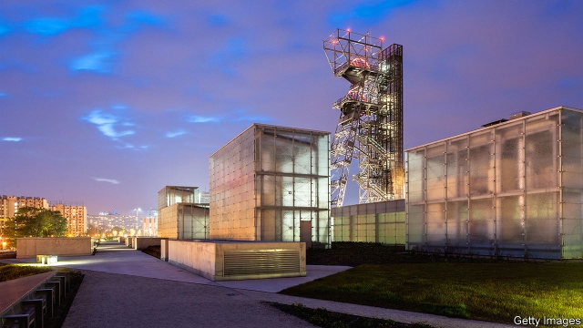

###### In the black

# How the capital of Poland’s coal belt is reinventing itself 

 

> print-edition iconPrint edition | Europe | Sep 7th 2019 

TO GRASP THE past and the hoped-for future of Katowice, visit Bogucice. The Warszawa II coal mineshaft, the largest of the southern Polish city’s old Hard Coal Mine, has long dominated this northern district. Its skeleton and giant winch-wheel loom over a tangle of highways and communist-era tower blocks. Such, for decades, was the image of the capital of the coal-mining region of Silesia: unbeautifully industrial, pollution-scarred and hopelessly reliant on hydrocarbon. When, last December, it hosted the latest global climate conference, it seemed a preposterous choice. In the week beforehand, Greenpeace reported, it had the second-worst air quality of any city in the EU. 

Poland is an environmental laggard. Its right-populist government remains emotionally fond of coal and resists tighter EU rules on emissions. Mateusz Morawiecki, its prime minister, wants to make Katowice the backdrop to his party’s anti-greenery campaign in parliamentary elections in October; he has chosen Katowice as the constituency from which to run for a new seat. And yet it is worth paying attention to attempts to reinvent Katowice. 

What is now Katowice was for centuries a cluster of German farms that passed between Polish, Czech, Austrian and Prussian control. From 1839 Franz Winkler, an industrialist, turned these into a coal-mining metropolis by basing his empire there. The railway came, then city status and then, after unification under Bismarck, “Germanising” cultural institutions like schools and a theatre. Polish-ising institutions followed when this part of Silesia became part of the young Polish republic in 1922, still evident today in the rational lines of the Silesian Parliament and the New York-style “Cloud Scraper” tower block. The latter was briefly used as a sniper station in 1939 when the Germans invaded. 

The ravages of first Nazi and then communist control deprived the city of many of its most beautiful buildings. Since the fall of communism the city has slowly come to terms with the decline and closure of many of the mines that had thundered and churned since Winkler’s time. 

Katowice’s leaders are inspired by the post-industrial reinvention of cities like Glasgow, Lille and Essen, but especially Bilbao. The Basque city has used cultural institutions like its monumental outpost of the Guggenheim Museum to strike out on a new path since the 1990s. Katowice wants to do the same with the National Polish Radio Symphony Orchestra on the site of the old KWK Katowice coal mine in Bogucice and the new Silesian Museum in Warszawa II nearby. New cycle paths twist through the city’s centre, parks have been developed and former industrial sites like the Guido mine in Zabrze have reopened as tourist attractions. New business parks on the city’s fringes are speeding its transition from mining (only two of the once dozens of shafts are still open) to services. 

Many cities want to achieve the “Bilbao effect”. Doing so takes an alchemical mix of creativity, ambition and luck. But Katowice stands a chance. Even by the standards of Poland’s booming economy, it is doing very well. Overall unemployment is low (2.3%), and the city’s squares, not to mention its futuristic Galeria Katowicka shopping centre, teem with workers and shoppers. Not for them the empty streets and boarded-up shops of other former coal-mining regions of Europe. 

Can it last? The Polish boom will not endure forever. The final mines will eventually close. With its mighty unions and veneration of Saint Barbara (the patron saint of miners), Katowice remains at heart a coal city. But Alicja Knast, the director of the Silesian Museum, reckons it can reinvent itself. The city passed through many hands over the centuries. It has experimented with various religions. Once Protestant, it is now Catholic. It hosted an important congress in the development of Zionism and is home to Poland’s first Buddhist temple. Poland’s first big hip-hop artists, Kaliber 44 and Paktofonika, emerged from its reacquaintance with capitalist forces in the 1990s. Surveying the city’s history from the mighty Warszawa II mine, Ms Knast is optimistic: “I’m not worried at all.” ■ 

