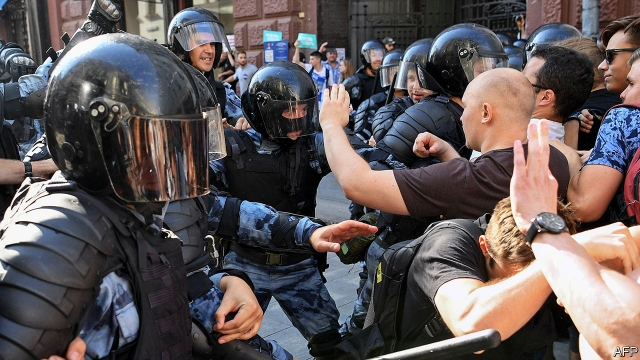

###### Kremlin v people

# Repression in Russia no longer works as well as it did 

 

> print-edition iconPrint edition | Europe | Sep 7th 2019 

EGOR ZHUKOV, a student in Moscow, published a video blog on August 1st in which he described how the siloviki (members of Russia’s security services) had seized power in Russia, using protests over local elections in Moscow as an excuse. “Russia will inevitably be free,” he said, “but we may not live to see it if we let fear win, because when fear wins, silence comes...a silence that will be disturbed by the screeching brakes of a black police wagon and the deafening ring of a doorbell that divides life into before and after.” 

Coming from a 21-year-old student, in prettified and bustling Moscow, with its hipster cafés and cycle lanes, the associations with the darkest days of the Soviet 1930s seemed like hyperbole. Eight hours later, in the middle of the night, the security services rang Mr Zhukov’s doorbell. At 2.05am, he sent a text message to a friend: “They’ve come for me.” A few hours later, he was led away and charged with involvement in “mass disturbances” during the summer protests. The charge was fabricated. Not only were the protests peaceful but Mr Zhukov was misidentified in a video used by the police. The only acts of violence during the protests were committed by the police and the security services. 

But the arrest of Mr Zhukov, and of many of his fellow activists, has been met with anything but silence. Students and academics have signed open letters and picketed police headquarters. Bloggers and rappers came to support him in court. And at the next big protest, on August 10th, some 50,000 people came out onto the streets. Stars’ Secrets, a tabloid about the life of celebrities, published a two-page spread about police violence. 

On September 3rd, after a month in detention, Mr Zhukov was released and placed under house arrest, the initial charge of “mass disturbances” replaced by a somewhat softer one of “extremism”. Five other detainees, also charged with “mass disturbances”, were released without charge. At the same time, though, four other men who had tried to resist police violence during the summer protests were sentenced to two and three years in prison. 

The Moscow protests, the largest since 2012, have demonstrated that Vladimir Putin is running out of non-violent means of sustaining himself in power. However, they also showed that ordinary Russians are no longer prepared to put up with being terrorised—and this shift in the public mood makes it harder for the Kremlin to terrorise them. The current crisis was triggered by the government’s fear of losing in local elections due on September 8th across the country, with the vote for Moscow’s city council especially significant. The council has little actual authority, but symbols carry enormous political weight in Russia. To many Russians, the fight for the Moscow council has turned into a proxy battle for the Kremlin itself. 

This was partly the doing of Alexei Navalny, Russia’s most prominent opposition leader, who urged his supporters to vote for candidates whom he identified as being most able to defeat the Kremlin’s nominees. The Kremlin used bogus excuses to disqualify not just Mr Navalny’s associates, but all independent candidates, including the more moderate ones. This sparked the large-scale protests. 

The Moscow authorities initially showed restraint. But when a couple of tents went up in central Moscow, officials fretted that this might be the start of a Ukrainian-style uprising. The siloviki came rushing in to crush it. They beat up unarmed protesters, including women, arrested some 1,400 and threatened to take away children from parents who brought them to protests. “We wanted to set a small fire and fry up United Russia [the ruling party]. But then the Kremlin dumped a canister of petrol into it,” says Mr Navalny. 

What started as a protest against electoral shenanigans turned into a broader movement for human rights. The initial slogan dopuskai “let [the candidates] in” changed into otpuskai, “let [political prisoners] out”. Kirill Rogov, an analyst, says that the one thing that independent-minded Russians can agree on is that they should be allowed to demonstrate without being beaten up. 

“Society is no longer prepared to put up with violence,” says Grigory Okhotin of OVD-Info, a human-rights group that monitors and provides legal help to the victims of repression. In recent weeks the group has seen an eight-fold increase in voluntary donations and a doubling of the number of volunteers, most in their mid-20s. “They are intolerant [of] repression and don’t want to wait for Russia to turn into a normal country. They want to live in a normal country now,” says Mr Okhotin. 

In a poll by the Levada Centre, 41% of Russians (and half of Muscovites) said they thought the state’s use of force was excessive and cruel; only 32% deemed it justified. Many people who once saw the state as a guarantor of stability and growth now see it as a threat. Hoping to de-escalate the crisis, the Kremlin has apparently transferred control of the Moscow streets back to civilians. The most recent protest on August 31st ended peacefully. 

This tactical retreat may be followed by more repression. But the summer protests showed that brutality has costs. As Mr Zhukov wrote in his letter from prison, the regime’s fall could be as sudden as his own arrest, the ring of history’s bell dividing Russia’s life into before and after. ■ 

-- 

 单词注释:

1.Kremlin['kremlin]:n. 克里姆林宫 [经] 克里姆林宫 

2.V[vi:]:[计] 溢出, 变量, 向量, 检验, 虚拟, 垂直 [医] 钒(23号元素) 

3.repression[ri'preʃәn]:n. 抑制, 压抑, 制止 [医] 压抑, 抑制 

4.Sep[]:九月 

5.egor[]:abbr. experimental gas-cooled reactor 实验用气冷式反应堆 

6.Zhukov[]:un. 朱可夫；茹科夫 [网络] 朱可夫元帅；朱可夫号；茹可夫 

7.blog[]:n. 博客；部落格；网络日志 

8.siloviki[]:[网络] 西罗维基；强力集团；西罗维琪 

9.inevitably[in'evitәbli]:adv. 不可避免地 

10.comesa[]: 氨甲酸甲戊炔酯 

11.screech[skri:tʃ]:n. 尖声喊叫, 尖叫声, 煞车声 vt. 尖声讲 vi. 发出尖声 

12.deafen['defәn]:vt. 使聋 vi. 变聋 

13.doorbell['dɒ:bel]:n. 门铃 

14.prettify['pritifai]:vt. 美化, 雕琢, 粉饰 

15.bustle['bʌsl]:n. 喧闹, 裙撑 vi. 奔忙, 喧闹 vt. 使忙碌, 催促 

16.hipster['hipstә]:n. 世面灵通的人 

17.hyperbole[hai'pә:bәli]:n. 夸张法 

18.involvement[in'vɔlvmәnt]:n. 卷入, 牵连, 包含, 困窘 [经] 财政困难, 经济上的困窘 

19.disturbance[dis'tә:bәns]:n. 扰乱, 不安, 忧虑 [化] 扰动; 干扰; 失调 

20.fabricate['fæbrikeit]:vt. 制造, 建造, 装配, 伪造 

21.Zhukov[]:un. 朱可夫；茹科夫 [网络] 朱可夫元帅；朱可夫号；茹可夫 

22.misidentify[,misai'dentifai]:v. 识别错 

23.activist['æktivist]:n. 激进主义分子 

24.headquarter[,hed'kwɔ:tә]:vt. 将...的总部设在 

25.blogger[]:n. 写博客的人；博客使用者 

26.rapper['ræpә]:n. 敲门人, (美)(非正式)控告人, 证人, 检举人 [机] 敲杆 

27.tabloid['tæblɒid]:n. 小报, 小型画报, 药片, 文摘 a. 轰动性的, 扼要的, 缩略的, 小报式的 

28.celebrity[si'lebrti]:n. 名声, 名人 

29.detention[di'tenʃәn]:n. 阻止, 监禁, 拘留 [医] 隔离, 拘留, 滞留, 停滞 

30.extremism[ik'stri:mizm]:n. 极端倾向, 极端论, 过激主义 

31.detainee[.di:tei'ni:]:n. 被拘留者, 被扣押者 [法] 被扣扣者, 被拘留者 

32.Vladimir[vlɑ'dimɪr]:n. 弗拉基米尔（古罗斯弗拉基米尔-苏兹达里公国的古都） 

33.putin['putin]:n. 普京（人名） 

34.terrorise['terәraiz]:vt. 使恐怖, 恐吓, 威胁, 胁迫 vi. 引起恐怖, 实行恐怖统治 

35.trigger['trigә]:n. 触发器, 扳机 vt. 触发, 发射, 引起 vi. 松开扳柄 [计] 切换开关 

36.proxy['prɒksi]:n. 代理, 代理人, 委托书 [经] 代理人, 代表权, 授权书 

37.Alexei[]:n. (Alexei)人名；(捷、罗、俄)阿列克谢 

38.Navalny[]:[网络] 纳瓦尔内；瓦尔尼 

39.opposition[.ɒpә'ziʃәn]:n. 反对, 敌对, 相反, 在野党 [医] 对生, 对向, 反抗, 反对症 

40.supporter[sә'pɒ:tә]:n. 支持者, 后盾, 迫随者, 护身织物 [法] 支持者, 赡养者, 抚养者 

41.nominee[.nɒmi'ni:]:n. 被提名者, 被任命者 [经] 被指定人 

42.bogus['bәugәs]:a. 假的, 伪造的 [经] 伪的, 伪造的 

43.disqualify[dis'kwɒlifai]:vt. 使不适合, 取消...资格 

44.initially[i'niʃәli]:adv. 最初, 开头 

45.fret[fret]:n. 烦躁, 磨损, 焦急, 网状饰物 vi. 烦恼, 不满, 磨损 vt. 使烦恼, 腐蚀, 使磨损, 使起波纹 

46.uprise[ʌp'raiz]:n. 升起, 起立, 上山坡, 出现 vi. 上升, 起义, 出现 

47.unarm[.ʌn'ɑ:m]:vt. 缴械 vi. 放下武器 

48.protester[]:n. 抗议者, 持异议者, 拒付者 [经] 反对者 

49.canister['kænistә]:n. 罐, 筒, 霰弹 [机] 罐, 滤毒罐 

50.electoral[i'lektәrәl]:a. 选举人的, 选举的, (有关)选举的 [法] 选举的, 选举人的, 由选举人组成的 

51.shenanigan[ʃә'næni^әn]:n. 鬼把戏, 诡计, 淘气, 恶作剧, 胡闹 

52.kirill[]:n. (Kirill)人名；(俄)基里尔 

53.rogov[]:[网络] 罗格夫；罗戈夫 

54.analyst['ænәlist]:n. 分析者, 精神分析学家 [化] 分析员; 化验员 

55.grigory[]:n. (Grigory)人名；(俄)格里戈里 

56.repression[ri'preʃәn]:n. 抑制, 压抑, 制止 [医] 压抑, 抑制 

57.donation[dәu'neiʃәn]:n. 捐赠物, 捐款, 捐赠 [经] 赠品, 捐款, 捐赠 

58.intolerant[in'tɔlәrәnt]:a. 不容忍的, 不容异说的, 偏执的, 偏狭的, 不宽容的, 不耐的, 不耐性的 

59.levada[]:n. (Levada)人名；(俄)列瓦达；(意、葡)莱瓦达 

60.Muscovite['mʌskәvait]:n. 莫斯科人 [化] 白云母 

61.deem[di:m]:v. 认为, 相信 

62.guarantor['gærәntә]:n. 保证人 [经] 保证人, 担保人 

63.apparently[ә'pærәntli]:adv. 表面上, 清楚地, 显然地 

64.peacefully[]:adv. 平静地 

65.tactical['tæktikl]:a. 战术的, 用兵上的, 策略的 

66.brutality[bru:'tæliti]:n. 残忍, 无慈悲, 野蛮的行为 

