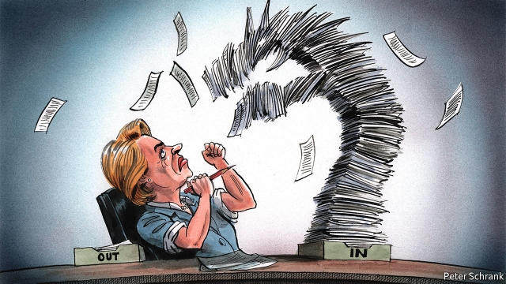

###### Charlemagne

# The new European Commission will be the most political yet 

 

> print-edition iconPrint edition | Europe | Sep 7th 2019 

URSULA VON DER LEYEN was no one’s first choice to be president of the European Commission. She did not run for the job during the European election campaign in May as a “lead candidate” representing a political grouping. Only because national leaders could not settle on an alternative did they resort to Germany’s now-former defence minister, a centrist Christian Democrat. The European Parliament, newly fragmented after the elections, was barely convinced and endorsed her candidacy with a majority of just nine votes. When next week she presents her proposed team of 26 commissioners (one from each other member state, minus soon-to-exit Britain), and especially when she takes office on November 1st, questions about her authority will hang in the air. 

Nor can she expect a honeymoon. Mrs von der Leyen formally takes the reins of the EU’s executive at midnight on October 31st, the precise moment when Britain is due to leave the EU. That could make for a busy first day. Then there is the teetering pile in her in-tray: a looming economic downturn, disputes over the EU’s next seven-year budget, unresolved problems in the euro zone, splits on migration and law and order, trade wars and an altogether daunting wider world. Her handling of these will depend especially on how political she is willing and able to be. 

The job of commission president has evolved. The EU’s executive combines the roles of “guardian of the treaties” (enforcer of rules and arbiter in disputes), initiator of legislation and implementer of decisions taken by the European Parliament and national governments. It once seemed like little more than a glorified secretariat. Roy Jenkins, the incumbent from 1977 to 1981, called his position “the impossible job.” “Indeed, it can hardly be called a job at all,” wrote his biographer in 1983: “The president has a number of conflicting responsibilities but no power. By no stretch of the imagination does [he] resemble the prime minister of Europe.” 

That has changed. Successive treaties have made the president more accountable to the European Parliament, more powerful over ordinary commissioners and better able to set the agenda. The latest stage of the process came in 2014 when the “lead candidate” convention came in, offering voters a chance to endorse a prospective president by voting for his or her party family. Jean-Claude Juncker “won” in that his centre-right European People’s Party came first, and claimed this as a mandate to create a “political commission”. That turned out to mean a tighter list of priorities, more control from the centre, new vice-presidents leading groups of commissioners and a greater willingness to apply political rather than merely technical judgments—for example by allowing Italy to bend budget rules in order to calm relations with its Eurosceptic government. 

Mrs von der Leyen, a wonkish and unflashy type, cannot point to much of a mandate from the parliament. It is thus tempting to assume that she will ditch the “political commission”, subordinate herself more to national leaders and restore the EU’s top job to its more technocratic roots. 

The early evidence suggests otherwise. From the start, Mrs von der Leyen has sought to put her political stamp on the next commission. She has insisted on there being more female commissioners. Twelve of the 26 nominated so far are women; Romania, the remaining member state, has proposed a man and a woman between whom Mrs von der Leyen can choose. So the next commission will be 44% or 48% female. And Mrs von der Leyen is also planning to give the vice-presidents greater powers and resources. Frans Timmermans, a Dutch socialist, and Margrethe Vestager, a Danish liberal, are earmarked for cross-cutting responsibilities for climate change and the digital economy; a central or eastern European, perhaps Vera Jourova of the Czech Republic, will also get a weighty vice-presidential role. 

Those pending appointments point to three other emerging features of Mrs von der Leyen’s commission. First, she is keen not to reverse but to extend the Juncker-era politicisation. Second, the new commission will have a leftish hue on many big issues. In her first 100 days Mrs von der Leyen will table a “green new deal”, new minimum wage protections, pay-transparency measures and a new strategy on the ethics of artificial intelligence; she has also called for more “growth-friendly” (that is, looser) fiscal policies in the euro area. Third, Mrs von der Leyen is determined to bind in those eastern member states that feel unfairly treated in the EU; making conciliatory noises about rule-of-law infringements in countries like Poland and Hungary, and calling for a reset on the divisive issue of accepting and distributing migrants who cross the Mediterranean. 

All of which alarms some. In February Stef Blok, the Dutch foreign minister, argued that: “A commission that prides itself on being political undermines its own objectivity.” In his view, the institution’s primary role is to be a neutral arbiter between member states, and it cannot do that if it is constantly taking positions on things. It is indeed troubling that the incoming president seems inclined, for diplomatic reasons, to bend the expectations of freedom and democracy that the EU has for its member states. 

However, it makes little sense to hark back to a halcyon era of technocratic, supposedly dispassionate decision-making. Jenkins’ Europe was a simpler, more homogeneous, more harmonious place. By contrast Mrs von der Leyen inherits a sprawling, plural club riven with differences and bombarded with events. The measures her commission proposes will probably have to command support spanning three, four or even five party groups in the fragmented European Parliament. Her tenure, like that of Mr Juncker, will probably be defined by how she reacts to unexpected crises. One can take issue with political decisions that she takes. But her right to take them is clear. ■ 
<<<<<<< HEAD

-- 

 单词注释:

1.Charlemagne['ʃɑ:lә'mein]:查理曼大帝(742-814, 世称 Charles the Great或Charles I, 768-814为法兰克王, 800-814为西罗马帝国皇帝) 

2.Sep[]:九月 

3.ursula['ә:sjulә]:n. 厄休拉（女子名） 

4.Von[vɔn;fɔn;fәn]:[计] 冯·诺伊曼 

5.der[]:abbr. 区分编码规则（Distinguished Encoding Rules） 

6.leyen[]:[网络] 部女部长莱恩 

7.grouping['gru:piŋ]:n. 分组 [计] 组 

8.centrist['sentrist]:n. 中间党派的成员, 温和主义者 [法] 中间派议员, 中立派议员 

9.democrat['demәkræt]:n. 民主人士, 民主主义者, 民主党党员 [经] 民主党 

10.endorse[in'dɒ:s]:vt. 支持, 赞同, 背书于, 签署 [经] 赞成, 背书 

11.candidacy['kændidәsi]:n. 候选人的地位, 候选资格 [法] 候选人的身份, 资格 

12.commissioner[kә'miʃәnә]:n. 委员, 理事, 行政长官 [法] 委员, 政府的特派员, 地方地官 

13.Mr['mistә(r)]:先生 [计] 存储器回收程序, 多重请求 

14.Von[vɔn;fɔn;fәn]:[计] 冯·诺伊曼 

15.der[]:abbr. 区分编码规则（Distinguished Encoding Rules） 

16.leyen[]:[网络] 部女部长莱恩 

17.formally['fɒ:mәli]:adv. 正式地, 形式上 

18.EU[]:[化] 富集铀; 浓缩铀 [医] 铕(63号元素) 

19.teeter['ti:tә]:vi. 步履不稳地走动, 踉跄, 摇晃, 摇摆不定, 摇摇欲坠, 玩跷跷板 n. 踉跄, 摇摆, 跷跷板 

20.loom[lu:m]:n. 织布机, 若隐若现的景象 vi. 朦胧地出现, 隐约可见, 可怕地出现 

21.downturn['dauntә:n]:n. (尤指经济方面的)衰退, 下降趋势 [电] 低迷时期 

22.unresolved['ʌnri'zɔlvd]:a. 无决断力的, 不果断的, 无决心的, 未解决的, 未澄清的, 未议决的, 未分解的 [计] 非分辩的 

23.euro['juәrәu]:n. 欧元（欧盟的统一货币单位） 

24.migration[mai'greiʃәn]:n. 移民, 移往, 移动 [计] 迁移 

25.daunt[dɒ:nt]:vt. 威吓, 难倒, 使气馁 

26.guardian['gɑ:diәn]:n. 看守者, 监护人, 保护人 a. 保护的 

27.enforcer[]:n. 实施者, 强制者 [计] 监视程序 

28.arbiter['ɑ:bitә]:n. 仲裁人, 裁决者, 公断人 [计] 判优程序 

29.initiator[i'niʃieitә]:n. 创始者, 首倡者, 引爆药 [化] 引发剂; 引药; 引爆药; 起爆药; 起始剂 

30.implementer['implimentә]:n. 制订人；实施者；实现器；实作器 

31.glorify['glɒ:rifai]:vt. 赞美, 美化, 赞扬, 使辉煌 

32.secretariat[.sekrә'tєәriәt]:n. 书记处, 秘书之职, 秘书处 

33.roy[rɔi]:n. 罗伊（男子名） 

34.jenkins[]:n. 詹金斯（姓氏） 

35.incumbent[in'kʌmbәnt]:a. 现任的, 依靠的, 负有义务的 n. 领圣俸者, 在职者 

36.biographer[bai'ɒgrәfә]:n. 传记作者 

37.accountable[ә'kauntәbl]:a. 负有责任的, 可说明的, 可解释的 [经] 负有责任的 

38.voter['vәutә]:n. 选民, 投票人 [法] 选民, 选举人, 投票人 

39.prospective[prәs'pektiv]:a. 预期的, 将来的 [经] 预期的, 未来的 

40.juncker[]:[网络] 容克；欧元集团现任主席容克；欧元区主席容克 

41.mandate['mændeit]:n. 命令, 指令, 要求 vt. 委任统治 

42.eurosceptic[ˌjʊərəʊ'skeptɪk]:n. 欧洲统一怀疑论者；反对英国亲近欧盟的人 

43.wonkish[]:[网络] won ish。 

44.unflashy[]:[网络] 不爽 

45.cannot['kænɒt]:aux. 无法, 不能 

46.subordinate[sә'bɒ:dnit]:n. 属下, 附属物 a. 下级的, 次要的, 附属的 vt. 使居下位, 使服从 

47.technocratic[ˌteknə'krætɪk]:a. 由技术专家官员组成的；受技术官僚影响的 

48.nominate['nɒmineit]:vt. 提名, 任命, 命名 [法] 提名...为候选人, 指定, 推荐 

49.Romania[rәu'meinjә]:n. 罗马尼亚 

50.fran[fræn]:n. 弗兰（Frances的昵称, 女子名） 

51.timmermans[]:[网络] 曼斯；莫曼；蒂默曼斯 

52.Dutch[dʌtʃ]:n. 荷兰人, 荷兰语 a. 荷兰的 

53.margrethe[]:[网络] 丹麦女王玛格丽特；丹麦玛格丽特；丹麦女王玛格丽特二世 

54.Danish['deiniʃ]:n. 丹麦文 a. 丹麦的, 丹麦人的, 丹麦文的 

55.earmark['iәmɑ:k]:n. 耳上记号, 特征, 记号, 标记 vt. 在耳朵上做记号, 标记, 指定...作特定用途 

56.vera['viәrә]:abbr. 通用实验性反应堆装置（Versatile Experimental Reactor Assembly ） 

57.Czech[tʃek]:n. 捷克人, 捷克语 a. 捷克的, 捷克语的, 捷克人的 

58.weighty['weiti]:a. 重的, 有份量的, 沉重的, 重大的, 严肃的 [法] 有影响力的, 重要的, 重的 

59.pending['pendiŋ]:a. 未决定的, 待决的, 行将发生的, 向外伸出的 prep. 在等待...之际, 直到...时为止, 在...期间, 在...过程中 

60.politicisation[]:[网络] 科学政治化 

61.leftish['leftɪʃ]:a. 左派的, 左倾的 

62.hue[hju:]:n. 样子, 色度, 色彩, 叫声, 色调 [计] 色调 

63.ethic['eθik]:n. 道德规范, 伦理 

64.loos[]:n. 损耗, 洗手间（loo复数形式） 

65.fiscal['fiskәl]:a. 财政的, 国库的 [经] 财政上的, 会计的, 国库的 

66.unfairly[]:adv. 不正当地；不公平地 

67.conciliatory[kәn'siliәtәri]:a. 安抚的, 和好的, 调和的 

68.infringement[in'frindʒmәnt]:n. 违犯, 侵害, 违反, 侵犯 [计] 违反, 侵犯, 侵权, 侵犯 

69.Poland['pәulәnd]:n. 波兰 

70.Hungary['hʌŋgәri]:n. 匈牙利 

71.reset[.ri:'set]:n. 重新设定, 重新组合, 重排版 vt. 重新设定, 重置, 重新组合 vi. 重置, 清零 [计] 重置, 清零 

72.divisive[di'vaisiv]:a. 区分的, 制造分裂的, 造成不和的 

73.migrant['maigrәnt]:n. 候鸟, 移居者 [法] 移居者 

74.stef[]:[网络] 孙燕姿；燕姿姿；姿姿不倦 

75.Blok[blɔk]:1924年在波兰成立的第一个抽象派画家组织 

76.undermine[.ʌndә'main]:vt. 在...下面挖, 渐渐破坏, 暗地里破坏 [法] 暗中破坏, 以阴谋中伤伤害 

77.objectivity[,ɔbdʒek'tivәti]:n. 客观, 客观现实, 客观性 [经] 客观性 

78.constantly['kɒnstәntli]:adv. 不变地, 不断地, 时常地 

79.incoming['inkʌmiŋ]:a. 进来的, 刚开始的, 新来的 n. 进来 

80.diplomatic[.diplә'mætik]:a. 外交的, 老练的 [法] 外交的, 外交上的, 文献上的 

81.hark[hɑ:k]:vi. 倾听 

82.halcyon['hælsiәn]:n. 神翠鸟, 翡翠鸟 a. 宁静的, 平稳的, 翡翠鸟的 

83.supposedly[sә'pәuzidli]:adv. 想象上, 看上去像, 被认为是, 恐怕, 按照推测 

84.dispassionate[dis'pæʃәnit]:a. 冷静的, 不带感情的 

85.homogeneous[.hәumә'dʒi:niәs]:a. 同种的, 同质的, 齐性的 [医] 同种的, 纯一的, 同质的, 均匀的 

86.harmonious[hɑ:'mәuniәs]:a. 和睦的, 调和的, 和谐的, 协调的 

87.sprawl[sprɒ:l]:vi. 伸开手足躺, 爬行, 蔓生, 蔓延 vt. 懒散地伸开, 使蔓生, 使不规则地伸展 n. 伸开手足躺卧姿势 

88.rive[raiv]:vt. 撕开, 使破碎 vi. 裂开, 破裂 

89.bombard[bɒm'bɑ:d]:vt. 炮击, 攻击, 轰击 n. 射石炮 

90.tenure['tenjuә]:n. 享有, 保有期 [经] (财产,职位等的)占有, 占有权 

91.unexpect[]:[网络] 意想不到；使意外 
=======
>>>>>>> 50f1fbac684ef65c788c2c3b1cb359dd2a904378

