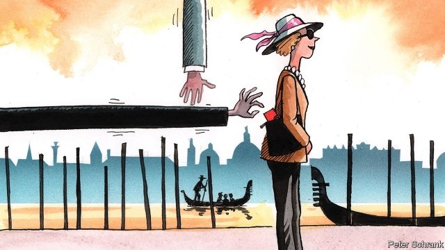

###### Hands to yourself

# Volunteers are nabbing Venice’s pickpockets 

 

> print-edition iconPrint edition | Europe | Sep 7th 2019 

WITH HORDES of distracted tourists crowding its labyrinthine streets, Venice offers rich pickings for pickpockets, especially during the summer crush. The police cannot cope. So volunteers known as Cittadini non distratti (CND), or Undistracted Citizens, help them out. 

Most of CND’s roughly 60 members just take pictures of suspects, using WhatsApp to pass along leads to cops. Some only grab the thieves they spot in the shops and bars where they are employed. Even so, CND is behind a third of pickpocket arrests in Venice, says Francesco Livieri, a deputy police commissioner. Collaboration between CND and the cops is so tight, Mr Livieri jokes, that he spends more time with the volunteers than with his wife. 

Privately, some volunteers say that they are behind many more than a third of pickpocket arrests. Cops are thin on the ground but “we have eyes everywhere”, says Franco Dei Rossi, an affable 68-year-old street painter who founded the group nearly three decades ago. Members must decline any rewards from victims (including, says Mr Dei Rossi, the occasional come-on). As he is speaking, two men who the group says have been picking pockets for weeks stroll past and, upon recognising Mr Dei Rossi, smile wryly. He shouts back: “Get a job!” 

Some members accuse city officials of neglecting pickpockets and pursuing illegal picnickers instead, who are much easier to catch and fine. Slow, lenient courts fuel street crime, says Monica Poli, a CND member. A cleaner, she hunts pickpockets after work near Venice’s train station, where apprentice thieves learn their trade by relieving newly arrived tourists of their wallets. “Here, I run things,” Ms Poli says. Perhaps, but Ms Poli was recently beaten twice by packs of female pickpockets. In Venice, they outnumber their male colleagues. 

The crusade is getting harder. Pickpockets circulate photos of CND volunteers, eroding their element of surprise. Also, it is no longer advisable for volunteers to restrain someone with a hand in a stranger’s purse. The courts now prefer that volunteers wait until the hand has emerged clutching valuables. And female thieves have a dastardly tactic to thwart their pursuers. When caught, they routinely scream that they are being groped or raped. This has made citizens’ arrests dangerous, says a CND member. He says he recently grabbed a thief who promptly ripped her own shirt and screamed that she was being attacked. Says Damiano Gizzi, a volunteer: “we risk a lynching.”■ 

-- 

 单词注释:

1.nab[næb]:vt. 捉住, 逮捕, 抢夺 [电] 国际广播协会的简写 

2.pickpocket['pikpɒkit]:n. 扒手 [法] 扒手 

3.Sep[]:九月 

4.horde[hɒ:d]:n. (一)群, 游牧部落, 移动群 vi. 成群结队 

5.distract[dis'trækt]:vt. 转移, 分心, 使发狂 

6.labyrinthine[,læbә'rinθain, -θin]:[医] 迷路的 

7.Venice['venis]:n. 威尼斯 

8.picking['pikiŋ]:n. 掘, 选择, 挑选, 采摘, 撬开, [U]采得物, 捡得物, 赃物, 扒窃物 [经] 挑拣 

9.cannot['kænɒt]:aux. 无法, 不能 

10.non[nɔn]:adv. 非, 不 

11.CND[]:abbr. 核裁军运动（Campaign for Nuclear Disarmament） 

12.undistracted[,ʌndis'træktid]:a. 不分心的,注意力集中的,心神不烦乱的 

13.WhatsApp[]:[网络] 智能手机；联络电话；每月活跃用 

14.cop[kɒp]:n. 警官 vt. 抓住 

15.grab[græb]:n. 抓握, 掠夺, 强占, 东方沿岸帆船 vi. 抓取, 抢去 vt. 攫取, 捕获, 霸占 

16.Francesco[]:n. 弗朗西斯科（意大利文艺复兴时期著名作家）；弗朗西斯科（意大利著名导演） 

17.commissioner[kә'miʃәnә]:n. 委员, 理事, 行政长官 [法] 委员, 政府的特派员, 地方地官 

18.collaboration[kә.læbә'ræʃәn]:n. 合作, 勾结 [法] 通敌卖国者, 奸细 

19.privately[]:adv. 秘密地；私下地 

20.franco['fræŋkәu]:a. 免费的 [经] 全部费用在内价, 运费准免的 

21.dei[]:prep. （意）一些 

22.Rossi[]:n. 罗西（意大利姓氏） 

23.affable['æfәbl]:a. 和蔼可亲的, 友善的, 亲切的, 慈祥的 

24.stroll[strәul]:n. 闲逛, 漫步 v. 闲逛, 漫步 

25.wryly[raɪlɪ]:adv. （面部表情）做鬼脸地, 苦笑地, 嘲讽地 

26.picnicker['piknikә]:n. 郊游者 

27.lenient['li:njәnt]:a. 宽大的, 温和的, 慈悲为怀的 [法] 宽大的, 仁慈的 

28.Monica['mɔnikә]:n. 莫尼卡（女子名） 

29.poli[]:n. 波里（人名） 

30.apprentice[ә'prentis]:n. 学徒, 生手 vt. 使做学徒 

31.outnumber[.aut'nʌmbә]:vt. 数目超过, 比...多 

32.crusade[kru:'seid]:n. 改革运动, 十字军东侵 vi. 从事改革运动, 加入十字军 

33.erode[i'rәud]:vt. 腐蚀, 侵蚀 vi. 受腐蚀 

34.clutch[klʌtʃ]:n. 抓紧, 掌握, 离合器, 一窝小鸡 vt. 抓住, 踩汽车离合器踏板 vi. 抓 [计] 联轴器; 离合器 

35.dastardly['dæstәdli]:a. 卑怯的人, 懦夫, 怯懦 

36.tactic['tæktik]:n. 一项战术, 一条策略 a. 战术的, 顺序的, 排列的 

37.thwart[θwɒ:t]:a. 横放的 vt. 反对, 阻挠, 横过 prep. 横过 adv. 横过 

38.pursuer[pә'sju:ә]:n. 追赶者, 追求者, 研究者 [法] 原告, 起诉人, 进行者 

39.routinely[]:adv. 日常, 乏味, 常规, 例行 

40.grope[grәup]:v. 摸索 n. 摸索 

41.rape[reip]:n. 抢夺, 掠夺, 强奸, 葡萄渣, 芸苔 vt. 掠夺, 抢夺, 强奸 

42.promptly['prɒmptli]:adv. 敏捷地, 迅速地 

43.rip[rip]:n. 裂痕, 破绽, 拉裂, 浪子, 巨浪 vi. 被拉开, 裂开, 猛冲 vt. 撕, 扯, 劈 

44.damiano[]: [人名] 达米亚诺 

