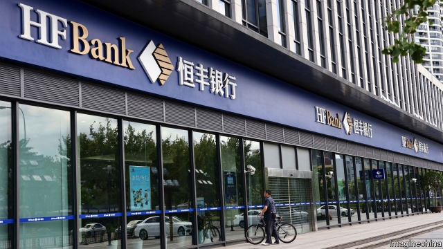
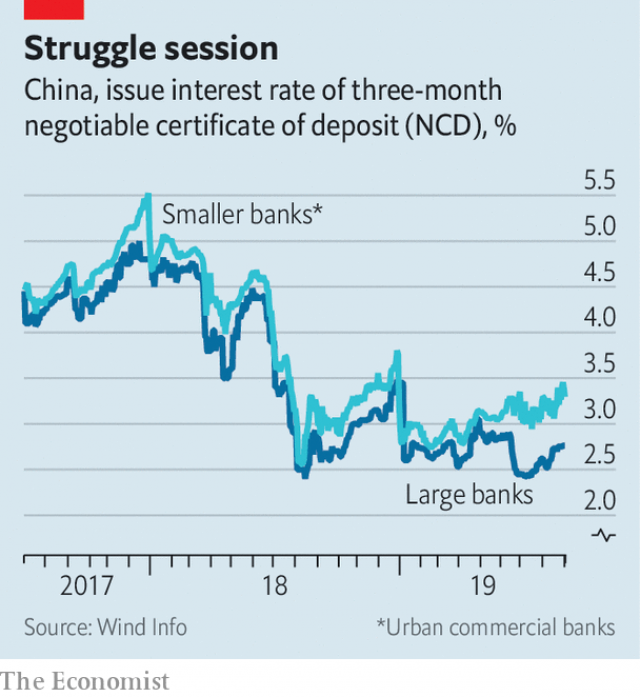

###### Expelling the poison

# After three Chinese banks are bailed out, how many more are at risk? 

 

> print-edition iconPrint edition | Finance and economics | Sep 5th 2019 

WORKING AT Hengfeng Bank, an embattled Chinese lender, requires a thick skin these days. On August 30th the bank’s Communist Party committee summoned its members, including top executives, for a self-criticism session, of the sort common in the Maoist era. “No one talked about their achievements. They talked only of their shortcomings and problems. They pointed the knife blade at themselves,” the bank reported afterwards. “Blushing and sweating, they expelled their poison.” 

The revival of self-criticism under Xi Jinping, China’s president, has raised alarm about the direction in which he is steering the country. Other banks have also conducted similar sessions, a testament to Mr Xi’s assertion of party control over the economy. But in the case of Hengfeng, ravaged by corruption scandals and bailed out last month by the government, the sight of its employees examining their misdeeds was, in a way, reassuring. It suggests that officials are getting a handle on one of the worst actors in the banking system, even if their techniques sometimes owe more to Lenin than to Dodd or Frank.  

The question now is how many more Hengfengs there are. It was the third bank to be rescued in the space of three months. In May regulators took over Baoshang Bank in Inner Mongolia. In July Industrial and Commercial Bank of China (ICBC), a state-owned giant, propped up the Bank of Jinzhou in the north-east. Then in August Hengfeng, based in Shandong province, received a cash infusion from China’s sovereign-wealth fund. 

Officials have portrayed these troubled banks as peripheral to the economy. The assets of Hengfeng, the biggest, peaked in 2017 at 1.4trn yuan ($210bn at the time), just 0.5% of the total for Chinese banks. Regulators have also been prompt in fixing holes. When the Baoshang rescue spooked investors as the first instance of losses on interbank loans, the central bank quickly calmed them by injecting cash into the banking system. 

Nevertheless, many financiers suspect that the rot is deeper. Their nerviness is visible in two ways. The first is small banks’ elevated funding costs. For years they paid roughly the same interest rates as big banks to borrow from each other. Since Baoshang’s rescue, their costs have been half a percentage point higher (see chart). 

 

The second is the 10% fall in ICBC’s shares since its Jinzhou investment, a performance that has fallen short of other banks. An auditor who worked with ICBC says the bank was surprised by the blowback. It had used a subsidiary to support Jinzhou, hoping to quarantine the rest of its balance-sheet. But investors did not see it that way. As analysts with China Merchants Bank said, it looked as if ICBC was performing “national service”. The fear is that big banks will be conscripted into service again and again. 

Many more banks do indeed need help. By the central bank’s count, 420 of China’s 4,327 lenders are at high risk of distress. However, all but nine are puny rural lenders, so it should be possible to mop up their messes. To get a sense of the scale, Jason Bedford of UBS assessed capital levels, bad loans and loss provisions at a large sample of banks. He estimated that banks with total assets of 9.2trn yuan ($1.3trn) are in danger, amounting to about 4% of the commercial banking system, or nearly a tenth of GDP. That is a big problem, but not an insuperable one. 

The banks rescued in recent months were atypical in various ways. Baoshang was the piggy bank of a disgraced tycoon; Bank of Jinzhou’s auditors resigned amid signs of loan fraud; multiple executives at Hengfeng were felled by corruption charges. “There doesn’t appear to be other banks left with the same scale and toxicity as these three,” says Mr Bedford. 

Yet much about them was also normal. China’s smaller banks have been especially aggressive, increasing their assets by 144% over the past five years, compared with 53% for large banks. They have also relied more on interbank borrowing. The implication is that as the economy slows, and as big banks grow wary of counterparty risk, more small banks will be exposed. 

Charlene Chu of Autonomous Research has long estimated that bad loans in China are much higher than reported: more like 20% of bank assets rather than the official 2%. She thinks this year’s turbulence is a preview of what lies ahead. But she also says that China has ways to delay the reckoning, potentially for a long time. When defaults spread to brokerages in June, regulators brought them and their creditors, mostly banks, together in emergency meetings. “It is a rare tool that Chinese authorities have,” says Ms Chu. “They called in all parties, and said no one is defaulting any more.” 

Even if China can prevent widespread defaults, its banks’ newfound risk aversion poses dangers itself. Small banks had been big lenders to small companies, which in turn are big drivers of growth. Now, the outlook for all is more subdued. 

At Hengfeng it is no coincidence that, when not engaged in self-criticism, bankers are talking up their role in helping small firms. In a recent news broadcast, Hengfeng’s chairwoman was shown visiting a local food company. She gazed over a rice field, trimmed to look like Tiananmen, complete with a portrait of Mao. A slogan was cut into the field: “I love my motherland”. In banking as in farming, it is good to know which way the wind is blowing. ■ 

