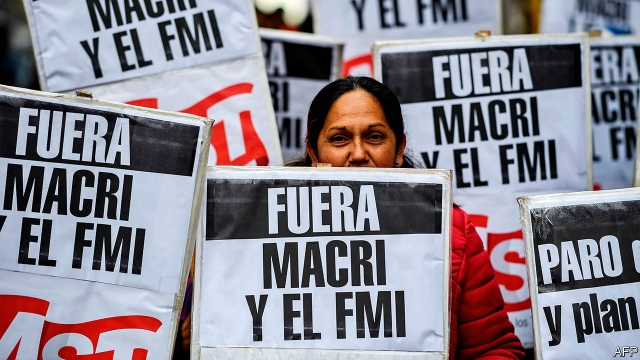
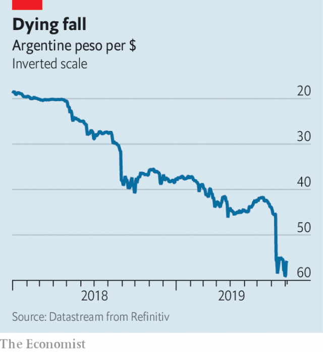

###### Force of circumstance

# In Argentina, Mauricio Macri's dying government mimics its opponents 

 

> print-edition iconPrint edition | Finance and economics | Sep 5th 2019 

ARGENTINA WAS not invited to the Bretton Woods conference in 1944 that created the IMF, and it did not join until 1956. But it has been making its presence felt ever since. At the end of August a team from the IMF visited Buenos Aires to assess the lie of the land before deciding whether to give Argentina’s government, led by Mauricio Macri, any more of the record $57bn loan (worth over 10% of Argentina’s 2018 GDP) agreed last year. But as the team left town, the landscape shifted. 

Mr Macri’s government said it would delay $7bn-worth of repayments on short-term bills held by institutional investors and seek a rescheduling of over $50bn of longer-term debt. It would also request new, extended loans from the IMF to help Argentina repay the money it already owes them. As the markets digested the news, the ground moved again. On September 1st the government imposed currency controls, preventing Argentines from buying more than $10,000 a month, forcing exporters to convert their earnings into pesos, and placing new restrictions on companies’ ability to buy foreign exchange.  

“This is not a port we imagined we would reach,” said Hernán Lacunza, Mr Macri’s new finance minister. The president had, after all, cast off in precisely the opposite direction after coming to power in December 2015, seeking to remove many of the clumsy impediments to market forces imposed by his predecessor, Cristina Fernández de Kirchner. Abolishing her currency controls and unifying Argentina’s exchange rate was one of his earliest, proudest successes. Now Argentina once again has a black market for dollars, just as it did under Ms Fernández. 

 

The reason for this dramatic reversal of policy is an equally dramatic reversal of political fortunes. On August 11th Argentina held “primary” elections (which are contested by all parties and in which voting is universal and compulsory). Mr Macri lost decisively to an opposition ticket featuring Alberto Fernández, a veteran Peronist, as president and Ms Fernández as vice-president (the two are unrelated). The news that their victory in next month’s presidential election was now almost certain alarmed Argentina’s creditors, who feared they would fail to honour the country’s debts, and corral capital flows. The peso fell by 25%, the principal stockmarket index collapsed and the cost of insuring against default tripled. Neither sky-high interest rates nor the central bank’s sales of dollar reserves could arrest the currency’s fall. Since the government could not persuade foreigners to hold more pesos, it has been forced to stop Argentines buying too many dollars instead. 

Even if Mr Fernández wins outright in October (avoiding a run-off election), he will not be sworn into office until December. But his words already have the power to move markets and shape the economy. His claim on August 30th that Argentina was in “virtual default” deepened the market sell-off (Standard & Poor’s, a rating agency, also declared that there had been a temporary, selective default on some of Argentina’s obligations). Creditors will not renegotiate their debts with Mr Macri’s lame-duck government, fearing that Mr Fernández might force bigger concessions later. The same worry may give pause to the IMF. Why should it give billions of additional dollars to Argentina, when its next president accuses it of helping to create a “social catastrophe” of rising prices, unemployment and poverty? 

Advisers to Mr Fernández say his campaign rhetoric should not be taken too seriously. “Alberto is acting now as a candidate…appealing to the base; he will govern very differently,” says one of his inner circle. His chief economic adviser, Guillermo Nielsen, has published a more moderate ten-point agenda that leaves some room for optimism. It recognises the need for a budget surplus. And it envisages a “social pact” between the unions and business to tame inflation by moderating wage-claims and price increases. A Peronist government under Mr Fernández may find it easier to bring the unions into line than today’s government does. According to Federico Sturzenegger, the former governor of Argentina’s central bank, Mr Macri’s administration has eschewed that kind of dealmaking because it “did not want to sit the ‘old-politics players’ at the decision table”. 

The next government may even consider much-needed reforms of labour laws and welfare entitlements, according to Emmanuel Alvarez Agis, another adviser who served under Néstor Kirchner, Ms Fernández’s late husband and predecessor as president. “The future depends on building coalitions, for change, not governing just from one side or the other,” he has said. 

Mr Nielsen says the next government will negotiate with the IMF, rather than walk away from it. Having already borrowed almost 80% of the $57bn on offer, Argentina will need new loans from the fund to help it repay the old ones. Mr Nielsen has also described China as a potential “financial life jacket”. Ms Fernández, who has remained remarkably quiet during the campaign, is known to covet Chinese investment, which might be attracted to Argentina’s infrastructure, 5G networks and renewable-energy projects. 

If that is the extent of Ms Fernández’s influence on the next government, foreign investors will be relieved. And so will some Argentines. “Many of us could never vote for Cristina and Alberto Fernández,” says a retired woman, waiting at her bank this week to change pesos into dollars. “But who can trust any of our politicians after all this?...I trust only my purse.”■ 

