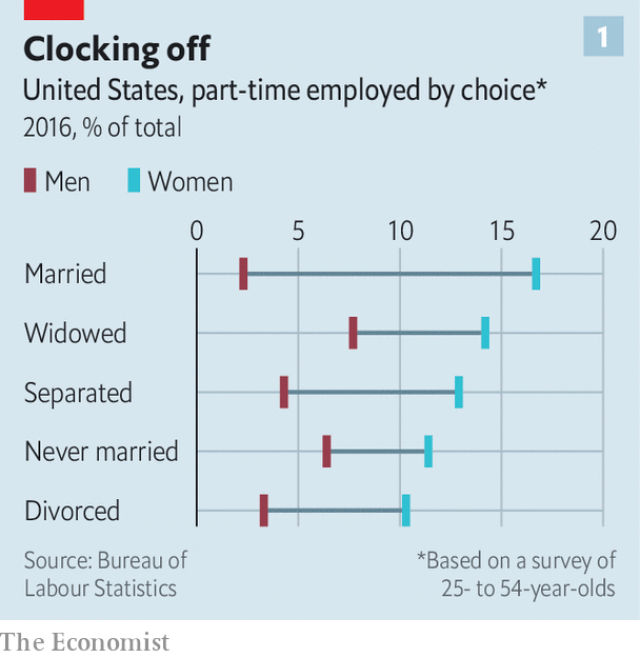
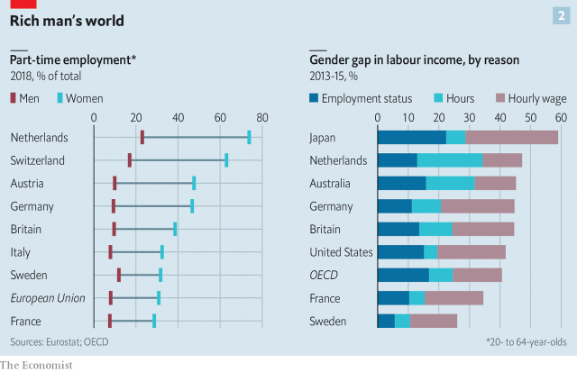

###### Balancing act

# Part-time jobs help women stay in paid work 

 

> print-edition iconPrint edition | Finance and economics | Sep 7th 2019 

GETTING HOLD of a Dutch woman on a Wednesday can be tricky. For most primary schools it is a half-day, and as three-quarters of working women are part-time, it is a popular day to take off. The Dutch are world champions at part-time work and are often lauded for their healthy work-life balance and happy children. But these come at a price. Among western European countries, the Netherlands has the largest gap between men’s and women’s pension entitlements, and the largest in monthly income. Even though a similar share of Dutch women are in the labour force as elsewhere in western Europe, their contribution to GDP, at 33%, is far lower, largely because they work fewer hours. 

In the rich world part-time working took off in the second half of the 20th century, as services replaced manufacturing and women piled into the labour market. It remains essential to helping women work, particularly after giving birth, and in countries with traditional gender norms. But it can prolong—or even worsen—gender inequality and make women less independent by locking them into jobs with worse pay and prospects. Differences in working hours explain a growing part of the gender pay gap. That share could increase as labour markets disproportionately reward those willing and able to work all hours—who are mostly men. 

Almost one in five workers globally are part-time (defined as working fewer than 35 hours a week). In many countries married women are the group most likely to work part-time, and married men the least likely to (see chart 1). In the EU nearly one in three women in work aged 20-64 are part-time, compared with fewer than one in 12 men (see chart 2). After the financial crisis the number of “involuntary” part-timers—workers who would take more hours if they could get them—rose alarmingly in some countries, including America, Britain and Spain. 

 

Family obligations often lead women to choose to work part-time. In America 34% of female part-timers, and just 9% of male ones, cite this as their main reason. In the EU the figures are 44% and 16%. “Part-time work can be very positive when the alternative would have been women leaving the labour market altogether,” says Andrea Bassanini of the OECD. Its availability has been credited with the rapid growth of female participation not just in the Netherlands, but also in Germany, Japan and Spain, where it has shifted the standard household from one to one-and-a-half breadwinners. In Germany all the growth of the female workforce in the past 15 years has been down to the rise in part-timers. 

 

But for women, there is a cost. Within the OECD—apart from in Japan and South Korea, where women are excluded from most well-paid jobs—part-time working and the gender pay gap are significantly correlated. The mix of reasons varies from country to country, but three stand out. 

First, in nearly everywhere that has data available, part-time jobs pay less per hour than full-time ones. Sometimes this is within an occupation. A recruitment firm, Indeed, found that the hourly-pay penalty for part-timers in America was highest in jobs that rewarded strong client relationships, such as in retail, or where workers are always on-call, such as web development. But more often it is between occupations: the types of jobs that can readily be done part-time, or are offered part-time, are lower-paid than those that are not. 

Second, part-timers are more likely to have a “bad job”—one that offers little training and few legal rights. In America 39% of female part-time workers, compared with 6% of full-time men and 9% of full-time women, are in the “secondary” labour market, with low pay, no benefits and few opportunities to move to better jobs, writes Arne Kalleberg of the University of North Carolina in “Precarious Work”. According to Patricia Gallego-Granados of DIW, a think-tank in Berlin, going part-time in Germany often involves “occupational downgrading”: accepting a job that does not use the worker’s skills to the full. 

Even good jobs can become worse when done part-time. A study of American women in elite occupations who voluntarily moved to part-time “retention” positions created for them found that they were put on a “mummy track” with less chance to progress. In Britain, says the IFS, a think-tank, wage increases stop when a woman moves to a part-time role. For graduates the penalty is particularly large, since they earn a larger return on experience. The IFS calculates that a quarter of Britain’s hourly gender pay gap can be explained by women’s greater propensity to work part-time.  

Third, part-time work can be a trap. Although often a short-term expedient, most women who start to work part-time continue for longer than intended. Many never go full-time again. The share of Dutch women working full-time peaks at age 25-30 and then falls, never to recover—quite unlike the pattern for men, who peak later and then stabilise. A study in Australia found that the likelihood of a woman changing hours, contract or employer fell by 25-35% after she became a mother. “The best kind of part-time work is for a short duration,” says Jon Messenger of the International Labour Organisation. 

For an employer, the benefit of part-time rather than full-time workers depends on the sector. When demand varies a lot, part-timers bring large productivity gains, according to an extensive study of employees in pharmacies. Companies where full-time employees work more than 48 hours a week could benefit from more part-timers, since productivity falls off above that threshold. But otherwise the evidence is mixed. In countries with fewer protections for part-timers (the Netherlands and Norway are rare exceptions), companies choose them for that reason. 

Indeed, the gender pay gap could even widen further. One reason is growing demand for “flexible” workers, by which employers generally mean the opposite of what workers with caring responsibilities mean: permanently on-call rather than with predictable, mutually agreed hours and the ability to work from home. “I wouldn’t be surprised if this new demand for flexibility creates new types of biases against women,” says Mr Bassanini. Related to this is the rise of jobs with extremely short hours, mostly done by women.  

Meanwhile the hourly reward for working in professions where very long hours are the norm, such as law and consulting, has risen dramatically. A study published by the National Bureau of Economic Research found that America’s gender pay gap would be as much as 46% smaller were it not for the increasingly disproportionate rewards for working extra hours since the 1980s. It estimates that average wages rise by 20% in an occupation for every 10% rise in average hours. This premium for uncompromising jobs means “women have been swimming upstream in terms of achieving wage parity,” write the authors. To make matters worse, says Youngjoo Cha of Indiana University, women in households where the man works more than 60 hours a week are three times as likely to stop work as women in households where the man works 35-50 hours a week. (A wife working long hours does not make a man any more likely to quit.) 

As long as some people work punishing hours, the prospect of closing the gender pay gap appears remote. Men in the rich world are twice as likely as women to work more than 48 hours a week. In America 20% of American fathers, but just 6% of mothers, work more than 50 hours a week. This is one of several arguments made by campaigners for a four-day working week. 

Yet even modern, family-oriented men face a dilemma. Their requests to work part-time are more likely than women’s to be rejected. And those who do work part-time risk discrimination. A study in which CVs were sent to prospective employers found that men whose CVs showed them as working part-time were just half as likely to get a call-back as those who were identical, except that they were working full-time. Part-time women faced no such discrimination. As long as such double standards exist, many couples will still choose to scale back her career, rather than his.■ 
<<<<<<< HEAD

-- 

 单词注释:

1.Sep[]:九月 

2.Dutch[dʌtʃ]:n. 荷兰人, 荷兰语 a. 荷兰的 

3.tricky['triki]:a. 狡猾的, 机敏的 

4.laud[lɒ:d]:n. 赞美, 称赞 vt. 赞美, 称赞 

5.Netherlands['neðәlәndz]:n. 荷兰 

6.entitlement[]:n. 权利 [法] 权利 

7.manufacturing[.mænju'fæktʃәriŋ]:n. 制造业 a. 制造业的 

8.gender['dʒendә]:n. 性 vt. 产生 

9.norm[nɒ:m]:n. 基准, 模范, 标准, 准则, 平均数 [化] 定额 

10.inequality[.ini'kwɒliti]:n. 不平等, 不同, 不平坦, 不平均 n. 不平等, 不等式 [计] 不等式 

11.les[lei]:abbr. 发射脱离系统（Launch Escape System） 

12.disproportionately[]:adv. 不匀称, 不相称 

13.globally[]:[计] 全局地 

14.EU[]:[化] 富集铀; 浓缩铀 [医] 铕(63号元素) 

15.involuntary[in'vɒlәntәri]:a. 自然而然的, 无意识的, 不知不觉的, 偶然的, 不随意的 [医] 不随意的 

16.alarmingly[ ə'lɑːmɪŋli]:adv. 让人担忧地 

17.Spain[spein]:n. 西班牙 

18.cite[sait]:vt. 引用, 引证, 表彰 [建] 引证, 指引 

19.andrea['ændriә,ɑ:n'dreiә]:n. 安德里亚（男子名） 

20.Oecd[]:[经] 已开发国家组织 

21.availability[ә.veilә'biliti]:n. 有效性, 可利用性, 可利用的人 [计] 有效性; 可用性 

22.participation[.pɑ:tisi'peiʃәn]:n. 参与, 分享 [经] 参与, 参股 

23.breadwinner['bred.winә]:n. 负担家计的人 

24.Korea[kә'riә]:n. 朝鲜, 韩国 

25.significantly[]:adv. 值得注目地；意味深长地 

26.correlate['kɒrәleit]:n. 有相互关系的东西, 相关物 vt. 使有相互关系 vi. 相关 

27.datum['deitәm]:n. 论据, 材料, 资料, 已知数 [医] 材料, 资料, 论据 

28.recruitment[ri'kru:tmәnt]:n. 新兵征召 [医] 募集[反应], 募集[现象](生理), 复聪(耳科) 

29.penalty['penәlti]:n. 处罚, 刑罚, 罚款, 罚球, 报应, 不利结果, 妨碍 [经] 罚金(款), 违约金 

30.client['klaiәnt]:n. 客户, 顾客, 委托人 [计] 客户, 客户机, 客户机程序 

31.alway['ɔ:lwei]:adv. 永远；总是（等于always） 

32.Arne[ɑ:n]:阿恩(①姓氏, 男子名 ②Thomas Augustine, 1710-1778, 英国作曲家) 

33.Carolina[.kærә'lainә]:n. 北(或南)卡罗来纳州 

34.precarious[pri'kєәriәs]:a. 不稳定的, 不安的, 危险的 

35.patricia[pә'triʃә]:n. 帕特丽夏（女子名） 

36.DIW[]:舰船在水上静上不动 

37.Berlin[bә:'lin]:n. 柏林, (软质)柏林毛线 

38.occupational[.ɒkju'peiʃәnl]:a. 职业的, 军事占领的 [医] 职业的 

39.elite[ei'li:t]:n. 精华, 精锐, 中坚分子 

40.voluntarily[.vɒlәn'terili]:adv. 自愿地, 以自由意志 

41.retention[ri'tenʃәn]:n. 保持, 留置, 保留, 保持力, 保留物, 记忆, 停滞, 固位 [计] 保贸, 保持 

42.mummy['mʌmi]:n. 木乃伊, 瘦而干瘪之人, 妈咪 [医] 干尸, 木乃伊; 普鲁士红 

43.ifs[ifs]:abbr. installable file system 可安装文件系统; integral flange and skirt 综合边缘和环绕 n. 不确定的事, 无把握的事( if的名词复数 ) 

44.hourly['auәli]:a. 每小时的, 以小时计的, 频繁的 adv. 每小时地, 频繁地, 不绝地 

45.propensity[prә'pensәti]:n. 倾向, 爱好, 习性 

46.expedient[ik'spi:diәnt]:n. 权宜之计 a. 权宜的, 方便的, 有用的 

47.stabilise['steibilaiz]:vt.vi. (使)稳定, (使)安定, (使)坚固 vt. 装稳定器 

48.jon[dʒɔn]:n. 乔恩（男子名） 

49.organisation[,ɔ: ^әnaizeiʃən; - ni'z-]:n. 组织, 团体, 体制, 编制 

50.sector['sektә]:n. 扇形, 部门, 部分, 函数尺, 象限仪, 段, 区段 vt. 把...分成扇形 [计] 扇面; 扇区; 段; 区段 

51.productivity[.prәudʌk'tiviti]:n. 生产力 [经] 生产率, 生产能力 

52.pharmacy['fɑ:mәsi]:n. 药房, 配药学, 制药业 [医] 药学, 药剂学, 调剂学, 药房 

53.threshold['θreʃәuld]:n. 门槛, 入口, 开端, 阈 [计] 阈; 阈值 

54.Norway['nɒ:wei]:n. 挪威 

55.predictable[pri'diktәbl]:a. 可预言的 

56.mutually['mju:tʃuәli]:adv. 互相地, 互助 

57.flexibility[.fleksi'biliti]:n. 弹性, 适应性 [计] 灵活性; 适应性 

58.biase[]:[网络] 偏差；偏向；偏离 

59.dramatically[drә'mætikli]:adv. 戏剧地, 引人注目地, 突然地 

60.disproportionate[.disprә'pɒ:ʃәnit]:a. 不成比例的 

61.premium['pri:miәm]:n. 额外补贴, 奖金, 奖赏, 保险费 [医] 保险费 

62.uncompromising[.ʌn'kɒmprәmaiziŋ]:a. 不让步的, 不妥协的, 坚定的 [法] 坚定的, 不受协的, 不能通融的 

63.upstream['ʌp'stri:m]:adv. 向上游, 逆流地 a. 向上游的, 逆流而上的 

64.parity['pærәti]:n. 同等, 同位, 平价, 奇偶性 [计] 奇偶性 

65.cha[tʃɑ:]:n. （英俚）茶 

66.Indiana[.indi'ænә]:n. 印地安那州 

67.campaigner[kæm'peinә]:n. 从军者, 老兵, 竞选者 

68.cv[]:abbr. 简历（Curriculum Vitae） 

69.prospective[prәs'pektiv]:a. 预期的, 将来的 [经] 预期的, 未来的 
=======
>>>>>>> 50f1fbac684ef65c788c2c3b1cb359dd2a904378

