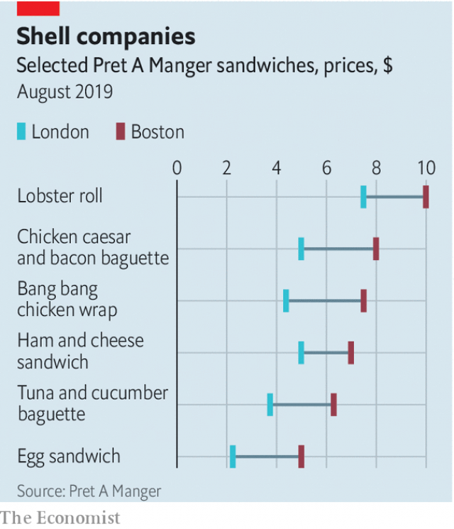

###### Consider the lobster roll

# Why Americans pay more for lunch than Britons do 

 

> print-edition iconPrint edition | Finance and economics | Sep 7th 2019 

THIS SUMMER Pret A Manger, purveyor of sandwiches to desk-workers in the white-collar cities of the West, added lobster rolls to its menu. In Britain they cost £5.99 ($7.31); in America $9.99. In both countries they are filled with lobster from Maine, along with cucumber, mayonnaise and more. Rent and labour cost about the same in London as in downtown New York or Boston. Neither sticker price includes sales tax. Yet a Pret lobster roll in America is a third pricier than in Britain, even though the lobster comes from nearer by. 

This Pret price gap is not limited to lobster rolls. According to data gathered by The Economist on the dozen Pret sandwiches that are most similar in the two countries, the American ones cost on average 74% more (see chart). An egg sandwich in New York costs $4.99 to London’s £1.79, more than double. A tuna baguette costs two-thirds more. The price mismatch is intriguing—the more so for The Economist, which publishes the Big Mac index, a cross-country comparison of burger prices, which shows a 43% transatlantic disparity. 

Menu pricing starts with a simple rule, says John Buchanan of the consulting arm of Lettuce Entertain You Enterprises, a restaurant group: take the cost of ingredients and multiply by three. Then ask yourself how much customers would expect to pay for a dish of this type, and how much they would expect to pay for it from you. A Pret lobster roll and one from a fancy seafood restaurant are quite different propositions. Lastly, check what the competition charges. “Only a small part of this decision is what I would call scientific,” says Mr Buchanan. “A lot has to do with a subjective judgment of what the market will bear.” 

 

The lunch market is local. New Yorkers do not care about prices in London. And they—alongside Bostonians and Washingtonians—are used to their local high prices, for reasons that include bigger portions (though not at Pret) and tipping habits. Londoners are keener on sandwich lunches, which means stiffer competition in that part of the market. 

Often lunch prices vary by neighbourhood. JD Wetherspoon, a British pub chain, prides itself on low prices, but allows them to differ by branch. In 2017 the Financial Times found that the most expensive Spoons charged over 40% more than the cheapest one. They also vary by time: many restaurants charge more for dinner than for lunch. Perceptions of value for money are relative not absolute. For Pret’s lobster rolls, it’s a case of claws and effect.■ 

