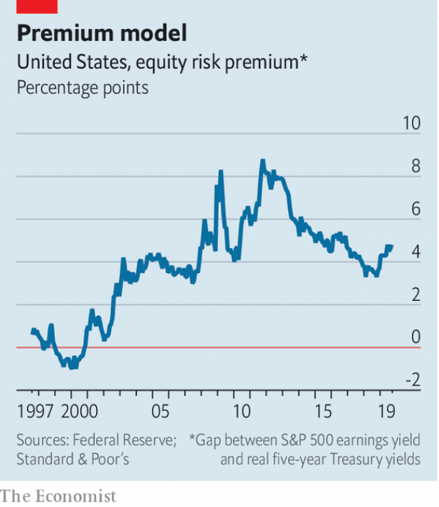

###### Buttonwood

# Why yields are the best guide to future stockmarket returns 

 

> print-edition iconPrint edition | Finance and economics | Sep 7th 2019 

IN 2011 JOHN COCHRANE, a professor at the University of Chicago’s Booth School of Business, gave a presidential address on “Discount Rates” to the American Finance Association. It was published as a paper a few months later. In a sweeping take, Mr Cochrane set out how academics’ understanding of the way asset prices are determined has shifted over the past half-century. Many papers are described as “landmark”; this one has a better claim to the label than most. 

His opening line (“Asset prices should equal expected discounted cash flows”) indicated that the basic premise has not changed. But plenty has. In the 1970s the focus of academic finance was on the “expected” part of that equation—the efficiency with which markets priced in any new information relevant to future cash flows. The emphasis has shifted. The “discounted” part, or the risk preferences of investors, has become the main organising principle for research, argued Mr Cochrane. 

The old-school view was that when stock prices are high relative to earnings or dividends (ie, yields are low), it implies these cash flows are expected to grow quickly in future. The new school says it is changes in risk appetite—the discount rate that investors apply to future earnings—that explains much of the variation in asset prices. If prices are high and yields are low, that implies investors are willing to accept lower returns in future. Yields predict returns. 

There are practical implications. A generation ago an investor might have looked to history for a guide to expected returns. Now yields are seen as a more useful steer. This is clearer with government bonds. The real annual return on American Treasury bonds was 1.9% between 1900 and 2018, according to Credit Suisse’s Global Investment Returns Yearbook. But history is bunk. It would not be wise to expect a 1.9% return when the yield-to-maturity on inflation-protected Treasury bonds is zero, as it is now. 

The future cash flows from stocks are not as certain as those from government bonds. But Mr Cochrane argued that a similar principle holds with stocks over the long haul. “High prices, relative to dividends, have reliably preceded many years of poor returns. Low prices have preceded high returns,” he said. The predictive power of yields holds for bonds and stocks, but also for other assets, such as housing. And valuations based on aggregate earnings or book value predict stock returns just as well as the dividend yield. 

A lot of people prefer the earnings yield. Share buy-backs have become a more popular way to return capital to stockholders than paying dividends. The earnings yield may be a better guide to expected returns. True, not all company earnings are distributed to shareholders in dividends or buy-backs; some are used to pay for investment to generate future earnings growth. On the other hand, that growth should also be considered part of expected returns. 

 

If yields predict returns, that might seem to imply that astute investors can sell stocks when yields (and expected returns) are low and buy them back when yields are high. In practice, the signal from yield is too weak to be relied upon to catch turning points profitably. But what matters to a lot of investors is not so much what stocks will return in the short run, but how much extra they will return over safe bonds in the long run. This extra reward is the equity risk premium—and to Mr Cochrane’s way of thinking the discount rate, the risk premium and the expected return on equities “are all the same thing”. One forward-looking measure of the equity risk premium shows a wide variation over time (see chart). Investors with a long-term horizon might profitably use such variations to decide on the mix of risky stocks and safe bonds to hold in a portfolio. The higher the risk premium on stocks, the more the odds favour investors tilting their portfolio away from bonds. 

A question for academic research is why exactly expected returns (or, if you prefer, discount rates) on stocks vary so much. One explanation is that, as memories of the previous market crash fade, people get more comfortable owning equities—until the next bear market makes them rethink. In his address Mr Cochrane argued that in a market slump a typical investor is inclined to ignore the high premiums offered by stocks because he fears for his job. The correlation between employment income and stock prices is to blame. Future returns are remarkably hard to predict. Yields may only be a weak guide to them; but they are the best we have.■ 

