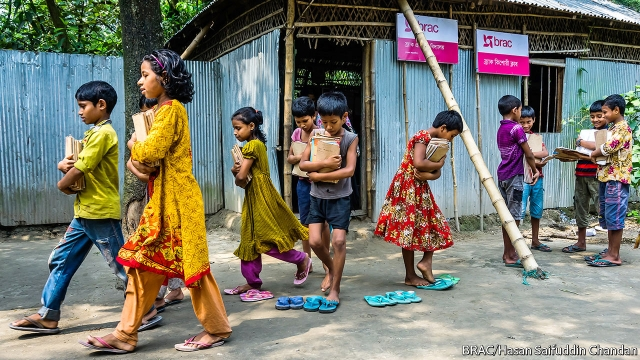
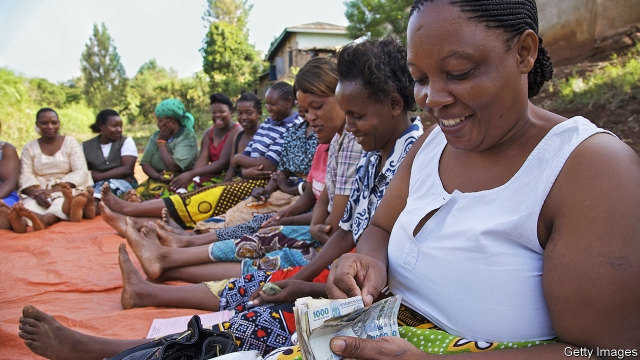

###### BRAC to the future

# How BRAC, the world’s biggest charity, made Bangladesh richer 

 

> print-edition iconPrint edition | International | Sep 7th 2019 

NINE YEARS ago Selina Akter was in a sorry state. She had eloped and gone to live with her husband in Charmotto, a village west of Dhaka in Bangladesh. But he was able to find only poorly paying casual work, and, because of the elopement, her family had disowned her. The couple had entered the ranks of the “ultra-poor”—the most indigent group of all who are barely able to feed themselves. 

Ms Akter came to the attention of BRAC, a charity so ubiquitous in Bangladesh that in some rural areas you see one of its pink-and-white signs every few miles. BRAC made her an offer she could hardly refuse. It would give her a cow and visit once a week to teach her about animal husbandry as well as the importance of saving money and the evils of child marriage. To ensure she got enough to eat, the charity would give her lentils and a small cash stipend. 

By rural Bangladeshi standards, Ms Akter is no longer poor. She lives in a house with cement steps, a pitched corrugated-iron roof and a refrigerator. Among other animals, she owns two cows, which lounge in her courtyard under an electric fan. Thanks in part to her earnings, her husband has been able to buy an auto-rickshaw. He has plenty of customers. The government has built good roads around Charmotto, and the district is growing wealthier as Dhaka sprawls towards it. Ms Akter’s story is a tribute to BRAC. She also hints at why this enormous, unusual charity has a problem. 

BRAC was founded in 1972 by Sir Fazle Abed, an accountant who was horrified by the state of his country. (The four letters of its name have stood for various things over the years, but today no longer stand for anything.) It has grown into one of the world’s biggest non-governmental organisations—the only outfit from a poor country to push its way into the top rank. BRAC has about 100,000 full-time staff, 8,000 of whom work outside Bangladesh. In 2018 it lent money to almost 8m people and educated more than 1m children across Bangladesh and ten other countries. It has a hand in a university, a bank, a seed company, an artificial-insemination outfit, a chicken concern, a driving school and a chain of 21 fashion boutiques—among other things. 

It is also one of the world’s best charities. NGO Advisor, which tries to keep score, has put it top of the heap for the past four years. Its corporate culture is a little like an old-fashioned engineering firm. BRAC’s employees are problem-solvers rather than intellectuals, and they communicate well—the organisation constantly tweaks its programmes in response to data and criticisms from local staff. Some of its innovations have spread around the world. The anti-poverty programme it created, which involves giving assets and training to indigent women, has been copied by other charities and has been shown to work in countries as diverse as Ethiopia, Honduras and India. 

ButBRAC now has problems that it may not be able to solve. Thanks largely to remittances and the garment industry, annual GDP growth in Bangladesh has been above 5% for each of the past 15 years—a record better than those of India or Pakistan. Bangladesh is already a lower-middle-income country. It will soon be too rich to be eligible for the World Bank’s International Development Assistance loans. 

Bangladesh has never been awash with foreign aid. It is not strategically vital and it is very populous. (Aid per head is usually higher in small countries.) Between the early 1980s and 2016, overall aid fell from more than 5% of Bangladesh’s gross national income (GNI) to just 1.1%. The following year the Rohingya refugees arrived from Myanmar, and aid rose to 1.4% of GNI. But the slide will probably continue. BRAC’s single largest source of grants, a “strategic partnership” with the governments of Australia and Britain, ends in 2021. 

Meanwhile, the state has more money than ever. Between 2000 and 2018 annual government spending more than tripled. That is a challenge. Large charities took root in Bangladesh because of government weakness. A catastrophic cyclone in 1970 and a famine in 1974 had shown the state to be incapable of providing public services, so it allowed others to do so. Around the time Sir Fazle created BRAC, a university professor named Muhammad Yunus started experimenting with lending small sums of money to women; he went on to create Grameen Bank, a microfinance organisation. These days, though, Sheikh Hasina’s government has plans aplenty—for digital education, conditional cash transfers and much more besides. 

As Bangladesh grows wealthier and its government reaches into new corners, the country’s charities are being squeezed. “Most NGOs are scaling down—they didn’t see it coming,” says Asif Saleh, BRAC’s executive director. They might simply be swept aside. Victorian and Edwardian Britain had mighty charities, often linked to churches, which ran schools and hospitals and built houses for the poor. Few were still mighty after the creation of the welfare state. But Mr Saleh reckons BRAC can avoid that fate. 

If aid money will not come to Bangladesh, perhaps BRAC can go where the aid money is. It first ventured abroad in 2002, opening an office in Afghanistan. It now operates in five Asian countries and six African ones. Some of the programmes that it developed in Bangladesh, and tested on people like Ms Akter, work well overseas. A recent evaluation by the World Bank of BRAC’s ultra-poor programme in Afghanistan found a big boost to incomes and women’s employment. In Uganda, its after-school clubs seem to cut teenage pregnancy rates and encourage girls to start working. 

But the charity is still a minnow outside Bangladesh. It is less prominent than Western aid agencies, multilateral outfits like UNICEF or other big international charities. One reason is that a lot of aid money goes to humanitarian projects, which are not BRAC’s main strength, although it has learned from working in the Rohingya refugee camps that have sprung up in eastern Bangladesh in the past two years. BRAC is good at proving that its programmes work and good at keeping its costs down (it pays staff less than other international NGOs). But donors care less about these things than one might hope. 

At home, the charity is responding to the squeeze differently. If Bangladesh has fewer desperately needy people, why not take advantage of that? BRAC is already a hybrid of charitable programmes and businesses. It uses some moneymaking activities to subsidise the rest—15% of the profits from its microfinance arm go into its core budget. The aim now is to shift the balance further from philanthropy to commerce, and quickly. 

In Gazipur district, north of the capital, 30 children in one of BRAC’s schools sing songs, chant the names of countries (they tend to know the ones that are good at football) and run through the Bengali spellings of “waves”, “innovation” and “researcher”. This school, which used to be free, now charges 350 taka ($4) a month. The teacher, Shahida Akhter, says things have improved as a result. She used to have to cajole children to come to school. Now their parents pay, they make sure the kids turn up. 

Since 2016 the charity has created or converted some 8,700 primary schools—many of them one-room outfits—into fee-paying schools. The change has been wrenching. Safiqul Islam, who runs the education programme, says that BRAC schools had been free for so long that some parents thought the teachers were corrupt. Now that they are paying, parents expect tables, chairs and electric fans; they also want qualified teachers rather than the trained local women BRAC usually employs. Higher expectations are good, points out Mr Islam. But fulfilling them is expensive. The fee-paying schools currently cover only about a quarter of their costs. 

The fees will surely go up. In January the charity created BRAC Academy, which charges three times as much as the school in Gazipur. If that proves popular, others will open. And the search is on for other opportunities to get people to pay for its services. BRAC has introduced small fees in its medical clinics, and charges to check the paperwork of Bangladeshis who go abroad—usually to the Gulf states—to work. 

 

Its efforts to rescue people from deep poverty have changed, too. The lentils and cash stipends that women like Selina Akter received are no more: internal research suggests that almost nobody in Bangladesh now struggles to afford food. The charity divides the roughly 100,000 working-age poor it deals with each year into two groups. The most indigent are expected to pay back 20% of the value of the asset (often a cow or bull) that they receive. The somewhat less indigent are asked to pay back between 30% and 70%. Partly as a result, the average cost of helping one person has fallen from $530 to $430. 

Independent research on the original ultra-poor programme, which gave people animals and other assets for nothing, has shown that it works extremely well in Bangladesh and elsewhere. It is not yet clear whether the new one does. One worry is that the neediest people will refuse help because they fear borrowing money. When the loan component was introduced in 2017, the refusal rate shot up from less than 2% to 27%. It has since come down, partly because BRAC has altered the balance between grants and loans. But a group of recipients in Borobaroil, near Charmotto, say the loans made them nervous—and that one woman refused help altogether. 

A combination of foreign expansion, fees and cost-cutting will probably not be quite enough to escape the squeeze. If BRAC is to remain potent in Bangladesh and beyond, it will probably have to do something more radical. Rather than providing the services that governments fail to, it will have to teach them how to do the work. The charity has deep experience in many areas. It began opening pre-primary schools in Bangladesh in 1985; the government followed only in 2012. It has learned how to identify the poorest people in a village—much harder than it sounds. Mr Saleh points out that the government of Kenya, which is weaving a social safety-net, has hired BRAC to assess whether it is targeting the right people. Bangladesh’s government could do something similar. 

Getting involved with politics is a tricky business, though—especially in Bangladesh. Even by the dismal standards of the trade, Bangladesh’s politicians are a brutal, vindictive bunch. In 2007, soon after being awarded the Nobel peace prize for his microfinance work, Mr Yunus tried to set up a political party. Four years later the political establishment struck back, forcing him out as leader of Grameen Bank. 

BRAC’s path is hard and strewn with traps. But it has done well to acknowledge the challenges posed by economic growth and to set out on the journey. Where it goes, other large charities are bound to follow. ■ 
<<<<<<< HEAD

-- 

 单词注释:

1.BRAC[]:abbr. 孟加拉乡村进步委员会（Bangladesh Rural Advancement Committee）；基地关闭与重组委员会（Base Realignment and Closure） 

2.Bangladesh[,bɑ:ŋ^lә'deʃ]:n. 孟加拉国 [经] 孟加拉共和国 

3.Sep[]:九月 

4.selina[]:n. 塞琳娜（女子名） 

5.elope[i'lәup]:vi. 私奔, 潜逃 [法] 私奔, 弃职, 逃亡 

6.DHAKA['dækә]:达卡[孟加拉国首都] 

7.poorly['puәli]:adv. 贫穷地, 不充分地, 贫乏地 a. 身体不舒服的 

8.elopement[i'lәupmәnt]:n. 潜逃, 私奔 [法] 私奔, 逃亡, 出走 

9.disown[dis'әun]:vt. 否认 [计] 不认, 驱逐 

10.indigent['indidʒәnt]:a. 贫乏的, 穷困的 

11.ubiquitous[ju:'bikwitәs]:a. 无所不在的, 到处存在的, 普遍存在的 

12.husbandry['hʌzbәndri]:n. 农事, 饲养业, 家政 

13.lentil['lentil]:n. 兵豆 

14.stipend['staipend]:n. 薪金, 定期生活津贴 [经] 薪水 

15.Bangladeshi[-ʃi]:n. 孟加拉国人 a. 孟加拉国(人)的 

16.earning['ә:niŋ]:n. 收入（earn的现在分词） 

17.sprawl[sprɒ:l]:vi. 伸开手足躺, 爬行, 蔓生, 蔓延 vt. 懒散地伸开, 使蔓生, 使不规则地伸展 n. 伸开手足躺卧姿势 

18.tribute['tribju:t]:n. 贡物, 礼物, 颂辞 

19.fazle[]:法兹勒 

20.abed[ә'bed]:adv. 在床上 

21.horrify['hɒrifai]:vt. 使恐惧, 使震惊 

22.outfit['autfit]:n. 用具, 配备, 机构 vt. 配备, 供应 vi. 得到装备 

23.ngo[]:abbr. 民间组织；非政府组织（Non-Governmental Organization） 

24.advisor[әd'vaizә]:n. 顾问, 劝告者, 指导教师 

25.corporate['kɒ:pәrit]:a. 社团的, 合伙的, 公司的 [经] 团体的, 法人的, 社团的 

26.organisation[,ɔ: ^әnaizeiʃən; - ni'z-]:n. 组织, 团体, 体制, 编制 

27.constantly['kɒnstәntli]:adv. 不变地, 不断地, 时常地 

28.tweak[twi:k]:n. 拧, 扭, 焦急 vt. 扭, 开足马力 

29.datum['deitәm]:n. 论据, 材料, 资料, 已知数 [医] 材料, 资料, 论据 

30.innovation[.inәu'veiʃәn]:n. 改革, 创新 [法] 创新, 改革, 刷新 

31.asset['æset]:n. 资产, 有益的东西 

32.Ethiopia[.i:θi'әupiә]:n. 埃塞俄比亚 

33.Honduras[hɒn'djurәs]:n. 洪都拉斯 

34.remittance[ri'mitns]:n. 汇款 [经] 汇款, 寄款, 支付(金额) 

35.Pakistan[.pɑ:ki'stɑ:n]:n. 巴基斯坦 

36.eligible['elidʒәbl]:a. 有资格当选的, 合格的 n. 有资格者, 合格者, 适任者 

37.awash[ә'wɒʃ]:a. 与水面齐平的, 被浪冲打的 

38.strategically[strә'ti:dʒikәli]:adv. 在战略上, 颇策略地 

39.populous['pɒpjulәs]:a. 人口多的, 人口稠密的 

40.gni[]:abbr. gross national income 国民总收入 

41.Rohingya[]:罗兴亚族（ 缅甸的一个穆斯林族群） 

42.refugee[.refju'dʒi:]:n. 难民, 流亡者 [法] 避难者, 流亡者, 难民 

43.Myanmar['mjænmɑ:(r)]:缅甸[东南亚国家](即Burma) 

44.partnership['pɑ:tnәʃip]:n. 合伙, 合股, 合作关系 [经] 合伙(合作)关系, 全体合伙人 

45.triple['tripl]:n. 三倍数, 三个一组 a. 三倍的 vt. 使增至三倍 vi. 增至三倍 

46.catastrophic[.kætә'strɒfik]:a. 悲惨的, 灾难的 

47.cyclone['saiklәun]:n. 龙卷风, 暴风 [化] 旋流(分离,除尘)器 

48.incapable[in'keipәbl]:a. 无能力的, 不能的 [机] 不能行的, 耐不住的 

49.muhammad[]:n. 穆罕默德 

50.yunus[]:[网络] 尤努斯；优努斯；尤纳斯 

51.grameen[]:[网络] 格莱珉；孟加拉乡村；葛拉敏银行 

52.microfinance[]:n. 小额信贷 

53.sheikh[ʃeik, ʃi:k]:n. 酋长, 王子, 村长, 族长, 教长, 导师, 有威信的丈夫 

54.conditional[kәn'diʃәnl]:a. 有条件的, 有前提的 [电] 有条件的 

55.ngos[]:abbr. non-government organization 非政府组织，非政府机构 

56.Asif[]:n. 阿西夫（男子名） 

57.Saleh[]:n. 萨利赫（人名） 

58.Victorian[vik'tɔ:riәn]:a. 英国维多利亚女王时代的, 笃信宗教的, 讲究体面的 n. 维多利亚女王时代的英国人 

59.edwardian[ed'wɔ:djәn]:a. 英王爱德华时代的 

60.mighty['maiti]:n. 有势力的人 a. 有势力的, 强大的, 有力的 adv. 很, 极 

61.creation[kri:'eiʃәn]:n. 创造, 创作物, 发明 [化] 产生 

62.reckon['rekәn]:vt. 计算, 总计, 估计, 认为, 猜想 vi. 数, 计算, 估计, 依赖, 料想 

63.Afghanistan[æf'gænistæn]:n. 阿富汗 

64.oversea['әuvә'si:]:adv. 海外, 向国外, 向海外, 国外 a. 外国的, 在国外的, 在海外的, 舶来的 

65.evaluation[i.vælju'eiʃәn]:n. 评估, 估价, 求值 [计] 鉴定; 评价; 求值 

66.Uganda[ju(:)'^ændә, u:'^ændә]:n. 乌干达 

67.teenage['ti:nidʒ]:a. 十三岁到十九岁的 

68.pregnancy['preɡnәnsi]:n. 怀孕；丰富, 多产；意义深长 

69.minnow['minәu]:n. 鲤科淡水小鱼 

70.les[lei]:abbr. 发射脱离系统（Launch Escape System） 

71.multilateral[.mʌlti'lætәrәl]:a. 多边的, 多国的 [经] 多边的, 涉及多方的 

72.unicef['ju:nisef]:abbr. 联合国儿童基金会（等于United Nations International Children'sEmergency Fund） 

73.humanitarian[hju:.mæni'tєәriәn]:n. 人道主义者, 博爱者, 基督凡人论者 a. 人道主义的, 博爱的, 凡人论的 

74.donor['dәunә]:n. 捐赠人 [化] 给体; 供体 

75.differently['difrentli]:adv. 差异, 不同, 各别, 各种 

76.desperately['despәrәtli]:adv. 拼命地；绝望地；极度地 

77.needy['ni:di]:a. 贫穷的, 贫困的, 生活艰苦的 

78.hybrid['haibrid]:n. 混血儿, 杂种, 混合物 a. 混合的, 杂种的, 混合语的 [计] NetWare的主机实用程序, 双重用户建立程序 

79.charitable['tʃæritәbl]:a. 大慈大悲的, 宽厚的, 慈善的 [法] 慈善的, 慷慨的, 宽恕的 

80.moneymaking['mʌni.meikiŋ]:a. 热心赚钱的；会赚钱的；赚钱的 

81.subsidise[]:vt. 给...补助金, 津贴, 资助 

82.philanthropy[fi'lænθrәpi]:n. 慈善, 仁慈, 博爱, 慈善事业, 慈善机构(团体) 

83.quickly['kwikli]:adv. 很快地 

84.Bengali[beŋ'^ɔ:li]:n. 孟加拉人 a. 孟加拉的 

85.taka['tɑ:kә. -kɑ:]:n. 孟加拉国货币单位；一种土耳其小船 

86.shahida[]:[网络] 沙希达 

87.akhter[]:n. (Akhter)人名；(阿富)阿赫塔尔 

88.cajole[kә'dʒәul]:vt. 以甜言蜜语哄骗, 勾引 

89.wrench['rentʃ]:n. 扳钳, 扳手, 扭伤, 歪曲, 痛苦 vt. 猛扭, 扭伤, 曲解, 折磨 vi. 猛扭, 猛绞 

90.Islam['izlɑ:m]:n. 伊斯兰教 

91.currently['kʌrәntli]:adv. 现在, 当前, 一般, 普通 [计] 当前 

92.Bangladeshi[-ʃi]:n. 孟加拉国人 a. 孟加拉国(人)的 

93.recipient[ri'sipiәnt]:a. 领受的, 容易接受的, 感受性强的 n. 领受者, 容纳者, 容器 

94.potent['pәutnt]:a. 有力的, 有说服力的, 有效的 [医] 有力的, 有性交能力的 

95.Kenya['kenjә]:n. 肯尼亚 

96.politic['pɒlitik]:a. 精明的, 明智的, 策略的 

97.tricky['triki]:a. 狡猾的, 机敏的 

98.dismal['dizmәl]:a. 阴沉的, 凄凉的, 令人忧郁的 n. 低落的情绪, 沼泽 

99.brutal['bru:tәl]:a. 残忍的, 野蛮的, 不讲理的 

100.vindictive[vin'diktiv]:a. 有报仇心的, 怀恨的, 惩罚的 [法] 报复的, 有报仇心的, 复仇的 

101.Nobel['nәubel]:n. 诺贝尔 

102.strew[stru:]:vt. 散播, 撒满 
=======
>>>>>>> 50f1fbac684ef65c788c2c3b1cb359dd2a904378

