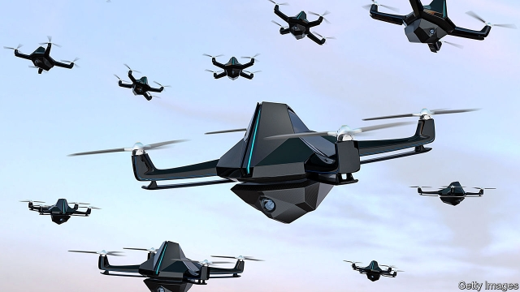

###### Mind control

# Artificial intelligence and war 

 

> print-edition iconPrint edition | Leaders | Sep 7th 2019 

THE CONTEST between China and America, the world’s two superpowers, has many dimensions, from skirmishes over steel quotas to squabbles over student visas. One of the most alarming and least understood is the race towards artificial-intelligence-enabled warfare. Both countries are investing large sums in militarised artificial intelligence (AI), from autonomous robots to software that gives generals rapid tactical advice in the heat of battle. China frets that America has an edge thanks to the breakthroughs of Western companies, such as their successes in sophisticated strategy games. America fears that China’s autocrats have free access to copious data and can enlist local tech firms on national service. Neither side wants to fall behind. As Jack Shanahan, a general who is the Pentagon’s point man for AI, put it last month, “What I don’t want to see is a future where our potential adversaries have a fully AI-enabled force and we do not.” 

AI-enabled weapons may offer superhuman speed and precision (see article). But they also have the potential to upset the balance of power. In order to gain a military advantage, the temptation for armies will be to allow them not only to recommend decisions but also to give orders. That could have worrying consequences. Able to think faster than humans, an AI-enabled command system might cue up missile strikes on aircraft carriers and airbases at a pace that leaves no time for diplomacy and in ways that are not fully understood by its operators. On top of that, AI systems can be hacked, and tricked with manipulated data. 

During the 20th century the world eventually found a way to manage a paradigm shift in military technology, the emergence of the nuclear bomb. A global disaster was avoided through a combination of three approaches: deterrence, arms control and safety measures. Many are looking to this template for AI. Unfortunately it is only of limited use—and not just because the technology is new. 

Deterrence rested on the consensus that if nuclear bombs were used, they would pose catastrophic risks to both sides. But the threat posed by AI is less lurid and less clear. It might aid surprise attacks or confound them, and the death toll could range from none to millions. Likewise, cold-war arms-control rested on transparency, the ability to know with some confidence what the other side was up to. Unlike missile silos, software cannot be spied on from satellites. And whereas warheads can be inspected by enemies without reducing their potency, showing the outside world an algorithm could compromise its effectiveness. The incentive may be for both sides to mislead the other. “Adversaries’ ignorance of AI-developed configurations will become a strategic advantage,” suggests Henry Kissinger, who led America’s cold-war arms-control efforts with the Soviet Union. 

That leaves the last control—safety. Nuclear arsenals involve complex systems in which the risk of accidents is high. Protocols have been developed to ensure weapons cannot be used without authorisation, such as fail-safe mechanisms that mean bombs do not detonate if they are dropped prematurely. More thinking is required on how analogous measures might apply to AI systems, particularly those entrusted with orchestrating military forces across a chaotic and foggy battlefield. 

The principles that these rules must embody are straightforward. AI will have to reflect human values, such as fairness, and be resilient to attempts to fool it. Crucially, to be safe, AI weapons will have to be as explainable as possible so that humans can understand how they take decisions. Many Western companies developing AI for commercial purposes, including self-driving cars and facial-recognition software, are already testing their AI systems to ensure that they exhibit some of these characteristics. The stakes are higher in the military sphere, where deception is routine and the pace is frenzied. Amid a confrontation between the world’s two big powers, the temptation will be to cut corners for temporary advantage. So far there is little sign that the dangers have been taken seriously enough—although the Pentagon’s AI centre is hiring an ethicist. Leaving warfare to computers will make the world a more dangerous place.■ 

-- 

 单词注释:

1.Sep[]:九月 

2.superpower[.sju:pә'pauә]:n. 超级强权, 超级大国 [经] 超级大国 

3.skirmish['skә:miʃ]:n. 前哨战, 小争论, 小冲突 vi. 发生小争论, 侦察 

4.quota['kwәutә]:n. 配额, 限额 [化] 定额 

5.squabble['skwɒbl]:vi. 争吵, 口角 n. 争吵, 口角 

6.warfare['wɒ:fєә]:n. 战争, 战斗, 交战, 斗争, 竞争 [法] 战事, 作战, 交战 

7.militarise['militəraiz]:v. 军事化, 军国化 

8.AI[ai]:[计] 附加信息, 人工智能 [化] 人工智能 

9.tactical['tæktikl]:a. 战术的, 用兵上的, 策略的 

10.fret[fret]:n. 烦躁, 磨损, 焦急, 网状饰物 vi. 烦恼, 不满, 磨损 vt. 使烦恼, 腐蚀, 使磨损, 使起波纹 

11.sophisticate[sә'fistikeit]:n. 久经世故的人, 精于...之道的人 vt. 篡改, 曲解, 使变得世故, 掺合, 弄复杂 vi. 诡辩 

12.autocrat['ɒ:tәkræt]:n. 独裁者 

13.copious['kәupiәs]:a. 很多的, 丰富的, 内容丰富的 

14.datum['deitәm]:n. 论据, 材料, 资料, 已知数 [医] 材料, 资料, 论据 

15.enlist[in'list]:vt. 征募, 参与, 谋取 vi. 从军, 应募, 赞助 

16.tech[tek]:n. 技术学院或学校 

17.jack[dʒæk]:n. 插座, 千斤顶, 男人 vt. 抬起, 提醒, 扛举, 增加, 提高, 放弃 a. 雄的 [计] 插座 

18.Shanahan[]:n. (Shanahan)人名；(英)沙纳汉 

19.adversary['ædvәsәri]:n. 敌手, 对手 a. 敌手的, 敌对的 

20.fully['fuli]:adv. 十分地, 完全地, 充分地 

21.superhuman[.sju:pә'hju:mәn]:a. 超人的, 人类能力所不能及的 

22.airbase[]:n. 空军基地；航空基地 

23.diplomacy[di'plәumәsi]:n. 外交, 外交手腕, 交际手段 [法] 外交, 外交手腕, 权谋 

24.hack[hæk]:n. 劈, 砍, 砍痕, 出租车, 干咳, 晒架, 鹤嘴锄 vt. 劈, 砍, 出租, 用旧 vi. 劈, 砍, 干咳, 驾驶出租车 a. 出租的 

25.manipulate[mә'nipjuleit]:vt. 操纵, 利用, 操作, 巧妙地处理, 假造 

26.paradigm['pærәdaim]:n. 范例, 式样, 词形变化表, 纵聚合关系语言项 

27.emergence[i'mә:dʒәns]:n. 出现, 浮现, 发生 

28.deterrence[di'tә:rәns]:n. 威慑, 威慑力量 [法] 威慑力量, 制止物 

29.template['templit]:n. 样板, 模板, 垫木 [计] 模板 

30.deterrence[di'tә:rәns]:n. 威慑, 威慑力量 [法] 威慑力量, 制止物 

31.catastrophic[.kætә'strɒfik]:a. 悲惨的, 灾难的 

32.les[lei]:abbr. 发射脱离系统（Launch Escape System） 

33.lurid['luәrid]:a. 火烧似的, 苍白的, 华丽的, 可怕的 

34.confound[kәn'faund]:vt. 使混淆, 使狼狈, 挫败 

35.toll[tәul]:n. 通行费, 代价, 钟声 vt. 征收, 敲钟, 鸣钟, 勾引, 引诱 vi. 征税, 鸣钟 

36.transparency[træns'pærәnsi]:n. 透明, 透明度, 透过性, 透明物, 清晰 [计] 透明性; 透明 

37.silo['sailәu]:n. 筒仓, 青贮窖 [机] 储仓 

38.cannot['kænɒt]:aux. 无法, 不能 

39.warhead['wɒ:hed]:n. 弹头 

40.potency['pәutәnsi]:n. 力量, 权力, 效力 [化] 能力 

41.algorithm['ælgәriðm]:n. 算法 [计] 算法 

42.effectiveness[i'fektivnis]:n. 效力 [经] 有效性, 能行性 

43.incentive[in'sentiv]:n. 动机 a. 激励的 

44.ignorance['ignәrәns]:n. 无知, 愚味 [法] 无知, 不知情, 愚昧 

45.configuration[kәn.figju'reiʃәn]:n. 结构, 表面配置, 外形, 配置 [计] 配置 

46.henry['henri]:n. 亨利 [医] 亨[利](电感应单位) 

47.Kissinger['kisәndʒә]:n. [姓氏] 基辛格 

48.arsenal['ɑ:snәl]:n. 兵工厂, 军械库 [机] 兵工厂 

49.protocol['prәutәkɒl]:n. 草案, 礼仪, 协议 v. 拟定 [计] 协议, 协议列表实用程序 

50.authorisation[,ɔ:θəraɪ'zeɪʃən]:n. 授权；批准 

51.mechanism['mekәnizm]:n. 机械, 机构, 结构, 机理, 技巧 [化] 机理; 历程; 机构 

52.detonate['detәneit]:vt. 引爆, 使爆炸, 使爆裂 vi. 爆炸, 发爆炸声 

53.prematurely['premətʃə(r)lɪ]:adv. 过早地, 贸然地 

54.analogous[ә'nælәgәs]:a. 类似的, 相似的 [医] 类似的, 类同的 

55.entrust[in'trʌst]:vt. 信托, 交托, 委托 [经] 委托 

56.orchestrate['ɒ:kistreit]:v. 编管弦乐曲 

57.chaotic[kei'ɒtik]:a. 混乱的, 无秩序的 [法] 混乱的, 混沌的 

58.battlefield['bætlfi:ld]:n. 战场, 沙场 

59.embody[im'bɒdi]:vt. 具体表达, 使具体化 [经] 合并, 具体化, 具体表现 

60.resilient[ri'ziliәnt]:a. 弹回的, 有弹力的 [医] 回弹的, 回能的 

61.crucially[ˈkru:ʃɪəlɪ]:adv. 至关重要地, 关键地 

62.explainable[]:a. 可说明的, 可辩解的, 可解释的 

63.deception[di'sepʃәn]:n. 欺骗, 诡计 [法] 瞒骗, 诈欺, 欺骗 

64.frenzy['frenzi]:n. 疯狂, 狂暴, 狂怒 [医] 暴怒, 狂乱 

65.amid[ә'mid]:prep. 在其间, 在其中 [经] 在...中 

66.confrontation[.kɔnfrʌn'teiʃәn]:n. 对抗；对质；面对 

67.ethicist['eθisist]:伦理学家 

