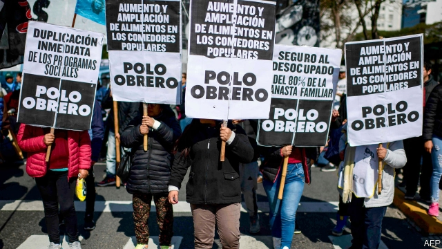
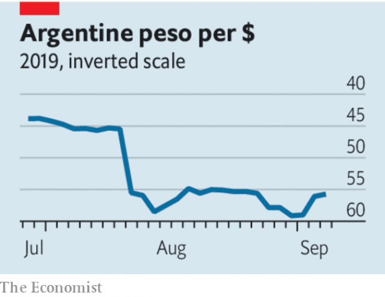

###### A superclassic crisis

# Blame populists, not reformers, for Argentina’s latest fiasco 

 

> print-edition iconPrint edition | Leaders | Sep 7th 2019 

BEFORE HE BECAME president of Argentina in 2015, Mauricio Macri was president of a Buenos Aires football club, Boca Juniors. On September 1st the team faced its crosstown adversary, River Plate, in the superclásico, as contests between the sides are called. The two armies of fans at last had something to agree about. As they made their way to the stadium, Mr Macri’s government announced an emergency reimposition of currency controls. Almost everyone believes that the new policy marks the end, in effect, of his time in office. It also confirms the horrible reality that Argentina has once again become a financial outcast. 

The controls limit the amount of dollars that Argentines can buy and force exporters to repatriate their earnings. They come shortly after the government said it would delay repayments of some of its short-term debt and seek an extension of longer-term liabilities. Intended to prevent capital flight and stabilise the peso, the measures are the final humiliation for Mr Macri, a businessman who promised to revive the economy by scrapping controls and reforming a bloated public sector. 

Foreign investors bought into his liberalising vision after the 2015 election, with Wall Street chiefs such as Jamie Dimon, boss of JPMorgan Chase, proclaiming that Argentina had come in from the cold. And when the financial markets became choppier, in 2018, the IMF backed him with $57bn, its largest-ever loan. A year on, the position could hardly be worse. Inflation is over 50%. The peso has dropped by 30% in the past 12 months, and the country’s dollar bonds trade at less than half their face value. 

Plenty of Argentines and some outsiders may conclude that Mr Macri’s agenda to liberalise the economy, and the IMF’s support, were misplaced. In fact much of the blame for Mr Macri’s failure lies with his populist predecessor, Cristina Fernández de Kirchner, who is running again in the upcoming elections as a vice-presidential candidate. Ms Fernández left behind a gaping budget deficit, artificially low utility prices, statistics that were brazenly manipulated and ruinously high public spending. After years of such mismanagement it has become ever harder to persuade Argentines that prices and the currency will be stable. Their mistrust of their economic institutions is sadly self-vindicating. It makes investors unusually skittish. Who would trust a country with so little faith in itself? 

 

Mr Macri and the IMF made mistakes (see article). To avoid a public backlash Mr Macri decided to narrow the budget deficit gradually, testing the bond market’s patience rather than the electorate’s. In hindsight he should have balanced the books sooner. Perhaps the IMF should have made a smaller loan (coupled, presumably, with an earlier debt restructuring). But it hoped that a large bail-out would restore investor confidence, allowing Argentina to recover without spending all the money the fund had promised. 

On top of the tactical errors by the government, what finally broke investors’ confidence was the spectre of populists returning to power. Alberto Fernández and his controversial running-mate, Ms Fernández (they are not related and he is more moderate than she), triumphed in a primary vote on August 11th and are almost certain to win October’s election. Investors’ fear of what the opposition would do led to panic and capital flight, and led the government to do some of those things itself, including delaying debt repayments and imposing currency controls. 

Although Mr Fernández has drained Mr Macri of power, he has been reluctant to act as Argentina’s next leader himself. He has instead struck vague and contradictory positions. If he wins, Mr Fernández will not be formally inaugurated until December. Until then Argentina will face a damaging political vacuum. The outgoing government is introducing measures, including price freezes and handouts, to try to protect the population from the shock rippling through the economy. But the situation is still dire, and the new man will still face the long-term problem that defeated Mr Macri: how to bring Argentina’s economy back in line with market realities. A large part of the electorate and the probable next president seem keen to dodge that question. Until it is confronted, decline and crisis will beckon.■ 

