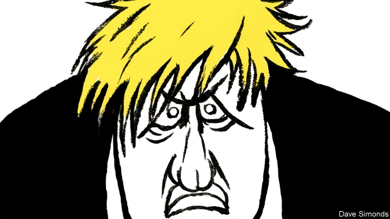

###### British politics

# Boris Johnson’s Unconservative Party 

 

> print-edition iconPrint edition | Leaders | Sep 7th 2019 

BORIS JOHNSON has been Conservative leader for little more than a month, and until this week had appeared in Parliament as prime minister only once. But that did not stop him carrying out the biggest purge in the party’s history on September 3rd. After a backbench rebellion led to a resounding defeat of his uncompromising Brexit policy, 21 moderate Conservative MPs, including seven former cabinet members and a grandson of Winston Churchill, had the whip withdrawn and were told they would not be allowed to stand as Tories at the next election. 

It was the most dramatic step in a long process: the transformation of Britain’s ruling party from conservatives into radical populists (see article). The capture of the Tories by fanatics determined to pursue a no-deal Brexit has caused the party to abandon the principles by which it has governed Britain for most of the past century. With an election looming, and the Labour opposition captured by an equally radical hard-left, the Tories’ sinister metamorphosis is terrible news. 

Junking more than 40 years of cautious pro-Europeanism after the referendum of 2016 was itself a big change. But under Mr Johnson and his Svengali-like adviser, Dominic Cummings, who masterminded the Leave campaign, the Tory party has become not just pro-Brexit but pro-no-deal. Mr Johnson claims he is working flat-out to get a better withdrawal agreement from the EU. Yet in his flailing performance before MPs this week, like an undergraduate bluffing his way through a viva, he was found out. He has no real proposal for replacing the contested Irish backstop. Reports that Mr Cummings privately admitted the negotiations in Brussels are a “sham” ring all too true. Mr Johnson’s unconservative plan seems to be to win a quick election, either after crashing out with no deal or, as it has turned out, claiming to have been thwarted by “enemies of the people” in Parliament. 

The religion of no-deal has wrecked other Conservative principles. Sajid Javid, the fiscally prudent chancellor, this week dished out billions of pounds worth of pre-election goodies. He gave money to public services without demanding much in the way of reform, and focused on day-to-day spending rather than investing for the future. Spending power was supposedly being kept aside to cope with a no-deal crash-out. But faith dictates that no-deal will do no great harm to the economy, so no safety-net is required. To show any such caution, as Mr Javid’s predecessor (now an ex-Tory) did, is a form of heresy. 

The most unconservative behaviour of Mr Johnson’s government has been its constitutional recklessness. Not only has it suspended Parliament (having said that it would not), so as to limit MPs’ time to legislate on Brexit (which, again, it said was unconnected). It also toyed with using even more underhand tactics, such as recommending that the queen not enact legislation passed by Parliament. Would the government abide by the law, a cabinet ally of Mr Johnson was asked? “We will see what the legislation says,” he replied. In a country whose constitution depends on a willingness to follow convention and tradition, even making such a threat weakens the rules—and paves the way for the next round of abuses, be it by a Labour or Tory government. 

This week there were still just enough conservatives in the Conservative Party to block the most dangerous part of Mr Johnson’s Brexit policy. As we went to press, a bill designed to stop no-deal was making its way through the House of Lords. But the defeat of the government, and its loss of any sort of majority, points towards an election. It will be a contest in which, for the first time in living memory, Britain has no centre-right party. Nor, thanks to Labour’s far-left leader, Jeremy Corbyn, will it have a mainstream opposition. Instead the two leading parties will, in their different ways, be bent on damaging the economy; and both will pose a threat to Britain’s institutions. Brexit’s dreadful consequences continue. ■ 
<<<<<<< HEAD

-- 

 单词注释:

1.politic['pɒlitik]:a. 精明的, 明智的, 策略的 

2.boris['bɔris]:n. 鲍里斯（男子名） 

3.unconservative[]:[网络] 不保守 

4.Sep[]:九月 

5.boris['bɔris]:n. 鲍里斯（男子名） 

6.johnson['dʒɔnsn]:n. 约翰逊（姓氏） 

7.purge[pә:dʒ]:n. 净化, 清除, 泻药 v. (使)净化, 清除, (使)通便 [计] 服务器文件删除实用程序 

8.backbench['bækbentʃ]:n. 后座议员席 a. 后座议员的 

9.resound[ri'zaund]:vi. 回响, 鸣响, 反响, 驰名, 被传遍 vt. 使回响, 传颂 

10.uncompromising[.ʌn'kɒmprәmaiziŋ]:a. 不让步的, 不妥协的, 坚定的 [法] 坚定的, 不受协的, 不能通融的 

11.Brexit[]:[网络] 英国退出欧盟 

12.MP[]:国会议员, 下院议员 [计] 宏处理程序, 维护程序, 线性规划, 微程序, 多处理器 

13.winston['winstәn]:n. 温斯顿（姓氏, 男子名） 

14.Churchill['tʃә:tʃil]:n. 邱吉尔 

15.Tory['tɒ:ri]:n. 托利党党员, 保守党员, 亲英分子 a. 保守分子的 

16.Populist['pɔpjulist]:n. 民粹派的成员 

17.fanatic[fә'nætik]:n. 狂热者, 盲信 a. 狂热的, 盲信的 

18.loom[lu:m]:n. 织布机, 若隐若现的景象 vi. 朦胧地出现, 隐约可见, 可怕地出现 

19.opposition[.ɒpә'ziʃәn]:n. 反对, 敌对, 相反, 在野党 [医] 对生, 对向, 反抗, 反对症 

20.equally['i:kwәli]:adv. 相等地, 同样地, 平等地 

21.sinister['sinistә]:a. 不吉利的, 凶恶的, 左边的 [医] 左的 

22.metamorphosis[.metә'mɒ:fәsis]:n. 蜕变, 变质, 变形 [医] 变态, 变形, 变质 

23.referendum[.refә'rendәm]:n. （就重大政治或社会问题进行的）全民公决，全民投票 

24.johnson['dʒɔnsn]:n. 约翰逊（姓氏） 

25.adviser[әd'vaizә]:n. 顾问, 劝告者, 指导教师 [法] 顾问, 劝告者 

26.dominic['dɔminik]:n. 多米尼克（男子名） 

27.Cumming[]:n. (Cumming)人名；(英)卡明 卡明 

28.mastermind['mɑ:stәmaind]:n. 优秀策划者, 才子 vt. 指导, 主持, 策划 

29.Tory['tɒ:ri]:n. 托利党党员, 保守党员, 亲英分子 a. 保守分子的 

30.withdrawal[wið'drɒ:l]:n. 提款, 撤退, 退回, 撤消, 退隐, 戒毒过程 [医] 戒除, 脱瘾 

31.EU[]:[化] 富集铀; 浓缩铀 [医] 铕(63号元素) 

32.flail[fleil]:n. 连枷 v. 用连枷打, 打 

33.bluff[blʌf]:n. 断崖, 绝壁, 吓唬 a. 直率的 v. 吓唬, 欺骗 

34.viva['vi:vә]:n. 口试, 口头测验 

35.backstop['bækstɒp]:n. 挡球网, 接球手 [电] 背向停止 

36.privately[]:adv. 秘密地；私下地 

37.negotiation[ni.gәuʃi'eiʃәn]:n. 谈判, 磋商, 交涉 [经] 谈判, 协商 

38.Brussel[]:n. 布鲁塞尔（比利时首都） 

39.sham[ʃæm]:n. 假, 赝品, 骗子, 哄骗 a. 假的, 伪造的 vt. 假装, 冒充 vi. 装假 

40.unconservative[]:[网络] 不保守 

41.thwart[θwɒ:t]:a. 横放的 vt. 反对, 阻挠, 横过 prep. 横过 adv. 横过 

42.sajid[]:n. (Sajid)人名；(印尼)赛义德 

43.javid[]:[网络] 加威；贾维德 

44.fiscally[]:adv. 在国库方面, 财政上, 在国库岁入方面 

45.prudent['pru:dnt]:a. 审慎的, 三思而后行的, 精明的, 节俭的 

46.chancellor['tʃɑ:nsәlә]:n. 大臣, 总理, 首相, 大使馆/领事馆的一等秘书, 司法官, 大学校长 

47.goody['gudi:]:n. 身分低微之老妇, 糖果, 姥姥 a. 感伤的, 伪善的 interj. 太好了 

48.supposedly[sә'pәuzidli]:adv. 想象上, 看上去像, 被认为是, 恐怕, 按照推测 

49.predecessor[.predi'sesә]:n. 前任, 先辈, 前身 [医] 初牙, 前辈, 祖先 

50.heresy['herәsi]:n. 异端, 异教 [法] 异端邪说, 异教, 信奉异教 

51.constitutional[.kɒnsti'tju:ʃәnl]:a. 宪法的, 立宪的, 体质的 [医] 全身的; 体质的 

52.recklessness[]:[法] 鲁莽, 粗心大意 

53.legislate['ledʒisleit]:vi. 制定法律 vt. 用立法规定 

54.unconnected['ʌnkә'nektid]:a. 不连接的, 分离的, 不连贯的, 无亲属关系的 [计] 非连通的 

55.underhand['ʌndәhænd]:a. 秘密的, 低手的, 偷偷摸摸的 [法] 卑鄙的, 秘密的, 欺诈的 

56.tactic['tæktik]:n. 一项战术, 一条策略 a. 战术的, 顺序的, 排列的 

57.enact[i'nækt]:vt. 制定法律, 扮演, 颁布 [法] 法令, 法规, 条例 

58.abide[ә'baid]:vi. 停留, 遵守, 居留, 继续下去 vt. 忍受, 经受, 屈从于 

59.ally['ælai. ә'lai]:n. 同盟者, 同盟国, 助手 vt. 使联盟, 使联合, 使有关系 vi. 结盟 

60.jeremy['dʒerimi]:n. 杰里米（男子名） 

61.Corbyn[]:科尔宾（人名） 

62.mainstream['meinstri:m]:n. 主流 

63.dreadful['dredful]:a. 可怕的 
=======
>>>>>>> 50f1fbac684ef65c788c2c3b1cb359dd2a904378

