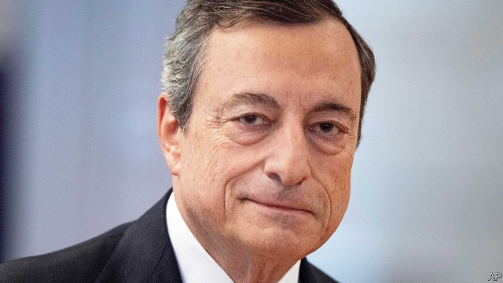
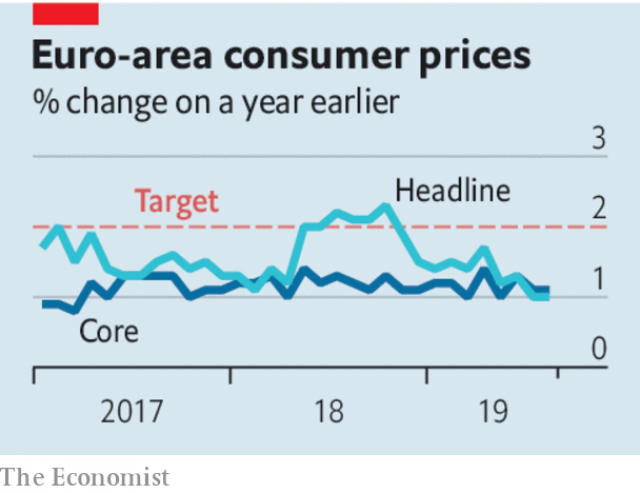

###### What Mario Draghi should do to perk up Europe’s economy

# Mario Draghi and the ECB confront a slowing euro zone 

 

> print-edition iconPrint edition | Leaders | Sep 7th 2019 

IF MARIO DRAGHI had been hoping for a quiet few months before he retires from the European Central Bank (ECB) at the end of October, he has been disappointed. He has been in charge for eight high-wire years. In 2012 he quelled panic about the break-up of the euro zone by pledging to do “whatever it takes” to save the single currency. In 2015 he introduced quantitative easing (QE, creating money to buy bonds) in the face of fierce opposition from northern member states. Now the euro zone is flirting with recession and governments are not helping by being slow to loosen fiscal policy. At the central bank’s meeting on September 12th, Mr Draghi must dust himself down one last time. 

Investors’ jitters about a recession and the impact of the trade war have sent bond yields tumbling. The ECB’s hawks—such as Jens Weidmann, the head of the Bundesbank, and Klaas Knot, of the Dutch central bank—caution against overreacting with a large stimulus. But the economic data are dreadful. Output in Germany shrank in the second quarter, and some economists are pencilling in another contraction in the third. Italy is stagnating. According to a survey of purchasing managers released on September 2nd, Europe’s manufacturing decline shows no sign of abating. The deeper it is and the longer it lasts, the more likely that trouble brims over into the rest of the economy. In Germany retail sales are already slipping and firms are planning to hire fewer workers. 

Inflation is dangerously low. Both the headline figure and the “core” measure—which strips away volatile food and energy prices—are stuck at around 1%, below the ECB’s target of inflation below, but close to, 2%. Investors’ medium-term expectations, as measured by swap rates, have drifted down to 1.2%, well below levels in 2014-15, when the bank prepared to launch QE. The views of professional forecasters surveyed by the ECB have fallen to their bleakest since polling began in 1999. In an attempt to bolster its credibility, the bank has tweaked its language to emphasise that it does not want to undershoot the target of 2% consistently. But without action, those words count for little. 

Some economists, among them Larry Summers of Harvard University, argue that, with little ammunition left, central banks should refrain from action so as to force governments to step into the breach with fiscal policy. They are right that the root cause of the economic woe is a shortfall of demand. Sovereign borrowing costs in much of the euro area are near zero or below it. In an ideal world governments would leap at the chance to borrow so cheaply in order to invest. And it is also true that monetary policy is likely to be less effective because rates are so low. The ECB’s deposit rate is already -0.4%. At some point the benefits of further cuts will be offset by their costs, for example if customers begin to withdraw funds from banks and thus destabilise them. With financial conditions already much looser, QE will not be as effective as it was in 2015. 

 

But for the ECB to stand back and do nothing would be irresponsible. It is legally obliged to achieve price stability. Germany’s government shows little appetite to borrow to spend, even if its entire bond yield-curve is submerged below zero. There is even less sign of co-ordinated regional fiscal stimulus in the offing. Until governments loosen the purse-strings, the ECB has no choice but to act. It is the only game in town. 

Mr Draghi must therefore be bold on September 12th. Although the scope for interest-rate cuts is limited, it still exists. The important thing is to mitigate the impact on financial stability by, say, “tiering” deposit rates—giving banks a rebate on some of the interest they would otherwise have to pay to park spare cash with the central bank. This would signal that the ECB can cut rates further without blowing up the banking system. 

He should also restart QE and commit the bank to buying bonds until underlying inflation shows a meaningful recovery. Mr Draghi has said before that he views asset purchases as particularly helpful in reviving inflation expectations. One constraint is the ECB’s self-imposed limit on the share of a country’s government bonds that the bank can buy. This should be lifted from a third to a half, sending a powerful signal that the ECB means business. The legality of QE is still being questioned in Germany’s constitutional court, but a ruling by the European Court of Justice last year appears to give the ECB room to raise those limits in its quest for price stability. The promise of lower borrowing costs for longer might even prompt national treasuries into issuing more debt. 

Last, Mr Draghi must use the bully pulpit to urge governments to exercise their fiscal powers to fend off a recession. You might think that he should avoid taking action at the end of his tenure, so as not to bind the hands of his successor, Christine Lagarde. Not so. A determined response now will save her much work later. Mr Draghi is in a unique position. His stature with investors and governments gives him real clout. And since he departs in a few weeks he can be blunter than he has been in putting across the message that governments, not just the ECB, must act. That would cement his legacy as the man who saved the euro.■ 
<<<<<<< HEAD

-- 

 单词注释:

1.mario['mæriәj, 'mɑ:-]:n. 马里奥（男子名） 

2.Draghi[]:[网络] 行长德拉吉；总裁德拉吉；欧洲央行德拉吉 

3.perk[pә:k]:vi. 昂首, 振作, 举止高傲, 神气活现, 滤煮 vt. 竖起, 打扮, 使振作, 滤煮 n. 小费 

4.ECB[]:[计] 事件控制块 

5.confront[kәn'frʌnt]:vt. 使面对, 对抗, 遭遇, 使对质, 比较 [法] 对证, 使对质, 比较 

6.euro['juәrәu]:n. 欧元（欧盟的统一货币单位） 

7.Sep[]:九月 

8.mario['mæriәj, 'mɑ:-]:n. 马里奥（男子名） 

9.Draghi[]:[网络] 行长德拉吉；总裁德拉吉；欧洲央行德拉吉 

10.quell[kwel]:vt. 压制, 平息, 减轻 

11.pledge[pledʒ]:n. 诺言, 保证, 誓言, 抵押, 信物, 保人, 祝愿 vt. 许诺, 保证, 使发誓, 抵押, 典当, 举杯祝...健康 

12.quantitative['kwɒntitәtiv]:a. 数量的, 定量的 [医] 定量的, 数量的 

13.qe[]:abbr. 量子电子学（Quantum Electronics） 

14.opposition[.ɒpә'ziʃәn]:n. 反对, 敌对, 相反, 在野党 [医] 对生, 对向, 反抗, 反对症 

15.flirt[flә:t]:n. 卖弄风骚的人, 急动, 急扔 vt. 忽然弹出, 轻快摆动, 挥动 vi. 调情, 玩弄, 摆动, 轻率地对待 

16.recession[ri'seʃәn]:n. 后退, 凹处, 衰退, 归还 [医] 退缩 

17.fiscal['fiskәl]:a. 财政的, 国库的 [经] 财政上的, 会计的, 国库的 

18.jitter['dʒitә]:vi. 神经过敏, 战战兢兢 [计] 跳动; 抖动 

19.jen[]:n. 珍（女子名） 

20.weidmann[]:[网络] 德国央行行长魏德曼；魏德曼电力科技；德国央行行长魏斯曼 

21.bundesbank['bundəs,bæŋk]:n. 德意志联邦银行 

22.klaas[]: [人名] 克拉斯 

23.Dutch[dʌtʃ]:n. 荷兰人, 荷兰语 a. 荷兰的 

24.overreact[,әuvәri'ækt]:vi. 反应过度, 反作用过强 

25.stimulus['stimjulәs]:n. 刺激, 激励, 刺激品 [医] 刺激特, 刺激 

26.datum['deitәm]:n. 论据, 材料, 资料, 已知数 [医] 材料, 资料, 论据 

27.dreadful['dredful]:a. 可怕的 

28.economist[i:'kɒnәmist]:n. 经济学者, 经济家 [经] 经济学家 

29.contraction[kәn'trækʃәn]:n. 收缩, 缩写式, 害病 [医] 收缩; 挛缩; 牙弓内缩 

30.stagnate['stægneit]:v. (使)淤塞, (使)停滞, (使)变萧条 

31.manufacturing[.mænju'fæktʃәriŋ]:n. 制造业 a. 制造业的 

32.abate[ә'beit]:vt. 减少, 减轻, 减弱, 废除, 打折扣 vi. 减轻, 减弱, 减少, 失效, 被废除 

33.inflation[in'fleiʃәn]:n. 胀大, 夸张, 通货膨胀 [化] 充气吹胀; 膨胀 

34.dangerously[]:adv. 危险, 不安全 

35.volatile['vɒlәtail]:a. 挥发性的, 可变的, 不稳定的, 飞行的, 轻快的, 爆炸性的 n. 有翅动物, 挥发物 [计] 易失的 

36.inflation[in'fleiʃәn]:n. 胀大, 夸张, 通货膨胀 [化] 充气吹胀; 膨胀 

37.forecaster['fɔ:kɑ:stә]:n. 预报员 

38.bleak[bli:k]:a. 萧瑟的, 荒凉的, 阴冷的 

39.bolster['bәulstә]:n. 支持, 长枕 vt. 支持, 支撑 

40.credibility[.kredi'biliti]:n. 可信用, 确实性, 可靠 [法] 证据能力, 可信程度, 确实性 

41.tweak[twi:k]:n. 拧, 扭, 焦急 vt. 扭, 开足马力 

42.emphasise[]:vt. 强调, 重读, 加强...的语气, 着重 

43.undershoot[.ʌndә'ʃu:t]:vt. 射击未达到(目标), 脱靶 n. 负脉冲信号, 负尖峰 

44.consistently[]:adv. 坚固, 坚实, 一致, 始终如一, 连贯 [计] 相容地 

45.Larry['læri]:n. 拉里（男子名） 

46.Harvard['hɑ:vәd]:n. 哈佛大学 

47.ammunition[.æmju'niʃәn]:n. 军火, 弹药 [机] 弹药 

48.refrain[ri'frein]:n. 重复的话, 叠句, 副歌 vi. 节制, 避免, 克制 

49.breach[bri:tʃ]:n. 裂口, 违背, 破坏, 违反, 突破, 破裂 vt. 攻破, 突破 vi. 跳出水面 

50.woe[wәu]:n. 悲哀, 悲痛, 苦痛 

51.shortfall['ʃɒ:tfɒ:l]:n. 不足, 不足量 [经] 缺少, 不足, 亏舱运费 

52.sovereign['sɒvrin]:n. 元首, 独立国 a. 具有主权的, 至高无上的, 国王的, 完全的 

53.cheaply['tʃipli]:adv. 便宜地 

54.monetary['mʌnitәri]:a. 货币的, 金钱的 [经] 货币的, 金融的 

55.les[lei]:abbr. 发射脱离系统（Launch Escape System） 

56.offset['ɒ:fset]:n. 抵消, 把...并列, 旁系, 支管, 用胶印法印 vt. 弥补, 抵消, 胶印 vi. 装支管 n. 偏移量 [计] 偏移量 

57.destabilise[di:'steɪbɪlaɪz]:vt. 破坏政府的稳定 

58.loos[]:n. 损耗, 洗手间（loo复数形式） 

59.irresponsible[.iri'spɔnsәbl]:a. 不负责任的；不可靠的 

60.legally['li:gәli]:adv. 法律上, 合法地 [法] 法律上, 合法地, 法定地 

61.regional['ri:dʒәnәl]:a. 地方的, 地域性的 [医] 区的, 部位的 

62.offing['ɒ:fiŋ]:n. 海面, 离岸距离 

63.mitigate['mitigeit]:vt. 温和, 缓和, 减轻 [医] 缓和, 减轻 

64.tiering[]:分层布置; 堆叠 

65.rebate[ri'beit]:n. 部分退款, 折扣 vt. 退还, 打折扣 vi. 退还部分付款 

66.restart[.ri:'stɑ:t]:v. 重新开始, 重新启动 [计] 重新启动 

67.underlie[.ʌndә'lai]:vt. 位于...之下, 成为...的基础 

68.meaningful['mi:niŋful]:a. 意味深长的 

69.asset['æset]:n. 资产, 有益的东西 

70.revive[ri'vaiv]:vt. 使苏醒, 使复兴, 使振奋, 回想起, 重播 vi. 苏醒, 复活, 复兴, 恢复精神 

71.constraint[kәn'streint]:n. 强制, 约束 [计] 约束 

72.legality[li:'gæliti]:n. 合法, 正当 [经] 合法性 

73.constitutional[.kɒnsti'tju:ʃәnl]:a. 宪法的, 立宪的, 体质的 [医] 全身的; 体质的 

74.quest[kwest]:n. 探索, 寻求, 调查 v. 寻找, 找, 追寻猎物 

75.treasury['treʒәri]:n. 国库, 宝库, 财政部, 国库券 [经] 库存, 国库, 金库 

76.bully['buli]:n. 欺凌弱小者, 土霸 vt. 威胁, 恐吓, 欺负 vi. 欺负 a. 特好的, 第一流的 adv. 十分 

77.pulpit['pulpit]:n. 讲道坛 

78.fend[fend]:vt. 击退, 保护, 供养 

79.tenure['tenjuә]:n. 享有, 保有期 [经] (财产,职位等的)占有, 占有权 

80.successor[sәk'sesә]:n. 继承者, 接任者 [计] 后继 

81.christine['kristi:n]:n. 克莉丝汀（女子名） 

82.lagarde[]: [地名] [法国] 拉加尔德 

83.stature['stætʃә]:n. 身材, 身高, 高度 [医] 身材, 身高 

84.investor[in'vestә]:n. 投资者 [经] 投资者 

85.clout[klaut]:n. 敲击, 破布 vt. 打补钉 

86.blunt[blʌnt]:a. 钝的, 坦率的, 麻痹的 

87.legacy['legәsi]:n. 祖先传下来之物, 遗赠物 [经] 遗产, 遗赠物 
=======
>>>>>>> 50f1fbac684ef65c788c2c3b1cb359dd2a904378

