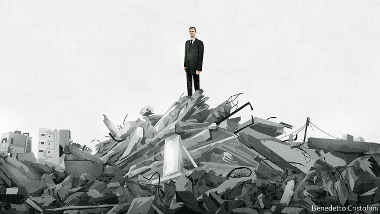

###### Assad’s hollow victory

# Syria will poison the region for years to come 

 

> print-edition iconPrint edition | Leaders | Sep 5th 2019 

“ASSAD OR WE burn the country.” For years Bashar al-Assad’s troops have daubed that phrase onto walls in the towns they recapture. The insurgents pushed the dictator to the brink. But Mr Assad shrugged off the empty threats of Western leaders, and enlisted the help of Iran and Russia. True to his slogan, he destroyed whole cities and gassed and starved his own people. What rebels remain are holed up in Idlib province. It, too, will soon fall. Against all the odds, the monster has won. 

Yet it is a hollow victory. Far from bringing order to the country, as the Russians and Iranians claim, Mr Assad has displaced half the population. Eight years of civil war have destroyed the economy and cost 500,000 lives. Mr Assad has nothing good to offer his people. His country will be wretched and divided. The consequences will be felt far beyond its borders. 

The precise moment of Mr Assad’s triumph will be determined in Idlib. About 3m people live there, many of whom fled fighting elsewhere. The area is controlled by the hardest-core rebels, jihadists linked to al-Qaeda, who will not go quietly. That, too, is a legacy of Mr Assad’s ruthlessness. He released hundreds of jihadists from prison in 2011, hoping that they would taint the once-peaceful, multi-confessional uprising. Now the regime is bombing them, along with civilians and hospitals. The offensive will take time—and it will be bloody (see article). 

When the fighting stops, the tensions that originally threatened the regime will remain—but they will be worse than ever. Start with religion. Mr Assad’s father, Hafez, a member of the Alawite minority, clung to power partly by holding the line between the country’s faiths. His son, though, painted his Sunni opponents as fundamentalists as a way of rallying Christians, Druze and secular-minded Syrians to his side. Millions of Sunnis have fled the country, creating what Mr Assad calls “a healthier and more homogeneous society”, but millions remain. They have seen their homes looted, property confiscated and districts overrun by Assad supporters. Resentful, fearful and oppressed, they will be a source of opposition to the regime. 

Next are Syrians’ grievances. Back in 2011 corruption, poverty and social inequality united the uprising. Things have only got worse. Syria’s GDP is one-third of what it was before the war. The UN reckons that more than eight in ten people are poor. Much of the country lies in ruins. But the government’s plans to rebuild Syria risk tearing it further apart. Reconstruction will cost between $250bn and $400bn, but Mr Assad has neither the money nor the manpower to carry it out. So he has focused resources on areas that remained loyal. The Sunni slums that did not are being demolished and redeveloped for his bourgeois supporters. His cronies reap the profits, as the country’s class and religious fault lines grow wider. 

Then there is Mr Assad’s cruelty. Hafez kept Syria in check with a brutal secret police and occasional campaigns of murderous violence. His son, in danger of losing power, has tortured and killed at least 14,000 people in the regime’s sprawling network of clandestine prisons, according to the Syrian Network for Human Rights, an NGO. Nearly 128,000 people are thought to remain in the dungeons, though many are probably dead. Even as the war nears its end, the pace of executions is increasing. Almost every Syrian has lost someone close to them in the war. Psychologists speak ominously of a breakdown in society. 

Last is Mr Assad’s debt to Iran and Russia. He owes his victory to their supply of firepower, advice and money and their willingness to back a pariah. They will expect to be paid, with interest. 

For Syrians, therefore, Mr Assad’s victory is a catastrophe. But his opponents are exhausted so, in spite of his weaknesses, he could yet cling to power for years. And for as long as he is in charge, Syria’s misery will spread across the region. 

The war has already drawn in a handful of outside powers, but the chaos could grow. Iran treats Syria as a second front against Israel to complement Hizbullah, its proxy in Lebanon. Israel has launched hundreds of air strikes on Iranian positions during the war. One in August prevented Iranian and Hizbullah operatives from attacking Israel with armed drones, the Israeli army says. Turkey, which has troops in the north, is threatening to launch an offensive against Kurdish forces, whom it considers terrorists, near its border. That could lead to a face-off with America, which supports the Kurds and had been trying to calm the Turks. 

Refugees will destabilise Syria’s neighbours, too. Those who have fled Mr Assad do not want to go home—indeed their numbers will grow because of the offensive in Idlib. The longer they stay in camps, the greater the danger that they become a permanent, festering diaspora. They are already unsettling host countries, such as Jordan, Lebanon and Turkey, where many locals accuse them of draining resources and taking jobs. Turkey is sending some back, even to places like Idlib. 

And that could spill over into the wider world. Dispossessed at home and unwanted abroad, refugees are at risk of radicalisation. Mr Assad’s ruthless tactics have left large parts of his population bitter and alienated. His prisons will incubate extremism. What better breeding ground for al-Qaeda and Islamic State (IS), which the American government says is already “resurging in Syria”? In May America dropped 54 bombs and missiles on jihadists in Iraq and Syria. That number rose to over 100 in each of June and July. 

Having failed to act in the war’s early days, when they might have pushed the dictator out, Western countries can do little now to change Syria’s course. Some European leaders think it is time to engage with Mr Assad, participate in reconstruction and send the refugees home. This is misguided. The refugees will not return willingly. Reconstruction will only benefit the regime and the warlords and foreigners who backed it. Better to let Russia and Iran pay. 

Instead the West should try to spare Syria’s suffering by offering strictly humanitarian assistance and threatening retribution for heinous acts, such as the use of chemical weapons. America should stay to keep IS and al-Qaeda in check. But for as long as Mr Assad is allowed to misrule Syria, most aid money would be better spent helping its neighbours. Syrians have suffered terribly. With Mr Assad’s victory, their misery will go on. ■ 

-- 

 单词注释:

1.Syria['siriә]:n. 叙利亚 [经] 叙利亚 

2.Sep[]:九月 

3.Assad[]:阿萨德（人名） 

4.bashar[]:巴沙尔 巴沙尔 

5.daub[dɒ:b]:v. 涂抹, 乱画, 弄脏 n. 污迹, 劣画 

6.recapture[.ri:'kæptʃә]:n. 取回, 夺回 vt. 再捕获, 夺回, 重温 

7.insurgent[in'sә:dʒәnt]:a. 谋叛的, 起义的, 澎湃的 n. 起义者, 叛乱者 

8.dictator['dikteitә]:n. 命令者, 独裁者 

9.brink[briŋk]:n. 边缘, 陡岸 

10.Assad[]:阿萨德（人名） 

11.enlist[in'list]:vt. 征募, 参与, 谋取 vi. 从军, 应募, 赞助 

12.Iran[i'rɑ:n]:n. 伊朗 

13.gass[]:abbr. generic administration software (support) system 通用管理软件（支持）系统; geophysical airborne survey system 地球物理航空测量系统; Gimbal Assembly Storage System 万向架总成存储系统 

14.Idlib[]:[地名] 伊德利卜 ( 叙 ) 

15.odds[ɒdz]:n. 可能性, 几率, 机会, 胜算, 不平等 

16.monster['mɒnstә]:n. 怪物, 恶人, 巨物 [医] 畸胎 

17.Iranian[i'reiniәn]:a. 伊朗的, 伊朗语系的 n. 伊朗人, 伊朗语 

18.displace[dis'pleis]:vt. 移置, 替换, 转移 

19.wretched['retʃid]:a. 可怜的, 不幸的, 卑鄙的 

20.jihadist[]:n. 伊斯兰圣战士 

21.quietly['kwaiәtli]:adv. 安静地, 沉着地, 秘密地 

22.legacy['legәsi]:n. 祖先传下来之物, 遗赠物 [经] 遗产, 遗赠物 

23.ruthlessness[]:n. 无情；冷酷；残忍 

24.taint[teint]:n. 污点, 耻辱, 感染 vt. 污染, 使腐败, 沾染, 腐蚀 

25.uprise[ʌp'raiz]:n. 升起, 起立, 上山坡, 出现 vi. 上升, 起义, 出现 

26.regime[rei'ʒi:m]:n. 政权, 当权期间, 政体, 社会制度, 体制, 情态 [医] 制度, 生活制度 

27.offensive[ә'fensiv]:a. 令人不快的, 侮辱的, 攻击性的 [法] 攻击的, 进攻的, 冒犯的 

28.bloody['blʌdi]:a. 血腥的, 嗜杀的, 有血的 

29.originally[ә'ridʒәnli]:adv. 本来, 原来, 最初, 就起源而论, 独创地 

30.Hafez[]:n. (Hafez)人名；(阿拉伯)哈菲兹 

31.Alawite[,ælә'wit]:n. (伊斯兰教什叶派支派)阿拉维派教徒 

32.cling[kliŋ]:vi. 粘紧, 附着, 紧贴, 坚持 

33.Sunni['suni:]:n. 〈伊斯兰〉逊尼派教徒 

34.fundamentalist[.fʌndә'mentәlist]:n. 基要主义者 

35.rally['ræli]:n. 重振旗鼓, 集合, 群众集会, 跌停回升 v. 重整旗鼓, 集合, 恢复精神, 团结, 挖苦, 嘲笑 

36.druze[dru:z]:n. 德鲁士(古罗马将军) n. [矿] 晶簇, 晶洞 n. [医] 鼻疽 

37.Syrian['siriәn]:n. 叙利亚人, 叙利亚语 a. 叙利亚语的, 叙利亚人的 

38.Sunni['suni:]:n. 〈伊斯兰〉逊尼派教徒 

39.homogeneous[.hәumә'dʒi:niәs]:a. 同种的, 同质的, 齐性的 [医] 同种的, 纯一的, 同质的, 均匀的 

40.loot[lu:t]:n. 赃物, 洗劫, 抢夺 v. 洗劫, 抢夺 

41.confiscate['kɒnfiskeit]:vt. 没收, 把...充公, 查抄 a. 被没收的 

42.overrun[.әuvә'rʌn]:n. 蔓延, 风行一时, 超过限度 vt. 蔓延, 蹂躏, 超过, 泛滥 vi. 泛滥, 超载限度 [计] 超限 

43.supporter[sә'pɒ:tә]:n. 支持者, 后盾, 迫随者, 护身织物 [法] 支持者, 赡养者, 抚养者 

44.resentful[ri'zentful]:a. 岔恨的, 易怨恨的, 不满的, 显然不满的 

45.opposition[.ɒpә'ziʃәn]:n. 反对, 敌对, 相反, 在野党 [医] 对生, 对向, 反抗, 反对症 

46.grievance['gri:vәns]:n. 委屈, 冤情, 苦况 [经] 不满(对雇用条件的) 

47.corruption[kә'rʌpʃәn]:n. 腐败, 堕落, 贪污 [计] 论误 

48.inequality[.ini'kwɒliti]:n. 不平等, 不同, 不平坦, 不平均 n. 不平等, 不等式 [计] 不等式 

49.UN[ʌn]:pron. 家伙, 东西 [经] 联合国 

50.reckon['rekәn]:vt. 计算, 总计, 估计, 认为, 猜想 vi. 数, 计算, 估计, 依赖, 料想 

51.reconstruction[.ri:kәn'strʌkʃәn]:n. 改造, 再建 [医] 改建, 改造, 翻造 

52.manpower['mænpauә]:n. 人力 [经] 人力 

53.demolish[di'mɒliʃ]:vt. 毁坏, 破坏, 粉碎 

54.redevelop[,ri:di'velәp]:v. 恢复(促进)经济发展, 重点恢复 

55.bourgeois[buә'ʒwɑ:]:n. 中产阶级分子, 商人, 资产阶级 a. 中产阶级的, 平庸的 n. 九点活字 

56.crony['krәuni]:n. 密友, 亲密伙伴, 好朋友 

57.cruelty['kru:әlti]:n. 残酷, 野蛮, 残酷行为 [法] 残酷, 残忍, 虐待 

58.brutal['bru:tәl]:a. 残忍的, 野蛮的, 不讲理的 

59.murderous['mә:dәrәs]:a. 凶狠的, 杀人的, 致命的 [法] 谋杀的, 杀人的, 残酷的 

60.sprawl[sprɒ:l]:vi. 伸开手足躺, 爬行, 蔓生, 蔓延 vt. 懒散地伸开, 使蔓生, 使不规则地伸展 n. 伸开手足躺卧姿势 

61.clandestine[klæn'destin]:a. 偷偷摸摸的 [法] 秘密的, 暗中的 

62.Syrian['siriәn]:n. 叙利亚人, 叙利亚语 a. 叙利亚语的, 叙利亚人的 

63.ngo[]:abbr. 民间组织；非政府组织（Non-Governmental Organization） 

64.dungeon['dʌndʒәn]:n. 地牢 

65.execution[.eksi'kju:ʃәn]:n. 实行, 完成, 执行, 死刑 [计] 执行 

66.psychologist[sai'kɒlәdʒist]:n. 心理学家 [医] 心理学家 

67.ominously['ɒmɪnəslɪ]:adv. 恶兆地, 不吉利地; 预示地 

68.breakdown['breikdaun]:n. 崩溃, 故障 [化] 事故; 击穿 

69.firepower['faiәpauә]:n. 火力 

70.pariah[pә'raiә]:n. 贱民(印度的最低阶级), 被放逐者 

71.misery['mizәri]:n. 痛苦, 悲惨, 不幸, 穷困 

72.chao[]:n. 钞（货币） 

73.Israel['izreil]:n. 以色列, 以色列后裔, 犹太人 

74.complement['kɒmplimәnt]:n. 补足物, 补语, 补数 vt. 补充, 补足 [计] 补码; 反相器; 补数 

75.hizbullah[]:n. 真主党 

76.proxy['prɒksi]:n. 代理, 代理人, 委托书 [经] 代理人, 代表权, 授权书 

77.Lebanon['lebәnәn]:n. 黎巴嫩 

78.Iranian[i'reiniәn]:a. 伊朗的, 伊朗语系的 n. 伊朗人, 伊朗语 

79.operative['ɒpәrәtiv]:a. 动作的, 运转的, 有效的, 关键的, 手术的 n. 技工, 侦探 

80.drone[drәun]:n. 雄蜂, 懒惰者, 嗡嗡的声音, 无人驾驶飞机(或船) vi. 嗡嗡作声, 混日子 vt. 低沉地说 

81.Israeli[iz'reili]:a. 以色列的, 以色列人(语)的 n. 以色列人 

82.Kurdish['kә:diʃ]:a. 库尔德人的 n. 库尔德语 

83.terrorist['terәrist]:n. 恐怖分子 [法] 恐怖份子, 恐怖主义 

84.Kurd[kuәd]:n. 库尔德人 

85.Turk[tә:k]:n. 土耳其人, 土耳其马 

86.refugee[.refju'dʒi:]:n. 难民, 流亡者 [法] 避难者, 流亡者, 难民 

87.destabilise[di:'steɪbɪlaɪz]:vt. 破坏政府的稳定 

88.fester['festә]:vi. 溃烂, 生脓 vt. 使溃烂 n. 脓疮, 溃烂 

89.Diaspora[dai'æspәrә]:n. 犹太人的离散, 离散的犹太人 

90.unsettle[.ʌn'setl]:vt. 使移动, 搅乱, 使动摇, 使不安宁 vi. 动荡不定, 离开固定位置 

91.jordan['dʒɒ:dәn]:n. 约旦, 约旦河, 尿壶 

92.dispossess[.dispә'zes]:vt. 剥夺, 使失去, 逐出 [法] 抢夺, 霸占, 剥夺 

93.unwanted[.ʌn'wɒntid]:a. 没人要的, 不需要的, 多余的 

94.radicalisation[]:[网络] 激进化 

95.ruthless['ru:θlis]:a. 无情的, 残忍的, 毫不留情的, 彻底的 [法] 无情的, 残忍的 

96.tactic['tæktik]:n. 一项战术, 一条策略 a. 战术的, 顺序的, 排列的 

97.alienate['eiljәneit]:vt. 使疏远, 离间, 转让 [法] 转让, 让与, 疏远 

98.incubate['inkjubeit]:vt. 孵, 培养, 使发展 vi. 孵蛋, 潜伏, 筑巢, 孵化, 酝酿 n. 孵育物 

99.extremism[ik'stri:mizm]:n. 极端倾向, 极端论, 过激主义 

100.Islamic[iz'læmik]:a. 伊斯兰教的, 穆斯林的 

101.resurge[ri'sә:dʒ]:vi. 再起, 复活, 复生 

102.Iraq[i'rɑ:k]:n. 伊拉克 

103.reconstruction[.ri:kәn'strʌkʃәn]:n. 改造, 再建 [医] 改建, 改造, 翻造 

104.misguide[mis'gaid]:vt. 误导 

105.warlord['wɒ:lɒ:d]:n. 军阀, 军阀式领袖 

106.humanitarian[hju:.mæni'tєәriәn]:n. 人道主义者, 博爱者, 基督凡人论者 a. 人道主义的, 博爱的, 凡人论的 

107.retribution[.retri'bju:ʃәn]:n. 报应, 惩罚, 报酬 [法] 惩罚, 报应, 报答 

108.heinous['heinәs]:a. 可憎的, 令人发指的 

109.misrule[mis'ru:l]:vt. 施暴政 n. 暴政 

110.terribly['terәbli]:adv. 可怕地, 甚为, 非常 

