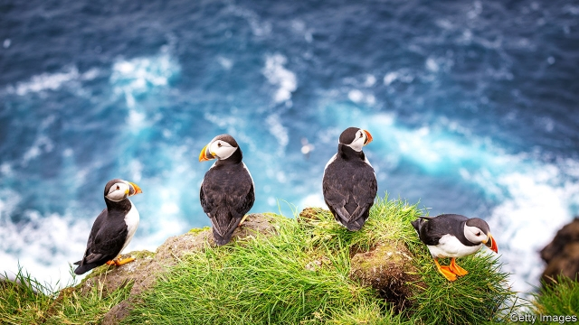
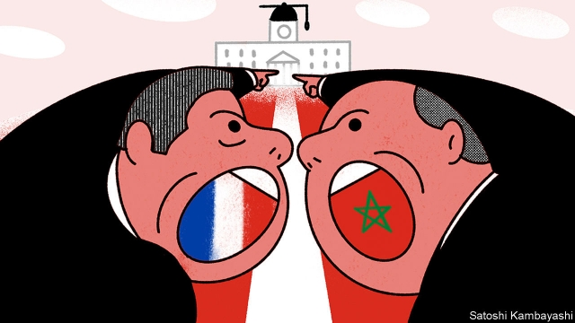

###### On Hungary, the great auk, Brexit, Hong Kong, language, conservatism

# Letters to the editor 

> Sep 7th 2019 

The achievements of Viktor Orban, Hungary’s prime minister, “are bad for Hungarian liberty”, you say in your briefing (“The entanglement of powers”, August 31st). In fact, the opposite is true. The past nine years of the Orban governments have been good for the country. GDP growth is one of the best in the European Union and our unemployment rate has hit all-time lows. Debt-to-GDP is down and deficits remain well below 3%. Investment is up, interest rates down and real wages are growing. The number of marriages has increased by 43% and divorces have fallen. The employment rate of women has reached an all-time high and abortions have dropped by nearly a third. Those are not the numbers of a “hollowed-out” democracy, but point to the optimism and confidence of a free people. 

Moreover, we did not build “a fence to keep out Middle Eastern refugees”. The fence was built as a barrier to prevent illegal entries into the EU’s visa-free Schengen area, with which Hungary met its Schengen treaty obligations to secure the EU’s external border. Most of those attempting to cross illegally were not refugees. 

And, yes, the governing parties have won three straight parliamentary elections, and many other electoral contests, with big margins. This has given us the democratic mandate to pursue these policies. Hungary’s free and vociferous press do a much better job than The Economist at asking why the opposition continues to fail to win over voters. 

You, along with many of our critics, have a hard time with Prime Minister Orban’s unapologetic defence of the Christian cultural identity of Europe. But the fact is, as the prime minister said in a speech in July, “liberal democracy was capable of surviving until it abandoned its Christian foundations.” Illiberal democracy, he said, “is Christian liberty and the protection of Christian liberty.” In our view, illiberalism is about putting the common good first. An illiberal is one who protects the country’s borders, who protects the nation’s culture. 

ZOLTAN KOVACSState secretary for international communications and relationsCabinet Office of the Prime MinisterBudapest 

 

You reported on the conservation efforts to protect the puffins of the Faroe Islands (“Well worth saving”, August 10th). This is not the first time the Faroes have witnessed a survival drama between hunters and seabirds. The islands were one of the last redoubts of the puffin’s larger cousin, the great auk (Pinguinus impennis). An iconic three-foot-tall flightless bird with a close resemblance to a penguin, it was one of the greatest examples of convergent evolution. Sadly the last pair were killed in 1844 so that their egg could be sold at auction in London. 

EDEN COTTEE-JONESLondon 

 

One solution to the conundrum surrounding the “backstop” in the Brexit withdrawal agreement (“Who’s gonna stop no-deal?”, August 31st) is to create an all-Ireland No-Custom Area, which would qualify as a Frontier Traffic area under Article 24 of the GATT/WTO. This would entail the free circulation within Ireland only of products originating in either part of the island, trade which represents the majority of intra-Ireland trade. Products originating from the rest of the European Union and directed to Northern Ireland (or the rest of the United Kingdom), or vice versa, would not benefit from this “passporting”. 

The issue is one of controlling circumvention and fraud. This can be done by appropriate controls not at the border but before products reach their destination, through labelling, marks of origins and so on, backed by adequate sanctions. In this way both the freedom of the UK to establish its own custom and regulatory regime for all its territory, including Northern Ireland, and the absence of an intra-Ireland border would be preserved. The establishment of such an area and its principles could be immediately agreed in an additional protocol to the withdrawal agreement before October 31st, to be completed during the transition period. 

PROF. GIORGIO SACERDOTIFormer member of the Appellate Body of the WTOMilan 

 

The row over reintroducing French as a language of instruction in Moroccan schools (“Quel est le problème?”, August 17th) reminds me of the mother-tongue teaching policy in Hong Kong, which was introduced when China took control of the city in 1997. For many pupils, this means learning in Cantonese Chinese. In a place where both English and Chinese are the official languages, the dismal reality is that many local graduates leave school with subpar English proficiency. Indeed, Hong Kong is consistently outranked by Singapore and Shanghai in the EF English Proficiency Index, blemishing Hong Kong’s reputation as an international commercial hub. In an interconnected world, not all languages are equally prominent, particularly in business and diplomacy. Re-establishing cultural identity can be achieved without undermining efforts to keep up with the tide of globalisation. 

JUSTIN BONG-KWANHong Kong 

 

You rightly questioned the right not to be offended (“Speak up”, August 17th). One of the foremost experts on offensive language was the late Reinhold Aman, the publisher of Maledicta, “an international journal of verbal aggression”. Aman argued that an agitated person can be compared to an overflowing steam boiler. The use of invective, in his view, serves as a relief valve that restores emotional and physical balance. 

CHRISTOPHER STEHBERGERTraunstein, Germany 

 

Bagehot submits that Margaret Thatcher’s famous quote, “There is no such thing as society”, is a “sin” against Burkean conservatism (August 3rd). But in that interview for Woman’s Own in 1987, Thatcher went on to say that we are a “living tapestry” of people, who by “our own efforts” help those who are unfortunate. In her autobiography she gave this clarification: “It’s our duty to look after ourselves and then to look after our neighbour.” Her point was that society is not abstract; if everyone thinks that others are responsible for looking after the vulnerable, then nothing will be done for them. Individuals have primacy in Thatcherism, but they do have social duties. Edmund Burke would agree. 

WILLIAM PEDENAncona, Italy 

Bagehot might review The Economist’s recent coverage of Boris Johnson, which aptly describes him as more Rabelaisian harlequin than “Rousseauan” ideologue. 

TRAVIS WHITE-SCHWOCHChicago 

My greatest joy as an American reading your publication is to become acquainted with British slang. Bagehot lamented the “berks” who now control the Tory party. Upon looking up the etymology of this particular lingo, I was not disappointed. I recommend your other readers give it a whirl. 

JED CRUMBONashville, Tennessee 

