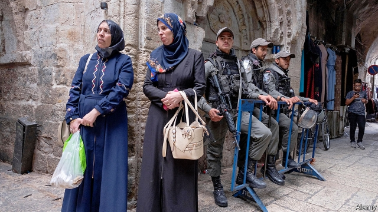

###### The other Israelis

# Israel’s Arab citizens could hold the key to political change 

 

> print-edition iconPrint edition | Middle East and Africa | Sep 7th 2019 

IT IS EASY to spot the Jewish and Arab neighbourhoods in Ramle, one of Israel’s few “mixed” cities. The Jewish ones consist mainly of tall, fairly new apartment buildings, with neat pavements. Arab areas, clustered around the city’s old centre, are haphazard and dilapidated. Naif Abu-Swiss, an independent city councillor, insists that things are changing. After being elected last year, he joined the municipal ruling coalition, headed by a mayor from the right-wing Likud party, and has been put in charge of urban renewal. 

“A Likudnik mayor is best for us,” says Mr Abu-Swiss. “He’s close to the government and gets funds for Ramle. He’s not prejudiced and is investing in planning and renewal in the Arab neighbourhoods.” Even so, the councillor hopes the long-serving Likud prime minister, Binyamin Netanyahu, loses the parliamentary election on September 17th, Israel’s second this year (Mr Netanyahu failed to form a coalition after the first, in April). “He needs to be replaced, so Israel won’t be like an Arab dictatorship,” says Mr Abu-Swiss. Arab voters could be key to turfing him out. 

Mr Abu-Swiss, a property developer, is one of a new wave of Arab-Israeli politicians who advocate a change of political strategy for Israel’s main minority. A fifth of Israeli citizens are Arabs. They have had the right to vote in every Israeli election since the country was founded in 1948. But their main parties have never joined a national coalition government. This is partly because of the ruling parties’ refusal to include them, but it also reflects the reluctance of Arab politicians themselves. Joining an Israeli government, many have argued, would make them complicit in mistreatment of their fellow Arabs. 

In recent years, though, a big shift has been under way. In a poll in March, 87% of Israeli Arabs said they would like to see an Arab party join the ruling coalition. The same poll found that those who considered themselves “Arab-Israeli” outnumbered those who preferred to identify themselves as “Palestinian” or “Palestinian-Israeli”. 

Though the broader Israeli-Palestinian conflict is far from being solved, Israel’s Palestinian citizens (unlike their brothers living without political rights under military occupation in the West Bank) have more to gain from integration. And though inequality and discrimination are still part of their daily lives, some advances have occurred. The improvement in education and health has been dramatic. Arab citizens have almost closed the gap with Jews in life expectancy and years of schooling, though they are a lot less rich. Israeli Jews on average earn over 50% more than Arabs. Half of Arab families fall below Israel’s official poverty line. 

In 2015 the Likud government passed a five-year plan to spend an extra 15bn shekels ($4.25bn) in ways that might help Arabs. This was meant mainly to help Arab local authorities which were planning new neighbourhoods and industrial zones in their jurisdiction and to improve education and job prospects. Arab politicians grumble that these projects are happening too slowly, but admit that the money is making a difference. 

The political climate matters, too, however. “It’s like eating in a fine restaurant, where the waitress says: ‘I hope you choke on your food,’” says Issawi Frej, an Arab member of parliament. “Netanyahu is correct when he says that under his government more money than ever went to the Arab community. But it was also a period of peak incitement against Arab citizens.” Mr Netanyahu has periodically accused Arab citizens of lawlessness and disloyalty. On election day in 2015 he warned that “Arab voters are moving in droves to the polling stations.” In 2018 he pushed through a “nation state law” declaring that Israel is the exclusive homeland of the Jewish people and downgrading Arabic from the status of an official national language. 

Despite this, Mr Frej, a member of a predominantly Jewish left-wing party, Meretz, insists that “to serve the interests of the Arab community, we need to be in coalitions and government. I’m prepared to sit with anyone, except outright racists, to achieve that.” However, Mr Netanyahu’s propaganda works. Even Benny Gantz, leader of Blue and White, the main opposition party, will not say in public that he is prepared to include Arab parties in his coalition if he wins. 

“How can we endorse as prime minister someone who won’t even talk to us?” asks Ayman Odeh, Israel’s most prominent Arab politician and leader of the Joint List, an electoral alliance of four Arab parties. Nonetheless, in an interview less than four weeks before the election, Mr Odeh said he would be prepared under certain conditions to join a government under Mr Gantz. That suggestion did not go down well. Blue and White, anxious not to anger its Jewish voters, gave Mr Odeh the cold shoulder. Some of his more nationalist Arab colleagues huffily insisted that he was speaking only for himself. 

In this year’s first election in April the turnout of Arab voters plunged to 49%, from 64% in 2015. This has been ascribed partly to a feeling among Arabs that their votes have no influence, partly to Arab politicians’ focus on nationalist issues at the expense of their constituents’ domestic concerns, and partly to Jewish hostility. Attitudes on the Arab side are beginning to change. But the Jewish side, including most of the centre-left opposition, is still loth to accept Arabs as equal citizens. ■ 

