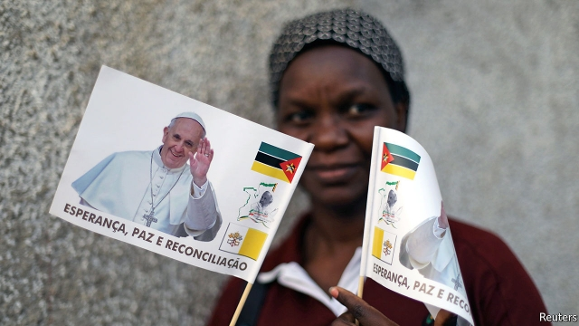
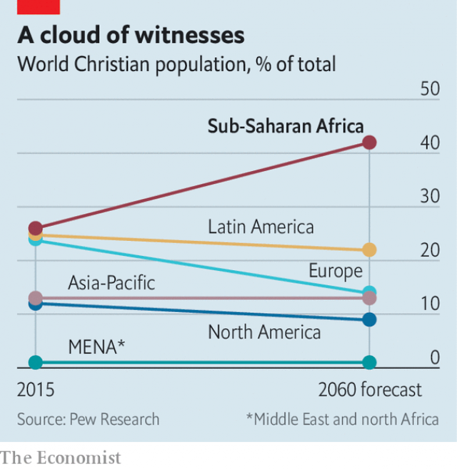

###### Stony ground

# Why Pope Francis struggles in Africa 

 

> print-edition iconPrint edition | Middle East and Africa | Sep 7th 2019 

A  YEAR AGO President Filipe Nyusi of Mozambique went to the Vatican and announced triumphantly that he had persuaded the pope to visit his country. Pope Francis retorted that he would make the trip in 2019—if he was still alive. This week the 82-year-old pontiff is keeping that promise, making only his second trip to sub-Saharan Africa, which is by far the biggest area of expansion for Christianity. His tour also takes in Madagascar and Mauritius. 

In some ways the itinerary is apt. In Mozambique alone he can see many of the woes that afflict his burgeoning flock across Africa: terrorism, interfaith conflict, environmental harm and the spectre of state failure. Madagascar, a fragile store of biodiversity, is similarly afflicted by poverty and rapid deforestation, which reduces nature’s resilience against disasters, such as the cyclones that swept the region last spring. Around 2m poor Mozambicans were hit by storms and floods. 

With the locus of Christianity moving southward, this troubled continent represents the faith’s greatest hope. According to Pew, an American research institute, the share of the world’s Christians who live in sub-Saharan Africa will surge to 42% by 2060, up from 26% in 2015 (see chart). Without that demography-fuelled expansion in Africa, Christianity would be destined to fall rather swiftly behind Islam as the world’s most popular faith. Pew predicts that by 2060 Muslim numbers will be 70% above 2015 levels, whereas the Christian flock will have risen by just 34%. As a net result, Pew reckons, Christians will make up 32% of the world’s population and Muslims just one percentage point less. 

 

But Africa also presents pastoral problems that seem at times beyond the reach of any religious leader, no matter how charismatic. Nor does Francis, despite his compassion for African migrants to the rich world, find the African church easy to navigate, given the doctrinal conservatism of its leaders. 

In Mozambique’s northern tip, a radical Islamist movement has claimed hundreds of lives, prompting at least one Catholic bishop to excoriate the government for failing to provide protection. Elsewhere, too, the country looks fragile. Only last month the government signed a final peace accord with the guerrillas of Renamo, its enemy in a bloody civil war that supposedly ended in 1992. Some parts of Renamo have rejected the deal, which requires fighters to disarm and co-operate in elections in October. An independent Catholic peacemaking agency, the Sant’Egidio community, has been deeply involved in mediation in Mozambique, and Francis will add his weight to the cause of reconciliation with Renamo veterans. 

Christian-Muslim conflict is also sputtering across west Africa and would now make any papal visit there a logistical and security challenge. In Nigeria Christians say they are at ever-increasing risk both from the Boko Haram terrorist group, part of which is aligned with the jihadists of Islamic State, and from Muslim Fulani herdsmen who have attacked crop-growing farmers. At least three Catholic priests have been killed this year. 

Francis has always stressed the primacy of economic factors in fuelling conflict, and he has refused to engage in Christian-Muslim name-calling. That marks a contrast with his predecessor, Benedict, who provoked a storm in 2006 with a speech that unintentionally seemed to link Islam with a propensity for violence. As Jimmy Burns, a biographer of the current pope, puts it: “Francis is convinced that environmental damage, inequality and competition for resources are the factors behind religious fundamentalism of any kind.” In recent days Francis seemed to confirm his doveish credentials in matters of Christian-Muslim relations by giving a cardinal’s hat to Archbishop Michael Fitzgerald, a British expert on Islam who had been demoted by Benedict, apparently for being too emollient. 

Arguments based on economics as a cause of interfaith conflict may resonate in academia but some Catholic leaders from Africa are pressing Francis to serve up stronger doctrinal medicine. Among the most powerful of African-born prelates is Cardinal Robert Sarah, who grew up in Guinea under a harsh Marxist dictatorship and developed a strong antipathy to left-wing authoritarianism. 

Cardinal Sarah has endeared himself to conservative critics of Francis by describing Islamist terrorism and liberal ideas about reproduction and sexuality as co-equal threats to the integrity of the Catholic faith. “What Nazism [and] fascism and communism were to the 20th century, Western ideologies on homosexuality and abortion and Islamic fanaticism are today,” he declared in 2015. Cardinal Sarah, who is responsible for worship and liturgy at the Holy See, is more or less loyal to Francis, but many traditionalists hope he will be the next pontiff. An African candidate more in line with Francis’s thinking would be Cardinal Peter Turkson of Ghana, the Vatican’s point-man on development. 

Even leaving aside the sensitive ideological questions that divide conservatives from relative liberals like Francis, the sheer size of the African Catholic church makes it difficult for anyone to control. Take a recent clerical dispute in Nigeria. Francis tried in 2017 to use the might of his office to force priests in the diocese of Ahiara to submit to a bishop who was not a member of their cultural and linguistic group. The clerics were told to write personal letters of apology for their reluctance to accept the unpopular prelate. Some letters were penned, but the Vatican blinked first: the bishop stepped aside. 

Elizabeth Foster of Tufts University, who has just written a book called “African Catholic”, says today’s lively, stubborn church is in some measure a by-product of French colonial policies. During the final decade or so of colonial rule, the French state overcame its secular principles and helped the church in a burst of missionary zeal, building schools and dispensaries which spread the faith. This produced a generation of well-educated and articulate Francophone clerics, but they did not always take the line that was expected by the church or state in Paris. 

Little wonder that Francis finds Africa uncomfortable. But his successor, whoever he is, will at the very least have to focus more on it. He may even be African.■ 

-- 

 单词注释:

1.pope[pәup]:n. 罗马教皇, 主教 

2.franci[]:[网络] 弗朗西；法赛纳；法奇 

3.Sep[]:九月 

4.filipe[]:n. (Filipe)人名；(斐、葡)菲利佩 

5.Mozambique[.mәuzәm'bi:k]:n. 莫桑比克 

6.Vatican['vætikәn]:n. 梵蒂冈, 罗马教廷 [法] 梵蒂冈, 罗马教廷 

7.triumphantly[traɪ'ʌmfəntlɪ]:adv. 耀武扬威地, 得意扬扬地; 胜利 

8.pope[pәup]:n. 罗马教皇, 主教 

9.retort[ri'tɒ:t]:n. 反驳, 顶嘴, 蒸馏器, 曲颈甑 vi. 反驳, 回嘴, 反击 vt. 反击, 反驳, 蒸馏 

10.pontiff['pɒntif]:n. 教皇, 主教, 大祭司 

11.Christianity[.kristʃi'æniti]:n. 基督教, 基督教精神 

12.Madagascar[mædә'^æskә]:n. 马达加斯加岛 

13.Mauritius[mɒ:'riʃiәs]:n. 毛里求斯 

14.itinerary[ai'tinәrәri]:n. 旅程, 旅行指南, 游记 a. 巡回的, 旅程的 

15.apt[æpt]:a. 有...倾向的, 易于的, 恰当的, 聪明的 [计] 自动数控语言, 自动图象传输, 自动程序控制, 自动程序设计工具 

16.woe[wәu]:n. 悲哀, 悲痛, 苦痛 

17.afflict[ә'flikt]:vt. 使苦恼, 折磨 

18.burgeoning[]:[计] 急速增长的 

19.terrorism['terәrizm]:n. 恐怖主义, 恐怖统治, 恐怖状态 [法] 胁迫, 暴政, 恐怖政治 

20.interfaith['intә(:),feiθ]:a. 不同宗教信仰者(间)的,不同宗教团体(间)的 

21.environmental[in.vaiәrәn'mentәl]:a. 周围的, 环境的 [经] 环境的, 环保的 

22.spectre['spektә]:n. 幽灵, 妖怪, 凶兆 

23.biodiversity[]:n. 生物多样性 

24.deforestation[di:.fɒ:ri'steiʃәn]:n. 采伐森林, 森林开伐 [法] 砍伐森森 

25.resilience[ri'ziliәns]:n. 弹回, 有弹力, 恢复力 [化] 回弹; 弹性; 弹回性; 回能; 弹能 

26.cyclone['saiklәun]:n. 龙卷风, 暴风 [化] 旋流(分离,除尘)器 

27.Mozambican[,məuzəm'bi:kən]:a. 莫桑比克的；莫桑比克人的 

28.locus['lәukәs]:n. 轨迹；地点, 所在地 

29.southward['sauθwәd]:n. 朝南的方向(或地点、地区) a. 在南方的, 往南方的 adv. 往南 

30.pew[pju:]:n. 教堂长椅, 会众, 座位 vt. 为(教堂)安装座位, 把...围在一起 

31.surge[sә:dʒ]:n. 巨涌, 汹涌, 澎湃 vi. 汹涌, 澎湃, 颠簸, 猛冲, 突然放松 vt. 使汹涌奔腾, 急放 [计] 电压尖峰 

32.destine['destin]:vt. 注定, 预定 

33.swiftly['swiftli]:adv. 很快地, 即刻 

34.Islam['izlɑ:m]:n. 伊斯兰教 

35.Muslim['mjzlim; (?@) 'mʌzlem]:n. 伊斯兰教, 伊斯兰教教徒 

36.reckon['rekәn]:vt. 计算, 总计, 估计, 认为, 猜想 vi. 数, 计算, 估计, 依赖, 料想 

37.Muslim['mjzlim; (?@) 'mʌzlem]:n. 伊斯兰教, 伊斯兰教教徒 

38.les[lei]:abbr. 发射脱离系统（Launch Escape System） 

39.pastoral['pæstәrәl]:n. 牧歌, 田园诗 a. 牧人的, 田园生活的, 牧师的, 田园式的 

40.charismatic[,kæriz'mætik]:a. 魅力, 能吸引大众的非凡能力, 神授的能力, 领袖人物感人的超凡魅力 

41.compassion[kәm'pæʃәn]:n. 同情, 怜悯 

42.migrant['maigrәnt]:n. 候鸟, 移居者 [法] 移居者 

43.navigate['nævigeit]:vi. 航行 vt. 航行于, 驾驶, 操纵, 使通过 

44.doctrinal['dɒktrinәl]:a. 教义的, 教诲的, 学说的 

45.conservatism[kәn'sә:vәtizәm]:n. 保守, 守旧性, 保守主义, [the]保守党的主张和政策, 保守党 [医] 保守性 

46.Islamist[iz'lɑ:mist]:n. 伊斯兰教主义者；回教教徒 

47.excoriate[ek'skɒ:rieit]:vt. 剥皮, 擦破皮肤, 严厉的责难 

48.guerrilla[gә'rilә]:n. 游击队 

49.renamo[]:[网络] 莫桑比克全国抵抗运动；莫桑比克全国抵抗组织；莫桑比克民族抵抗运动 

50.bloody['blʌdi]:a. 血腥的, 嗜杀的, 有血的 

51.supposedly[sә'pәuzidli]:adv. 想象上, 看上去像, 被认为是, 恐怕, 按照推测 

52.disarm[dis'ɑ:m]:vt. 解除武装, 裁军, 缓和 vi. 放下武器 

53.mediation[.mi:di'eiʃәn]:n. 调停, 调解, 中介 [医] 间介[作用], 居间[作用] 

54.reconciliation[,rekәnsili'eiʃәn]:n. 和解, 和好, 复交, 调解, 调停, 和谐, 一致, 甘愿, 顺从 [经] (银行往来)调节, 调和, 一致 

55.sputter['spʌtә]:n. 喷溅声, 劈啪声, 语无伦次 vi. 唾沫飞溅, 结结巴巴地讲, 发劈啪声 vt. 喷出, 飞溅出, 气急败坏地说 

56.papal['peipl]:a. 罗马教皇的, 教皇制度的 

57.logistical[ lə'dʒɪstɪkl]:a. 逻辑的; 后勤方面的 

58.Nigeria[nai'dʒiriә]:n. 尼日利亚 

59.boko['bәukәu]:n. <英俚>鼻子 

60.haram['heәrәm]:n. (=harem)(伊斯兰教徒)女眷居住的内室,闺房, (伊斯兰教徒的)女眷,共配一雄的一群雌性动物 

61.terrorist['terәrist]:n. 恐怖分子 [法] 恐怖份子, 恐怖主义 

62.align[ә'lain]:vi. 排列, 排成一行, 结盟 vt. 使结盟, 使成一行, 校正 

63.jihadist[]:n. 伊斯兰圣战士 

64.Islamic[iz'læmik]:a. 伊斯兰教的, 穆斯林的 

65.Fulani['fu:lɑ:ni]:富拉尼人(即富尔贝人) 

66.herdsman['hә:dzmәn]:n. 牧人, 牧主 

67.alway['ɔ:lwei]:adv. 永远；总是（等于always） 

68.primacy['praimәsi]:n. 第一, 首位, 卓越 

69.predecessor[.predi'sesә]:n. 前任, 先辈, 前身 [医] 初牙, 前辈, 祖先 

70.benedict['benidikt]:n. 新婚男人 

71.provoke[prә'vәuk]:vt. 激怒, 惹起, 诱导 [法] 刺激, 煽动, 激怒 

72.unintentionally[ˌʌnɪn'tenʃənəlɪ]:adv. 非故意地, 非存心地; 无意之中 

73.propensity[prә'pensәti]:n. 倾向, 爱好, 习性 

74.jimmy['dʒimi]:n. 铁撬 vt. 撬 

75.biographer[bai'ɒgrәfә]:n. 传记作者 

76.inequality[.ini'kwɒliti]:n. 不平等, 不同, 不平坦, 不平均 n. 不平等, 不等式 [计] 不等式 

77.fundamentalism[.fʌndә'mentәlizm]:n. 基要主义 

78.doveish[]:[网络] 鸽子 

79.credential[kri'denʃәl]:n. 国书, 凭据, 证明书 [经] 凭证, 证书 

80.archbishop['ɑ:tʃ'biʃәp]:n. 大主教 

81.michael['maikl]:n. 迈克尔（男子名） 

82.fitzgerald[fits'dʒerәld]:n. 菲茨杰拉德（姓氏）；菲茨杰拉德（英国诗人、翻译家, 爱德华·菲茨杰拉德）；菲茨杰拉德（美国作家, 弗·司各特·菲茨杰拉德） 

83.demote[.di:'mәut]:vt. 使降级, 使降职 

84.apparently[ә'pærәntli]:adv. 表面上, 清楚地, 显然地 

85.emollient[i'mɒliәnt]:a. 使柔软的 n. 软化剂, 润肤剂 

86.resonate['rezәneit]:v. (使)共鸣, (使)共振 

87.academia[.ækә'di:miә]:n. 学术界, 学术生涯 

88.prelate['prelit]:n. 高级教士 

89.cardinal['kɑ:dinәl]:n. 红衣主教, 鲜红色 a. 主要的, 深红色的 

90.Robert['rɔbәt]:[法] 警察 

91.Sarah['sєәrә]:n. 萨拉(<<圣经>>故事人物) 

92.guinea['gini]:n. 几内亚 

93.dictatorship[dik'teitәʃip]:n. 独裁者之职位, 独裁, 独裁政权 [法] 专攻, 独裁权 

94.antipathy[æn'tipәθi]:n. 厌恶, 反感 [医] 反感, 厌恶; 相克疗法 

95.authoritarianism[ə,θɔrə'tɛrɪənɪzəm]:n. 独裁主义；权力主义 

96.endear[in'diә]:vt. 使受喜爱, 使受钟爱 

97.reproduction[.ri:prә'dʌkʃәn]:n. 再现, 复制, 生殖, 繁殖, 复制品 [医] 生殖, 复现(心理) 

98.sexuality[.sekʃu'æliti]:n. 性征, 性行为, 性欲 [医] 性别, 性欲 

99.integrity[in'tegriti]:n. 正直, 廉正, 完整 [计] 完整性 

100.Nazism['nɑ:tsizәm, 'næt-]:n. 纳粹主义 

101.fascism['fæʃizm]:n. 法西斯主义, 极端国家主义 

102.ideology[.aidi'ɒlәdʒi]:n. 思想体系, 意识形态, 观念学, 空论 [医] 观念学, 观念形态 

103.homosexuality[-'æliti]:n. 同性恋 [医] 同性性欲, 同性恋爱 

104.fanaticism[fә'nætisizm]:n. 狂热, 入迷 

105.liturgy['litәdʒi]:n. 礼拜仪式, 祷告文, 圣餐仪式 

106.traditionalist[]:n. 传统主义者, 因循守旧者 

107.peter['pi:tә]:vi. 逐渐消失, 逐渐减少 

108.Ghana['gɑ:nә]:n. 加纳 

109.ideological[.aidiә'lɒdʒikәl]:a. 意识形态的, 空想的 [法] 思想的, 思想上的, 意识形态的 

110.sheer[ʃiә]:a. 绝对的, 全然的, 纯粹的, 透明的, 峻峭的 vi. 偏转, 偏航 vt. 使急转向, 使偏航 adv. 完全, 全然, 峻峭 n. 偏航 

111.clerical['klerikәl]:n. 牧师 a. 文书的, 事务上的, 抄写员的, 牧师的 

112.diocese['daiәsis]:n. 主教教区 

113.cultural['kʌltʃәrәl]:a. 文化的, 教养的, 修养的 [医] 培养的 

114.linguistic[liŋ'^wistik]:a. 语言的, 语言学的 [计] 语言的, 语言学的 

115.cleric['klerik]:a. 牧师的, 教士的 

116.reluctance[ri'lʌktәns]:n. 不情愿, 勉强 [电] 磁阻 

117.unpopular['ʌn'pɔpjulә]:a. 不得人心的, 不受欢迎的, 不流行的 

118.blink[bliŋk]:vi. 眨眼, 闪亮 vt. 眨眼, 使闪亮 n. 眨眼, 瞬间, 闪光, 闪烁 [计] 闪烁 

119.elizabeth[i'lizәbәθ]:n. 伊丽莎白（女子名） 

120.foster['fɒstә]:a. 收养的, 养育的 vt. 养育, 抚育, 培养, 鼓励, 抱(希望) 

121.tuft[tʌft]:n. 一簇, 矮树丛 vi. 丛生 vt. 用丛毛装饰 

122.colonial[kә'lәunjәl]:a. 殖民的, 殖民地的 [法] 殖民地居民 

123.secular['sekjulә]:n. 修道院外的教士 a. 世俗的, 现世的, 长期的 

124.missionary['miʃәnәri]:n. 传教士, 负有任务者, 工作人员 a. 传教的, 传教士的 

125.dispensary[dis'pensәri]:n. (尤指医院的)药房, 诊疗所 [医] 医务所, 防治所, 药房 

126.articulate[ɑ:'tikjulit]:a. 发音清晰的, 口才好的 vt. 明白地说, 以关节连接, 使成为系统的整体 

127.francophone['fræŋkәufәun]:n. (尤指在使用两种或多种语言国度里的)操法语者,讲法语的(当地)人 

128.successor[sәk'sesә]:n. 继承者, 接任者 [计] 后继 

