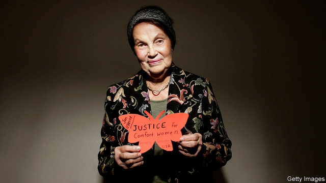

###### Cries from a handkerchief

# Obituary: Jan Ruff O’Herne died on August 19th 

 

> print-edition iconPrint edition | Obituary | Sep 7th 2019 

ALL SORTS OF objects lay in Jan Ruff O’Herne’s dressing table drawer. A necklace of dark amber beads. Silver work from Java where she had been brought up, the daughter of Dutch colonialists. A belt embroidered with tulips from the country she had never seen until after the war. Costume jewellery, gloves, lotions and potions. Her daughters Eileen and Carol loved to riffle through the drawer as children, and she gladly let them. The things often summoned up her Java stories of gamelans, sate-sellers, cicadas and warm rain. But when one day they found the embroidered white handkerchief folded at the bottom she snatched it away. 

That was a rare moment, in 50 years of silence, when her secret was almost out. Other things she could disguise as phobias. Her unease when night fell, and she had to draw the living-room curtains. Her terror of going to doctors, even when she was quite ill. And, perhaps hardest to explain, her dislike of flowers. On her birthday she would beg friends and family not to give her any. They were such a waste of money, so soon over. 

But this was not the reason. Flowers reminded her of the day in 1944, in a rambling house in Semarang, when she and six other Dutch-Indonesian girls realised that the place they had been abducted to was a Japanese military brothel. The Japanese had invaded Indonesia two years before, driving all the Dutch settlers into labour camps where they were kept in squalor, close to starvation. But this degradation was new. She and her companions, all virgins, so innocent, had been plucked from their camp to service queues of impatient army officers. To aid selection in the brothel, the names of flowers were pinned to their bedroom doors. She was also given a vase of white orchids which, in fear and disgust, she threw away. Ever after, she hated to be given flowers. 

As night fell, the first officer came to her room. He was bald, fat and repulsively ugly. When she wept, screamed and kicked him, crying “Don’t!” in all the languages she knew, he simply laughed. Then he unsheathed his sword. As she huddled and prayed, expecting to be killed at any moment, he let the sword-tip wander over her body, up and down, up and down, before ripping off what was left of her clothes and raping her. 

She never imagined suffering like this. It seemed he would never stop. But physical hurt was only part of it. Far worse was the shame. She could not have helped it, he was too heavy. But her pure young body, the body she had been planning to dedicate to Christ as a Catholic nun, had been destroyed. Her dignity and self-esteem were lost. In the bathroom afterwards, with the other sobbing and destroyed girls, she tried to wash off the soiling, but it stayed. Desperate, the girls tried to hide in the garden, but they were dragged out to be raped by more officers. It might have been ten times that night, and the next night, for three months. The brothel doctor raped them, too. Ever after, she feared both doctors and the dark. 

Yet she also feared the light. It was too hard to reveal this. She buried it deep in shame, and so did those closest to her. When she was reunited with her mother in the labour camp, lying tearful with relief in the hollow of her arms, and her mother stroked her bald head, bald because she had cut off her hair in a bid to make the officers avoid her, she briefly told her. Her mother could not cope with it, and they said nothing more. She told a priest, since she still hoped to be a nun, but he deflected her as something sullied. When she met Tom Ruff, the British soldier who became her husband, she spoke of it once, then never again. She longed to scream out the details of what had been done to her, but instead she was expected to get on with life as though nothing had. 

In a way, she succeeded. She and Tom married and moved happily to Adelaide. She did not want sex, but bore it, and after surgery to mend her she had her daughters. Their house was full of music, and she sang in choirs. When Tom became an invalid, her faith helped her bear that. Outwardly she was smiling and serene. Inside was another story. All kinds of things reminded her, but especially the handkerchief in the drawer. A woman at the camp had passed it to her as she left for Semarang, and on the veranda of the brothel one evening, as they waited for that dreaded dark, she had asked the six other girls to sign it. Miep, Gerda, Els, Annie, Betty and Lies had written their names in pencil and she had sewn over them. Sometimes she would hold it to her face and cry. 

Then in 1992, when she was almost 70, God suddenly set her life-task before her. Three elderly Korean war-rape victims spoke out on television and inspired her to do the same. If she backed them up, adding her European voice to theirs, they might together get Japan’s attention. The only hard part of her decision was that she had to tell her daughters the secret first. She could not do so face to face. Instead she wrote two copies of what she called “Cry of the Raped”, stuffed them into envelopes and left them to be read. But the deed was done. She could let her awful secret out to the world now, not as a “comfort woman”—how she hated that insulting, cuddly name—not as an angry victim seeking revenge, but as a calmly spoken witness who wanted Japan to admit what its soldiers had done to perhaps 200,000 women like herself. 

Released and relieved, she addressed a war-crimes hearing in Tokyo, gave testimony to Congress and, whenever victims gathered, hugged and encouraged them. They won some compensation, though she herself would not accept it, since Japan’s right-wing government still refused to make a full apology. Now that the story was out, the case for one was overwhelming. 

Time and again she thought of the passage from Ephesians 5 which Sister Xavier had made her learn at school, when she had tried to cheat in an exam: “The things which are done in secret are things that people are ashamed even to speak of; but anything exposed by the light will be illuminated, and anything illuminated turns into light.” So it had proved. And the white handkerchief, too, had left the darkness of the drawer. She had given it to the Australian War Memorial, where it stood on display and shone: seven testifying, suffering names to speak for all the others. ■ 

