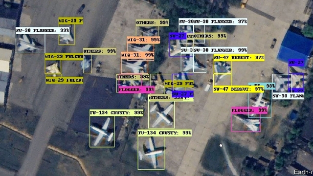
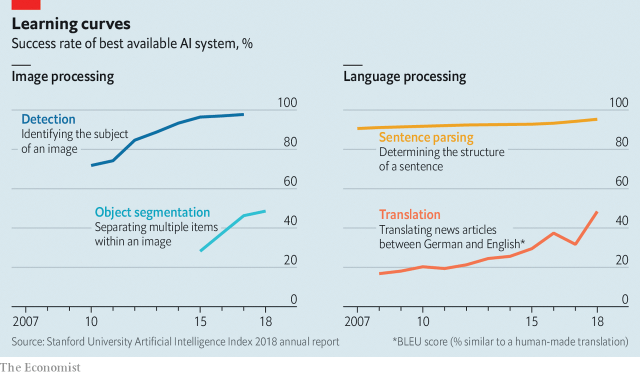
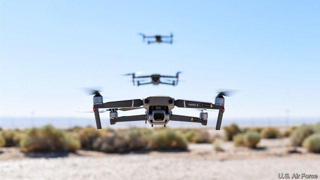

###### Battle algorithm

# Artificial intelligence is changing every aspect of war 

 

> print-edition iconPrint edition | Science and technology | Sep 7th 2019 

AS THE NAVY plane swooped low over the jungle, it dropped a bundle of devices into the canopy below. Some were microphones, listening for guerrilla footsteps or truck ignitions. Others were seismic detectors, attuned to minute vibrations in the ground. Strangest of all were the olfactory sensors, sniffing out ammonia in human urine. Tens of thousands of these electronic organs beamed their data to drones and on to computers. In minutes, warplanes would be on their way to carpet-bomb the algorithmically-ordained grid square. Operation Igloo White was the future of war—in 1970. 

America’s effort to cut the Ho Chi Minh trail running from Laos into Vietnam was not a success. It cost around $1bn a year (about $7.3bn in today’s dollars)—$100,000 ($730,000 today) for every truck destroyed—and did not stop infiltration. But the allure of semi-automated war never faded. The idea of collecting data from sensors, processing them with algorithms fuelled by ever-more processing power and acting on the output more quickly than the enemy lies at the heart of military thinking across the world’s biggest powers. And today that is being supercharged by new developments in artificial intelligence (AI). 

AI is “poised to change the character of the future battlefield”, declared America’s Department of Defence in its first AI strategy document, in February. A Joint Artificial Intelligence Centre (JAIC) was launched in the Pentagon in summer 2018, and a National Security Commission on Artificial Intelligence met for the first time in March. The Pentagon’s budget for 2020 has lavished almost $1bn on AI and over four times as much on unmanned and autonomous capabilities that rely on it. 

A similar flurry of activity is under way in China, which wants to lead the world in AI by 2030 (by what measure is unclear), and in Russia, where President Vladimir Putin famously predicted that “whoever becomes the leader in this sphere will become the ruler of the world”. But the paradox is that AI might at once penetrate and thicken the fog of war, allowing it to be waged with a speed and complexity that renders it essentially opaque to humans. 

AI is a broad and blurry term, covering a range of techniques from rule-following systems, pioneered in the 1950s, to modern probability-based machine learning, in which computers teach themselves to carry out tasks. Deep learning—a particularly fashionable and potent approach to machine learning, involving many layers of brain-inspired neural networks—has proved highly adept at tasks as diverse as translation, object recognition and game playing (see chart). Michael Horowitz of the University of Pennsylvania compares AI to the internal combustion engine or electricity—an enabling technology with myriad applications. He divides its military applications into three sorts. One is to allow machines to act without human supervision. Another is to process and interpret large volumes of data. A third is aiding, or even conducting, the command and control of war. 

 

Start on the battlefield. The appeal of autonomy is obvious—robots are cheaper, hardier and more expendable than humans. But a machine capable of wandering the battlefield, let alone spilling blood on it, must be intelligent enough to carry that burden—an unintelligent drone will not survive for long in a battle; worse still, an unintelligent gun-toting robot is a war crime waiting to happen. So AI is required to endow machines with the requisite skills. Those include simple ones, like perception and navigation, and higher-order skills, like co-ordination with other agents. 

Intelligent machines that combine these abilities can do things that individual humans cannot. “Already, an AI system can outperform an experienced military pilot in simulated air-to-air combat,” notes Kenneth Payne of King’s College London. In February, the Defence Advanced Research Projects Agency (DARPA), the Pentagon’s blue-sky-thinking branch, conducted the latest test of a six-strong drone swarm capable of collaborating in a “high-threat” environment, even when cut off from human contact. 

For all that, most such systems embody intelligence that is narrow and brittle—good at one task in a well-defined environment, but liable to fail badly in unfamiliar settings. So existing autonomous weapons are comprised of either loitering missiles that smash into radars or quick-firing guns that defend ships and bases. Useful, but not revolutionary—and neither requires the fancy machine-learning techniques pioneered in recent years. 

It would be a mistake to think that AI is useful only for battlefield drudgery. Robots, killer or otherwise, must act on what they see. But for many military platforms, like spy planes and satellites, the point is to beam back raw data that might be turned into useful intelligence. There is now more of that than ever before—in 2011 alone, the most recent year for which there are data, America’s 11,000-or-so drones sent back over 327,000 hours (37 years) of footage. 

Most of that has lain unwatched. Luckily, the second major application for AI in the armed forces will be in processing data. In lab-based tests, algorithms surpassed human performance in image classification by 2015 and nearly doubled their performance in a tougher task, object segmentation, which involves picking out multiple objects from single images, between 2015 and 2018, according to Stanford University’s annual index of AI progress. Computer vision is far from perfect and can be exploited in ways that would not fool a human observer. In one study, altering 0.04% of the pixels in an image of a panda—imperceptible to humans—caused the system to see a gibbon instead. 

Those weaknesses notwithstanding, by February 2017 the Pentagon itself concluded that deep-learning algorithms “can perform at near-human levels”. So it established the “Algorithmic Warfare” team, known as Project Maven, which uses deep learning and other techniques to identify objects and suspicious actions, initially in footage from the war against Islamic State and now more widely. The aim is to produce “actionable” intelligence—the sort that often ends with bombs falling or special forces kicking in doors. 

An insider with knowledge of Project Maven says that the benefits to analysts—in terms of time savings and new insights—remain marginal for now. Wide-angle cameras that can see across entire cities throw up large numbers of false positives, for instance. “But the nature of these systems is highly iterative,” he says. Progress is rapid and Project Maven is just the tip of the iceberg. 

Earth-i, a British company, can apply machine-learning algorithms from a range of satellites to identify different variants of military aircraft across dozens of bases with over 98% accuracy (see main picture), according to Sean Corbett, a retired air vice-marshal in the Royal Air Force (RAF) who now works for the firm. “The clever bit”, he says, “is then developing methods to automatically identify what is normal and what is not normal.” By watching bases over time, the software can distinguish routine deployments from irregular movements, alerting analysts to significant changes. 

Algorithms, of course, are omnivorous and can be fed any sort of data, not just images. “Bulk data combined with modern analytics make the modern world transparent,” noted Sir Alex Younger, the head of MI6, Britain’s spy agency, in December. In 2012 leaked documents from the NSA, America’s signals-intelligence agency, described a programme (reassuringly called Skynet), which applied machine learning to Pakistani mobile-phone data in order to pick out individuals who might be couriers for terrorist groups. Who, for instance, had travelled from Lahore to the border town of Peshawar in the past month—and turned off or swapped their handset more often than usual? “It’s beginning to shift intelligence from the old world, where commanders asked a question and intelligence agencies used collection assets to find the answer, to a world where answers are in...the cloud,” says Sir Richard Barrons, a retired general who commanded Britain’s joint forces until 2016. 

Indeed, the data in question need not always come from an enemy. JAIC’s first project was neither a weapon nor a spying tool, but a collaboration with special forces to predict engine failures in their Black Hawk helicopters. The first version of the algorithm was delivered in April. Air-force tests on command-and-control planes and transporters showed that such predictive maintenance could reduce unscheduled work by almost a third, which might allow big cuts in the $78bn that the Pentagon currently spends on maintenance. 

The point of processing information, of course, is to act on it. And the third way AI will change warfare is by seeping into military decision-making from the lowly platoon to national headquarters. Northern Arrow, a tool built by UNIQAI, an Israeli AI firm, is one of many products on the market that helps commanders plan missions by crunching large volumes of data on variables such as enemy positions, weapon ranges, terrain and weather—a process that would normally take 12 to 24 hours for soldiers the old-fashioned way by poring over maps and charts. It is fed with data from books and manuals—say, on tank speeds at different elevations—and also from interviews with experienced commanders. The algorithm then serves up options to harried decision-makers, along with an explanation of why each was chosen. 

These “expert system” platforms, such as Northern Arrow and America’s similar CADET software, can work far quicker than human minds—two minutes for CADET compared with 16 person-hours for humans, in one test—but they tend to employ rule-following techniques that are algorithmically straightforward. By historical standards this would be considered AI, but most use deterministic methods, which means that the same inputs will always produce the same outputs. This would be familiar to the soldiers who used the outputs of ENIAC, the world’s first electronic general-purpose computer, which generated artillery firing tables in 1945. 

In the real world, randomness often gets in the way of making precise predictions, so many modern AI systems combine rule-following with added randomness as a stepping stone to more complex planning. DARPA’s Real-time Adversarial Intelligence and Decision-making (RAID) software aims to predict the goals, movements and even the possible emotions of enemy forces five hours into the future. The system relies on a type of game theory that shrinks down problems into smaller games, reducing the computational power required to solve them. 

In early tests between 2004 and 2008, RAID performed with greater accuracy and speed than human planners. In simulated two-hour battles in Baghdad, human teams were pitted against either RAID or other humans; they could tell them apart less than half the time. The retired colonels drafted to simulate Iraqi insurgents “got so scared” of the software, notes Boris Stilman, one of its designers, that “they stopped talking to each other and used hand signals instead”. RAID is now being developed for army use. 

 

The latest deep-learning systems can be the most enigmatic of all. In March 2016, AlphaGo, a deep-learning algorithm built by DeepMind, beat one of the world’s best players in Go, an ancient Chinese strategy game. In the process it played several highly creative moves that confounded experts. The very next month, China’s Academy of Military Science held a workshop on the implications of the match. “For Chinese military strategists, among the lessons learned from AlphaGo’s victories was the fact that an AI could create tactics and stratagems superior to those of a human player in a game that can be compared to a war-game,” wrote Elsa Kania, an expert on Chinese military innovation. 

In December 2018 another of DeepMind’s programs, AlphaStar, trounced one of the world’s strongest players in StarCraft II, a video game played in real-time, rather than turn-by-turn, with information hidden from players and with many more degrees of freedom (potential moves) than Go. Many officers hope that such game-playing aptitude might eventually translate into a flair for inventive and artful manoeuvres of the sort celebrated in military history. Michael Brown, director of the Defence Innovation Unit, a Pentagon body tasked with tapping commercial technology, says that AI-enabled “strategic reasoning” is one of his organisation’s priorities. 

But if algorithms that surpass human creativity also elude human understanding, they raise problems of law, ethics and trust. The laws of war require a series of judgments about concepts such as proportionality (between civilian harm and military advantage) and necessity. Software that cannot explain why a target was chosen probably cannot abide by those laws. Even if it can, humans might mistrust a decision aid that could outwardly resemble a Magic 8-Ball. 

“What do we do when AI is applied to military strategy and has calculated the probabilistic inferences of multiple interactions many moves beyond that which we can consider,” asks wing-commander Keith Dear, an RAF intelligence officer, “and recommends a course of action that we don’t understand?” He gives the example of an AI that might propose funding an opera in Baku in response to a Russian military incursion in Moldova—a surreal manoeuvre liable to baffle one’s own forces, let alone the enemy. Yet it might result from the AI grasping a political chain of events that would not be immediately perceptible to commanders. 

Even so, he predicts that humans will accept the trade-off between inscrutability and efficiency. “Even with the limitations of today’s technology, an AI might support, if not take over, decision-making in real-world warfighting” by using a “massive near-real-time simulation”. 

That is not as far-fetched as it sounds. Sir Richard Barrons points out that Britain’s defence ministry is already purchasing a technology demonstrator for a cloud-based virtual replication of a complex operating environment—known as a single synthetic environment—essentially a military version of the software that powers large-scale online video games such as “Fortnite”. It is built by Improbable, a gaming company, and CAE, known for its flight simulators, using open standards, so everything from secret intelligence to real-time weather data can be plugged in. “It will revolutionise how command and control is done,” says Sir Richard, as long as there are plentiful data, networks to move it and cloud computing to process it. That would allow a “single synthetic command tool from the national security council down to the tactical commander”. 

Western governments insist that humans will be “on the loop”, supervising things. But even many of their own officers are not convinced. “It seems likely humans will be increasingly both out of the loop and off the team in decision-making from tactical to strategic,” says Commander Dear. The expectation that combat will speed up “beyond the capabilities of human cognition” recurs in Chinese writing, too, says Ms Kania. The result would not only be autonomous weapons, but an automated battlefield. At the outset of a war, interconnected AI systems would pick out targets, from missile launchers to aircraft-carriers, and choreograph rapid and precise strikes to destroy them in the most efficient order. 

The wider consequences of that remain unclear. The prospect of accurate and rapid strikes “could erode stability by increasing the perceived risk of surprise attack”, writes Zachary Davis in a recent paper for the Lawrence Livermore National Laboratory. But AI might equally help defenders parry such blows, by identifying the telltale signs of an impending strike. Or, like America’s sensor-scattering spree in the Vietnamese jungle in the 1960s, such schemes could wind up as expensive and ill-conceived failures. Yet no power wants to risk falling behind its rivals. And here, politics, not just technology, may have an impact. 

The Pentagon’s spending on AI is a fraction of the $20bn-30bn that was spent by large technology firms in 2016. Although many American companies are happy to take defence dollars—Amazon and Microsoft are nearing a $10bn cloud-computing contract with the Pentagon—others are more skittish. In June 2018 Google said it would allow its $9m contract for work on Project Maven to lapse this year, after 4,000 employees protested the company’s involvement in “warfare technology”. 

In China, on the other hand, firms can be easily pressed into the service of the state and privacy laws are a minor encumbrance. “If data is the fuel of AI, then China may have a structural advantage over the rest of the world,” warned Robert Work, a former US deputy secretary of defence, in June. Whether civilian data can fuel military algorithms is not clear, but the question plays on the minds of military leaders. JAIC director General Jack Shanahan expressed his concerns on August 30th: “What I don’t want to see is a future where our potential adversaries have a fully AI-enabled force and we do not.” ■ 

