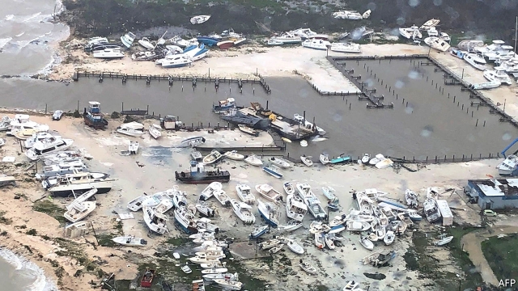
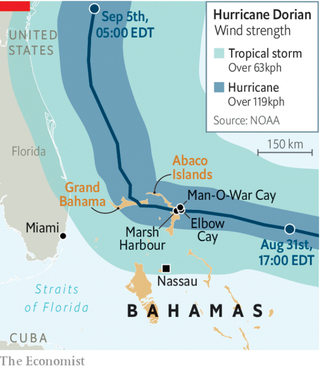

###### Tragedy in the Caribbean

# Slow-moving Hurricane Dorian devastates the northern Bahamas 

 

> print-edition iconPrint edition | The Americas | Sep 5th 2019 

ANY CATEGORY-FIVE hurricane is terrifying and dangerous for people in its path. Dorian, which devastated parts of the Bahamas on September 1st-3rd, seemed to take pleasure in its malice. Equal in strength to the worst Atlantic storm to make landfall ever recorded (the Labour Day hurricane of 1935), it struck the Abaco islands and then Grand Bahama with sustained winds of 300kph (185mph) and brought sea surges of nearly eight metres (26 feet). It lingered to inflict punishment, slowing down to 1mph near Grand Bahama.  

As The Economist went to press Dorian had caused 20 confirmed deaths, most in the Abaco islands, home to 17,000 people. The toll is bound to rise. The northern Bahamas had suffered a “historic tragedy”, said the prime minister, Hubert Minnis. 

Dorian’s first victims were the largely white residents of prosperous Man-O-War Cay and Elbow Cay. (Many are descendants of New England loyalists who joined the losing side in the American revolution.) It moved west to Marsh Harbour on Great Abaco, where it flattened the shantytowns of The Mudd and Pigeon Pea, settled by people of Haitian origin. Then it crawled past Grand Bahama, which has 52,000 inhabitants, inundating 60% of the island. 

Most of the Bahamas’ 400,000 people live in the capital, Nassau, on the island of New Providence, 240km south of Dorian’s eye. Even there, the lights went out island-wide and low-lying districts flooded. In all, more than 60,000 people will need food and clean drinking water, according to the UN and the Red Cross. As Dorian at last moved away and up the coast of the United States, it weakened. 

 

Bahamians largely ignored government warnings to evacuate low-lying areas. The government wants such advice to be mandatory in future storms, but that might not help much. On small islands escape is not easy. Dorian ripped roofs off shelters and flooded the hospital on Grand Bahama. 

Reconstruction will be slow and expensive. The government plans to appeal for “hundreds of millions, if not billions” of dollars of aid. The economy, based on tourism and offshore banking, could take years to recover. The Royal Oasis resort on Grand Bahama, wrecked in 2004 by hurricanes Frances and Jeanne, is still derelict. Matthew shut down the Grand Lucayan on the same island in 2016. Still mostly closed, its ballroom sheltered people from Dorian.  

The first half of this year’s hurricane season was quiet. Among the far-flung effects of El Niño events, which are oscillations in climate caused by changes in the Pacific, are stronger upper-level westerly winds in the Atlantic, which prevent hurricanes from forming. But the effects of this year’s El Niño diminished in July, allowing Dorian to form. More ferocity may be in store. Tropical Storm Fernand has reached the Mexican coast. 

The Caribbean may have to come to terms with more destructive storms. In 2017 Irma smashed up the north-eastern Caribbean, then Maria devastated Puerto Rico and Dominica. By warming the surface of the Atlantic, climate change should make hurricanes stronger. It may have played a role in slowing Dorian to a cruel crawl. A recent study by NASA and the National Oceanic and Atmospheric Administration found that the number of slow-moving hurricanes in the North Atlantic has been climbing since the 1940s. Dorian is unlikely to be the last of its kind. ■ 

