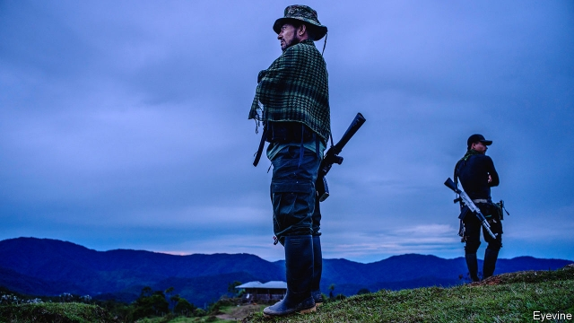

###### FARC, the sequel

# Will Colombia return to war? 

 

> print-edition iconPrint edition | The Americas | Sep 5th 2019 

IT WAS A throwback to the bad old days. In a 32-minute video released on August 29th Iván Márquez, once the number-two commander of the FARC, a guerrilla group that waged war against the Colombian state for 52 years, announced that he was taking up arms again. Appearing in combat fatigues before a banner bearing the FARC’s old crossed-rifles logo and images of Simón Bolívar and Manuel Marulanda, the group’s founder, Mr Márquez accused the government of “shredding” the peace agreement it signed in 2016. He promised to “fight for a betrayed peace”. 

Little in his amateurish production was as it seemed. Footage shot from a drone supposedly showed the jungles of eastern Colombia, where the warrior said he would establish his new base, but the government thinks the video was filmed in Venezuela. Mr Márquez does not have the means by himself to restart the war, which killed perhaps 220,000 people and displaced 7m. The government’s implementation of the peace agreement has been flawed, but that is probably not his reason for returning to the fight. 

Even so, it is bad news. Mr Márquez’s group may add to the violence that already plagues parts of the countryside. If it coalesces with other forces it could pose a serious military threat to the government. FARC 2 raises the risk of border skirmishes with Venezuela. And it will further polarise Colombia’s bitter argument about the rights and wrongs of the peace agreement. That may shape the regional elections due in October, an important test for the president, Iván Duque. 

Mr Márquez, whose real name is Luciano Marín, may have chosen the jungle in preference to an American jail cell. His nephew, Marlon Marín, was arrested last year along with Seuxis Hernández (aka Jesús Santrich), a FARC commander who is accused of conspiring to ship 10,000kg (22,000lb) of cocaine to the United States after the signing of the peace deal. Mr Santrich disappeared on June 30th when Colombia sought to extradite him to the United States (and popped up in the video alongside Mr Márquez). Marlon Marín is in American custody and is thought to have implicated Mr Márquez. Most leaders of the FARC, which became a political party and has ten seats in congress, condemned Mr Márquez’s return to war. 

He cannot wage it on a large scale. It is hard to see the 10,000 FARC fighters who have demobilised returning to the jungle. Mr Márquez may hope to ally with some 2,000 “dissident” FARC members, who have formed armed groups that operate mainly in southern Colombia, where they concentrate on trafficking drugs. But the strongest dissident leader is Miguel Botache Santillana, known as Gentil Duarte, a former mid-level commander who regards Mr Márquez as a traitor because he helped negotiate the peace deal. 

The ageing guerrilla can still do damage. “He has half a dozen very experienced field commanders with him,” says a former defence official, who sees a “serious risk of urban terrorism”. One of Mr Márquez’s allies, known as El Paisa, arranged the bombing of a social club in Bogotá in 2003 that killed 36 people. Universities are recruiting grounds for would-be bombers, says the former official. 

Mr Márquez wants to co-ordinate with the ELN, a guerrilla group that is still at war with Colombia. In this, he will have help from Venezuela’s leftist government. Hugo Chávez, the late founder of the “Bolivarian revolution”, was friendly to Colombia’s guerrilla groups. The current head of the regime, Nicolás Maduro, has gone further. The ELN and other armed groups have collaborated with drugs gangs facilitated by high-ranking officials of the Venezuelan government. In April, according to Colombian military intelligence, Mr Márquez met ELN commanders in Venezuela. 

This alliance raises the risk of a confrontation between Colombia and Venezuela. Mr Duque, who calls FARC 2 a “gang of narco-terrorists” sheltered by Venezuela, may be tempted to strike its bases inside that country. This would follow an example set by Álvaro Uribe, a former president and Mr Duque’s political mentor. In 2008 Mr Uribe ordered the bombing of a FARC base just over the border with Ecuador. Rafael Correa, Ecuador’s then-president, did not strike back. Mr Maduro, a dictator in charge of a collapsing economy, might. 

Mr Márquez’s return to battle will make it harder for the government to implement the peace agreement. Signed by Mr Duque’s predecessor, Juan Manuel Santos, it was narrowly rejected in a referendum. Mr Santos eventually rammed it through congress. Mr Duque won last year’s election in part because of his alliance with Mr Uribe, a fierce foe of the agreement. Mr Márquez’s gun-toting appearance is certain further to undermine public support for the deal. 

In office Mr Duque has tried to please sceptics while taking steps endorsed by the accord’s supporters. He has given priority to those parts that deter former fighters from returning to violence. The government extended beyond the terms set in the accord both stipends of former fighters and payment for leases on the transition zones where some live. It seems to be making progress in bringing development to rural areas hardest hit by the war and in updating the land registry, a precondition for such development. 

But Mr Duque has been half-hearted about putting into effect many other provisions. The government is moving slowly to fulfil its commitment to hand out within ten years title to 7m hectares (17m acres) of land, mainly to poor farmers. It claims to have given titles for 300,000 hectares, but nearly all are to indigenous groups on reserves. Few farmers have received the technical assistance they need to switch from growing coca, the raw material for cocaine, to other crops. Short of money, the government has slashed by 10% or more the budgets of agencies in charge of such areas as rural development. Mr Duque has yet to send to congress a single bill to implement the agreement. More than half the needed legislation has not been passed. 

The part of the deal to which he is most hostile is the “transitional justice” tribunal, called the JEP, which investigates war crimes and crimes against humanity. He, along with many Colombians, regards the sentences it can hand out as too lenient and its judges as too sympathetic to the defendants. The tribunal seemed to confirm those suspicions in May when it freed Mr Santrich as he was facing extradition. Mr Duque thinks it outrageous that accused FARC members can sit in congress. He filed six objections to the law under which the JEP operates, which were overruled by the constitutional court. For the deal’s supporters, transitional justice is a painful compromise that made peace possible. 

The government’s most damaging failure has been to protect former combatants, as well as activists working on behalf of the poor. Around 130 demobilised guerrillas have been killed since the signing of the peace deal, mainly by dissident FARC soldiers and by members of militias spawned by right-wing paramilitary groups. Around 290 activists have also been murdered. Mr Márquez cited that to justify his own return to violence (ignoring the fact that some of the killers are his prospective allies). The number of murders in areas where armed groups are still active rose in 2018 but appears to have fallen this year. Even so, the end of the war has not brought tranquility to those regions. While Mr Duque fights the menace of Mr Márquez, he must do more to strengthen Colombia’s fragile peace.■ 

