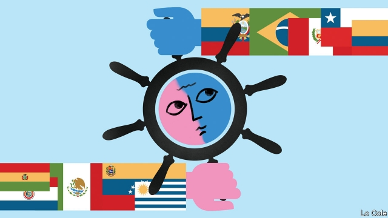

###### Bello

# Will South America’s “pink tide” return? 

 

> print-edition iconPrint edition | The Americas | Sep 5th 2019 

FOUR YEARS ago the unexpected victory of Mauricio Macri in Argentina’s presidential election marked the ebbing of the “pink tide”, a long period of hegemony of the left in South America. In its wake centre-right candidates went on to triumph in Peru, Ecuador, Chile and Colombia (although in Ecuador Lenín Moreno moved right only when in office). In Brazil last year a far-rightist, Jair Bolsonaro, won the presidency. Shortly after Mr Macri’s victory, in Venezuela the opposition trounced the United Socialist Party of Nicolás Maduro in a parliamentary election, the last free contest that country has seen. And Evo Morales, Bolivia’s leftist president since 2006, lost a referendum to change the constitution to allow him to run for a fourth term. 

Last month Mr Macri’s bid for a second term foundered when he fared badly in “primary” elections (in reality, a dress rehearsal). Everything suggests that in the real thing in October the Peronists will return to power in the form of Alberto Fernández, a social democrat, and his running-mate, Cristina Fernández de Kirchner, who ruled as a leftist populist from 2007 to 2015. Will Argentina once again portend a broader shift in the region’s political weather? 

Some analysts think so. Noting that leftists had lost in the recent past because they were incumbents rather than because voters had become more conservative, Christopher Garman of Eurasia Group, a consultancy, wrote that “anti-establishment, or change” elections risk ending market-friendly policies in several South American countries over the next three years. 

He has a point. Leftist presidents were popular in part because the pink tide coincided with a commodity boom. Their successors did not have their luck. Governing is hard in South America nowadays. Voters are angry about a mixture of slower growth or economic stagnation, corruption scandals, crime and poor public services (see article). The fake news, “alternative facts” and smears of social media have damaged the faith of citizens in their leaders and institutions. Political fragmentation means that several current presidents lack the legislative majority required to enact needed reforms. That applies in particular to Sebastián Piñera in Chile, Martín Vizcarra in Peru and Iván Duque in Colombia. In several cases, political honeymoons have been short. Mr Duque’s approval rating is in the mid-30s, while those of Mr Piñera, Mr Moreno and Mr Bolsonaro languish in the 20s. 

Yet none of this translates automatically into a return of the left. Argentina is a special case. The failure of Mr Macri’s attempt to clean up the economic mess left by Ms Fernández, and a consequent descent into recession and inflation, explain why voters have deserted him (see article). Perhaps the only potential parallel is with Ecuador, where Mr Moreno, like Mr Macri, has turned to the IMF and growth is mediocre. It is not hard to see a candidate backed by Rafael Correa, Ecuador’s former populist strongman, winning in 2021. 

But the left has its own problems. In Uruguay, after 14 years in power, the Broad Front looks tired. An election in October could bring victory for the centre-right. In Chile and Peru, the left is divided. Everywhere the Venezuelan catastrophe is a propaganda tool against left-wingers who have failed to keep their distance from Mr Maduro or to smash the icon of Hugo Chávez, his mentor and predecessor. And just like the swing to the right, the pink tide originally owed more to anti-incumbent feeling than to an ideological shift among voters. 

Populists tend to be more successful than moderates in riding out hard times. Take Mexico, which elected Andrés Manuel López Obrador, a left-wing populist, last year. He remains liked, mainly because carefully marketed social programmes and other gestures persuade many Mexicans that he is on their side. In Bolivia, having disregarded the referendum result, Mr Morales may win another term in October, partly because he controls the state. But eventually, if they are allowed to, voters turn against populists who fail. That applied to Ms Fernández and Mr Maduro. 

Rather than a shift back to the left, South American politics is moving into a pattern of volatility, with short cycles of change. That is a mixed blessing. It will make it harder for would-be imitators of Chávez and Mr Morales to establish lasting hegemony. But it impedes the long-term investment and continuity of good policy that South America needs.■ 

-- 

 单词注释:

1.bello[]:n. 贝罗（姓氏） 

2.Sep[]:九月 

3.unexpect[]:[网络] 意想不到；使意外 

4.Mauricio[]:n. 毛利西奥（男子名） 

5.macri[]: [人名] 麦克里 

6.presidential[.prezi'denʃәl]:a. 总统制的, 总统的, 首长的, 统辖的 [法] 总统的, 议长的, 总经理的 

7.eb[eb]:abbr. 电子束（Electron Beam） 

8.hegemony[hi:'dʒemәni]:n. 霸权, 领导权, 支配权, 拥有支配权的政府 [法] 霸权, 盟主权 

9.Peru[pә'ru:]:n. 秘鲁 

10.Ecuador['ekwәdɒ:]:n. 厄瓜多尔 

11.Chile['tʃili]:n. 智利 [化] 番椒; 辣椒 

12.Colombia[kә'læmbiә]:n. 哥伦比亚 

13.Moreno[]:莫雷诺（男子名） 

14.Brazil[brә'zil]:n. 巴西 

15.jair[]:[网络] 睚珥；贾伊尔；睢珥 

16.presidency['prezidәnsi]:n. 总统职权, 总裁职位 

17.Venezuela[,vene'zweilә]:n. 委内瑞拉 

18.opposition[.ɒpә'ziʃәn]:n. 反对, 敌对, 相反, 在野党 [医] 对生, 对向, 反抗, 反对症 

19.trounce[trauns]:vt. 痛打, 严惩 

20.maduro[mә'duәrәu]:a. 色深味浓的烟草做的, (雪茄)色深味浓的 

21.parliamentary[.pɑ:lә'mentәri]:a. 国会的, 议会的, 议会制度的 

22.evo[]:abbr. 意蓝虚拟办公室（eLand Virtual Office, 软件名）；国际能效评估组织（Efficiency Valuation Organization）；三菱兰瑟（汽车品牌） 

23.morale[mɒ'rɑ:l]:n. 士气, 道德 

24.leftist['leftist]:n. 左翼的人, 左派 a. 左派的 

25.referendum[.refә'rendәm]:n. （就重大政治或社会问题进行的）全民公决，全民投票 

26.founder['faundә]:n. 创立者, 建立者 vt. 使沉没, 使摔倒, 弄跛, 浸水, 破坏 vi. 沉没, 摔到, 变跛, 倒塌, 失败 

27.Peronist[pә'rәjnist]:a. (阿根廷总统)庇隆的,庇隆主义的, 庇隆主义者的 

28.alberto[]:n. 阿尔贝托（阿塞拜疆教练） 

29.democrat['demәkræt]:n. 民主人士, 民主主义者, 民主党党员 [经] 民主党 

30.Cristina[]:n. 克里斯蒂娜（电视剧中的人物） 

31.de[di:]:[化] 非对映体过量 [医] 铥(69号元素铥的别名,1916年Eder离得的假想元素) 

32.kirchner[]:柯克纳（人名） 

33.Populist['pɔpjulist]:n. 民粹派的成员 

34.Argentina[.ɑ:dʒәn'ti:nә]:n. 阿根廷 

35.portend[pɒ:'tend]:vt. 成为...的前兆, 预知, 给与...的警告 

36.analyst['ænәlist]:n. 分析者, 精神分析学家 [化] 分析员; 化验员 

37.incumbent[in'kʌmbәnt]:a. 现任的, 依靠的, 负有义务的 n. 领圣俸者, 在职者 

38.voter['vәutә]:n. 选民, 投票人 [法] 选民, 选举人, 投票人 

39.christopher['kristәfә]:n. 克里斯多夫（男子名） 

40.garman[]: [人名] [英格兰人姓氏] 加曼 Gorman的变体 

41.Eurasia[ju'reiʒә]:n. 欧亚大陆 

42.consultancy[]:n. 商量, 协商, 磋商, 会诊, 与...商量, 咨询, 请教, 找(医生)看病, 查阅, 考虑 [经] 咨询业务, 咨询服务 

43.leftist['leftist]:n. 左翼的人, 左派 a. 左派的 

44.coincide[.kәuin'said]:vi. 一致, 符合 [化] 重合 

45.commodity[kә'mɒditi]:n. 农产品, 商品, 有用的物品 [经] 商品, 货物, 日用品 

46.successor[sәk'sesә]:n. 继承者, 接任者 [计] 后继 

47.stagnation[stæg'neiʃәn]:n. 淤塞, 停滞 [医] 停滞, 滞留, 郁积 

48.corruption[kә'rʌpʃәn]:n. 腐败, 堕落, 贪污 [计] 论误 

49.fake[feik]:n. 假货, 欺骗, 诡计 a. 假的 vt. 假造, 仿造 vi. 伪装 

50.smear[smiә]:vt. 涂, 擦上, 玷污, 把...擦模糊 vi. 被弄脏 n. 污点, 污迹, 污蔑 

51.fragmentation[.frægmәn'teiʃәn]:n. 分裂, 破碎 [计] 在IP层将打包文件切成适当大小的程序 

52.legislative['ledʒislәtiv]:n. 立法机构 a. 立法的, 有立法权的 

53.enact[i'nækt]:vt. 制定法律, 扮演, 颁布 [法] 法令, 法规, 条例 

54.vizcarra[]:[网络] 维兹卡拉 

55.duque[]: [人名] 杜凯 

56.languish['læŋgwiʃ]:vi. 憔悴, 凋萎, 苦思 

57.consequent['kɒnsikwәnt]:n. 随后发生的事情, 结果 a. 作为结果的, 合乎逻辑的 

58.descent[di'sent]:n. 降落, 家系, 侵袭, 血统 [医] 下降, 世代, 血统 

59.recession[ri'seʃәn]:n. 后退, 凹处, 衰退, 归还 [医] 退缩 

60.inflation[in'fleiʃәn]:n. 胀大, 夸张, 通货膨胀 [化] 充气吹胀; 膨胀 

61.IMF[]:国际货币基金组织 [经] 国际货币基金 

62.mediocre[.mi:di'әukә]:a. 不好不坏的, 通常, 平凡的 

63.rafael[]:n. 拉斐尔（男子名, 来源于圣经故事） 

64.correa[]: [人名] 科雷亚 

65.strongman[ˈstrɒŋmæn]:n. 大力士 

66.Uruguay['uru^wai]:n. 乌拉圭 [经] 乌拉圭 

67.venezuelan[,venә'zweilәŋ]:a. 委内瑞拉的；委内瑞拉人的 

68.propaganda[.prɒpә'gændә]:n. 宣传, 宣传活动 [医] 宣传 

69.icon['aikɒn]:n. 画像, 肖像, 偶像, 图标, 像标 [计] 像标, 图标 

70.hugo['hju:^әu]:n. 雨果（男子名, 等于Hugh） 

71.mentor['mentɔ:]:n. 指导者, 良师益友 

72.predecessor[.predi'sesә]:n. 前任, 先辈, 前身 [医] 初牙, 前辈, 祖先 

73.originally[ә'ridʒәnli]:adv. 本来, 原来, 最初, 就起源而论, 独创地 

74.ideological[.aidiә'lɒdʒikәl]:a. 意识形态的, 空想的 [法] 思想的, 思想上的, 意识形态的 

75.manuel['mænjuel]:n. 曼纽尔（男子名）；曼努埃尔二世（拜占庭皇帝约翰五世的次子） 

76.López[]:[地名] 洛佩斯 ( 阿根、厄 ) 

77.obrador[]:[网络] 布拉多 

78.carefully['kєәfuli]:adv. 小心地, 谨慎地 

79.Bolivia[bә'liviә]:n. 玻利维亚 

80.disregard[.disri'gɑ:d]:n. 忽视, 漠视 vt. 忽视, 不顾 

81.politic['pɒlitik]:a. 精明的, 明智的, 策略的 

82.volatility[.vɒlә'tiliti]:n. 挥发性, 挥发度, 轻快, 易变, 短暂 [计] 变更率 

83.imitator['imi,teitә]:n. 模仿者, 临摹者, 仿造者, 伪造者 [计] 模拟, 模拟程序, 模拟器 

84.impede[im'pi:d]:vt. 妨碍, 阻碍, 阻止 

85.continuity[.kɒnti'nju:iti]:n. 连续性 [化] 连续性 

