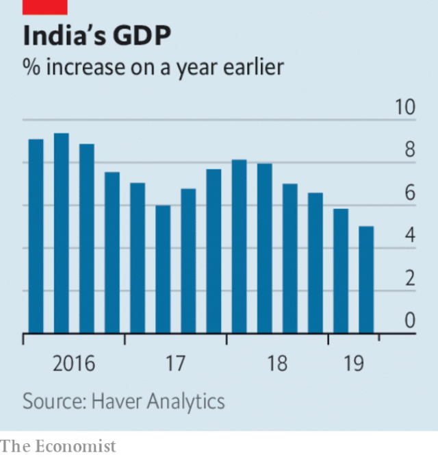

###### British politics

# Business this week 

> Sep 7th 2019 

The Argentine government introduced emergency capital controls, restricting the amount of dollars that people and firms can buy. The measures are meant to stop money gushing out of the country amid a run on the peso, which has tumbled as investors fret that October’s presidential election will be won by a ticket that includes Cristina Fernández de Kirchner, a former president whose spendthrift policies ruined the economy. See article. 

 

India’s economy grew by 5% in the second quarter compared with the same three months last year, the country’s slowest growth rate in six years and well below market forecasts. Separate figures showed that domestic car sales slumped in August (by 49% for Tata Motors compared with August 2018) and that manufacturing activity was cooling rapidly. More government stimulus is now on the cards.  

The Indian government also announced plans to streamline the country’s state-controlled banks, which hold lots of bad debt, cramping their ability to lend, and proposed that ten state banks be merged into four new ones. Markets gave the idea a cool reception. 

Australia’s GDP grew by 1.4% in the second quarter, the slowest pace since the financial crisis. Exports are booming, but consumers in the Lucky Country are reining in their spending. 

Turkey’s annual inflation rate fell to 15% in August, the lowest it has been for 15 months. Inflation soared to 25% at the end of last year amid a currency crisis. Today’s more stable lira and decreasing price pressures have boosted expectations that the central bank will again slash interest rates when it meets on September 12th, though probably by not as much as the 4.25-percentage-point cut to rates in July. 

America and China agreed to resume high-level talks in early October to try to resolve their trade dispute. Negotiators last met in July and there is little hope that a breakthrough will come soon. There was evidence this week that the dispute is having an effect on manufacturing. Factory output in America surprisingly contracted in August for the first time in three years. In Britain manufacturing activity fell to a seven-year low. And in Germany a purchasing-managers’ index suggested that manufacturing had shrunk for an eighth consecutive month. Figures in China showed manufacturing contracting for the fourth month in a row. 

Uber’s share price hit a new low ahead of the expected passage of a bill in California that would reclassify the employment status of the company’s drivers in the state from contractor to employee, a threat to its low-labour-cost business model. 

Walmart decided to stop selling ammunition that can be used in military-style weapons and handguns. The retailer has come under pressure to do more to curb gun sales since last month’s mass shooting at one of its stores in El Paso. This week a gunman murdered seven people at random in west Texas. Walmart stopped selling handguns in the 1990s and semi-automatics in 2015, but the latest surge in shootings has led to calls for parents to boycott its stores in the back-to-school season. 

A key ally of Muhammad bin Salman, Saudi Arabia’s crown prince and de facto ruler, was put in charge of Saudi Aramco. The promotion of Yasir al-Rumayyan to chairman makes the on-off IPO of the state oil company more likely; it could come as early as next year. 

Cathay Pacific’s chairman stood down, three weeks after its chief executive resigned amid the political turmoil in Hong Kong, Cathay’s home hub. The airline draws a lot of business from the Chinese mainland, where the government has told it to bar cabin crew who participate in Hong Kong’s pro-democracy protests from flying to Chinese airports. Cathay has sacked two pilots who joined the marches. The new chairman, like the new CEO, comes from Swire Group, a conglomerate with a 45% stake in Cathay. 

Nickel prices soared to five-year highs after the Indonesian government brought forward a ban on exports of nickel ore to December, two years earlier than it had proposed. The metal is used in stainless steel and increasingly in batteries for electric cars, an industry which Indonesia wants to develop domestically. 

There were more privacy scandals involving internet companies. Google was fined $170m in America for illegally collecting data from child users on its YouTube site in order to target them with ads. And a two-year hacking campaign was uncovered (by Google’s researchers) that tapped into text messages and photos on hundreds of thousands of iPhones. As a reminder that no one is immune, the Twitter account of Jack Dorsey, Twitter’s boss, was briefly hijacked; a number of offensive messages and a bomb threat were tweeted out. 

-- 

 单词注释:

1.politic['pɒlitik]:a. 精明的, 明智的, 策略的 

2.Sep[]:九月 

3.argentine['ɑ:dʒәntain]:n. 银, 银白色金属, 银白色鱼鳞, 阿根廷人 a. 银的, 银色的, 阿根廷的 

4.gush[gʌʃ]:n. 涌出, 滔滔不绝地讲话 v. 涌出, 迸出, 滔滔不绝的讲话 

5.amid[ә'mid]:prep. 在其间, 在其中 [经] 在...中 

6.peso['peisәu]:n. 比索 [经] 比索 

7.investor[in'vestә]:n. 投资者 [经] 投资者 

8.fret[fret]:n. 烦躁, 磨损, 焦急, 网状饰物 vi. 烦恼, 不满, 磨损 vt. 使烦恼, 腐蚀, 使磨损, 使起波纹 

9.presidential[.prezi'denʃәl]:a. 总统制的, 总统的, 首长的, 统辖的 [法] 总统的, 议长的, 总经理的 

10.Cristina[]:n. 克里斯蒂娜（电视剧中的人物） 

11.de[di:]:[化] 非对映体过量 [医] 铥(69号元素铥的别名,1916年Eder离得的假想元素) 

12.kirchner[]:柯克纳（人名） 

13.spendthrift['spendθrift]:n. 浪费的人 a. 浪费的, 挥霍无度的 

14.ruine['ru:ɪn]: [医]路因碱 

15.slump[slʌmp]:n. 暴跌, 垂头弯腰的姿态 vi. 猛然掉落, 陷入, 衰落(经济等) 

16.tata[.tæ'tɑ:. .tɑ:-]:int. [英国口语]再见 

17.manufacturing[.mænju'fæktʃәriŋ]:n. 制造业 a. 制造业的 

18.stimulus['stimjulәs]:n. 刺激, 激励, 刺激品 [医] 刺激特, 刺激 

19.streamline['stri:mlain]:n. 流线, 流线型 vt. 使成流线型, 使合理化 

20.cramp[kræmp]:n. 痉挛, 腹部绞痛, 铁夹钳 a. 狭窄的, 难认的 vt. 使抽筋, 以铁箍扣紧, 束缚 

21.merge[mә:dʒ]:vt. 使合并, 使消失, 吞没 vi. 合并, 渐渐消失 [计] 合并 

22.inflation[in'fleiʃәn]:n. 胀大, 夸张, 通货膨胀 [化] 充气吹胀; 膨胀 

23.inflation[in'fleiʃәn]:n. 胀大, 夸张, 通货膨胀 [化] 充气吹胀; 膨胀 

24.soar[sɒ:]:n. 高扬, 翱翔 vi. 往上飞舞, 高耸, 翱翔 

25.lira['liәrә]:n. 里拉 

26.slash[slæʃ]:v. 猛砍, 乱砍 n. 猛砍, 乱砍, 删减 [计] 斜线 

27.negotiator[ni'gәuʃieitә]:n. 磋商者, 交涉者, 议定者 [经] 谈判者, 交易者, 协商者 

28.consecutive[kәn'sekjutiv]:a. 连续的, 联贯的 [计] 连续的; 连接的 

29.California[.kæli'fɒ:njә]:n. 加利福尼亚 

30.reclassify['ri:'klæsifai]:[经] 三级分类 

31.statu[]:[网络] 状态查看；雕像；特级雪花白 

32.contractor['kɒntræktә]:n. 立契约的人, 承包商 [化] 承包者; 承包工厂 

33.walmart['wɔlma:t]: 沃尔玛（世界连锁零售企业） 

34.ammunition[.æmju'niʃәn]:n. 军火, 弹药 [机] 弹药 

35.handgun['hændɡʌn]:n. 手枪 

36.retailer['ri:teilә]:n. 零售商人, 传播的人 [经] 零售商 

37.curb[kә:b]:n. 抑制, 勒马绳, 边石 vt. 抑制, 束缚, 勒住 

38.el[el]:abbr. 预期损失（Expected Loss） 

39.paso[]:abbr. 泛美体育组织（Pan American Sports Organization） 

40.gunman['gʌnmәn]:n. 枪手, 持枪的歹徒, 制造枪械者 [法] 持枪歹徒, 持枪抢劫或杀人者, 枪炮工人 

41.Texas['teksәs]:n. 德克萨斯 

42.surge[sә:dʒ]:n. 巨涌, 汹涌, 澎湃 vi. 汹涌, 澎湃, 颠簸, 猛冲, 突然放松 vt. 使汹涌奔腾, 急放 [计] 电压尖峰 

43.ally['ælai. ә'lai]:n. 同盟者, 同盟国, 助手 vt. 使联盟, 使联合, 使有关系 vi. 结盟 

44.muhammad[]:n. 穆罕默德 

45.bin[bin]:n. (贮存谷物等的)容器, 箱子 [计] 二进制, 商业信息网 

46.Salman[]:n. 萨尔曼（男子名） 

47.saudi['sajdi]:a. 沙乌地阿拉伯（人或语）的 

48.facto[]:[法] 实际上, 事实上 

49.aramco[]:abbr. 沙特阿美石油公司（Arabian-American Oil Company） 

50.promotion[prәu'mәuʃәn]:n. 晋级, 创建, 增进 [经] 推广, 推销, 促进 

51.yasir[]:[网络] 亚西尔；富足的；富有 

52.ipo[]:abbr. 首次公开募股（Initial Public Offerings）；初次公开发行（Initial Public Offering） 

53.Cathay[kæ'θei]:n. 中国 

54.turmoil['tә:mɒil]:n. 骚动, 混乱 

55.hong[hɔŋ]:n. （中国、日本的）行, 商行 

56.kong[kɔŋ]:n. 含锡砾石下的无矿基岩；钢 

57.hub[hʌb]:n. 毂, 木片, 中心 [计] 插座; 插孔; 集线器, 集中器, 连接器, 中继站 

58.ceo[]:abbr. 首席执行官；执行总裁（chief executive officer） 

59.Swire[]:n. 太古集团 

60.conglomerate[kәn'glɒmәrit]:a. 聚成球形的, 砾岩性的 n. 集成物, 混合体, 砾岩 v. (使)凝聚成团 

61.nickel['nikl]:n. 镍, 镍币, 五分镍币 vt. 镀镍于 

62.Indonesian[.indәu'ni:ʒәn]:a. 印尼的 n. 印尼人, 印尼语群 

63.nickel['nikl]:n. 镍, 镍币, 五分镍币 vt. 镀镍于 

64.Indonesia[.indәu'ni:ʒә]:n. 印尼 

65.domestically[dәu'mestikli]:adv. 家庭式地, 国内地 

66.privacy['praivәsi]:n. 隐私, 隐居, 秘密 [计] 个人保密权 

67.google[]:谷歌；搜索引擎技术；谷歌公司 

68.illegally[]:[法] 非法地, 不合法地, 违法地 

69.datum['deitәm]:n. 论据, 材料, 资料, 已知数 [医] 材料, 资料, 论据 

70.youtube[]:n. 视频网站（可以让用户免费上传、观赏、分享视频短片的热门视频共享网站） 

71.hack[hæk]:n. 劈, 砍, 砍痕, 出租车, 干咳, 晒架, 鹤嘴锄 vt. 劈, 砍, 出租, 用旧 vi. 劈, 砍, 干咳, 驾驶出租车 a. 出租的 

72.iphone[]:n. 苹果手机 

73.reminder[ri'maindә]:n. 提醒的人, 暗示 [经] 催单 

74.immune[i'mju:n]:a. 免疫的, 免除的, 不受影响的 n. 免疫者 

75.twitter['twitә]:n. 啁啾, 唧唧喳喳声 vi. 啭, 啁啾, 颤抖 vt. 嘁嘁喳喳地讲, 抖动 

76.jack[dʒæk]:n. 插座, 千斤顶, 男人 vt. 抬起, 提醒, 扛举, 增加, 提高, 放弃 a. 雄的 [计] 插座 

77.dorsey[]:n. 多尔西（姓） n. 多尔西（美国地名） 

78.briefly['brifli]:adv. 简短地, 扼要地, 简明地, 简单地 

79.hijack['haidʒæk]:vt. 抢劫, 劫持, 敲诈 [法] 挡路抢劫, 抢劫, 绑架 

80.offensive[ә'fensiv]:a. 令人不快的, 侮辱的, 攻击性的 [法] 攻击的, 进攻的, 冒犯的 

81.tweet[twi:t]:vi. 啁啾 n. 小鸟叫声 

