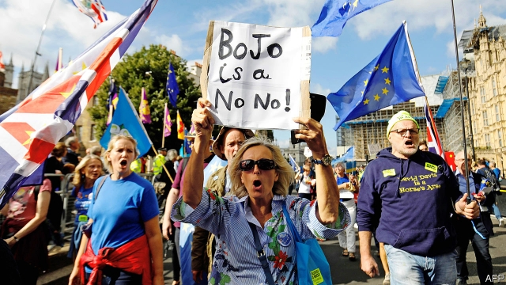

###### British politics

# Politics this week 

 

> Sep 7th 2019 

The squabble over Britain’s withdrawal from the European Union intensified in Parliament. MPs in the House of Commons defied the government by passing a bill that seeks a delay to Brexit until January 31st if a deal has not been passed in the chamber by October 19th. Boris Johnson purged the 21 MPs who rebelled against him from the Conservative Party, leaving the prime minister in charge of a government 43 short of a working majority. Mr Johnson now wants to hold an election. He has a lead in the polls—but so did Theresa May before a setback at an election in 2017. See here and here. 

In what many considered to be a pre-election giveaway, the government outlined plans to increase spending, which for the first time in 11 years would enlarge the size of the British state relative to GDP. Sajid Javid, the chancellor of the exchequer, said that Britain could “afford to turn the page on austerity”.  

HS2, Britain’s controversial high-speed rail project, faced more delays and an estimate for the final bill soared to £90bn ($110bn), or £260m per mile. The project was planned in two phases and originally costed at £30bn in 2010. The escalating price means HS2 is in danger of being derailed. 

Members of the Five Star Movement in Italy voted to accept a new government in coalition with their former enemies, the Democrats, to be headed by the incumbent prime minister, Giuseppe Conte. This means that the plan by the hard-right leader of the Northern League, Matteo Salvini, to force an election has failed, for now. 

In Germany, the Christian Democrats in Saxony and the Social Democrats in Brandenburg saw off challenges from the hard-right Alternative for Germany in state elections, which means that at the national level, the grand coalition between the CDU and the SPD is likely to continue. See article.  

A military judge set January 11th 2021 as the start date for the trial of the five men accused of plotting the 9/11 attacks. The trial, to be held at Guantánamo Bay, may not happen if it is found that the defendants’ statements were extracted under torture. If it does occur Khalid Sheikh Mohammed and four others will face a court, 20 years after the atrocities. 

Thirty-four people died when a fire broke out on a boat chartered for a scuba-diving excursion off the coast of Los Angeles. It was the worst loss of life on a vessel in American waters in four decades. 

Hong Kong’s chief executive, Carrie Lam, said she would formally withdraw the legislation that triggered the past three months of protests in the territory. The bill would have allowed the extradition of criminal suspects to courts on the Chinese mainland. In a leaked off-the-record speech, Mrs Lam said China had no plans to send in the army to control the unrest. See article.  

The Chinese Communist Party said its Central Committee would meet on an unspecified date in October. The committee, comprising more than 300 of the country’s most powerful officials, has not met since early last year—the longest gap in decades. It is due to discuss ways of “perfecting” the country’s socialist system. 

Zalmay Khalilzad, the diplomat conducting talks with the insurgents of the Taliban regarding an American withdrawal from Afghanistan, declared that the two sides had reached a preliminary deal. The plan is for a quick withdrawal of 5,400 of the 14,000 American troops in the country, followed by the staggered departure of the remainder, provided the Taliban meet certain conditions.  

The government of Bangladesh ordered mobile-phone operators to end service in the camps housing Rohingya Muslim refugees from Myanmar, and to stop selling mobile access to residents of the camps. The UN said the move would further isolate the 750,000 Rohingyas, who fled a pogrom backed by the Burmese army in 2017.  

Kazakhstan’s president, Kassym-Jomart Tokayev, promised to ease laws restricting public protests. Police have suppressed sporadic demonstrations against his stage-managed succession to the presidency earlier this year, after the abrupt resignation of Nursultan Nazarbayev, the strongman of 30 years. Mr Tokayev also affirmed Mr Nazarbayev’s daughter Dariga as head of the senate and thus next in line to the presidency. 

Hurricane Dorian, thought to be equal in strength to the most powerful ever recorded in the Atlantic to make landfall, devastated the Bahamas. With sustained winds of up to 185mph (300kph) the storm hit the Abaco islands, which have 17,000 inhabitants, before moving on to Grand Bahama, which has 52,000. It caused the sea to rise nearly eight metres (26 feet) above normal. At least 20 people died.  

Iván Márquez, a former second-in-command of the FARC, a guerrilla group that ended its 52-year war against the Colombian state in 2016, announced that he would lead fighters back into battle, accusing Colombia’s government of “shredding” the peace agreement. Most leaders of the FARC, now a political party with seats in congress, condemned Mr Márquez’s return to war. See article. 

Police in Guatemala arrested Sandra Torres, the runner-up in the presidential election in August, on charges of violating campaign-finance laws. She claimed that she was being politically persecuted. 

The international Red Cross said that as many as 100 people were killed when an air strike by the Saudi-led coalition that is fighting Houthi rebels in Yemen hit a detention centre under rebel control. The Saudis said the centre had been used to store drones. A UN report listed possible war crimes that have been committed in the five-year conflict, which include the use of indiscriminate air strikes. 

Israel exchanged fire with Hizbullah, the Lebanese militia-cum-party backed by Iran, in their most serious border clash in years. Israel was responding to a missile attack from Hizbullah, which the militia said was in retaliation for an Israeli drone attack in the suburbs of Beirut. 

Police in South Africa arrested 300 people after riots directed at migrants from other parts of Africa broke out in Johannesburg and Pretoria, killing at least five people. Violence against workers from other areas of the continent is relatively common in South Africa, which has an official unemployment rate of 29%. 

Pope Francis started a week-long visit to Mozambique, Madagascar and Mauritius, his second trip to sub-Saharan Africa. See article. 
<<<<<<< HEAD

-- 

 单词注释:

1.politic['pɒlitik]:a. 精明的, 明智的, 策略的 

2.Sep[]:九月 

3.squabble['skwɒbl]:vi. 争吵, 口角 n. 争吵, 口角 

4.withdrawal[wið'drɒ:l]:n. 提款, 撤退, 退回, 撤消, 退隐, 戒毒过程 [医] 戒除, 脱瘾 

5.intensify[in'tensifai]:vt. 加强 vi. 强化 

6.MP[]:国会议员, 下院议员 [计] 宏处理程序, 维护程序, 线性规划, 微程序, 多处理器 

7.defy[di'fai]:vt. 藐视, 挑衅, 使落空 n. 挑战 

8.Brexit[]:[网络] 英国退出欧盟 

9.boris['bɔris]:n. 鲍里斯（男子名） 

10.johnson['dʒɔnsn]:n. 约翰逊（姓氏） 

11.purge[pә:dʒ]:n. 净化, 清除, 泻药 v. (使)净化, 清除, (使)通便 [计] 服务器文件删除实用程序 

12.theresa[ti'ri:zә]:n. 特丽萨（女子名） 

13.setback['setbæk]:n. 挫折, 退步, 逆流 

14.giveaway['givә.wei]:n. 泄漏, 免费赠品 

15.sajid[]:n. (Sajid)人名；(印尼)赛义德 

16.javid[]:[网络] 加威；贾维德 

17.chancellor['tʃɑ:nsәlә]:n. 大臣, 总理, 首相, 大使馆/领事馆的一等秘书, 司法官, 大学校长 

18.exchequer[iks'tʃekә]:n. (英国)财政部, 国库 [法] 国库, 财源, 财政法院 

19.austerity[ɒ'sterәti]:n. 朴素, 苦行, 严格, 严峻 

20.soar[sɒ:]:n. 高扬, 翱翔 vi. 往上飞舞, 高耸, 翱翔 

21.originally[ә'ridʒәnli]:adv. 本来, 原来, 最初, 就起源而论, 独创地 

22.escalate['eskәleit]:vi. 逐步扩大, 逐步升高, 逐步增强 vt. 使逐步上升 

23.derail[di'reil]:vt. 使出轨 n. 脱轨器 [计] 转移指令 

24.coalition[.kәuә'liʃәn]:n. 结合体, 结合, 联合 [经] 联合, 联盟 

25.democrat['demәkræt]:n. 民主人士, 民主主义者, 民主党党员 [经] 民主党 

26.incumbent[in'kʌmbәnt]:a. 现任的, 依靠的, 负有义务的 n. 领圣俸者, 在职者 

27.giuseppe[]:n. 朱塞佩（男子名） 

28.conte[kuŋt]:n. 短篇小说 

29.matteo[]:马泰奥（人名） 

30.salvini[]:[网络] 索氏丽体鱼；萨尔维尼 

31.Saxony['sæksәni]:n. 光毛呢 

32.Brandenburg['brændənbə:ɡ]:n. 勃兰登堡（德国城市） 

33.CDU[]:abbr. 中央显示器（Central Display Unit）；海防搜索潜艇雷达（Coast Defense radar for detecting U-boats） 

34.spd[]:abbr. 电涌保护器；补充石油税；统计过程诊断（Statistical Process Diagnosis） 

35.extract[ik'strækt]:n. 榨出物, 精汁, 摘录, 选段 vt. (费力地)取出, 采掘, 榨取, 摘录, 吸取 [计] 提取 

36.Khalid[]:n. 哈利德（男子名） 

37.sheikh[ʃeik, ʃi:k]:n. 酋长, 王子, 村长, 族长, 教长, 导师, 有威信的丈夫 

38.Mohammed[mu'hæmәd]:n. 穆罕默德(伊斯兰教创始人) 

39.atrocity[ә'trɒsiti]:n. 残暴, 凶恶, 暴行 [法] 暴行, 残酷, 残忍 

40.charter['tʃɑ:tә]:n. 特许状, 执照, 宪章 vt. 特许, 发给特许执照 

41.los[lɔ:s]:abbr. 月球轨道航天器（Lunar Orbiter Spacecraft）；视线（Line of Sight） 

42.angeles[]:n. 安杰利斯（姓氏）；天使城（菲律宾地名） 

43.hong[hɔŋ]:n. （中国、日本的）行, 商行 

44.carrie['kæri]:n. 卡丽（女名, Caroline的昵称） 

45.lam[læm]:v. 打, 鞭笞, 逃脱 n. 逃亡 

46.formally['fɒ:mәli]:adv. 正式地, 形式上 

47.trigger['trigә]:n. 触发器, 扳机 vt. 触发, 发射, 引起 vi. 松开扳柄 [计] 切换开关 

48.extradition[.ekstrә'diʃәn]:n. 引渡逃犯, 亡命者送还本国 [法] 引渡 

49.Mr['mistә(r)]:先生 [计] 存储器回收程序, 多重请求 

50.unspecified['ʌn'spesifaid]:a. 未特别指出的, 未特别提到的 

51.zalmay[]: [人名] 扎尔梅 

52.khalilzad[]:[网络] 哈利勒扎德 

53.diplomat['diplәmæt]:n. 外交官, 有外交手腕的人 [法] 外交家, 外交官, 有权谋的人 

54.insurgent[in'sә:dʒәnt]:a. 谋叛的, 起义的, 澎湃的 n. 起义者, 叛乱者 

55.Taliban[]:塔利班 

56.Afghanistan[æf'gænistæn]:n. 阿富汗 

57.stagger['stægә]:n. 蹒跚, 踌躇 vi. 蹒跚, 犹豫 vt. 使摇摆, 使踌躇, 交错, 错开 a. 交错的, 错开的 

58.remainder[ri'meindә]:n. 剩余物, 其他人, 残余, 余数 v. 削价出售(图书) a. 剩余的, 出售削价剩书的 [计] 余数 

59.Bangladesh[,bɑ:ŋ^lә'deʃ]:n. 孟加拉国 [经] 孟加拉共和国 

60.Rohingya[]:罗兴亚族（ 缅甸的一个穆斯林族群） 

61.Muslim['mjzlim; (?@) 'mʌzlem]:n. 伊斯兰教, 伊斯兰教教徒 

62.refugee[.refju'dʒi:]:n. 难民, 流亡者 [法] 避难者, 流亡者, 难民 

63.Myanmar['mjænmɑ:(r)]:缅甸[东南亚国家](即Burma) 

64.UN[ʌn]:pron. 家伙, 东西 [经] 联合国 

65.Rohingya[]:罗兴亚族（ 缅甸的一个穆斯林族群） 

66.pogrom['pɒgrәm]:n. 集体迫害, 大屠杀 vt. 集体迫害, 大屠杀 

67.Burmese[.bә:'mi:z]:n. 缅甸人, 缅甸语 a. 缅甸的, 缅甸人的, 缅甸语的 

68.suppress[sә'pres]:vt. 镇压, 使止住, 禁止, 抑制, 查禁 [法] 镇压, 平定, 禁止出版 

69.sporadic[spәu'rædik]:a. 偶尔发生的, 零星发生的, 分散的 [医] 散在的, 散发的 

70.demonstration[.demәn'streiʃәn]:n. 示范, 实证 [医] 示教, 实物教授 

71.presidency['prezidәnsi]:n. 总统职权, 总裁职位 

72.nursultan[]:[网络] 努苏坦 

73.nazarbayev[]:[网络] 纳扎尔巴耶夫；总统纳扎尔巴耶夫；哈萨克的纳扎尔巴耶夫 

74.strongman[ˈstrɒŋmæn]:n. 大力士 

75.affirm[ә'fә:m]:v. 断言, 确认 

76.Dariga[]:[地名] 达里加 ( 巴基 ) 

77.Dorian['dɔriәn]:a. (古希腊中南部)多里斯(Doris) 的,多里安人的 n. 多里安人 

78.landfall['lændfɒ:l]:n. 初见陆地, 到达陆地, 着陆 

79.devastate['devәsteit]:vt. 毁坏 [法] 使荒废, 毁灭, 掠夺 

80.Bahamas[bә'hɑ:mәz]:n. 巴哈马群岛 

81.abaco[]:abbr. Great and Little Abaco islands 大阿巴科群岛和小阿巴科群岛 

82.bahama[bəˈhɑ:məz]:n. 巴哈马 [网络] 芦荟凝胶；晒后镇定；比哈马 

83.farc[]:abbr. Federal Addiction Research Center 联邦上瘾研究中心; Fuerzas Armadas Revolucionarias de Colombia (Spanish=Armed Revolutionary Forces of Colombia) （西班牙语）哥伦比亚武装革命力量; Federal Archives and Records Center 联邦档案履历中心; Field Artillery Replacement Center 野战炮兵补充训练中心（美军） 

84.guerrilla[gә'rilә]:n. 游击队 

85.Colombian[kә'læmbiәn]:n. 哥伦比亚人 a. 哥伦比亚的 

86.shred[ʃred]:n. 碎布条, 细片, 少量 v. 撕碎 

87.Guatemala[.gwɑ:tә'mɑ:lә]:n. 危地马拉 

88.sandra[]:n. 桑德拉（女子名） 

89.Torre[]:n. (Torre)人名；(英、法)托尔；(德、西、意、葡、塞)托雷 托尔 托雷 

90.presidential[.prezi'denʃәl]:a. 总统制的, 总统的, 首长的, 统辖的 [法] 总统的, 议长的, 总经理的 

91.politically[]:adv. 政治上 

92.persecute['pә:sikju:t]:vt. 迫害, 虐待, 困扰, 同...捣乱 [法] 迫害, 虐待, 烦扰 

93.houthi[]:[网络] 胡塞；也门一侧胡塞；什叶派胡塞 

94.yeman[]:[网络] 也门；叶门；园艺业的普及则始于也门 

95.detention[di'tenʃәn]:n. 阻止, 监禁, 拘留 [医] 隔离, 拘留, 滞留, 停滞 

96.saudi['sajdi]:a. 沙乌地阿拉伯（人或语）的 

97.drone[drәun]:n. 雄蜂, 懒惰者, 嗡嗡的声音, 无人驾驶飞机(或船) vi. 嗡嗡作声, 混日子 vt. 低沉地说 

98.indiscriminate[.indis'kriminit]:a. 无差别的, 任意的, 杂乱的 [医] 无差别的, 普遍的 

99.Israel['izreil]:n. 以色列, 以色列后裔, 犹太人 

100.hizbullah[]:n. 真主党 

101.lebanese[,lebә'ni:z]:a. 黎巴嫩的 

102.Iran[i'rɑ:n]:n. 伊朗 

103.clash[klæʃ]:n. 冲突, 撞击声, 抵触 vi. 冲突, 抵触 vt. 使发出撞击声 [计] 对撞 

104.militia[mi'liʃә]:n. 义勇军, 民兵组织, 国民军 

105.retaliation[ri.tæli'eiʃәn]:n. 报复 [法] 报仇, 报复, 回敬 

106.Israeli[iz'reili]:a. 以色列的, 以色列人(语)的 n. 以色列人 

107.Beirut[.bei'ru:t]:n. 贝鲁特 

108.riot['raiәt]:n. 暴动, 喧闹, 放纵 vi. 发动, 暴动, 纵情, 放荡 vt. 浪费, 挥霍 

109.migrant['maigrәnt]:n. 候鸟, 移居者 [法] 移居者 

110.Johannesburg[dʒәu'hænisbә:^]:约翰内斯堡[南非(阿扎尼亚)东北部城市] 

111.pretoria[pri'tɔ:riә]:n. 比勒陀利亚[南非（阿扎尼亚）首都] 

112.pope[pәup]:n. 罗马教皇, 主教 

113.franci[]:[网络] 弗朗西；法赛纳；法奇 

114.Mozambique[.mәuzәm'bi:k]:n. 莫桑比克 

115.Madagascar[mædә'^æskә]:n. 马达加斯加岛 

116.Mauritius[mɒ:'riʃiәs]:n. 毛里求斯 
=======
>>>>>>> 50f1fbac684ef65c788c2c3b1cb359dd2a904378

