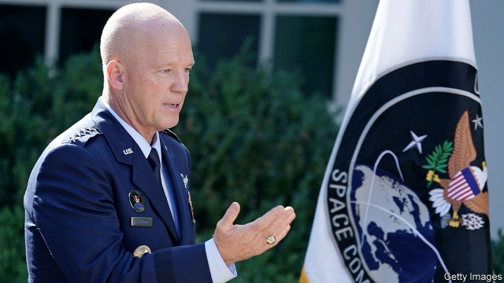

###### [Insert your own Star Wars pun here]

# Donald Trump unveils Space Command 

 

> print-edition iconPrint edition | United States | Sep 7th 2019 

IN THE SHADOW of the Rocky Mountains, at Peterson air force base in Colorado Springs, an officer of the US Air Force Space Command clutches a metallic object scarcely larger than a Rubik’s Cube. “If we lose this cubesat in orbit,” he explains, “it could be someone else’s attack vehicle.” In the past, satellite operators—like those controlling GPS satellites from nearby Schriever air force base—would have blamed problems on space weather or communication glitches. Now their minds leap to hacking, jamming and deliberate collision. And so on August 29th, after congressional instruction a year ago, President Donald Trump unveiled a new Space Command, with operational control of nearly all American space assets. He promised that a Space Force, the first new military service since the air force was established in 1947, would follow. 

The distinction between command and service is important. Since the Goldwater-Nichols Act in 1986, America’s armed forces have been cleaved into two parts. Individual services train and equip their respective forces, but do not send them into battle. Instead 11 so-called combatant commands divvy the world up into six geographical chunks and five functional areas such as cyber, special operations—and now space. The head of each one controls all the forces within his or her fief, whatever their service. Thus the admiral who runs the Indo-Pacific Command in Hawaii rules over infantrymen in South Korea, air-force pilots in Japan and marines in Australia. The system was designed specifically to avoid the sorts of inter-service quarrels that contributed to a botched hostage-rescue mission in Iran in 1980. 

For some years, space sat awkwardly in this structure. There was a dedicated Space Command between 1985 and 2002. But after the September 11th attacks an emphasis on homeland defence led to the creation of a new Northern Command, covering North America. Space was kicked into Strategic Command, whose primary job is nuclear weapons. There was some logic to this: America’s most vital satellites are those which watch for missile launches, detect nuclear detonations and pass orders from the president to nuclear forces. 

But as space threats seemed to grow—China’s test of an anti-satellite missile in 2007 was the first by any country since 1985—the arrangement looked problematic. In 2014 a review of space policy by the Obama administration concluded that it was “critical” for America to be able to identify threats in space and counter other countries’ anti-satellite weapons. The Trump administration intensified public warnings of those vulnerabilities. 

In February General John Hyten, commander of Strategic Command, said that space was his third priority, after the modernisation of nuclear forces and their command and control. “It really is important to have someone who comes to work every day and that’s all they think about—space operations, space threats and defending our space assets,” says Matthew Donovan, the acting secretary of the air force. That job now falls to General John “Jay” Raymond (pictured). Notably, he will have wartime control of the National Reconnaissance Office’s fleet of highly classified spy satellites if they come under attack. 

Not everyone is convinced that the reorganisation is urgently needed. In an essay published in July on “War on the Rocks”, a website, Brian Weeden, a former space-operations officer with the air force who is now at the Secure World Foundation, a think-tank, warned that General Raymond might wind up clashing with geographical-area commanders. If, for instance, China jams American GPS signals during a war over Taiwan, Space Command and Indo-Pacific Command may disagree on how best to respond. The Pentagon is examining how such co-ordination will work. Mr Weeden also worries that a dedicated command might encourage those fixated on “future battles in space”—satellite-on-satellite combat—rather than the more pressing task of using devices orbiting Earth to help commanders wage war on its surface, such as by sharpening GPS signals or redirecting spy satellites. 

Before Space Command can get stuck into cosmic battles, a more conventional war over federal dollars has to be fought. Mr Trump did not disclose which of six shortlisted bases across three states—Alabama, California and Colorado—would accommodate Space Command.. 

The debate is then likely to shift to Mr Trump’s Space Force, which, like the other services, would train and equip the “space warfighters” (as the Pentagon calls them) for General Raymond’s command. The White House has proposed a $500m-a-year service that would sit demurely within the air force, much as the marine corps is a component of the navy. Mr Weeden says that this, not Space Command, ought to have been the priority. He points out that there is a pressing need to train more space experts; over a third of space billets at Strategic Command are said to be unfilled. 

Congress is broadly in favour of the force, although the Senate and House are haggling over details. The Senate wants to put off creating a fully-fledged service for at least a year, to avoid bureaucratic bloat. The Democrat-controlled House prefers a less pugnacious label: Space Corps. Whatever it is called, the aim is to inculcate a galactic esprit de corps. “When people join the marines, it’s not about joining the navy,” says Stephen Kitay, deputy assistant secretary of defence for space policy. “Somebody joins the marines and that’s in their culture and DNA and ethos. And we’re looking to create that for space.”■ 

