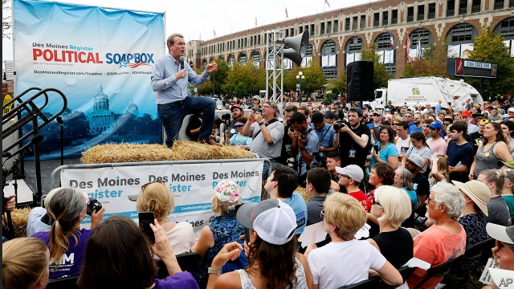

###### Wonk-in-chief

# Elizabeth Warren’s ideas get noticed. Michael Bennet’s are better 

 

> print-edition iconPrint edition | United States | Sep 7th 2019 

TO SIMPLIFY just a bit, the Democratic presidential primary has two competing ideological factions. The first is the brand of leftism, assertive and ascendant, championed by Bernie Sanders and Elizabeth Warren, which preaches ideas like protectionism, Medicare for All, a Green New Deal and decriminalising illegal border crossings. Arrayed against this is a squishy moderation, exemplified by Joe Biden, the former vice-president and current front-runner, and Kamala Harris, the senator from California. Both of them have attempted to please what they assume is an increasingly left-wing primary electorate, while not going so far as to alienate moderates. The results have been mixed. 

Mr Biden began his campaign with a flip-flop on whether the federal government should pay for abortions (no, then yes, apparently), and Ms Harris flip-flop-flip-flopped on whether private health insurance should be abolished (no, yes, no, yes, apparently). Meanwhile the candidate perhaps most intellectually capable of challenging the party’s leftward creep, Senator Michael Bennet of Colorado, is gaining little traction. “My worry is that if we’re going down the road of Medicare for All and open borders…that could disqualify us with the American people going into the election in 2020,” he says. 

Many in the field are fixated on Medicare for All, an idea for universal coverage pitched by Mr Sanders in which the government programme for the elderly becomes a single-payer for everyone’s care that is free at the point of use. Private insurance would no longer exist. “I think what we’re creating here is a solution in search of a problem,” says Mr Bennet, who notes that 175m Americans get health insurance through work and that the estimated tax needed for Mr Sanders’s idea—$33trn over ten years—is 70% of current federal revenues. 

His competing plan, known as Medicare X and, unlike others, unveiled years, not months, before his presidential run, would try to achieve universal coverage by allowing people to buy health insurance from the government and by shoring up the insurance exchanges set up under the Affordable Care Act, better known as Obamacare. “And if the American people hate private insurance as much as Bernie thinks they do, we might end up with Medicare X displacing the private market. I suspect that’s not where the American people will be,” Mr Bennet adds. 

Rather than being defined just in relief, Mr Bennet also differs in what he would spend money on. He has put two objectives at the centre of his economic pitch: investing in the 70% of American workers without a college degree and eroding childhood poverty. Both are big, progressive-sounding ideas—except that they are not much discussed by progressives. 

Help for non-college-educated Americans, which he estimates would cost $500bn over ten years, would come in the form of wage subsidies, wage insurance and grants for training. By concentrating on work, Mr Bennet takes note of the perennial worry about welfare traps. His other big proposal, monthly cash transfers of $300 for each American child, has gone unnoticed beside flashier offers like a universal basic income (from Andrew Yang) or universal child care paid for by a wealth tax (from Ms Warren). “For 3% of the costs of Medicare for All, you could reduce childhood poverty in America by 40% and end $2-a-day childhood poverty in America,” says Mr Bennet. Because interventions to improve economic mobility are most effective early in life, “my starting point would be free preschool, not free college”. 

Ms Warren has risen in the polls by creating the brand of a wonkish populist with a plan for everything (including one inquiring supporter’s love life). Mr Bennet’s ideas are a foil to these. They are just as rigorous and technocratic, but more rooted in pragmatism. Unfortunately, few voters have taken notice yet. After attending the first two debates, Mr Bennet failed to qualify for the television debate that will be held on September 12th, because of its more stringent polling and fundraising requirements. Still, Mr Bennet has pledged to continue his campaign until the first actual votes, which are not for five months.■ 

-- 

 单词注释:

1.elizabeth[i'lizәbәθ]:n. 伊丽莎白（女子名） 

2.michael['maikl]:n. 迈克尔（男子名） 

3.Sep[]:九月 

4.presidential[.prezi'denʃәl]:a. 总统制的, 总统的, 首长的, 统辖的 [法] 总统的, 议长的, 总经理的 

5.ideological[.aidiә'lɒdʒikәl]:a. 意识形态的, 空想的 [法] 思想的, 思想上的, 意识形态的 

6.faction['fækʃәn]:n. 小派系, 内讧 [法] 宗派, 派别, 小集团 

7.leftism['leftizәm]:n. 左派观点, 在倾行为 

8.assertive[ә'sә:tiv]:a. 武断的, 过分自信的 [法] 断言的 

9.ascendant[ә'sendәnt]:n. 支配地位, 优势, 运星 a. 上升的, 占优势的 

10.bernie['bә:ni]:n. 伯尼（男子名）；[俚]可卡因（等于cocaine） 

11.sander['sændә]:[电] 散沙 

12.warren['wɒrәn]:n. 养兔场, 拥挤的地区 

13.preach[pri:tʃ]:v. 传道, 讲道, 说教, 宣讲, 鼓吹 n. 说教, 布道 

14.protectionism[prә'tekʃәnizm]:n. 贸易保护主义, 贸易保护制 [经] 保护(贸易)主义, 保护(贸易)制 

15.medicare['medi,keә]:n. 医疗照顾方案, 医疗照顾项目 [法] 公办的医疗保险制 

16.decriminalising[]:vt. decriminalise的变形 

17.array[ә'rei]:n. 排列, 衣服, 大批, 军队 vt. 布署, 打扮, 排列 [计] 数组; 阵列 

18.squishy['skwiʃi]:a. 湿软的, 粘糊糊的 

19.moderation[.mɒdә'reiʃәn]:n. 缓和, 适度, 温和 [化] 慢化 

20.exemplify[ig'zemplifai]:vt. 例证, 例示 [法] 制作经公章证明的誊本, 例证 

21.joe[dʒәu]:n. 乔（男子名） 

22.biden[baidən]: [人名] 拜登 

23.kamala[kә'meilә]:n. [植] 粗糠柴 

24.harris['hæris]:n. 哈里斯（英国苏格兰一地区）；哈里斯（姓氏） 

25.senator['senәtә]:n. 参议员, (某些大学的)理事 [法] 参议员, 上议员 

26.California[.kæli'fɒ:njә]:n. 加利福尼亚 

27.electorate[i'lektәrit]:n. 选民, 有选举权者, 选区 [法] 选民, 选举团, 选区 

28.alienate['eiljәneit]:vt. 使疏远, 离间, 转让 [法] 转让, 让与, 疏远 

29.apparently[ә'pærәntli]:adv. 表面上, 清楚地, 显然地 

30.intellectually[]:adv. 智力上；知性上；理智地 

31.leftward['leftwәd]:a. 左方的, 左侧的 adv. 在左方, 在左手 

32.senator['senәtә]:n. 参议员, (某些大学的)理事 [法] 参议员, 上议员 

33.bennet['benit]:n. 水杨梅, 花梗 

34.Colorado[,kɔlә'rɑ:dәu]:n. 科罗拉多, 科罗拉多河 

35.traction['trækʃәn]:n. 曳, 牵引, 牵引力 [医] 牵引 

36.disqualify[dis'kwɒlifai]:vt. 使不适合, 取消...资格 

37.fixate['fikseit]:vi. 使固定, 使不变, 注视 vt. 使固定, 注视 

38.coverage['kʌvәridʒ]:n. 覆盖的范围, 保险总额, 新闻报导 [化] 可达范围; 覆盖度 

39.x[eks]:n. 未知数 [计] 交换, 变址, 索引, 传输 

40.unveil[.ʌn'veil]:vt. 揭开, 揭幕, 除去...的面纱 vi. 显露, 除去面纱 

41.affordable[]:[计] 普及型 

42.obamacare[]: 奥巴马医改计划 

43.displace[dis'pleis]:vt. 移置, 替换, 转移 

44.erode[i'rәud]:vt. 腐蚀, 侵蚀 vi. 受腐蚀 

45.perennial[pә'reniәl]:a. 常年的, 长期的, 反复的 [医] 多年生的 

46.unnotice[]:[网络] 未被注意的 

47.flashy['flæʃi]:a. 闪光的, 一瞬间的, 浮华的 

48.andrew['ændru:]:n. 安德鲁（男子名） 

49.yang[jɑ:ŋ,jæŋ]:n. 杨（姓氏） 

50.intervention[.intә'venʃәn]:n. 插入, 介入, 调停 [经] 干预 

51.mobility[mәu'biliti]:n. 可动性, 流动性, 机动性 [化] 迁移率 

52.preschool['pri:'sku:l]:a. 就学前的 n. 育幼院, 幼稚园 

53.wonkish[]:[网络] won ish。 

54.Populist['pɔpjulist]:n. 民粹派的成员 

55.foil[fɒil]:n. 箔, 烘托, 衬托 vt. 贴箔于, 衬托, 阻止, 挡开, 挫败 

56.rigorous['rigәrәs]:a. 严厉的, 严酷的, 严格的, 苛刻的, 严密的, 精确的 

57.technocratic[ˌteknə'krætɪk]:a. 由技术专家官员组成的；受技术官僚影响的 

58.pragmatism['prægmәtizm]:n. 实用主义 [法] 实用主义, 干涉主义, 独断 

59.voter['vәutә]:n. 选民, 投票人 [法] 选民, 选举人, 投票人 

60.stringent['strindʒәnt]:a. 迫切的, 严厉的, 银根紧的 [医] 约束的, 紧迫的 

61.fundraising['fʌndˌreɪzɪŋ]:n. 筹款, 募款 a. 筹款的 

62.pledge[pledʒ]:n. 诺言, 保证, 誓言, 抵押, 信物, 保人, 祝愿 vt. 许诺, 保证, 使发誓, 抵押, 典当, 举杯祝...健康 

