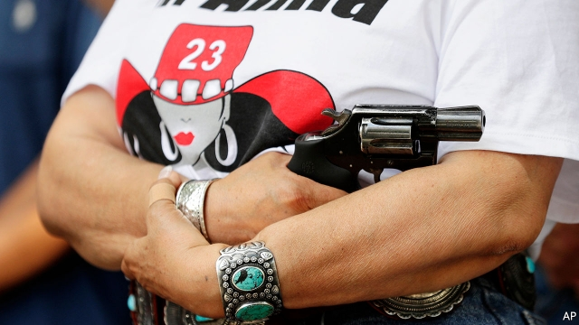

###### Daddy lessons

# Republican states loosen their gun laws following mass shootings 

 

> print-edition iconPrint edition | United States | Sep 7th 2019 

ON AUGUST 31ST a man armed with an AR-15 rifle fired indiscriminately along a 15-mile stretch spanning Odessa and Midland, two cities in Texas. At least 20 people were injured, seven were killed. Three days later, a 14-year-old in Alabama confessed to killing five family members—his father, stepmother and three siblings—with a handgun. There is no great mystery as to why such incidents regularly happen in America and not any other rich country, yet its lawmakers are reluctant to reduce access to firearms. New research confirms that if anything, mass shootings tend to lead to looser gun laws, not stricter ones. 

Michael Luca, Deepak Malhotra and Christopher Poliquin, three economists, have published a working paper matching mass shootings from 1989 until 2014 with state legislation on gun control. The authors find that in year immediately following a mass shooting, Republican legislatures passed twice as many laws expanding access to guns compared with other years. In contrast, Mr Luca and his colleagues find that overall mass shootings have no significant effect on firearms legislation in states controlled by Democrats. 

Part of this might be because guns are simply a much bigger deal for Republicans than Democrats. Surveys conducted by the Pew Research Centre, a think-tank, found that 38% of Republicans believed it was “important to protect the right of Americans to own guns” in 2000, compared with 20% of Democrats. The share of Republicans who see gun rights as a priority has risen to 76% since then, whereas the share of Democrats has hardly changed. 

Mass shootings seem only to further galvanise people along party lines. A study published this year by David Barney and Brian Schaffner, two political scientists, found that among those who lived within 25 miles of a mass shooting, average support for stricter gun control among Democrats increased by two percentage points. The opposite was true for Republicans. 

Less than 24 hours after the most recent mass shooting in Texas, nine new laws came into effect in Texas, all making it easier for civilians to carry guns. They were not motivated by the killings in Odessa and Midland, but rather by prior mass killings. It will now be easier for licensed gun owners to take their weapons into churches and other places of worship. Schools will no longer be able to prevent gun owners from keeping ammunition in their car parks. Greg Abbott, Texas’s governor, says his state’s newly enacted laws will make communities safer. This might sound backward, but for anyone who believes that guns equal safety, more guns make perfect sense as a response to a mass shooting. 

President Donald Trump’s administration is preparing new legislation which will expedite the execution of perpetrators found guilty of mass killings, and introduce a number of new gun reforms. The Texan shooter had previously failed a background check, which meant he was unable to buy a gun from a retailer. Yet he was able to obtain a rifle from a private seller, a process which does not require a background check. Mr Trump’s mooted changes are unlikely to close this loophole.■ 
<<<<<<< HEAD

-- 

 单词注释:

1.daddy['dædi]:n. 爸爸 

2.Sep[]:九月 

3.indiscriminately[ˌɪndɪ'skrɪmɪnətlɪ]:adv. 无差别, 任意地; 不分青红皂白地; 滥; 不分皂白 

4.Odessa[әu'desә]:敖德萨(苏联港市) 

5.midland['midlәnd]:n. 中部地方, 内地 

6.Texas['teksәs]:n. 德克萨斯 

7.Alabama[.ælә'bæmә]:n. 亚拉巴马州 

8.stepmother['step.mʌðә]:n. 继母 

9.handgun['hændɡʌn]:n. 手枪 

10.lawmaker[lɒ:'meikә]:n. 立法者 

11.firearm['faiә'ɑ:m]:n. 火器, 枪炮 

12.loos[]:n. 损耗, 洗手间（loo复数形式） 

13.michael['maikl]:n. 迈克尔（男子名） 

14.luca[]:n. 卢卡（男子名） 

15.deepak[]:n. 迪帕克（男子名） 

16.malhotra[]:n. (Malhotra)人名；(印、芬、尼)马尔霍特拉 

17.christopher['kristәfә]:n. 克里斯多夫（男子名） 

18.economist[i:'kɒnәmist]:n. 经济学者, 经济家 [经] 经济学家 

19.legislature['ledʒisleitʃә]:n. 立法机关, 议会, 立法院 [法] 立法机构, 立法机关 

20.democrat['demәkræt]:n. 民主人士, 民主主义者, 民主党党员 [经] 民主党 

21.pew[pju:]:n. 教堂长椅, 会众, 座位 vt. 为(教堂)安装座位, 把...围在一起 

22.galvanise['^ælvәnaiz]:vt. 通电流于, 给...镀锌, 电镀, 刺激, 使兴奋, 激动, 激励, 惊起 

23.david['deivid]:n. 大卫；戴维（男子名） 

24.barney['bɑ:ni]:n. [口]大吵大闹；拉曳器 

25.brian['braiәn]:n. 布莱恩（男子名） 

26.schaffner[]: [人名] 沙夫纳 

27.les[lei]:abbr. 发射脱离系统（Launch Escape System） 

28.killing['kiliŋ]:n. 谋杀, 杀戮 a. 杀害的, 疲惫的, 迷人的 

29.ammunition[.æmju'niʃәn]:n. 军火, 弹药 [机] 弹药 

30.greg[greg]:n. 格雷格（男子名, 等于Gregory） 

31.Abbott['æbət]:n. 阿尔伯特（人名）；雅培（公司名） 

32.enact[i'nækt]:vt. 制定法律, 扮演, 颁布 [法] 法令, 法规, 条例 

33.expedite['ekspidait]:vt. 加快, 促进, 发出 a. 畅通的, 无阻碍的, 迅速的, 方便的 

34.execution[.eksi'kju:ʃәn]:n. 实行, 完成, 执行, 死刑 [计] 执行 

35.perpetrator[]:n. 作恶者, 犯罪者, 行凶者 [法] 作恶者, 行凶者, 犯罪者 

36.Texan['teksәn]:a. 得克萨斯州的 n. 得克萨斯州的人, 得克萨斯人 

37.shooter['ʃu:tә]:n. 射手, 狩猎者, 手枪 

38.retailer['ri:teilә]:n. 零售商人, 传播的人 [经] 零售商 

39.moot[mu:t]:n. 大会, 模拟案件, 辩论会 a. 未决议的, 无实际意义的 vt. 讨论, 争论 
=======
>>>>>>> 50f1fbac684ef65c788c2c3b1cb359dd2a904378

