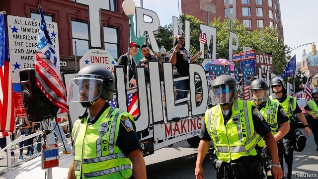

###### Dire straights

# Straight pride struggles to catch on 

 

> print-edition iconPrint edition | United States | Sep 7th 2019 

“IT’S HARDER to come out as conservative than gay,” complains David Elkins, a pensioner whose T-shirt reads “It’s OK to be white, straight, and male”. Luckily he found acceptance at Boston’s first straight-pride parade. Behind him a clown with a rainbow wig and green face-paint wandered past a truck festooned with “Trump 2020” posters, and a child held a sign that says “Make normalcy normal again.” The music in the background veers from “YMCA” (an odd choice) to “God Bless the USA”, before settling on a disco number whose chorus is just the word “freedom” sung over and over. “We don’t hate gay people,” insists Dawn, who is reluctant to give her surname, and stands amid a sea of American flags. “Some of us used to be gay.” 

The event, held on August 31st, was organised by a group called Super Happy Fun America, which says it campaigns for heterosexuals, America’s “oppressed majority”. As the group’s name suggests, its intention was partly to troll critics and provoke them into outrage. The language on its website often mockingly mirrors that used by social-justice activists. Some LGBT activists thought it was best to ignore the parade and starve it of attention. Others felt compelled to oppose it. The roughly 200 people who attended it were vastly outnumbered not just by the almost 1,000 counter-protesters, but also by the police keeping the groups apart. 

Debates over gay rights have largely taken a back seat in the current round of America’s culture wars, compared with issues of race and gender. (This is less true of transgender rights.) Polling by the Pew Research Centre shows that almost two-thirds of Americans, including nearly half of Republicans, now support gay marriage. Straight pride, which has lived for years on the fringes of social media, has struggled to catch on; analogous movements like men’s-rights activism and white nationalism, both of which have inspired acts of terrorism, are far better known. 

Even among those at the parade, motivations varied. A few, like Lois, who had travelled from Los Angeles, warned darkly of “gay domination” and “schools teaching anal sex to five-year-olds”. Others, like Kristy, a transgender woman, said they just wanted to support free speech. Some brought signs supporting the president’s proposed border wall. “I’m only here to make the left look ridiculous, to draw them out and expose their true colours,” said Patrick. Many spent the entire parade filming the counter-marchers. 

Attitudes like Patrick’s made it tricky for the event’s critics to decide how to respond. The organisers of Boston’s gay-pride parade, which drew 750,000 people this year, released a statement saying they were “not interested in responding to their bait”. The counter-marchers, chanting slogans like “Boston hates you!”, disagreed. “I know they want to go home and say ‘I triggered a snowflake’, but it’s a stronger message to oppose them,” said Meghan Self, a schoolteacher. “To do nothing is to say it’s OK.” Many described their opponents, rightly or wrongly, as white supremacists; like a lot of the parade-goers, they saw this march as just another front in the culture wars, or the resistance to the president. 

The parade ended with speeches outside Boston’s city hall. The small audience cheered as one roared “I want to say it’s not OK to be gay,” but they seemed more hesitant when another, an African-American woman introduced only as Barbara from Harlem, said “Thank God for slavery”. Her tribute to America’s “Judeo-Christian principles” was interrupted by a cry of “not Judeo!”. A later speaker declared, “We are living in a time when bad is good and good is bad.” Many of the counter-protesters, kept far away with multiple layers of barricades, would probably have agreed.■ 
<<<<<<< HEAD

-- 

 单词注释:

1.dire[daiә]:a. 可怕的, 悲惨的, 阴沉的, 极端的 

2.Sep[]:九月 

3.david['deivid]:n. 大卫；戴维（男子名） 

4.elkin[]: [人名] [英格兰人姓氏] 埃尔金 Elias的昵称; [地名] [美国] 埃尔金 

5.pensioner['penʃәnә(r)]:n. 领取抚恤金者, (英国剑桥大学的)自费生, 为金钱所收买的人, 帮佣 [法] 领取退休金者, 领取抚恤金者 

6.luckily['lʌkili]:adv. 幸运地, 幸亏, 侥幸 

7.clown[klaun]:n. 小丑, 乡下人 

8.wig[wig]:n. 假发, 斥责 vt. 给...戴假发, 激怒, 使发狂 vi. 激动, 发狂 

9.festoon[fes'tu:n]:n. 花彩 vt. 结彩于 

10.normalcy['nɒ:mlsi]:n. 常态 

11.veer[viә]:vi. 转向 vt. 使转向 n. 转向 

12.ymca[]:abbr. 基督教青年会（Young Men's Christian Association） 

13.USA[ju: es 'ei]:美国, 美利坚合众国, 美国陆军 

14.disco['diskәu]:n. 夜总会, 迪斯科, 的士高 

15.amid[ә'mid]:prep. 在其间, 在其中 [经] 在...中 

16.heterosexual[.hetәrә'sekʃuәl]:a. 异性的, 异性爱的 n. 异性恋的人 

17.troll[trɒl]:vi. 滚动, 参加轮唱, 曳绳钓鱼 vt. 使转动, 轮唱, 高唱, 用曳绳钓(鱼) n. 转动, 轮唱, 钓绳 

18.provoke[prә'vәuk]:vt. 激怒, 惹起, 诱导 [法] 刺激, 煽动, 激怒 

19.outrage['autreidʒ]:n. 暴行, 侮辱, 愤怒 vt. 凌辱, 虐待, 触犯 

20.mockingly['mɒkiŋli]:adv. 愚弄地, 取笑地 

21.activist['æktivist]:n. 激进主义分子 

22.lgbt[.el dʒiː biː 'tiː]:[网络] 同志；跨性别者；双性恋和跨性别 

23.vastly['vɑ:stli]:adv. 广大地, 许多, 巨大 

24.outnumber[.aut'nʌmbә]:vt. 数目超过, 比...多 

25.gender['dʒendә]:n. 性 vt. 产生 

26.les[lei]:abbr. 发射脱离系统（Launch Escape System） 

27.transgender[trænzˈdʒendə(r)]:n. 变性人 

28.pew[pju:]:n. 教堂长椅, 会众, 座位 vt. 为(教堂)安装座位, 把...围在一起 

29.fringe[frindʒ]:n. 边缘, 端, 流苏, 穗, 初步 vt. 加穗于, 加饰边于 a. 边缘的, 附加的 

30.analogous[ә'nælәgәs]:a. 类似的, 相似的 [医] 类似的, 类同的 

31.activism['æktivizm]:n. 激进主义, 行动主义, 能动论 [法] 激进主义, 行动主义 

32.nationalism['næʃәnәlizm]:n. 民族主义, 民族特性 

33.terrorism['terәrizm]:n. 恐怖主义, 恐怖统治, 恐怖状态 [法] 胁迫, 暴政, 恐怖政治 

34.lois['lәuis]:n. 洛伊斯（女子名） 

35.los[lɔ:s]:abbr. 月球轨道航天器（Lunar Orbiter Spacecraft）；视线（Line of Sight） 

36.angeles[]:n. 安杰利斯（姓氏）；天使城（菲律宾地名） 

37.darkly['dɑ:kli]:adv. 暗, 黑, 呈黑 

38.domination[.dɒmi'neiʃәn]:n. 支配, 控制, 管辖 

39.anal['einәl]:a. 肛门的, 肛门附近的 [计] 分析员 

40.kristy[]:n. 克里斯蒂（女子名） 

41.patrick['pætrik]:n. 帕特里克（男子名） 

42.tricky['triki]:a. 狡猾的, 机敏的 

43.bait[beit]:n. 饵 vt. 以饵引诱, 欺负 vi. 中途休息 

44.Boston['bɒstәn]:n. 波士顿 

45.trigger['trigә]:n. 触发器, 扳机 vt. 触发, 发射, 引起 vi. 松开扳柄 [计] 切换开关 

46.meghan[]:梅根（人名） 

47.schoolteacher['sku:lti:tʃә]:n. 教师 

48.rightly['raitli]:adv. 合适地, 正当地, 正确地 

49.wrongly[]:adv. 错误地, 不恰当地, 不正确地, 不正直地, 不公正地 

50.supremacist[sә'premәsist, sju-]:n. 至上主义者 

51.hesitant['hezitәnt]:a. 迟疑的, 踌躇的, 犹豫不定的 

52.barbara['bɑ:bәrә]:n. 芭芭拉（女子名） 

53.Harlem['hɑ:lәm]:n. 哈莱姆(纽约一地区) 

54.tribute['tribju:t]:n. 贡物, 礼物, 颂辞 

55.barricade[.bæri'keid]:n. 路障, 障碍 vt. 设路障于, 阻碍 
=======
>>>>>>> 50f1fbac684ef65c788c2c3b1cb359dd2a904378

