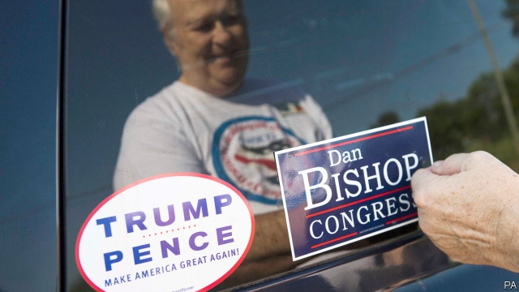
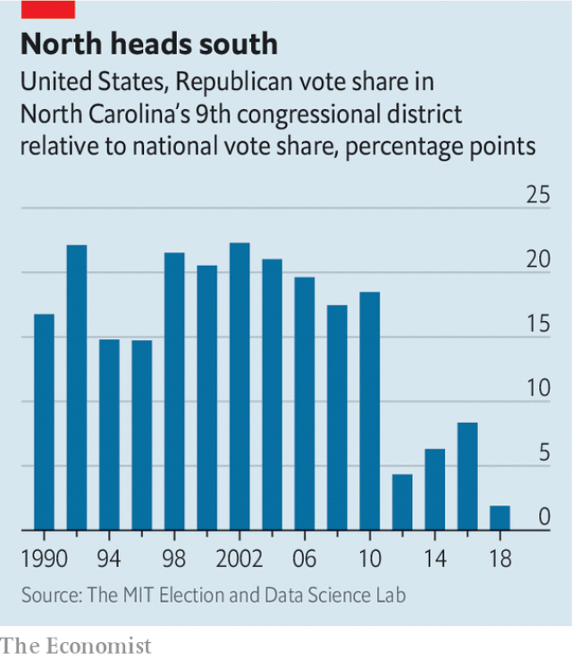

###### First in flight

# There is more to North Carolina’s special election than Donald Trump 

 

> print-edition iconPrint edition | United States | Sep 7th 2019 

THE MID-TERM elections in 2018 filled quietly and without notable controversy nearly all of the 435 seats in the House of Representatives. The election in North Carolina’s ninth congressional district was an exception. In the ten months since last November’s contest the district has been the focus of several trials for election fraud, a restructuring of the state election supervisory board and the departure of a discredited would-be congressman. After September 10th, if all goes according to plan, residents of the ninth district will at last have a representative in Congress. The race is close. In a district that has sent Republicans to Washington in every election since 1963, that alone is remarkable. 

The 2018 election in NC-9, which stretches from suburban Charlotte through the backwoods of the Tar Heel State, was invalidated in February 2019 after campaign operatives for the Republican candidate, Mark Harris, were accused of falsifying absentee votes. Leslie McRae Dowless, a low-level campaign organiser and the mastermind of the operation, has since been indicted for obstruction of justice, conspiracy to obstruct justice and unlawful possession of absentee ballots. Mr Dowless allegedly ran a similar scheme in the 2016 general election and the 2018 primary, in which Mr Harris defeated the incumbent Republican, Robert Pittenger. 

Mr Pittenger, who now works to educate parliamentarians in allied countries about surveillance, counterterrorism and intelligence-sharing, blames Mr Dowless for his loss in last year’s primary. “It was all fraud,” he says. Yet although he misses representing his fellow Carolinians in Washington—“I loved the job”—he did not seek the Republican nomination for next week’s special election. Instead the party picked Dan Bishop, a Republican state senator, to run for the seat. 

In more normal times Mr Bishop ought to be a shoo-in. Yet with every election seemingly a referendum on President Donald Trump, these are not those times. The tightness of the race is not only a Trump phenomenon, though. NC-9—which was once as friendly to Republicans as a church picnic on the lawn of a country club to celebrate Barry Goldwater’s birthday—has been becoming steadily more competitive for a decade as its fields and trees have been replaced by suburbs and parking lots. In 2006 voters in the district gave the Republican candidate a vote share that was 20 points higher than the nationwide Republican tally. In 2018 the district was leaning to the right by just 2 percentage points (see chart). Mr Harris defeated his 2018 Democratic challenger Dan McCready, an ex-marine, by a mere 900 votes last year (and that includes the cheating). 

 

In light of the seat’s newfound competitiveness, money has flooded in. According to number-crunching by the Centre for Responsive Politics, a non-partisan research group, Mr McCready has raised $4.7m, whereas Mr Bishop has raised $1.9m. According to political polling, the race remains close. One survey from Harper Polling found Mr McCready beating Mr Bishop by four percentage points—within the margin of error—while another survey from the Democratic firm ALG Research found the two candidates tied on 46% each. McCready appears to have a slight edge, but the election could go either way. With luck, this time nobody will stuff the ballot boxes.■ 
<<<<<<< HEAD

-- 

 单词注释:

1.Sep[]:九月 

2.quietly['kwaiәtli]:adv. 安静地, 沉着地, 秘密地 

3.notable['nәutәbl]:n. 著名人士, 值得注意之事物 a. 值得注意的, 显著的 

4.controversy['kɒntrәvә:si]:n. 论争, 辩论, 论战, 争论 [法] 论战, 争论, 争吵 

5.congressional[kәn'greʃәnl]:a. 会议的, 议会的, 国会的 [法] 代表大会的, 大会的, 议会的 

6.fraud[frɒ:d]:n. 欺骗, 欺诈, 诡计, 骗子 [经] 欺诈, 舞弊, 骗子 

7.restructuring[]:[计] 重构的 

8.supervisory[.sju:pә'vaizәri]:a. 管理的, 监督的, 管理人的 [经] 监督的, 管理的 

9.discredit[dis'kredit]:n. 无信用, 丢脸, 不名誉 vt. 不信, 怀疑, 使丢脸 

10.congressman['kɒŋgresmәn]:n. 国会议员, 众议院议员 [法] 国会议会 

11.Washington['wɒʃiŋtn]:n. 华盛顿 

12.suburban[sә'bә:bәn]:a. 郊外的, 郊区的, (贬)偏狭的, 土气的, 见识不广的 n. 郊区居民 

13.charlotte['ʃɑ:lәt]:n. 水果奶油布丁 

14.backwood['bækwjd]:n. 未开垦地, (偏僻的森林地带) 

15.tar[tɑ:]:n. 焦油, 柏油, 水手 vt. 涂以焦油, 玷污, 怂恿 a. 焦油的 

16.invalidate[in'vælideit]:vt. 使无效 [法] 使无效, 使无效力, 使作废 

17.operative['ɒpәrәtiv]:a. 动作的, 运转的, 有效的, 关键的, 手术的 n. 技工, 侦探 

18.harris['hæris]:n. 哈里斯（英国苏格兰一地区）；哈里斯（姓氏） 

19.falsify['fɒ:lsifai]:vt. 伪造, 歪曲 vi. 说谎 

20.absentee[.æbsәn'ti:]:n. 缺席者, 不在者 [经] 缺勤者, 缺席者, 未到工者 

21.leslie['lezli, 'lisli]:n. 莱斯利（男子名） 

22.McRae[]:n. (McRae)人名；(英)麦克雷 

23.dowless[]:[网络] 没事 

24.mastermind['mɑ:stәmaind]:n. 优秀策划者, 才子 vt. 指导, 主持, 策划 

25.indict[in'dait]:vt. 起诉, 控告, 指控 [法] 控告, 揭发, 对...起诉 

26.obstruction[әb'strʌʃәn]:n. 障碍, 妨碍, 闭塞物 [医] 梗阻, 不通 

27.conspiracy[kәn'spirәsi]:n. 同谋, 阴谋, 阴谋集团 [法] 阴谋, 通谋, 共谋 

28.obstruct[әb'strʌkt]:vt. 阻隔, 妨碍, 阻塞, 遮没 vi. 设障碍 

29.unlawful[.ʌn'lɒ:ful]:a. 非法的, 不正当的 [法] 不法, 不法的, 非法的 

30.ballot['bælәt]:n. 投票, 投票用纸, 抽签 vi. 投票, 抽签 vt. 投票选出, 拉选票 

31.allegedly[ә'ledʒidli]:adv. 依其申述 

32.incumbent[in'kʌmbәnt]:a. 现任的, 依靠的, 负有义务的 n. 领圣俸者, 在职者 

33.Robert['rɔbәt]:[法] 警察 

34.pittenger[]: [人名] 皮滕杰 

35.parliamentarian['pɑ:lәmen'teәriәn]:n. 议会法规专家, 国会议员, 熟悉议会法规而又有经验的议员 

36.ally['ælai. ә'lai]:n. 同盟者, 同盟国, 助手 vt. 使联盟, 使联合, 使有关系 vi. 结盟 

37.surveillance[sә:'veilәns]:n. 监视, 监督 [电] 侦测 

38.counterterrorism['kaʊntəˌterərɪzəm]:n. 以恐怖反恐怖主义, 报复性恐怖主义 

39.Carolinian[kærә'liniәn]:n. 美国北[南]卡罗莱纳州人 

40.nomination[.nɒmi'neiʃәn]:n. 提名, 任命, 提名权 

41.dan[dæn]:n. 段(柔道、围棋运动员的等级) [建] 小车, 空中吊运车, 杓 

42.senator['senәtә]:n. 参议员, (某些大学的)理事 [法] 参议员, 上议员 

43.seemingly['si:miŋli]:adv. 看来似乎, 表面上看来 

44.referendum[.refә'rendәm]:n. （就重大政治或社会问题进行的）全民公决，全民投票 

45.tightness['taitnis]:n. 坚固, 紧密 [化] 紧度; 严密度 

46.Barry['bæri]:n. 巴里（男子名） 

47.voter['vәutә]:n. 选民, 投票人 [法] 选民, 选举人, 投票人 

48.tally['tæli]:n. 符木, 记账, 得分, 比分, 计数器, 标签, 符合, 对应物 vt. 记录, 点数, 计算, 加标签于, 使符合 vi. 记帐, 符合, 吻合, 记分 [计] 计数 

49.challenger['tʃælindʒә]:n. 挑战者 [经] 申请回避的人 

50.McCready[]:n. (McCready)人名；(英)麦克里迪 

51.newfound['nju:fajnd]:a. 新发现的 

52.competitiveness[]:[经] 竞争 

53.responsive[ri'spɒnsiv]:a. 回答的, 应答的, 易感应的 

54.politic['pɒlitik]:a. 精明的, 明智的, 策略的 

55.Harper['hɑ:pә]:n. 哈珀（英语姓氏） 

56.ALG[]:[计] 算法 [医] 抗淋巴细胞球蛋白 
=======
>>>>>>> 50f1fbac684ef65c788c2c3b1cb359dd2a904378

