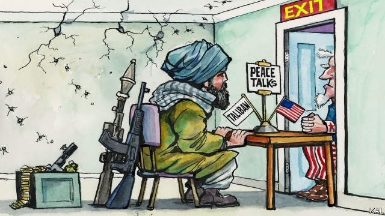

###### Lexington

# Trumped by the Taliban 

 

> print-edition iconPrint edition | United States | Sep 7th 2019 

AFGHANS OFTEN celebrate auspicious events with volleys of gunfire. The Taliban went one further on September 2nd by detonating a suicide-bomb in Kabul just as an American diplomat, Zalmay Khalilzad, was confirming the outline of the draft settlement he has negotiated with the jihadist group. Up to 30 people were reported killed in the blast. Half a dozen more were shot and wounded by police in the protests that followed. 

The violence underlined why the draft agreement, which would cover an initial withdrawal of around 5,000 of America’s 14,000 troops in Afghanistan within five months, has been cautiously welcomed by many sceptics. The Taliban control much of the country, cannot be defeated and the war’s toll on Afghans is intolerable. It also indicated how much America, 18 years after it bombed the jihadists from power, has capitulated to them. 

Mr Khalilzad, a former ambassador to Afghanistan, set three conditions when launching peace talks with the militants in Doha a year ago. America would consider withdrawing only if they agreed to a ceasefire, recognised Afghanistan’s government as a negotiating partner, and renounced their former alliance with al-Qaeda. This offer was itself a significant climb-down. 

Under George W. Bush, America refused to negotiate with the Taliban. Under Barack Obama, it started to, but stopped after Afghanistan’s government—at whose behest America claims to be operating—objected. Donald Trump’s decision to revive the talks over President Ashraf Ghani’s more vociferous protests was therefore a big concession to the militants, even if justified by their strength. Yet Mr Khalilzad seems to have won little by this gamble. 

Though he has released few details of the draft agreement, he appears to have dropped all but his third condition. The Taliban have agreed to participate in an intra-Afghan dialogue while the Americans draw down, but have not recognised the government, which has been excluded from the talks. Last weekend Mr Khalilzad let Mr Ghani read a copy of the draft, provided he hand it back afterwards. As the slaughter in Kabul indicates, the militants have also refused to countenance a ceasefire or discuss a more lasting settlement. Beyond maintaining their commitment to re-establishing an Islamist regime, they have not indicated what power-sharing or constitutional arrangement they might be willing to accept short of total victory. That raises obvious concerns about their commitment to peace—without which it is hard to imagine how their anticipated promise to cut their cord to foreign terrorists could be verified, especially in the absence of American troops. 

This is dispiriting but not surprising. As the war has dragged on, the American government’s leverage over the Taliban has been eroded by its floundering and their success. According to Ronald E. Neumann, a former ambassador to Kabul, America has undertaken nine major policy shifts in Afghanistan—or three per sitting president—since launching the war. Mr Bush was against nation-building, then for it. Mr Obama ramped up the war, then ended it. Mr Trump lambasted the war for years, seemed momentarily energised by the prospect of succeeding where his predecessor failed, and now—aching for a foreign-policy win—may simply want the troops out before next year’s election. No wonder the Taliban’s leaders, at the helm of a profitable insurgency and confident of victory sooner or later, are not minded to compromise. 

To stand a fair chance of arresting Afghanistan’s descent to civil war, America will have to persuade the militants it has more sticking-power than they think. Mr Khalilzad implies it is willing to. He maintains the withdrawal will be “conditions-based”, which suggests it could go into reverse if the Taliban do not get more enthusiastic about peacemaking. And indeed, Mr Trump has better cards than the militants may imagine. With another 8,000 Western troops in Afghanistan, the alliances that sustain America’s effort look solid. Neighbouring Pakistan and China helped push the militants to the table. And America’s current level of commitment to Afghanistan appears sustainable; Congress and the media generally ignore the conflict. 

There are two problems with this somewhat hopeful case. Mr Trump may prefer to fold. His supporters want an end to America’s wars almost as much as a border wall—and, having failed to wall off Mexico, he may consider the former campaign promise easier to keep. That would be consistent with an emerging paradox of his presidency. His unorthodoxy has consistently created novel opportunities—a possible splurge on infrastructure at home; a peace process with the Taliban abroad—that his personal shortcomings make him especially unlikely to realise. 

More fundamentally, ushering the Taliban and government to the table, and keeping them there, would require a degree of political nous and flexibility that America lacks above all else in Afghanistan. Its efforts have been disjointed, with soldiers, diplomats and spies pushing conflicting priorities that only the faraway president can adjudicate between. Hence the policy shifts, as Mr Bush and his successors flitted from one recommendation to the next, often in response to domestic pressures. The complex politics of a country torn by war and ethnic rivalry, and between modernity and tradition, have rarely penetrated that self-absorbed process. 

The limited understanding of American political officers, cycled in every six months or so, has made matters worse. Mr Neumann recalls his unsuccessful effort to persuade Mr Ghani’s predecessor to sack a provincial governor convicted of selling heroin in America. It was months before the then ambassador learned that the president owed a big favour to the drug-pusher’s father. Remember that next time you hear politicians cudgelling each other with arguments for and against state-building. There is little recent evidence that America is capable of it. Even the more modest task of saving Afghanistan’s current shaky structure may be beyond it.■ 

