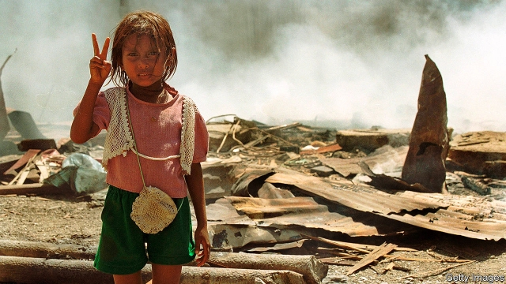

###### Gong wrong

# A row about medals reveals disputes about East Timor’s history 

 

> print-edition iconPrint edition | Asia | Sep 12th 2019 

THE PRISON in the six interconnected bungalows of Comarca became notorious during the 24 years that Indonesia occupied East Timor. Many of those locked up there for resisting the occupation did not survive its torture cells. Comarca is now occupied by Centro Nacional Chega! (CNC), an institution set up in 2016 to continue the work of the truth commission established after the Timorese voted for independence in a UN-supervised referendum in 1999. 

Comarca has in recent weeks been receiving more foreign visitors than usual. Many were in Dili for a party to mark the 20th anniversary of the referendum on August 30th. The Timorese paid a big price for freedom. The Indonesian army and its local militias went on the rampage, killing at least 1,400 Timorese and reducing the country to ashes. Recently declassified American documents show that the American and Australian governments knew about the Indonesian army’s intentions for months, but did nothing. They acted only when the country was already burning. 

The truth commission’s report, published in 2005, includes a long list of recommendations to prevent the recurrence of atrocities. But the Timorese government chose to ignore them, partly so as not to upset Indonesia, its powerful neighbour, and partly because of internal opposition. The report was left to gather dust in churches and libraries. 

The CNC’s director, Hugo Fernandes, wants to make sure East Timor “will learn from its past and knows its own history”. Every group in East Timor has developed its own narrative of the struggle for independence, casting itself in a pivotal role. The trick, he says, is “to balance these into one communal history.” 

It was partly with that aim that the government in 2009 created the “Order of Timor-Leste”, the highest national honour, to acknowledge locals and foreigners who have “contributed significantly” to the country. Taur Matan Ruak, the prime minister and a former resistance fighter, says it is important to give young Timorese “altruistic role models”. 

Some in government wanted to mark the anniversary by conferring the order on countries and institutions that helped in the independence struggle. Bill Clinton and Kofi Annan, respectively the American president and UN secretary-general at the time of the referendum, were both named as recipients. But others argued the outside world did too little, too late and that East Timor should rather reward individuals who had taken personal risks for the country. Several journalists who drew attention to abuses under Indonesian occupation, including your correspondent, made the list. At the last minute, however, the president decided to add two UN officials who had worked on East Timor. Since there were no spare medals for the presentation ceremony, that meant another prospective recipient had to be dropped. 

Saskia Kouwenberg, a Dutch journalist and human-rights campaigner who managed to smuggle out footage of an Indonesian massacre in 1991, was abruptly removed from the list of recipients. Her snubbing enraged civil-society groups. They organised an alternative “popular solidarity award” for her. The ceremony took place in the forecourt of Comarca, neatly fulfilling its mission to grapple with conflicting versions of the past. ■ 

