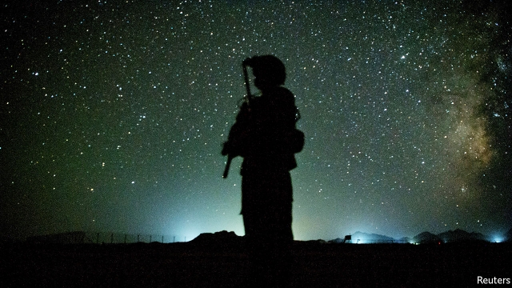

###### No retreat

# America calls off negotiations to end its 18-year war in Afghanistan 

 

> print-edition iconPrint edition | Asia | Sep 12th 2019 

IN THREE TWEETS (how else?) President Donald Trump upended more than a year of painstaking American negotiation with the insurgents of the Taliban, who have been fighting to overthrow the American-backed government in Afghanistan for 18 years. First Mr Trump revealed that Taliban leaders had been due to meet him at Camp David, the presidential country retreat. Then, he explained, he had learned about a Taliban suicide-bombing in Kabul on September 5th that had killed an American soldier along with 11 others. 

“I immediately cancelled the meeting and called off peace negotiations,” Mr Trump declared on September 7th. He continued: “If they cannot agree to a ceasefire during these very important peace talks, and would even kill 12 innocent people, then they probably don’t have the power to negotiate a meaningful agreement anyway.” Two days later he repeated his decision, saying that the talks were “dead”. 

Mr Trump’s change of heart came less than a week after his negotiator, Zalmay Khalilzad, had announced that a deal had been reached in principle to begin winding up America’s longest war. Mr Khalilzad said the accord with the Taliban would see 5,400 of America’s 14,000 troops leave in the next four-and-a-half months. A fuller withdrawal was expected over the next year or more. 

Yet Mr Khalilzad was vague about what the Taliban would give in return. The details have not been published, but there seems to have been a pledge not to harbour foreign militants such as al-Qaeda. No ceasefire was promised. Instead, there was talk of reducing violence around American bases. Afghan forces, which already bear the brunt of the conflict, do not seem to have been offered any reprieve. 

Opinion against Mr Khalilzad’s deal hardened as indiscriminate bombings in Kabul killed dozens of civilians. Nine former American envoys to Afghanistan warned that a hasty withdrawal would only intensify the civil war. The Afghan government, led by Ashraf Ghani, expressed grave misgivings. 

Was it cold feet about the deal that caused Mr Trump’s reversal? Or was it an attempt to wheedle more concessions out of the Taliban? If the latter, it may backfire. The Taliban have never trusted American promises. They say they remain committed to talks, but this volte-face will only deepen their mistrust. Meanwhile Mr Ghani, sidelined until now, is no doubt relieved. The Taliban had wanted him to call off presidential elections at the end of the month, which he is hoping to win. He used his strengthened hand to call for direct talks with the Taliban, something the insurgents have steadfastly refused—although the now-scrapped deal did involve a woolly national dialogue in which both the Taliban and the government would have taken part. 

The Taliban and America have said they will now redouble military operations. Heavy fighting is expected. Mike Pompeo, America’s secretary of state, crowed earlier this week that 1,000 Taliban fighters had been killed in the past ten days alone. Despite his bravado, however, the military realities have not changed. The Taliban are slowly gaining ground and control much of the countryside, but, thanks to American backing, and especially air support, the Afghan army retains control of all the cities. A “political settlement” remains the only way to end the conflict, as General Austin Miller, the commander of American forces in Afghanistan, recently affirmed. 

In his tweets Mr Trump asked of the Taliban, “How many more decades are they willing to fight?” The answer is probably longer than Mr Trump. This suggests that, sooner or later, the talks will resume. ■ 

