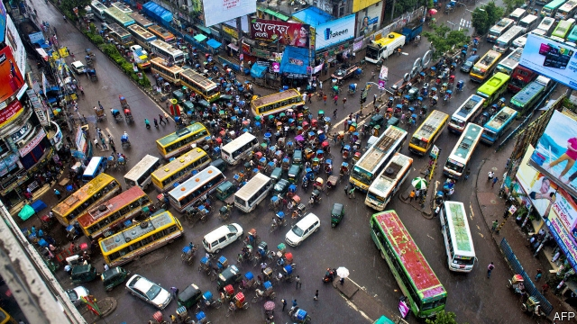

###### Life after Dhaka

# Bangladesh tries to muffle the siren song of the capital 

 

> print-edition iconPrint edition | Asia | Sep 12th 2019 

INDUSTRIAL ZONES, residential developments, clinics and universities—the mayor of Mongla’s ideas for his town’s expansion seem a bit ambitious. Mongla has a mere 40,000 people; his office is in a crumbling building hemmed in by forest. But in five years, Zulfikar Ali insists, Mongla will be a regional economic hub, accommodating thousands of migrants drawn by rapid industrialisation and pushed by the loss of agricultural land to the rising sea. (Already, the sea is eating away at the surrounding low-lying delta region.) “I want to be ready,” he says. 

In 1974 just 9% of Bangladeshis lived in towns or cities. Today 37% of the country’s 170m people do. In a few decades more than half will. The capital, Dhaka, which attracts the majority of rural migrants, has grown from 3m in 1980 to 18m today. It is “already bursting at the seams”, says Saleemul Huq of the International Centre for Climate Change and Development, a think-tank trying to bolster education and employment in eight places, including Mongla, to help absorb migrants. 

The surge of labour into Dhaka has powered Bangladesh’s brisk economic growth, which has averaged 6.5% a year over the past decade. Dhaka generates 35% of the country’s GDP. The fast-growing garment industry, which supplies around 11% of GDP, employs lots of internal migrants. 

But growth has come at a price. According to an index compiled by the Economist Intelligence Unit, a sister company to The Economist, Dhaka, notorious for traffic jams and pollution, is the world’s third-least liveable city. Some 60% of residents live in makeshift structures, according to the Centre for Urban Studies (CUS), another think-tank. Many of these slum-dwellers lack access to clean water and sanitation and are at constant risk of eviction. 

In such conditions diseases—especially waterborne ones—thrive. Frequent bouts of illness that stop slum-dwellers from working keep them trapped in poverty, says Abdus Shaheen of Water & Sanitation for the Urban Poor, an NGO. “This, of course, hampers the wider economy, too,” he adds. 

There is also an environmental cost. Every day 1.1m cubic metres of sewage are pumped into Dhaka’s rivers. As the city has expanded into nearby wetlands, a natural drainage system has been destroyed, increasing the risk of floods. 

These problems stem from a combination of too much centralisation and too little urban planning, says Nazrul Islam of CUS. The government was taken unawares by the rapid growth of the garment industry. There was no effort to provide low-cost housing or services, he laments. 

Some 30 years later, the government is no longer ignoring the problem. The ruling Awami League, elected for a third consecutive five-year term in December, is trying to curb migration from rural areas by providing villages with the same facilities as urban areas, including reliable power and access to the internet. 

Decentralisation is also on the agenda. The government has been creating new local authorities and giving them more money for development. To foster growth outside Dhaka, 100 industrial zones are to be built over the next decade. Eleven were inaugurated earlier this year, including one in Mongla. 

Meanwhile, in Dhaka, a metro system is under construction. RAJUK, the city’s planning authority, is working on a plan for orderly expansion to the north and east. The World Bank has approved a $100m project to improve public spaces and municipal services in four of the city’s poorer neighbourhoods. 

But neither in Dhaka nor around the new industrial zones are there plans for lots of cheap housing, notes Mahfuja Aktar, a planner at RAJUK. (The mayor of Mongla wants to build some, but has not yet received government approval.) Moreover MPs, who fear their clout will diminish, are resisting decentralisation. Nonetheless, Mr Islam is optimistic: Dhaka has become so dysfunctional, he argues, that the government has no choice but to plan better. ■ 

