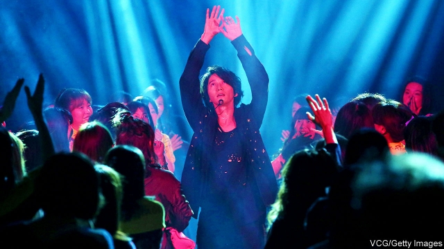

###### Going for pot

# Japanese law and social mores still treat users of soft drugs severely 

 

> print-edition iconPrint edition | Asia | Sep 12th 2019 

UNTIL HIS dramatic mea culpa in June, Junnosuke Taguchi was just another pop star-turned-minor actor. Dressed in funereal black, Mr Taguchi (pictured) prostrated himself in contrition before a scrum of reporters after his release on bail for drugs charges. A police raid on his apartment in Tokyo had uncovered rolling papers, a seed-grinder and 2.2 grams of marijuana (enough to roll a couple of joints). 

While other countries legalise marijuana or instruct the police to turn a blind eye to casual use, Japan maintains strict prohibition. Possession is punishable by up to five years in prison—seven if the intent is to profit from distribution. Teams of detectives are dispatched to raid the homes of pot-smokers in remote rural areas. Every summer police comb the cooler northern countryside for wild cannabis, methodically pulling up millions of plants and incinerating them in bonfires. 

Strict enforcement of the Cannabis Control Act leaves most young people with little exposure to the sort of drug-taking that is commonplace elsewhere, says an official with the justice ministry, and so narrows the “gateway” to harder substances. Hard drugs are indeed vanishingly rare: police reported only 14 heroin-related crimes last year. But the anti-cannabis regime is not purely punitive. Nearly half of offences go unprosecuted, and even those that are often end in suspended sentences. The emphasis, at least for young, first-time offenders, is on rehabilitation. 

Worse than the official penalties, in most cases, is the stigma that comes from getting caught with drugs of any kind. Mr Taguchi’s career will be lucky to survive. Pierre Taki, an actor and musician, has disappeared from public view since his conviction in June for taking cocaine. NHK, the country’s largest broadcaster, scrubbed his scenes from a TV series, including some that had already aired. Mr Taki’s father felt obliged to offer a public apology for the misconduct of his son, who is 52. 

Japan’s relative social cohesion helps to curb its appetite for drugs, says Yuko Kawanishi, a sociologist of mental health. But social norms are not entirely consistent, she argues. In the absence of alternatives, many Japanese self-medicate with booze, she points out: “A lot of drinking considered normal in Japan would be labelled alcoholic elsewhere.” To the extent that any drug is common, it is methamphetamines, often taken to help users with punishing work schedules. An official was recently dismissed from the education ministry after being caught using stimulants, traces of which were found at his office. 

Once addicted, many people stay that way because there is little help for abusers, says Yasuhiro Maruyama of Rissho University. Few in Japan see much distinction between soft and hard drugs, he says. To most, “cannabis means all illegal drugs.” 

Mr Maruyama is one of many who wonder whether Japan can keep the world at bay. The taboo on pot appears to be easing among the young. Last year over 3,500 people were arrested on cannabis-related charges—a record, but still far below the levels that prevail in other rich countries. With Tokyo bracing for the arrival of millions of tourists for the Olympic Games next year, the organisers have warned them to leave their stashes at home.The line on cannabis may be softening elsewhere, says the justice ministry official, but such talk has no place in Japan. ■ 

