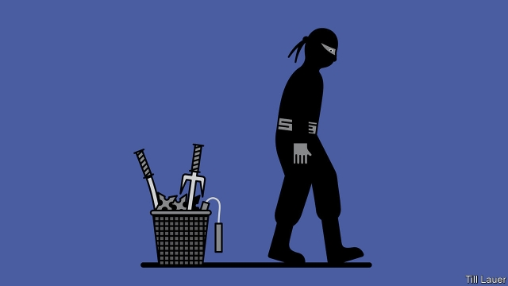

###### Banyan

# Japanese spies, once renowned, have fallen on hard times 

 

> print-edition iconPrint edition | Asia | Sep 12th 2019 

IT IS RARE for James Bond to pass up a martini. But on a visit to Japan in 1967, in “You Only Live Twice”, he opts for sake—served at 98.4°F (36.9°C). “For a European, you are exceptionally cultivated,” enthuses Tiger Tanaka, a Japanese spymaster. Mr Tanaka is a suave, Suntory-sipping spook who runs a ninja school in a remote castle, and helps Mr Bond storm the bad guy’s volcano lair. 

In reality, Mr Tanaka would scarcely have a licence to snoop, let alone kill. When Banyan asked a former American intelligence official for his judgment on Japan’s spies, the answer was simple: “pretty woeful”. In a new book—“Special Duty: A History of the Japanese Intelligence Community”—Richard Samuels, a professor at MIT, explains why that is so. 

The history of Japanese espionage is filled with derring-do, from sabotage in Tsarist Russia to stealing secrets in Latin America. But that came to an end with Japan’s defeat in the second world war. The American occupiers forced Japan to disband its army and renounce war. As part of the same process of pacification, Japanese intelligence was shrunk, divided into squabbling units and focused narrowly on communists at home and trade secrets abroad. It has since recovered a little. Japan now boasts first-rate spy satellites. When the long-serving national security adviser retires on September 13th, the country’s top spy chief will replace him. But despite growing threats, change has been slow. 

Part of the problem is that the police run the show. Cops have always led the Cabinet Intelligence and Research Office (CIRO), the main intelligence agency, and held important jobs in almost all others. Police have stymied reform by leaking proposals, and their bureaucratic skirmishing with diplomats and soldiers has, at times, been crippling. 

A related problem is that politicians’ and bureaucrats’ risk-aversion does not lend itself to the messy business of old-fashioned human intelligence. According to Mr Samuels, Junichiro Koizumi, the prime minister of the day, told his colleagues in 2005 that Japan had “destroyed its intelligence capabilities” and needed more “ninjas”. But in 2015 Shinzo Abe, Mr Koizumi’s successor, rejected his own party’s plans to create a ���Japanese-style CIA”. One retired officer tells Mr Samuels that too little has changed: “We do [human intelligence], but not a lot of it, and not as covert action.” And perhaps not all that well. Since 2015 nine Japanese nationals have been arrested in China for espionage. Depressingly, some see that as an encouraging sign. At least Japan is trying. 

In theory, tech-savvy Japan should be better off when it comes to electronic espionage. Its armed forces have submarines, ships and planes that are good at hoovering up Chinese and North Korean radar and other signals, says the former American official. “But you don’t get good intelligence”, he points out, “unless you get them close.” 

Nor is it easy for Japan to hack phones and computers. Cyber-security spending jumped by over a third between 2018 and 2019, to 85bn yen ($770m), and the number of cyber-warriors will grow from 150 at present to 500 in five years. But most of that is for parrying intrusions from China and North Korea, rather than actively stealing secrets. Japanese officials admit that their would-be hackers are hobbled by strict privacy laws that limit what they can do on domestic networks, and by self-imposed constraints on offensive action. 

Espionage, in any case, requires secrecy. “I never travel in the streets of Tokyo,” Mr Tanaka tells Mr Bond from his office in an underground railway. “In my position, it would be most unwise.” His real-world counterparts are said to be more lax. During the cold war, Mr Samuels recounts, Japan was an open book to the Soviet Union, China and North Korea, prompting America to withhold intelligence. In 2013 Mr Abe passed a landmark state-secrets law, but the system remains leaky. 

That makes others reluctant to share secrets. Japan has long wanted to get closer to the Five Eyes pact, in which the signals-intelligence agencies of America, Australia, Britain, Canada and New Zealand share the fruits of their spying. In 2017, amid rising nuclear tensions with North Korea, Japan (with South Korea) was invited to a Five Eyes conclave for the first time. Several meetings have followed, building trust. “Japan wants to be the sixth eye,” says a Western diplomat in Tokyo. That, says the American official, is not on the cards. Asked why, he says, bluntly: “They’re not bringing anything to the table.” 

