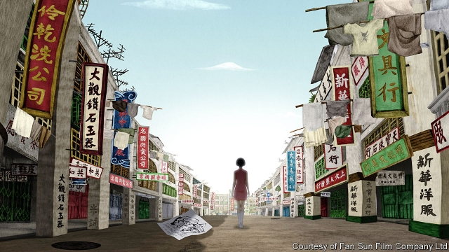

###### The air of freedom

# A counter-revolutionary love story from Hong Kong 

 

> print-edition iconPrint edition | Books and arts | Sep 12th 2019 

DURING THE courtship at the heart of “No. 7 Cherry Lane”, an animated film from Yonfan, a 71-year-old auteur, the streets of Hong Kong erupt in violent protest. Police in riot gear and gas-masks face down crowds of angry youths who are calling for the downfall of an authoritarian government. It is 1967, when Chinese Communist agitators fuelled riots that rocked the territory, then under British colonial rule. “This is revolution,” marvels Fan Ziming, a university student, looking on from a safe distance. Mrs Yu, his 40-year-old love interest, is unimpressed, having lived through the civil war in China. “This is not revolution,” she snaps back. “I’ve experienced the real thing.”  

The echoes of the current unrest in Hong Kong may be coincidental, but they are inescapable. “No. 7 Cherry Lane”, which was screened last week at the Venice Film Festival, is a surreal, erotically charged story in which Mrs Yu competes with her 18-year-old daughter Meiling for the affections of Ziming, an English tutor. But it is also, more subtly, a conservative rebuke to youthful rebellion, and a paean to elders and to bridging differences between generations. Yonfan, who won the festival’s screenplay prize, dedicated the film to Hong Kong, calling it a “love letter” to the territory. But his may not be the sort of affection that today’s protesters appreciate. He loves Hong Kong both as it was in 1967, and as it is now under Chinese rule.  

The director was born in China on the eve of the revolution; his family eventually settled in Taiwan, where he grew up under the dictatorship of Chiang Kai-shek. He describes breathing “the air of freedom” when, aged 16, he rode the Star Ferry after his arrival in British-controlled Hong Kong in 1964. Yonfan had been urged by friends to stay quiet about today’s protests while in Venice—but he couldn’t. He sees them as violent, lawless and unnecessary; he had no quarrel with the extradition bill, backed by the mainland government, which sparked the upheaval (and which Carrie Lam, Hong Kong’s chief executive, finally withdrew on September 4th). He says he does not feel the tightening of liberties that has driven hundreds of thousands, even millions of people into the streets; like others sympathetic to the authorities, he disputes those high crowd counts. “In Hong Kong”, he insists, “I feel free, everywhere, all the time.”  

Casual fans of the films Yonfan began making in the 1980s might have missed his particular strain of conservatism. For example, “Bishonen” (1998) was groundbreaking for its explicit exploration of gay romance. “No. 7 Cherry Lane”, his first feature film in a decade, lingers on Mrs Yu’s frank sexual fantasies in lurid dream sequences. In an early set piece, inspired by a classic Chinese story, she imagines herself as a nun who is kidnapped by a brute and taken to a forest clearing, her naked body set upon by snakes, then by her kidnapper. She tears away the brute’s face to reveal Ziming. He also attracts the lustful eye of Mrs Yu’s upstairs neighbour Mrs May, a transvestite and retired actor, now a recluse with her butler and cats. In another fantasy sequence, Mrs Yu stretches out languorously on a sofa, imagining a shirtless Ziming with a pair of cats scratching and licking his chest.  

By contrast, Ziming’s courtship of Mrs Yu is chaste and old-fashioned. Every Saturday he takes her to the cinema, where they watch matinée screenings of classic French films, all starring Simone Signoret, which reinforce Yonfan’s theme of an older woman’s romantic appeal to a younger man. Infatuated with Ziming herself, Meiling jealously follows her mother on these dates and almost ends up bagging him, in a rough approximation of “The Graduate” (a title which appears in the film on a cinema marquee). At one point Meiling declares that “tomorrow belongs to me”. 

To Yonfan, though, this is the misplaced arrogance of youth. In his telling, Mrs Robinson gets the boy. In a show of filial piety, Meiling finally gives up her pursuit and wishes her mother happiness. Tomorrow may belong to the young, Yonfan says, but they should get there in “the right way”. “This is a movie of reconciliation,” he explains. “Yesterday, today, tomorrow. Yesterday is the mother. Tomorrow is the daughter. But in my movie, they reconcile.” 

There is an acute irony in an independent Hong Kong film carrying (albeit subtly) a pro-establishment message. In the past some Hong Kong directors, including Yonfan, enjoyed a global reputation for an avant-garde playfulness with social and artistic conventions, which their inhibited counterparts on the mainland only occasionally matched. But Hong Kong’s masters have receded from the international film circuit in recent years. In this century some of China’s and Hong Kong’s most daring film-makers have been embraced by the authorities. Critics think several have been co-opted, their films subject to official censorship as a price for access to the most lucrative Chinese-language market.  

Yonfan is not in that category. As with his previous films, he took no official funding for “No. 7 Cherry Lane”. He did not submit it to censors in Beijing as he is not seeking a theatrical release on the mainland (though the movie was animated in Beijing, by Zhang Gang). This time, however, his avant-garde statement is to make a film that, in its eccentric way, stands squarely in opposition to the rebellious zeitgeist of Hong Kong today. Yonfan does not care if Hong Kongers boycott his film because of his anti-protest sentiments, on-screen and off: “I made this movie for me.” ■ 

