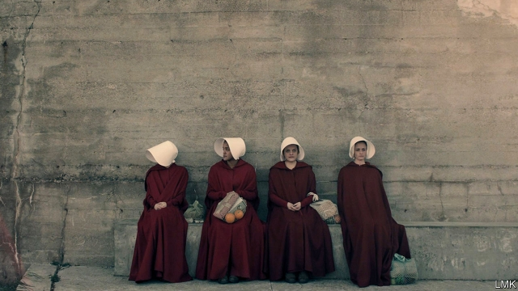

###### Return to Gilead

# The sequel to “The Handmaid’s Tale” explores the workings of repression 

 

> print-edition iconPrint edition | Books and arts | Sep 12th 2019 

The Testaments. By Margaret Atwood. Nan A. Talese; 432 pages; $28.95. Chatto & Windus; £20  

THEY STOOD in a line outside the Capitol while senators considered a health-care bill that would restrict family-planning services. They reappeared in Washington to watch over the confirmation hearings of Brett Kavanaugh, a controversial Supreme Court justice. In Ohio’s statehouse they sat, heads bowed, as lawmakers discussed banning a common abortion procedure. Each time the protest was silent. Their long crimson gowns and winged white headdresses made the point. The uniform, borrowed from “The Handmaid’s Tale”, has become a universal symbol of women’s oppression. 

Although Margaret Atwood’s novel was published in 1985, for many readers it illuminates today’s politics more than any other work of literature. Some of its dystopian predictions about the rollback of reproductive rights now seem prophetic. “While we were moving away from Gilead for a while in the 20th century,” Ms Atwood told The Economist, referring to the oppressive theocratic state in her story, “we turned around in the 21st and started going back.” 

Women who agree with her have attended demonstrations across the world, dressed as her characters. At the marches for women’s rights in January 2017, protesters in America and elsewhere carried placards quoting the book, or drily insisting that this work of speculative fiction is not an “instruction manual” for governments. A television adaptation, featuring those now-iconic costumes, was first broadcast a few months later; at the White House Correspondents’ Dinner the next year, Michelle Wolf, a comedian, joked that if Mike Pence, America’s vice-president and a zealous evangelical Christian, had not already watched the show, he “would love it”. 

The contemporary influence of “The Handmaid’s Tale” is approaching that of George Orwell’s “Nineteen Eighty-Four”. Over 8m copies have been sold in English. In 2017 it was the most-read novel in America, according to Amazon. Ms Atwood quips that she “may be the only person on the planet who is such a beneficiary” of America’s rancour. More than three decades after the original, a sequel to the book, “The Testaments”, was published this week. 

“The Handmaid’s Tale” imagines that the American government has been overthrown by the Sons of Jacob, a fundamentalist Christian group. They murder the president and members of Congress—“they blamed it on the Islamic fanatics”—suspend the constitution and declare the Republic of Gilead. In this totalitarian state, men and women have strict roles. Men can be “Commanders” governing Gilead, “Eyes” (spies), “Angels” (soldiers) or “Guardians of the Faith” (sentries); some continue in professions deemed useful, such as doctors and accountants. Women can be Wives to Commanders, “Marthas” (household labourers), “Aunts” (disciplinarians for the regime) or “Handmaids” (surrogates who bear the Commanders’ children). The “Unwomen” who resist these roles are executed or dispatched to the Colonies, where they farm toxic land until they die. This system is explained by Offred (“Of-Fred”, the name of her Commander), a Handmaid. 

When Ms Atwood was writing that book in 1984, she wanted to imbue it with an uncanny realism, and sought biblical or historical precedents for every detail and policy in Gilead, amassing a box of newspaper clippings. The past is “filled with echoes”, she wrote in “The Handmaid’s Tale”. She had a point. The religious conservatism that was then sweeping America harked back to the country’s Puritan history. Communist regimes relied on primitive propaganda. The kind of public executions that provided voyeuristic thrills in medieval times remained popular in Saudi Arabia and Iran. Meanwhile, debate raged about feminism, sexual violence and abortion. 

After Donald Trump’s election, Ms Atwood came to be seen by some as a soothsayer. “The Handmaid’s Tale” laid out an extreme version of America’s pathologies, issuing a warning that what was once shocking could come to seem normal, as outrage devolved into complacency. Speak up about injustice while you can, it seemed to say. For Gilead “may not seem ordinary to you now, but after a time it will”, one character observes. 

Given the story’s status, when publication of “The Testaments” was announced last year, the reaction in the literary world was frenzied. Cyber-criminals undertook a long (though unsuccessful) campaign to hack the computers of Ms Atwood’s literary agents and steal the manuscript. Only a tiny number of copies were released for publicity—including a few for the judges of the Booker prize, who last week shortlisted “The Testaments” for the award. 

The new book leaps ahead of the TV series, which itself extended the drama of “The Handmaid’s Tale” far beyond Ms Atwood’s original novel. Set more than 15 years later, “The Testaments” has three main characters: Aunt Lydia, one of the architects of Gilead’s policies towards women; Agnes Jemima, Offred’s first daughter, who is still in Gilead; and Daisy, Offred’s second daughter, who, like her mother, has made it to the safety of Canada. The narrative alternates between their accounts. 

“The Handmaid’s Tale” described the new regime’s brutality from Offred’s perspective only, showing how a politician’s promise of a better future “never means better for everyone…it always means worse, for some”. The scope of “The Testaments” is wider. It uncovers Gilead’s inner workings: the ideological hypocrisies, the fragile alliances, the institutional rot. It highlights, through Aunt Lydia, the coercive tactics employed by repressive states. Having previously been a judge, when the coup takes place Lydia is imprisoned in a former stadium. She is locked in solitary confinement, tortured and given a choice that is not a choice: to co-operate or die. In these conditions, even the strongest wills can be tamed. “You take the first step, and to save yourself from the consequences, you take the next one,” Aunt Lydia says. 

Ms Atwood was inspired by the struggles for survival among the top brass of the Soviet Union and elsewhere. Yet fans hoping to glimpse the problems of the 21st century in the new book will be gratified, too. There are references to “the floods, the fires, the tornadoes, the hurricanes, the droughts, the water shortages, the earthquakes”, and to economic problems that make citizens scared—then resentful. Gilead corrals its outcasts “like sheep into fenced-in ghost towns with no food and water”. In an inversion of America’s vexed relationship with Mexico, people flee, “risking their lives walking north to the Canadian border in winter”. Other countries, after “refugee riots”, have closed their doors to the fugitives. 

For their part, the Commanders try to introduce a “Certificate of Whiteness” scheme, which fails. Women die after being forced to give birth to non-viable babies. A respected dentist is sexually abusing several young girls, but the victims feel they cannot come forward. “Even with grown women,” Aunt Lydia writes, “four female witnesses are the equivalent of one male, here in Gilead.” 

Yet if “The Handmaid’s Tale” was a warning, “The Testaments” has a more positive message. Both books end by affirming that the regime eventually falls, in epilogues which refer to a historical symposium of Gileadean studies. “The Testaments” shows that corruption and infighting help to bring about its demise from within. Ms Atwood says that it reflects a sense of hopefulness on her part. History, she thinks, proves that “you can keep some of the people down some of the time, and most of the people down most of the time, but you can’t keep all of the people down all of the time.” ■ 

