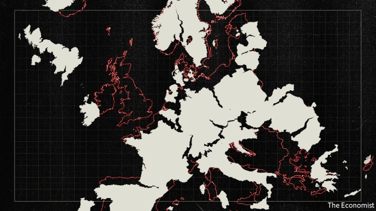
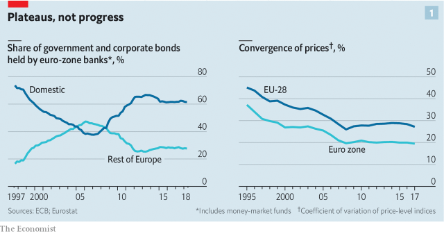
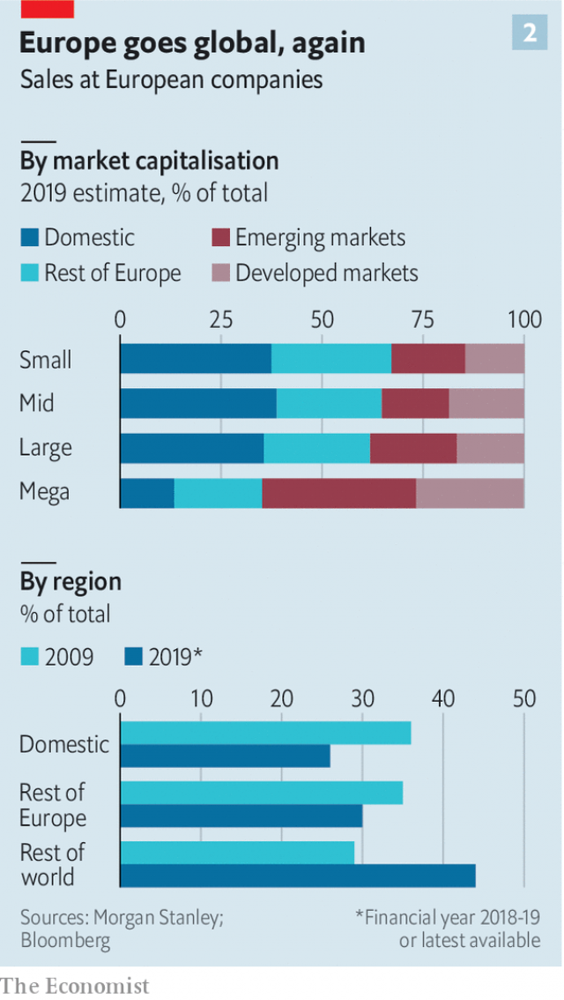

###### An unconscious uncoupling

# The economic policy at the heart of Europe is creaking 

 

> print-edition iconPrint edition | Briefing | Sep 12th 2019 

HELLO KITTY, a Japanese cat-girl with a bright pink bow, is an unusual mascot for European integration. But in July the cartoon character inadvertently became one. Sanrio, Hello Kitty’s owner, admitted to the European Union (EU) that it had granted trademark licences to business partners on the condition each would sell the ensuing Hello Kitty merchandise—from school bags to pencil cases and duvet covers—only in specified EU states. This attempt to treat Europe as a disjointed bundle of countries breaches an article of economic faith: that the EU’s 28 members are one single market. The European Commission doled out a €6.2m ($6.8m) fine. 

Maps of Europe still show its various countries separated by borders, some of them not much moved in centuries. Commercially, they are meant to be anachronistic. In theory, at least viewed from Brussels, the EU’s 500m citizens live in a single economic zone much like America, with nothing to impede the free movement of goods, services, people and capital. 

This single-market policy has underpinned Europe’s continued, if somewhat diminishing, importance to the global economy. But three decades after it was dreamed up, Europe’s commercial unification is creaking. In parts it is incomplete and in others actively going backwards. At a time when Britain is attempting to leave the EU and trade wars loom, this is worrying. The health of the single market is vital to Europe’s economy. 

The single market is an economic arrangement unlike any other. Its origins lie in a series of treaties signed in the 1950s, creating what was to become the EU. Their aim was to weld the French and German economies so closely together as to make war impossible, for example by creating a common market in coal and steel. Economic integration gradually deepened. In 1993 the single market proper came into existence, promising “an area without internal frontiers”. All EU countries (and some others, like Norway and Switzerland) vowed to abolish not just tariffs but myriad non-tariff barriers that hamper trade. 

One of the single market’s underlying principles is that decisions made in one EU country—whether a car is safe to drive or a financial product fit for investors—should be recognised by all others. Some regulation is harmonised and ruled upon by EU bodies, as with the regulation of big banks. More often, European rules are transposed into each country’s law and applied by national watchdogs. The EU’s fierce privacy regulations, for example, are enforced not by Brussels but by 28 national agencies. 

The arrangement is thus a sort of free-trade agreement on steroids. Estimates vary, but EU countries trade roughly half as much with each other as states in America but twice as much as they would in a looser arrangement. All EU countries, with the exception of Britain and Ireland, trade more with other EU countries than with the outside world. Cross-border supply chains in Europe have more foreign inputs from neighbouring countries than those in Asia or North America. 

Yet the importance of the single market is fading. Like all rich-world economies, Europe is shifting from the making of goods to the provision of services, such as banking, cloud computing and child care. Such services now make up nearly three-quarters of EU GDP, up from around two-thirds before the single market; all the net new jobs created in Europe in the past decade have been in services. 

The single market, on the other hand, was originally devised for goods—stuff made with the steel and coal from which the ever-closer union was to be built. Markets for such goods could be liberalised by opening up borders, or boosted by agreeing joint rules on things like product safety. 

Abolishing barriers to trade in services is much harder. “What stops services moving across borders is how they are regulated by different countries,” says Jonathan Faull, a former commission official now with Brunswick Group, a consultancy. “Some of that regulation goes back to medieval guilds.” 

National politicians have long been hesitant to take on the lawyers, pharmacists and taxi drivers of the service economy. As a result, only in 2006 was a fresh set of commitments made to include services in the single market. Even then, many industries ended up being exempt entirely. For services that were covered, implementation has been patchy. 

By the EU’s own estimate, 5,000 national regulations exist to protect the delivery of different types of services in its member states—nearly 200 per country. Denmark, for example, demands law firms be 90% owned by lawyers qualified or registered there. A Swedish lawyer looking to offer advice across the Oresund strait cannot easily do so without significant hassle. 

Similarly, lots of jobs require practitioners to register with professional bodies—often a tiresome process. Though not overtly designed to hamper trade, the rules often have that effect. 

Tackling this kind of de facto protectionism is essential if the single market is to keep pace with Europe’s ever more service-led business landscape, says Nicolas Véron of Bruegel and the Peterson Institute for International Economics, two think-tanks. “If you do nothing to deepen the single market [to include services],” he says, “it covers a shrinking part of the economy.” 

Brussels once had the stomach for such liberalisation. It crafted new rules designed to curb protectionism and cracked down on countries that failed to enforce them. But in 1999 many of those who might have continued the push for abolishing commercial borders shifted their attention to another ambitious federalist project—the euro. A decade later, all their energies went into battling for the survival of their single currency as it descended into crisis. “The single market disappeared off the agenda for several years,” says Stefano Micossi of Assonime, a trade group. 

Mario Monti, a former European commissioner and Italian premier, once put the post-crisis lull in single-market activism down to a mix of “integration fatigue”, meaning few wanted a fresh push for ever-closer union; and “market fatigue”, an all-round disenchantment with according primacy to the role of the market. Fans of services liberalisation originally estimated that it would result in EU GDP being boosted by 0.8-1.8% over a decade. But that “bonus” never materialised, further sapping enthusiasm for the project. 

The effect is starting to be felt. It was once assumed Europe would move to ever-closer economic relations. That is no longer the case. Consider banking. With the advent of the euro, lenders increasingly ventured beyond their national borders to the rest of Europe. In the decade to 2007, the share of bonds held by EU banks issued in countries other than the banks’ own tripled to 46%—overtaking the amount of bonds they held issued by companies and government entities in their own countries. The prospect of a true pan-European financial market seemed close. The trend quickly reversed with the financial crisis (see chart one). Financial integration is now on hold. Banks currently make 85% of loans to companies in their own country. 

 

Another indicator of economic convergence is the extent to which people pay the same price for the same goods in different parts of an economic area. In a seamless market, for example within a country, prices should equalise as firms arbitrage differences. 

For years, this measure pointed to rapid convergence in the EU. The continent was coming together and turning into something akin to America (though itself not a perfect single market). But again in 2008, progress stalled (see chart one). Firms in increasingly cosseted national markets are freer now to raise prices without losing share to other European firms. Part of that is down to the shift towards services, some of which are hard to trade. A hairdresser in Bratislava will struggle to attract customers from Lisbon. 

Other measures do point to continuing integration—but one is soon to be disrupted. Since 2007, the number of Europeans living in an EU country other than their own has more than doubled, to around 17m. But the second-most-popular destination after Germany is due to leave within months. Although European citizens are expected to be able to stay in Britain for a time, and vice versa, the number of Europeans living in a country other than their own will fall by nearly a third overnight. This is not so much a retrenchment of the single market as an abrupt truncation. 

How the single market works in practice does much to determine the opportunities open to the EU’s firms and thus the shape of its economy. European companies selling goods can make use of the single market, reaching scale and so profitability quickly. They have an edge over those that sell services. Partly as a result, Europe is a continent of goods companies. Fully 21 of the EU’s 25 biggest listed firms supply goods, including cars, make-up, alcohol and planes. Two decades ago the same was true in America—where now 17 of the 25 biggest companies provide services such as software, data plans and bank accounts. 

This matters: services companies are, on the whole, more productive than those making goods. That usually translates into higher salaries for their employees. Services companies spring up quickly. America’s five biggest companies are tech giants mainly focused on services (and gadgets, in the case of Apple) with an average age of just 30, worth $4.3trn between them, 35 times last year’s profits. Europe’s biggest firms all existed in one form or another a century ago—think of Unilever and Royal Dutch Shell. Combined, they are worth under $1trn, about 23 times last year’s profits. 

It is not just European multinationals that are smaller. The splintered European market means there are three times as many services companies in the EU as in America. Italy has roughly as many firms as America, despite an economy one-tenth as big. Being undersized saps productivity as firms lack the capacity to adopt new technologies. Around 30% of Europeans work for a company with ten or fewer employees, three times the figure in America and over twice the rate in Japan. 

Stunted market opportunities make it hard for companies to raise venture capital. Those stay-at-home banks can also charge higher interest rates to corporate borrowers, having fended off EU competitors who might have eaten away lending margins. Consumers foot the bill. 

Similarly, markets are dominated by national champions who can get away with higher prices. In telecoms, Europe has dozens of operators—but in no country can consumers pick from more than three or four. That means the telecoms firms have all the rent-seeking advantages of oligopolies, but none of the economies of scale available to Chinese or American rivals. 

European energy markets are equally fragmented. That means higher prices for consumers and businesses. It also stifles investment, not least for renewable-energy projects. The commission has set targets for more integration of electricity grids, for example, but progress has been slow. 

 

If Europe were a true single market, firms based there would expand at home before venturing overseas, as American tech firms typically do. But the incompleteness of the single market means they are far likelier to expand outside the club. Data from Morgan Stanley, a bank, show that EU firms in 1997 made nearly three-quarters of their sales in wealthy parts of Europe. Today the figure is under half. The bigger a European firm gets, the less it relies on sales to EU countries other than its own (see chart two). This suggests that business bosses view their domestic market as their home country, not the EU. 

Big European firms have invested in emerging markets instead. In part, this is to chase economic growth. But the frustrations of doing business in foreign parts of the EU must also be a factor. A database put together by The Economist of large companies based in five EU countries shows European companies are ever keener to invest anywhere but their home continent. 

The 300 or so firms who break down foreign sales, as reported in Bloomberg, attach less importance to Europe than they once did. Ten years ago, 35% of their sales came from EU countries other than their national home market, versus 29% for the rest of the world. Now, despite a ten-percentage-point increase in exports, the share of European sales has dropped to 30%, while 44% of sales go farther afield. 

European firms are less anchored to their home continent as a result. The boss of Schneider Electric, a French blue-chip engineering company, is now based in Hong Kong. In 2000 over 75% of the money spent by European companies on cross-border takeovers was earmarked for other European companies. In the past few years the figure has been under 50%, according to Dealogic, a data provider. 

Policymakers in Brussels point to cross-border trade within Europe rising. This is true. But that is a feature of a far wider increase in imports and exports: trade outside the EU is rising nearly as fast. Globalisation has proved just as potent a force as Europe’s push towards integration. 

 

Why has the single market not lived up to its promise? Part of it may be down to Europe’s many tongues, a natural barrier that no legislation will ever remedy. But a survey conducted in 2015 suggests this is a hurdle for only 45% of companies—versus 83% who fear administrative complexity when crossing EU borders. 

The digital economy is particularly damaged by this red tape. Around 40% of European websites do not sell to consumers based in other member states; 77% of online sales are domestic. While EU digital firms stick close to home, limiting opportunities for expansion, the likes of Netflix and Amazon have seized dominant positions in the EU. This is one reason why Europe has only 47 “unicorns” (unlisted startups valued at over $1bn), compared with 97 in China and 194 in America. 

Nor is it clear the situation will improve soon. The past few years have been, at best, a period of stasis. “The single market is not a project people can get behind,” says Christian Odendahl of the Centre for European Reform. “It isn’t a vote-winner.” 

The European Commission, which enforces the single market, has not given up. In recent years it has focused on building cross-border links in specific areas, such as energy and capital markets, with varying degrees of success. On June 6th it threatened all 28 EU countries with lawsuits if they failed to improve cross-border access to services. But the number of “enforcement actions” it has undertaken to bring wayward governments back on track has nearly halved in a decade. This suggests either fewer new rules or less diligence in enforcing them. 

Ursula von der Leyen, the incoming commission president (pictured), hardly mentioned the single market in a speech outlining her agenda in July. That is perhaps not surprising given her political champions, Germany and France, have other priorities. Germany, with its world-class manufacturers and less competitive service firms, enjoys the status quo. And like France it is calling for a more energetic “industrial policy” in which politicians would steer state funding and protection to favoured sectors—the antithesis of the single-market approach. 

Britain, once the biggest champion of the single market, would previously have provided a counterweight. But now in its place are a coalition of pro-market small countries, including Sweden and Ireland, that lack its heft. The single market looks set to remain a third-order priority. 

Wopke Hoekstra, the finance minister of the Netherlands, another traditional champion of the single market, recently warned in a speech that Europe could not continue “applying bricks-and-mortar rules to a digital economy”. It is a strategy that has been tried for too long. Its limits have now been reached. ■ 

