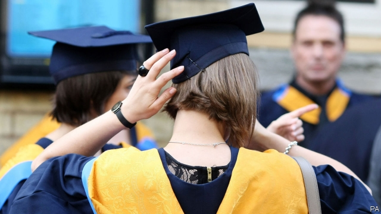
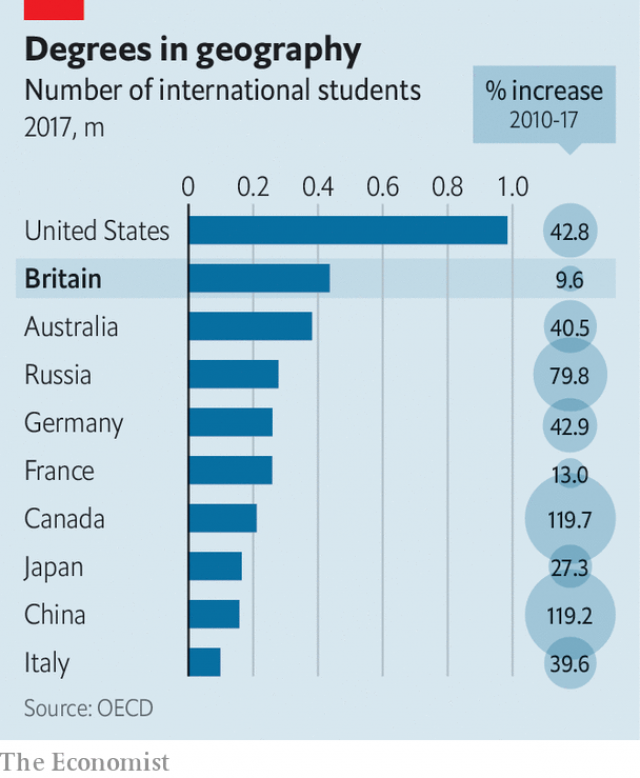

###### Hire education

# Britain signals an about-turn on immigration 

 

> print-edition iconPrint edition | Britain | Sep 12th 2019 

AS THE TORY leadership election hobbled on, the London Evening Standard hoped that Boris Johnson would prove a “big-hearted, optimistic, liberal” leader. They expected that as prime minister he would reassure millions of socially liberal voters who backed Remain. Yet in his nearly two months in Downing Street, the liberal Mr Johnson has been absent. His authoritarian alter-ego has stolen the show by suspending Parliament, ditching plans to abandon short prison sentences and delivering a speech in front of a phalanx of uniformed coppers. When he droned on for so long that one of them fainted, he didn’t look terribly big-hearted either. 

This week the liberal returned—at least for a day. On September 11th he announced that foreign students will be allowed to stay in Britain for two years after their degrees while working or looking for a job, rather than the current four months. It is the most significant sign yet that Mr Johnson’s government will abandon the hostile approach to immigration favoured by his predecessor, Theresa May. 

Foreign students could stay for two years after their studies until 2012, when Mrs May, then the home secretary, introduced the current limit in an attempt to cut net migration. Mr Johnson’s government is “explicitly moving away from the focus on reducing numbers,” says Robert McNeil of the Migration Observatory at Oxford University. The new policy is also significantly more liberal than that recommended by the government’s independent migration advisory committee. 

 

It is good news for universities. Britain has long been a destination of choice for foreign students, thanks to tuition in English and the cachet of its institutions. Though it remains the second-most favoured destination (see chart), it has lost market share in recent years. Indians, in particular, have switched to countries with more generous options for post-study work. Foreign students already account for a fifth of places in Britain. The relaxed rules should tempt many more of them. 

Vice-chancellors are especially keen on students from outside the European Union, who pay the full cost of their degree, rather than the £9,250 ($11,400) per year that universities can charge Britons and other Europeans. The number of Asian students looking to study abroad is booming, thanks to growing wealth and connectedness. The British government hopes to increase the number of foreign students from about 450,000 to 600,000 by 2030. 

Employers are cock-a-hoop, too. The current rules leave them a brief window to find good graduates to sponsor or risk them going home. The new scheme gives firms and graduates the time to “try before you buy”, says Ian Robinson of Fragomen, a law firm. The overall impact on the labour market will be slight, since only 40,000 or so students a year took up the two-year period before it was abolished. But it will give firms a bigger pool of workers with desirable skills. Far more international students plump for business or engineering degrees than courses in history or philosophy. 

And the policy is the most significant attempt yet by a Leaver to follow through on the commitment to create an outward-looking “global Britain” after Brexit. Exporting education boosts Britain’s soft power around the world. More heads of state and government (58) were educated in Britain than in any other country, according to a study in 2017 by the Higher Education Policy Institute, a think-tank. As Brexit roils the country, at least there are some lessons Britain can still teach. ■ 

